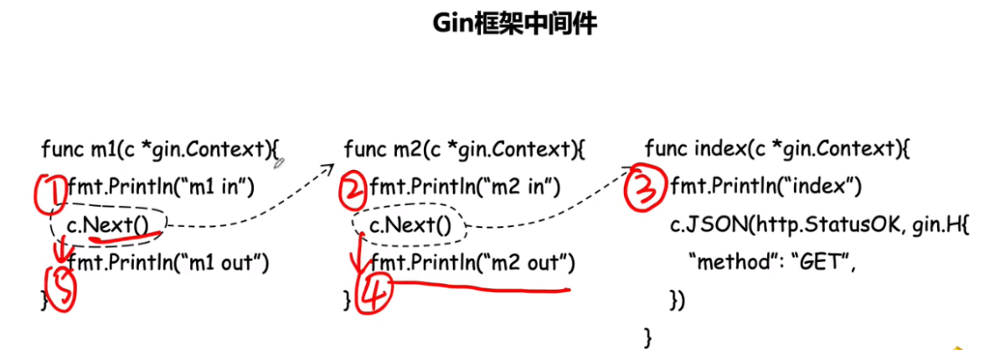
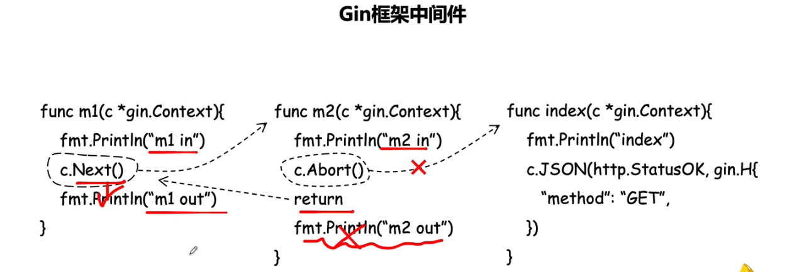

# net.http

```go
//HandleFunc把域名路由到对应的函数，函数必须接收响应和请求两个参数
func login(w http.ResponseWriter, r *http.Request){
    fmt.Fprintln(w, "pls login")
}
//ListenAndServe监听端口，接收两个参数：ip端口；一个handler(一般置为nil)
func main() {
    _,_ = http.HandleFunc("/login",login)
    http.ListenAndServe("127.0.0.1:8080",nil)
}
```

# Gin初识

> 当前后端是只返回json格式的数据给代理服务器（nginx等），然后前台拿到数据后渲染预期的效果
>
> RESTful API风格：用4种http的请求来代表业务中不同的动作（get、put、post、delete

```go
func login(c *gin.Context){
    //把gin.H结构体对象封装成json返回给前端
    r.JSON(gin.H{
        "code":200,
        "msg":"hello gin!",
    })
}

func main() {
    r := gin.Deatult()		//初始化一个默认路由引擎
    r.Get("/login",login)	//把get请求的url路由到login函数
    r.Run("127.0.0.1:8080")	//监听端口
}
```

# template模板

> 模板：使用相应的数据去替换html文档中事先准备好的标记
>
> html/template包有防恶意注入功能；text/template没有

## 使用

1. 定义模板

   - `tmpl`或`tpl`文件

2. 解析模板

   - 解析字符串：`t,_ := template.Parse`

   - 解析文件：

     - `t,_ := template.ParseFiles(filenames ...string)`

     - `t,_ := template.New(name string).ParseFiles(filenames ...string)`

       > new的作用是创建模板对象，接收的参数要和parsefile的参数一致。（一般先new，然后可以调用模板对象的其他方法）

   - `t,_ := template.ParseGlog(pattern string)`：用正则的方式解析模板文件名

3. 模板渲染

   - `t.Execute(wr io.Writer, data interface{})`：前端通过`{{.}}`获取数据

     > 结构体的字段名需要大写；map的key或普通变量不用大写
     >
     > 有多个数据要传是时，execute的第二个参数是`map[string]interface{}`，key随便叫，value是要传的变量，前端通过`{{.value}}`可获取数据（相当于beego的`t.Data["data"]`，gin中直接用gin.H更方便）
     
   - `t.ExecuteTemplate(wr io.Writer, name string, data interface{})`：有继承模板时使用

## 语法

- 多个文件夹中有同名`tmpl`文件时，可以在模板文件开头`{{define "user/index.tmpl"}}`来命名

- 自定义模板函数

  ```go
  // 1. 定义的函数要么只有一个返回值，要么两个且第二个必须是error
  // 2. 注册这个函数
  t := template.New("f.tmpl")
  t.Func(
      template.FuncMap{
          "前端用的函数名":定义好的函数名
  	}
  )
  ```

- 模板嵌套和自定义模板

  -  template.ParseFiles的时候，传两个参数，第一个是主模板文件名，第二个是被嵌套的模板
  - 自定义模板是，要带文件后缀`{{define "my.tmpl"}}`

- 模板继承（类似beego的layout）

  - 根模板：在`base.tmpl`中放上`{{block "content" .}} {{end}}`，作为各个页面中显示内容不同的地方（content可以改成其他，但继承此模板的文件define的名字和此处必须一致）

  - 在其他需要用到base的模板文件中：先继承根模板，再重新定义区块

    ```html
    {{template "base.html" .}}
    {{define "content"}}
    	这里的内容会替换继承过来的base中{{block "content" .}} {{end}}的部分
    {{end}}
    ```

  - 解析文件时：`t.ParseFiles()`先传根模板文件名，再传其他模板文件名

  - 渲染模板时：要使用`t.ExecuteTemplate`

- 修改标识符：`template.New("h.tmpl").Delims("[[","]]").ParseFiles`

  > beego中是beego.BConfig.WebConfig.TemplateLeft("[[")

- `html/template`包有防恶意注入功能，不会转义html格式的参数，如果确实需要转义，则自定义一个模板函数：接收string，把参数通过`template.HTML()`强转后返回

# Gin使用template

- 模板渲染

```go
func hello(c *gin.Context) {
    //c.HTML相当于beego的t.TplName
    //第二个参数是模板名。要么是是不带路径的文件名，要么是{{define dir/i.tmpl}}的带路径的文件名
    //第三个参数是传给前端的参数，gin.H就是一个快捷的map[string]interface{}。前端通过{{.title}}获取
	c.HTML(http.StatusOK, "index.tmpl", gin.H{
		"title": "ZhangSan",
	})
}

func main() {
	r := gin.Default()
    
	//自定义模板函数
	r.SetFuncMap(template.FuncMap{
		"str2html": func(s string) template.HTML {
			return template.HTML(s)
		},
	})
    
	//设置/static这个URL的路径为./static；beego的SetStaticPath
	r.Static("/static","./static")
    
	//模板解析
	r.LoadHTMLFiles("template/index.tmpl")	//解析单个文件，参数数量不限，太多时用下面的
	r.LoadHTMLGlob("template/**/*")	//解析一坨模板，**表示所有目录，*表示所有文件。template没有子目录时直接一个*
    
	//模板渲染
	r.GET("/hello", hello)
    
	_ = r.Run("127.0.0.1:8080")
}
```

- 给前端返回json

```go
//c.JSON本质上就是json的序列化，传map和结构体都可以
func json(c *gin.Context) {
	//方法1：使用map
	data = gin.H{
		"name":"张三",
		"age":18,
	}
	c.JSON(200,data)
}
func json2(c. *gin.Context) {
    //方法2：结构体
	type msg struct{
        Name string	`json:"name"`
        Age int	`json:"age"`
	}
	data := msg{
		Name: "张四",
		Age: 19,
	}
    c.JSON(200,data)
}
func main() {
    r := gin.Default()
    r.GET("/json",json)
    r.GET("/json2",json2)
}
```

# Gin前端数据交互

- 获取queryString（`/queryString?kw=xxx`)

```go
func queryString(c *gin.Context) {
	//方法1
	kw := c.Query("kw")
	//方法2
	kw = c.DefaultQuery("kw","默认值")
	//方法3
	kw, ok := c.GetQuery("kw")
	if !ok {
		kw = "默认值"
	}
	
	c.JSON(200,gin.H{
		"kewWord":kw,
	})
}
func man() {
    r := gin.Default()
    r.GET("/queryString",json)
}
```

- 获取URL中的path参数（`/queryString/xxx`）

```go
func queryStringPath(c *gin.Context) {
	kw1 := c.Param("kw1")
	kw2 := c.Param("kw2")
	c.JSON(200,gin.H{
		"keyword1":kw1,
		"keyword2":kw2,
	})
}

func main() {
    r := gin.Default()
    //获取URL中的path参数，path前面最好不要直接是根路径，否则会路由冲突
	r.GET("/queryStringPath/:kw1/:kw2",queryStringPath)
}
```

- 获取form提交的参数

```go
func toLogin(c *gin.Context) {
	c.HTML(http.StatusOK,"login.html",gin.H{})
}
func doLogin(c *gin.Context) {
	//方式1
	userName := c.PostForm("username")
	password := c.PostForm("password")
	//方式2
	userName = c.DefaultPostForm("username","默认值")
	password = c.DefaultPostForm("password","默认值")
	//方式3
	userName, ok1 := c.GetPostForm("username")
	password, ok2 := c.GetPostForm("password")
	if !ok1 {
		userName = "默认值"
	}
	if !ok2 {
		password = "默认值"
	}

	c.HTML(200,"welcome.html",gin.H{
		"username":userName,
		"pwd":password,
	})
}

func main() {
    r := gin.Default()
    r.GET("/login",toLogin)
	r.POST("/login",doLogin)
}
```

- 绑定结构体

```go
type User struct {
	Username string	`form:"username"`
	Password string	`form:"password"`
}
func bindStruct(c *gin.Context) {
	u := User{}
	_ = c.ShouldBind(&u)
	c.JSON(200,gin.H{
		"msg":"ok",
	})
}
func main() {
    r := gin.Default()
    //queryString的参数或者form表单提交的参数来绑定结构体。万能函数。还有其他的ShouldBindJSON,ShouldBindXML等
	r.GET("/bindStruct",bindStruct)
	r.POST("/bindStruct",bindStruct)
}
```

- 上传单个文件

```go
func toUpload(c *gin.Context) {
	c.HTML(200,"upload.html",nil)
}
func doUpload(c *gin.Context) {
	file,_ := c.FormFile("f1")
	filePath := path.Join("./",file.Filename)
	_ = c.SaveUploadedFile(file,filePath)
	c.JSON(200,gin.H{
		"msg":"ok",
	})
}

func main() {
    r := gin.Default()
    r.MaxMultipartMemory = 1 << 20	//上传文件的大小超过这个限制时，会先把已经接收到内存的落盘到临时文件中，再继续接收
	r.GET("/upload",toUpload)
	r.POST("/upload",doUpload)
}
```

- 上传多个文件

```go
func toUploadMulti(c *gin.Context) {
	c.HTML(200,"uploadMulti.html",nil)
}
func doUploadMulti(c *gin.Context) {
	form,_ := c.MultipartForm()
	files := form.File["file"]
	for _, file := range files {
		filePath := path.Join("./",file.Filename)
		_ = c.SaveUploadedFile(file,filePath)
	}
	c.JSON(200,gin.H{
		"msg":"ok",
	})
}

func main() {
    r := gin.Default()
	r.GET("/uploadMulti",toUploadMulti)
	r.POST("/uploadMulti",doUploadMulti)
}
```

- 重定向

```go
func redirect (c *gin.Context) {
	//重定向某个域名，跳转后URL会改变
	c.Redirect(http.StatusMovedPermanently,"www.baidu.com")
	//重定向到/n的路由处理函数（常用）
	c.Request.URL.Path = "/n"	//修改URI
	gin.New().HandleContext(c)	//后续的处理
}

func main() {
    r := gin.Default()
    r.GET("/m",redirect)
}
```

# Gin路由

- 路由

```go
func main() {
	r := gin.Default()
    //user这个URL的任何请求都路由到这里，根据请求的方式路由到对应的处理函数
	r.Any("/user", func(c *gin.Context) {
		switch c.Request.Method {
		case http.MethodGet:
			c.JSON(http.StatusOK,gin.H{"method":"GET"})
		case http.MethodPost:
			c.JSON(200,gin.H{"method":"POST"})
		}
	})
    //访问不存在的URL，都路由到这里
	r.NoRoute(func(c *gin.Context) {
		c.JSON(http.StatusNotFound,gin.H{"msg":"找不到"})
	})
}
```

- 路由组（支持嵌套）

```go
func main() {
    r := gin.Default()
    //某个路径下有多个不同的子路径
    userGroup := r.Group("/user")
	{
		userGroup.GET("/cars", func(c *gin.Context) {
			c.JSON(200,gin.H{})
		})
		userGroup.GET("salary", func(c *gin.Context) {
			c.JSON(200,gin.H{})
		})
        
        info := userGroup.Group("/info")
        info.GET("/name",...)
	}
}
```

# Gin中间件

> Gin框架允许开发者在处理请求的过程中，加入用户自己的钩子（Hook）函数。这个钩子函数就叫中间件，中间件适合处理一些公共的业务逻辑，比如登录认证、权限校验、数据分页、记录日志、耗时统计等。

如下代码的打印顺序：





```go
func index(c *gin.Context) {
	name,ok := c.Get("name")	//跨中间件取值
	name = c.MustGet("name")
	name = c.GetString("name")
	fmt.Println(name,ok)
	c.JSON(http.StatusOK, gin.H{
		"msg": "ok",
	})
}

//定义一个m1中间件
func m1(c *gin.Context) {
	fmt.Println("m1 in ...")
	//中间件常用做法：计算耗时
	start := time.Now()
	c.Next() 	//马上调用后续的处理函数，即m2。不调用的话则是m1先走完，再根据注册的顺序走下一个函数
	//c.Abort()	//阻止调用后续的处理函数，m2和index都不会执行
	cost := time.Since(start)
	fmt.Println(cost)
	fmt.Println("m1 out ...")
}

func m2(c *gin.Context) {
	fmt.Println("m2 in ...")
    c.Set("name","zhangsan")	//在上下文中设置值，它后续的处理函数可取值
	c.Next()					//调用后续的处理函数，即index。
    return
	fmt.Println("m2 out ...")
}

func main() {
	r := gin.Default()
	//全局注册m1中间件函数，这样的话就不用在r.GET中注册m1了。所有的请求都会先走中间件
	r.Use(m1, m2)
	r.GET("/index", index)
    
    //为此路由单独注册一个中间件
	r.GET("/index", m1, index)

	//为此路由组注册一个中间件，方法1：
	xxGroup := r.Group("/xx",m1)
	//为此路由组注册一个中间件，方法2：
	xxGroup = r.Group("/xx")
	xxGroup.Use(m1)
	{
		xxGroup.GET("/abc", func(c *gin.Context) {
			c.JSON(200,"")
		})
	}

	_ = r.Run()
}
```

`gin.Default()`默认使用了`Logger`和`Recovery`中间件，其中：

- `Logger`中间件将日志写入`gin.DefaultWriter`，即使配置了`GIN_MODE=release`。
- `Recovery`中间件会recover任何`panic`。如果有panic的话，会写入500响应码。

如果不想使用上面两个默认的中间件，可以使用`gin.New()`新建一个没有任何默认中间件的路由。

==gin中间件中使用goroutine==

> 当在中间件或`handler`中启动新的`goroutine`时，**不能使用**原始的上下文（c *gin.Context），必须使用其只读副本（`c.Copy()`）。

==实际业务的中间件==

```go
//实际业务的中间件，用闭包
func authMiddleware(doCheck bool)gin.HandlerFunc {
	//先进行一些其他工作，如连接数据库等
	return func(c *gin.Context) {
		if doCheck {
			//存放具体的逻辑，如判断用户是否是vip等
			//if 满足auth，则c.Next()
			//else，则c.Abort()
		}else {
			c.Next()
		}
	}
}

func main() {
    r := gin.Deafult()
    r.Use(authMiddleware(true))	//根据情况设置是否要用中间件拦截
    r.GET("/index",index)
}
```

# session

```go
func main() {
    r := gin.Default()
    // 创建基于cookie的存储引擎，secret11111 参数是用于加密的密钥
    store := cookie.NewStore([]byte("secret11111"))
    // 设置session中间件，参数mysession，指的是session的名字，也是cookie的名字
    // store是前面创建的存储引擎，我们可以替换成其他存储引擎
    r.Use(sessions.Sessions("mysession", store))

    r.GET("/hello", func(c *gin.Context) {
        // 初始化session对象
        session := sessions.Default(c)
        // 通过session.Get读取session值
        // session是键值对格式数据，因此需要通过key查询数据
        if session.Get("hello") != "world" {
            // 设置session数据
            session.Set("hello", "world")       
            // 删除session数据
            //session.Delete("hello")
            //清空session
            //session.Clear()
            // 保存session数据
            //session.Save()
            // 删除整个session
            // session.Clear()
        }
        //转发到另一个url       
        c.Request.URL.Path = "/hi"
        r.HandleContext(c)
    })
}
```

# GORM

- GORM内置了一个`gorm.Model`结构体。`gorm.Model`是一个包含了`ID`, `CreatedAt`, `UpdatedAt`, `DeletedAt`四个字段的Golang结构体。
- GORM 默认会使用名为ID的字段作为表的主键

```go
// gorm.Model 定义，可以将它嵌入到你自己的模型中
type Model struct {
  ID        uint `gorm:"primary_key"`
  CreatedAt time.Time
  UpdatedAt time.Time
  DeletedAt *time.Time	//如果模型有DeletedAt字段，调用Delete删除该记录时，将会设置DeletedAt字段为当前时间，而不是							直接将记录从数据库中删除。
}
//模型定义示例
type User struct {
  gorm.Model
  Name         string
  Age          sql.NullInt64									//零值类型，详见后面的Scanner/Valuer
  Birthday     *time.Time
  Email        string  `gorm:"type:varchar(100);unique_index"`
  Role         string  `gorm:"size:255"` 						// 设置字段大小为255
  MemberNumber *string `gorm:"unique;not null"` 				// 设置会员号（member number）唯一并且不为空
  Num          int     `gorm:"AUTO_INCREMENT"` 					// 设置 num 为自增类型
  Address      string  `gorm:"index:addr"` 						// 给address字段创建名为addr的索引
  IgnoreMe     int     `gorm:"-"` 								// 忽略本字段
}
```

```go
type User struct {} // 默认表名是 `users`

// 将 User 的表名设置为 `profiles`
func (User) TableName() string {
  return "profiles"
}
// 禁用默认表名的复数形式，如果置为 true，则 `User` 的默认表名是 `user`
db.SingularTable(true)
```

- 也可以通过`Table()`指定表名：

```go
// 使用User结构体创建名为`deleted_users`的表
db.Table("deleted_users").CreateTable(&User{})

var deleted_users []User
db.Table("deleted_users").Find(&deleted_users)
//// SELECT * FROM deleted_users;

db.Table("deleted_users").Where("name = ?", "jinzhu").Delete()
//// DELETE FROM deleted_users WHERE name = 'jinzhu';
```

- GORM还支持更改默认表名称规则：

```go
gorm.DefaultTableNameHandler = func (db *gorm.DB, defaultTableName string) string  {
  return "sys_" + defaultTableName;
}
```

- 支持的结构体标记（Struct tags）：首字母可以小写；tag中，字符串用单引号括起来

| 结构体标记（Tag） |                           描述                           |
| :---------------: | :------------------------------------------------------: |
|      Column       |                         指定列名                         |
|       Type        |                      指定列数据类型                      |
|       Size        |                  指定列大小, 默认值255                   |
|    PRIMARY_KEY    |                      将列指定为主键                      |
|      UNIQUE       |                      将列指定为唯一                      |
|      DEFAULT      |                       指定列默认值                       |
|     PRECISION     |                        指定列精度                        |
|     NOT NULL      |                    将列指定为非 NULL                     |
|  AUTO_INCREMENT   |                   指定列是否为自增类型                   |
|       INDEX       | 创建具有或不带名称的索引, 如果多个索引同名则创建复合索引 |
|   UNIQUE_INDEX    |         和 `INDEX` 类似，只不过创建的是唯一索引          |
|     EMBEDDED      |                     将结构设置为嵌入                     |
|  EMBEDDED_PREFIX  |                    设置嵌入结构的前缀                    |
|         -         |                        忽略此字段                        |

- 关联相关标记（tags）

|        结构体标记（Tag）         |                描述                |
| :------------------------------: | :--------------------------------: |
|            MANY2MANY             |             指定连接表             |
|            FOREIGNKEY            |              设置外键              |
|      ASSOCIATION_FOREIGNKEY      |            设置关联外键            |
|           POLYMORPHIC            |            指定多态类型            |
|        POLYMORPHIC_VALUE         |             指定多态值             |
|       JOINTABLE_FOREIGNKEY       |          指定连接表的外键          |
| ASSOCIATION_JOINTABLE_FOREIGNKEY |        指定连接表的关联外键        |
|        SAVE_ASSOCIATIONS         |    是否自动完成 save 的相关操作    |
|      ASSOCIATION_AUTOUPDATE      |   是否自动完成 update 的相关操作   |
|      ASSOCIATION_AUTOCREATE      |   是否自动完成 create 的相关操作   |
|    ASSOCIATION_SAVE_REFERENCE    | 是否自动完成引用的 save 的相关操作 |
|             PRELOAD              |    是否自动完成预加载的相关操作    |

# GORM的CRUD

## 创建记录

使用使用`NewRecord()`查询主键是否存在，主键为空使用`Create()`创建记录：

```go
user := User{Name: "q1mi", Age: 18}

db.NewRecord(user) // 主键为空返回`true`
db.Create(&user)   // 创建user
db.NewRecord(user) // 创建`user`后返回`false`
```

**注意：**通过tag定义字段的默认值，在创建记录时候生成的 SQL 语句会排除没有值或值为 零值 的字段。 在将记录插入到数据库后，Gorm会从数据库加载那些字段的默认值。

举个例子：

```go
var user = User{Name: "", Age: 99}
db.Create(&user)	//创建完name还是默认值
```

**注意：**所有字段的零值, 比如`0`, `""`,`false`或者其它`零值`，都不会保存到数据库内，但会使用他们的默认值。 如果你想避免这种情况，可以考虑使用指针或实现 `Scanner/Valuer`接口，比如：

- 使用指针方式实现零值存入数据库

```go
// 使用指针
type User struct {
  ID   int64
  Name *string `gorm:"default:'小王子'"`
  Age  int64
}
user := User{Name: new(string), Age: 18))}
db.Create(&user)  // 此时数据库中该条记录name字段的值就是''
```

- 使用Scanner/Valuer接口方式实现零值存入数据库

```go
//原码
type NullString struct {
	String string
	Valid  bool // Valid is true if String is not NULL
}
// 使用 Scanner/Valuer
type User struct {
	ID int64
	Name sql.NullString `gorm:"default:'小王子'"` // sql.NullString 实现了Scanner/Valuer接口
	Age  int64
}
user := User{Name: sql.NullString{"", true}, Age:18}
db.Create(&user)  // 此时数据库中该条记录name字段的值就是''
```

## 查询记录

### 一般查询

```go
// 根据主键查询第一条记录
db.First(&user)
//// SELECT * FROM users ORDER BY id LIMIT 1;

// 随机获取一条记录
db.Take(&user)
//// SELECT * FROM users LIMIT 1;

// 根据主键查询最后一条记录
db.Last(&user)
//// SELECT * FROM users ORDER BY id DESC LIMIT 1;

// 查询所有的记录，users是个切片
db.Find(&users)
//// SELECT * FROM users;

// 查询指定的某条记录(仅当主键为整型时可用)
db.First(&user, 10)
//// SELECT * FROM users WHERE id = 10;
```

### Where 条件

#### 普通SQL查询

```go
// Get first matched record
db.Where("name = ?", "jinzhu").First(&user)
//// SELECT * FROM users WHERE name = 'jinzhu' limit 1;

// Get all matched records
db.Where("name = ?", "jinzhu").Find(&users)
//// SELECT * FROM users WHERE name = 'jinzhu';

// <>
db.Where("name <> ?", "jinzhu").Find(&users)
//// SELECT * FROM users WHERE name <> 'jinzhu';

// IN
db.Where("name IN (?)", []string{"jinzhu", "jinzhu 2"}).Find(&users)
//// SELECT * FROM users WHERE name in ('jinzhu','jinzhu 2');

// LIKE
db.Where("name LIKE ?", "%jin%").Find(&users)
//// SELECT * FROM users WHERE name LIKE '%jin%';

// AND
db.Where("name = ? AND age >= ?", "jinzhu", "22").Find(&users)
//// SELECT * FROM users WHERE name = 'jinzhu' AND age >= 22;

// Time
db.Where("updated_at > ?", lastWeek).Find(&users)
//// SELECT * FROM users WHERE updated_at > '2000-01-01 00:00:00';

// BETWEEN
db.Where("created_at BETWEEN ? AND ?", lastWeek, today).Find(&users)
//// SELECT * FROM users WHERE created_at BETWEEN '2000-01-01 00:00:00' AND '2000-01-08 00:00:00';
```

#### Struct & Map查询

```go
// Struct
db.Where(&User{Name: "jinzhu", Age: 20}).First(&user)
//// SELECT * FROM users WHERE name = "jinzhu" AND age = 20 LIMIT 1;

// Map
db.Where(map[string]interface{}{"name": "jinzhu", "age": 20}).Find(&users)
//// SELECT * FROM users WHERE name = "jinzhu" AND age = 20;

// 主键的切片
db.Where([]int64{20, 21, 22}).Find(&users)
//// SELECT * FROM users WHERE id IN (20, 21, 22);
```

**提示：**当通过结构体进行查询时，GORM将会只通过非零值字段查询，这意味着如果你的字段值为`0`，`''`，`false`或者其他`零值`时，将不会被用于构建查询条件，例如：

```go
db.Where(&User{Name: "jinzhu", Age: 0}).Find(&users)
//// SELECT * FROM users WHERE name = "jinzhu";
```

你可以使用指针或实现 Scanner/Valuer 接口来避免这个问题.

```go
// 使用指针
type User struct {
  gorm.Model
  Name string
  Age  *int
}

// 使用 Scanner/Valuer
type User struct {
  gorm.Model
  Name string
  Age  sql.NullInt64  // sql.NullInt64 实现了 Scanner/Valuer 接口
}
db.Where(&User{Name: "jinzhu", Age: sql.NullInt64{0,true}}).Find(&users)
```

### Not 条件

作用与 Where 类似的情形如下：

```go
db.Not("name", "jinzhu").First(&user)
//// SELECT * FROM users WHERE name <> "jinzhu" LIMIT 1;

// Not In
db.Not("name", []string{"jinzhu", "jinzhu 2"}).Find(&users)
//// SELECT * FROM users WHERE name NOT IN ("jinzhu", "jinzhu 2");

// Not In slice of primary keys
db.Not([]int64{1,2,3}).First(&user)
//// SELECT * FROM users WHERE id NOT IN (1,2,3);

db.Not([]int64{}).First(&user)
//// SELECT * FROM users;

// Plain SQL
db.Not("name = ?", "jinzhu").First(&user)
//// SELECT * FROM users WHERE NOT(name = "jinzhu");

// Struct
db.Not(User{Name: "jinzhu"}).First(&user)
//// SELECT * FROM users WHERE name <> "jinzhu";
```

### Or条件

```go
db.Where("role = ?", "admin").Or("role = ?", "super_admin").Find(&users)
//// SELECT * FROM users WHERE role = 'admin' OR role = 'super_admin';

// Struct
db.Where("name = 'jinzhu'").Or(User{Name: "jinzhu 2"}).Find(&users)
//// SELECT * FROM users WHERE name = 'jinzhu' OR name = 'jinzhu 2';

// Map
db.Where("name = 'jinzhu'").Or(map[string]interface{}{"name": "jinzhu 2"}).Find(&users)
//// SELECT * FROM users WHERE name = 'jinzhu' OR name = 'jinzhu 2';
```

### 内联条件

即原本在`Where`中的条件，直接扔进立即执行方法。当内联条件与多个[立即执行方法](https://www.liwenzhou.com/posts/Go/gorm_crud/#autoid-1-3-1)一起使用时, 内联条件不会传递给后面的立即执行方法。

```go
// 根据主键获取记录 (只适用于整形主键)
db.First(&user, 23)
//// SELECT * FROM users WHERE id = 23 LIMIT 1;
// 根据主键获取记录, 如果它是一个非整形主键
db.First(&user, "id = ?", "string_primary_key")
//// SELECT * FROM users WHERE id = 'string_primary_key' LIMIT 1;

// Plain SQL
db.Find(&user, "name = ?", "jinzhu")
//// SELECT * FROM users WHERE name = "jinzhu";

db.Find(&users, "name <> ? AND age > ?", "jinzhu", 20)
//// SELECT * FROM users WHERE name <> "jinzhu" AND age > 20;

// Struct
db.Find(&users, User{Age: 20})
//// SELECT * FROM users WHERE age = 20;

// Map
db.Find(&users, map[string]interface{}{"age": 20})
//// SELECT * FROM users WHERE age = 20;
```

### 额外查询选项

```go
// for update是在数据库中上锁用的，可以为数据库中的行上一个排它锁。当一个事务的操作未完成时候，其他事务可以读取但是不能写入或更新
db.Set("gorm:query_option", "FOR UPDATE").First(&user, 10)
//// SELECT * FROM users WHERE id = 10 FOR UPDATE;
```

### FirstOrInit

获取匹配的第一条记录，否则根据给定的条件初始化一个新的对象 (仅支持 struct 和 map 条件)

```go
// 未找到
db.FirstOrInit(&user, User{Name: "non_existing"})
//// user -> User{Name: "non_existing"}

// 找到
db.Where(User{Name: "Jinzhu"}).FirstOrInit(&user)
//// user -> User{Id: 111, Name: "Jinzhu", Age: 20}
db.FirstOrInit(&user, map[string]interface{}{"name": "jinzhu"})
//// user -> User{Id: 111, Name: "Jinzhu", Age: 20}
```

#### Attrs

如果记录未找到，将使用参数初始化 struct.

```go
// 未找到
db.Where(User{Name: "non_existing"}).Attrs(User{Age: 20}).FirstOrInit(&user)
//// SELECT * FROM USERS WHERE name = 'non_existing';
//// user -> User{Name: "non_existing", Age: 20}

// 找到
db.Where(User{Name: "Jinzhu"}).Attrs(User{Age: 30}).FirstOrInit(&user)
//// SELECT * FROM USERS WHERE name = jinzhu';
//// user -> User{Id: 111, Name: "Jinzhu", Age: 20}
```

#### Assign

不管记录是否找到，都将参数赋值给 struct.

```go
// 未找到
db.Where(User{Name: "non_existing"}).Assign(User{Age: 20}).FirstOrInit(&user)
//// user -> User{Name: "non_existing", Age: 20}

// 找到
db.Where(User{Name: "Jinzhu"}).Assign(User{Age: 30}).FirstOrInit(&user)
//// SELECT * FROM USERS WHERE name = jinzhu';
//// user -> User{Id: 111, Name: "Jinzhu", Age: 30}
```

### FirstOrCreate

获取匹配的第一条记录, 否则根据给定的条件创建一个新的记录 (仅支持 struct 和 map 条件)

```go
// 未找到
db.FirstOrCreate(&user, User{Name: "non_existing"})
//// INSERT INTO "users" (name) VALUES ("non_existing");
//// user -> User{Id: 112, Name: "non_existing"}

// 找到
db.Where(User{Name: "Jinzhu"}).FirstOrCreate(&user)
//// user -> User{Id: 111, Name: "Jinzhu"}
```

#### Attrs

如果记录未找到，将使用参数创建 struct 并保存至数据库.

```go
 // 未找到
db.Where(User{Name: "non_existing"}).Attrs(User{Age: 20}).FirstOrCreate(&user)
//// SELECT * FROM users WHERE name = 'non_existing';
//// INSERT INTO "users" (name, age) VALUES ("non_existing", 20);
//// user -> User{Id: 112, Name: "non_existing", Age: 20}

// 找到
db.Where(User{Name: "jinzhu"}).Attrs(User{Age: 30}).FirstOrCreate(&user)
//// SELECT * FROM users WHERE name = 'jinzhu';
//// user -> User{Id: 111, Name: "jinzhu", Age: 20}
```

#### Assign

不管记录是否找到，都将参数赋值给 struct 并保存至数据库.

```go
// 未找到
db.Where(User{Name: "non_existing"}).Assign(User{Age: 20}).FirstOrCreate(&user)
//// SELECT * FROM users WHERE name = 'non_existing';
//// INSERT INTO "users" (name, age) VALUES ("non_existing", 20);
//// user -> User{Id: 112, Name: "non_existing", Age: 20}

// 找到
db.Where(User{Name: "jinzhu"}).Assign(User{Age: 30}).FirstOrCreate(&user)
//// SELECT * FROM users WHERE name = 'jinzhu';
//// UPDATE users SET age=30 WHERE id = 111;
//// user -> User{Id: 111, Name: "jinzhu", Age: 30}
```

### 高级查询

#### 子查询

基于 `*gorm.expr` 的子查询

```go
db.Where("amount > ?", db.Table("orders").Select("AVG(amount)").Where("state = ?", "paid").SubQuery()).Find(&orders)
// SELECT * FROM "orders"  WHERE amount > (SELECT AVG(amount) FROM "orders"  WHERE state = 'paid');
```

#### 选择字段

Select，指定你想从数据库中检索出的字段，默认会选择全部字段。参数可以是mysql的分组函数

```go
db.Select("name, age").Find(&users)
//// SELECT name, age FROM users;

db.Select([]string{"name", "age"}).Find(&users)
//// SELECT name, age FROM users;

db.Table("users").Select("COALESCE(age,?)", 42).Rows()
//// SELECT COALESCE(age,'42') FROM users;
```

#### 排序

Order，指定从数据库中检索出记录的顺序。设置第二个参数 reorder 为 `true` ，可以覆盖前面定义的排序条件。

```go
db.Order("age desc, name").Find(&users)
//// SELECT * FROM users ORDER BY age desc, name;

// 多字段排序
db.Order("age desc").Order("name").Find(&users)
//// SELECT * FROM users ORDER BY age desc, name;

// 覆盖排序
db.Order("age desc").Find(&users1).Order("age", true).Find(&users2)
//// SELECT * FROM users ORDER BY age desc; (users1)
//// SELECT * FROM users ORDER BY age; (users2)
```

#### 数量

Limit，指定从数据库检索出的最大记录数。

```go
db.Limit(3).Find(&users)
//// SELECT * FROM users LIMIT 3;

// -1 取消 Limit 条件
db.Limit(10).Find(&users1).Limit(-1).Find(&users2)
//// SELECT * FROM users LIMIT 10; (users1)
//// SELECT * FROM users; (users2)
```

#### 偏移

Offset，指定开始返回记录前要跳过的记录数。

```go
db.Offset(3).Find(&users)
//// SELECT * FROM users OFFSET 3;

// -1 取消 Offset 条件
db.Offset(10).Find(&users1).Offset(-1).Find(&users2)
//// SELECT * FROM users OFFSET 10; (users1)
//// SELECT * FROM users; (users2)
```

#### 总数

Count，该 model 能获取的记录总数。

```go
db.Where("name = ?", "jinzhu").Or("name = ?", "jinzhu 2").Find(&users).Count(&count)
//// SELECT * from USERS WHERE name = 'jinzhu' OR name = 'jinzhu 2'; (users)
//// SELECT count(*) FROM users WHERE name = 'jinzhu' OR name = 'jinzhu 2'; (count)

db.Model(&User{}).Where("name = ?", "jinzhu").Count(&count)
//// SELECT count(*) FROM users WHERE name = 'jinzhu'; (count)

db.Table("deleted_users").Count(&count)
//// SELECT count(*) FROM deleted_users;

db.Table("deleted_users").Select("count(distinct(name))").Count(&count)
//// SELECT count( distinct(name) ) FROM deleted_users; (count)
```

**注意** `Count` 必须是链式查询的最后一个操作 ，因为它会覆盖前面的 `SELECT`，但如果里面使用了 `count` 时不会覆盖

#### Group & Having

```go
rows, err := db.Table("orders").Select("date(created_at) as date, sum(amount) as total").Group("date(created_at)").Rows()
for rows.Next() {
  ...
}

// 使用Scan将多条结果扫描进事先准备好的结构体切片中
type Result struct {
	Date time.Time
	Total int
}
var rets []Result
db.Table("users").Select("date(created_at) as date, sum(age) as total").Group("date(created_at)").Scan(&rets)

rows, err := db.Table("orders").Select("date(created_at) as date, sum(amount) as total").Group("date(created_at)").Having("sum(amount) > ?", 100).Rows()
for rows.Next() {
  ...
}

type Result struct {
  Date  time.Time
  Total int64
}
db.Table("orders").Select("date(created_at) as date, sum(amount) as total").Group("date(created_at)").Having("sum(amount) > ?", 100).Scan(&results)
```

#### 连接

Joins，指定连接条件

```go
rows, err := db.Table("users").Select("users.name, emails.email").Joins("left join emails on emails.user_id = users.id").Rows()
for rows.Next() {
  ...
}

db.Table("users").Select("users.name, emails.email").Joins("left join emails on emails.user_id = users.id").Scan(&results)

// 多连接及参数
db.Joins("JOIN emails ON emails.user_id = users.id AND emails.email = ?", "jinzhu@example.org").Joins("JOIN credit_cards ON credit_cards.user_id = users.id").Where("credit_cards.number = ?", "411111111111").Find(&user)
```

### Pluck

Pluck，查询 model 中的一个列作为切片

```go
var ages []int64
db.Find(&users).Pluck("age", &ages)

var names []string
db.Model(&User{}).Pluck("name", &names)

db.Table("deleted_users").Pluck("name", &names)

// 想查询多个字段？ 这样做：
db.Select("name, age").Find(&users)
```

### 扫描

Scan，扫描结果至一个 struct。效果和where.find差不多，但是scan必须带.Table()

```go
type Result struct {
  Name string
  Age  int
}

var result Result
db.Table("users").Select("name, age").Where("name = ?", "Antonio").Scan(&result)

var results []Result
db.Table("users").Select("name, age").Where("id > ?", 0).Scan(&results)

// 原生 SQL
db.Raw("SELECT name, age FROM users WHERE name = ?", "Antonio").Scan(&result)
```

## 链式操作相关

### 链式操作

Method Chaining，Gorm 实现了链式操作接口，所以你可以把代码写成这样：

```go
// 创建一个查询
tx := db.Where("name = ?", "jinzhu")

// 添加更多条件
if someCondition {
  tx = tx.Where("age = ?", 20)
} else {
  tx = tx.Where("age = ?", 30)
}

if yetAnotherCondition {
  tx = tx.Where("active = ?", 1)
}
```

在调用立即执行方法前不会生成`Query`语句，借助这个特性你可以创建一个函数来处理一些通用逻辑。

### 立即执行方法

Immediate methods ，立即执行方法是指那些会立即生成`SQL`语句并发送到数据库的方法, 他们一般是`CRUD`方法，比如：

`Create`, `First`, `Find`, `Take`, `Save`, `UpdateXXX`, `Delete`, `Scan`, `Row`, `Rows`…

这有一个基于上面链式方法代码的立即执行方法的例子：

```go
tx.Find(&user)
```

生成的SQL语句如下：

```sql
SELECT * FROM users where name = 'jinzhu' AND age = 30 AND active = 1;
```

### 范围

`Scopes`，Scope是建立在链式操作的基础之上的。

基于它，你可以抽取一些通用逻辑，写出更多可重用的函数库。

```go
func AmountGreaterThan1000(db *gorm.DB) *gorm.DB {
  return db.Where("amount > ?", 1000)
}

func PaidWithCreditCard(db *gorm.DB) *gorm.DB {
  return db.Where("pay_mode_sign = ?", "C")
}

func PaidWithCod(db *gorm.DB) *gorm.DB {
  return db.Where("pay_mode_sign = ?", "C")
}

func OrderStatus(status []string) func (db *gorm.DB) *gorm.DB {
  return func (db *gorm.DB) *gorm.DB {
    return db.Scopes(AmountGreaterThan1000).Where("status IN (?)", status)
  }
}

db.Scopes(AmountGreaterThan1000, PaidWithCreditCard).Find(&orders)
// 查找所有金额大于 1000 的信用卡订单

db.Scopes(AmountGreaterThan1000, PaidWithCod).Find(&orders)
// 查找所有金额大于 1000 的 COD 订单

db.Scopes(AmountGreaterThan1000, OrderStatus([]string{"paid", "shipped"})).Find(&orders)
// 查找所有金额大于 1000 且已付款或者已发货的订单
```

### 多个立即执行方法

Multiple Immediate Methods，在 GORM 中使用多个立即执行方法时，后一个立即执行方法会复用前一个**立即执行方法**的条件 (不包括内联条件) 。

```go
db.Where("name LIKE ?", "jinzhu%").Find(&users, "id IN (?)", []int{1, 2, 3}).Count(&count)
```

生成的 Sql

```sql
SELECT * FROM users WHERE name LIKE 'jinzhu%' AND id IN (1, 2, 3)

SELECT count(*) FROM users WHERE name LIKE 'jinzhu%'
```

## 更新

> DML语句要么是db.Table()要么是db.Model()，否则操作数据的时候找不到对应的表
>
> 用db.Model()是，传进来的对象如果为空或没有给ID赋值，则是对所有数据进行操作。想指定操作某条数据的话就给ID赋值或先查询，把查到的数据扔进此对象，再去操作指定的数据

### 更新所有字段

`Save()`默认会更新该对象的所有字段，即使你没有赋值。

```go
db.First(&user)

user.Name = "七米"
user.Age = 99
db.Save(&user)

////  UPDATE `users` SET `created_at` = '2020-02-16 12:52:20', `updated_at` = '2020-02-16 12:54:55', `deleted_at` = NULL, `name` = '七米', `age` = 99, `active` = true  WHERE `users`.`deleted_at` IS NULL AND `users`.`id` = 1
```

### 更新修改字段

如果你只希望更新指定字段，可以使用`Update`或者`Updates`

```go
// 更新单个属性，如果它有变化，model里的结构体必须所有字段都有值
db.Model(&User{}).Update("name", "hello")
//// UPDATE users SET name='hello', updated_at='2013-11-17 21:34:10';

// 根据给定的条件更新单个属性
db.Model(&User{}).Where("active = ?", true).Update("name", "hello")
//// UPDATE users SET name='hello', updated_at='2013-11-17 21:34:10' WHERE active=true;

// 使用 map 更新多个属性，只会更新其中有变化的属性
db.Model(&User{}).Updates(map[string]interface{}{"name": "hello", "age": 18, "active": false})
//// UPDATE users SET name='hello', age=18, active=false, updated_at='2013-11-17 21:34:10' WHERE;

// 使用 struct 更新多个属性，只会更新其中有变化且为非零值的字段
db.Model(&User{}).Updates(User{Name: "hello", Age: 18})
//// UPDATE users SET name='hello', age=18, updated_at = '2013-11-17 21:34:10' WHERE;

// 警告：当使用 struct 更新时，GORM只会更新那些非零值的字段
// 对于下面的操作，不会发生任何更新，"", 0, false 都是其类型的零值
db.Model(&User{}).Updates(User{Name: "", Age: 0, Active: false})
```

### 更新选定字段(给了多个要更新的字段，又不想对这些字段全部更新)

如果你想更新或忽略某些字段，你可以使用 `Select`，`Omit`

```go
db.Model(&user).Select("name").Updates(map[string]interface{}{"name": "hello", "age": 18, "active": false})
//// UPDATE users SET name='hello', updated_at='2013-11-17 21:34:10' WHERE id=111;

db.Model(&user).Omit("name").Updates(map[string]interface{}{"name": "hello", "age": 18, "active": false})
//// UPDATE users SET age=18, active=false, updated_at='2013-11-17 21:34:10' WHERE id=111;
```

### 无Hooks更新

上面的更新操作会自动运行 model 的 `BeforeUpdate`, `AfterUpdate` 方法，更新 `UpdatedAt` 时间戳, 在更新时保存其 `Associations`, 如果你不想调用这些方法，你可以使用 `UpdateColumn`， `UpdateColumns`

```go
// 更新单个属性，类似于 `Update`
db.Model(&user).UpdateColumn("name", "hello")
//// UPDATE users SET name='hello' WHERE id = 111;

// 更新多个属性，类似于 `Updates`
db.Model(&user).UpdateColumns(User{Name: "hello", Age: 18})
//// UPDATE users SET name='hello', age=18 WHERE id = 111;
```

### 批量更新

批量更新时`Hooks（钩子函数）`不会运行。

```go
db.Table("users").Where("id IN (?)", []int{10, 11}).Updates(map[string]interface{}{"name": "hello", "age": 18})
//// UPDATE users SET name='hello', age=18 WHERE id IN (10, 11);

// 使用 struct 更新时，只会更新非零值字段，若想更新所有字段，请使用map[string]interface{}
db.Model(User{}).Updates(User{Name: "hello", Age: 18})
//// UPDATE users SET name='hello', age=18;

// 使用 `RowsAffected` 获取更新记录总数
db.Model(User{}).Updates(User{Name: "hello", Age: 18}).RowsAffected
```

### 使用SQL表达式更新

先查询表中的第一条数据保存至user变量。

```go
var user User
db.First(&user)
db.Model(&user).Update("age", gorm.Expr("age * ? + ?", 2, 100))
//// UPDATE `users` SET `age` = age * 2 + 100, `updated_at` = '2020-02-16 13:10:20'  WHERE `users`.`id` = 1;

db.Model(&user).Updates(map[string]interface{}{"age": gorm.Expr("age * ? + ?", 2, 100)})
//// UPDATE "users" SET "age" = age * '2' + '100', "updated_at" = '2020-02-16 13:05:51' WHERE `users`.`id` = 1;

db.Model(&user).UpdateColumn("age", gorm.Expr("age - ?", 1))
//// UPDATE "users" SET "age" = age - 1 WHERE "id" = '1';

db.Model(&user).Where("age > 10").UpdateColumn("age", gorm.Expr("age - ?", 1))
//// UPDATE "users" SET "age" = age - 1 WHERE "id" = '1' AND quantity > 10;
```

### 修改Hooks中的值

如果你想修改 `BeforeUpdate`, `BeforeSave` 等 Hooks 中更新的值，你可以使用 `scope.SetColumn`, 例如：

```go
func (user *User) BeforeSave(scope *gorm.Scope) (err error) {
  if pw, err := bcrypt.GenerateFromPassword(user.Password, 0); err == nil {
    scope.SetColumn("EncryptedPassword", pw)
  }
}
```

### 其它更新选项

```go
// 为 update SQL 添加其它的 SQL
db.Model(&user).Set("gorm:update_option", "OPTION (OPTIMIZE FOR UNKNOWN)").Update("name", "hello")
//// UPDATE users SET name='hello', updated_at = '2013-11-17 21:34:10' WHERE id=111 OPTION (OPTIMIZE FOR UNKNOWN);
```

## 删除

### 用结构体对象删除

**警告** 删除记录时，请确保主键字段有值，GORM 会通过主键去删除记录，如果主键为空，GORM 会删除该 model 的所有记录。

```go
// 删除现有记录
db.Delete(&email)
//// DELETE from emails where id=10;

// 为删除 SQL 添加额外的 SQL 操作
db.Set("gorm:delete_option", "OPTION (OPTIMIZE FOR UNKNOWN)").Delete(&email)
//// DELETE from emails where id=10 OPTION (OPTIMIZE FOR UNKNOWN);
```

### 用where删除

删除全部匹配的记录

```go
db.Where("email LIKE ?", "%jinzhu%").Delete(Email{})
//// DELETE from emails where email LIKE "%jinzhu%";

db.Delete(Email{}, "email LIKE ?", "%jinzhu%")
//// DELETE from emails where email LIKE "%jinzhu%";
```

### 软删除

如果一个 model 有 `DeletedAt` 字段，他将自动获得软删除的功能！ 当调用 `Delete` 方法时， 记录不会真正的从数据库中被删除， 只会将`DeletedAt` 字段的值会被设置为当前时间

```go
db.Delete(&user)
//// UPDATE users SET deleted_at="2013-10-29 10:23" WHERE id = 111;

// 批量删除
db.Where("age = ?", 20).Delete(&User{})
//// UPDATE users SET deleted_at="2013-10-29 10:23" WHERE age = 20;

// 查询记录时会忽略被软删除的记录
db.Where("age = 20").Find(&user)
//// SELECT * FROM users WHERE age = 20 AND deleted_at IS NULL;

// Unscoped 方法可以查询被软删除的记录
db.Unscoped().Where("age = 20").Find(&users)
//// SELECT * FROM users WHERE age = 20;
```

### 物理删除

```go
// Unscoped 方法可以物理删除记录
db.Unscoped().Delete(&order)
//// DELETE FROM orders WHERE id=10;
```