#  简介

## 是什么

- javascript是运行在客户端的脚本语言
- 不需要编译，运行过程中由js解释器逐行解释并执行
- 也可以Node.js进行服务器端编程
- 是解释型、动态类型语言

## 作用

- 表单动态校验、密码强度检测
- 网页特效
- 服务端开发（Node.js）
- 桌面程序（Electron）
- App（Cordova）
- 控制硬件-物联网（Ruff）
- 游戏开发（cocos2d-js）

## 浏览器执行js

- 浏览器分成两部分：渲染引擎和JS引擎
- js引擎也称为js解释器，用来读取网页的js代码并处理，如chrome的V8引擎
- js解释器逐行解释源码，转换成机器语言，由计算机执行

## 组成

- ECMAScript，基础语法
- DOM，页面文档对象模型
- BOM，浏览器对象模型

## 写法

- 行内式：直接在元素内写
- 内嵌式：写在\<script>\</script>标签内
- 外部式：在\<script>\</script>内通过src属性引入

## 输入输出

- prompt，浏览器弹出输入框，输入后，函数返回的结果都是string类型
- alert，浏览器弹出警示
- console.log控制台打印输出

## 报错

js是逐行解释，一行报错时，就不会继续执行后面的

# 变量

## 使用

- var age; age = 18;
- var age = 18;
- var age = prompt('输入年龄');
- age = 20; // 重新赋值，不需要var
  - 变量值以最后一次的赋值为准
- 集体声明多个变量
  - var age = 18, address = '西安', salary = 2000;

- var a = b = c = 9; 相当于var a = 9; b = 9; c = 9; // 区别于集体声明，b、c是直接赋值，没有声明
- 特殊情况
  - 只声明不赋值，结果是undefined
  - 不声明不赋值，直接使用变量 ，会报错
  - 不声明，直接赋值，可以使用（会变成全局变量，不提倡）
  - name这个变量名有特殊含义
- `var`、`let`和`const`都可以用来声明变量，但它们在作用域、提升（hoisting）和重新赋值方面有所不同。现代JavaScript开发中，推荐使用`let`和`const`来代替`var`，主要是因为`let`和`const`提供了更加清晰和可控的作用域管理。它们之间的一些关键区别：
  1. 作用域：
     - `var`声明的变量有函数作用域或全局作用域，不具备块级作用域。
     - `let`和`const`声明的变量具有块级作用域（即{}内部有效）。
  2. 提升（Hoisting）：
     - `var`声明的变量会被提升到函数或全局作用域的顶部，但在初始化之前不能访问其值。
     - `let`和`const`也会被提升，但是它们在声明之前是不可访问的，这种状态被称为“暂时性死区”。
  3. 重复声明：
     - 同一作用域内，`var`允许重复声明同一个变量。
     - `let`和`const`在同一作用域内禁止重复声明同一个变量。
  4. 重新赋值：
     - 使用`var`和`let`声明的变量可以被重新赋值。
     - 使用`const`声明的变量必须在声明时初始化，并且不能被重新赋值（但如果是对象或数组，其内部状态可以被修改）。

## 命名规范

- 字母、数字、下划线、$组成
- 严格区分大小写
- 不能以数字开头
- 不能是关键字、保留字
- 必须见名知意
- 遵循小驼峰命名
- 尽量不使用name作为变量名

## 交换变量

只能使用临时变量

# 数据类型

## 简介

javascript是弱类型和动态类型语言，变量的数据类型在运行过程中根据值来确定，变量的数据类型可以变化。

## 简单数据类型

| 数据类型  | 说明                                                         | 默认值    | 控制台中的颜色 |
| --------- | ------------------------------------------------------------ | --------- | -------------- |
| number    | 数字型，包含整型和浮点型值，如21、0.21<br>数字以0开头是八进制，以0x开头是十六进制<br>Number.MAX_VALUE和Number.MIN_VALUE是js中数字的最大值和最小值<br>Infinity和-Infinity是js中的无穷大和负无穷大<br>NaN，not a number，非数字<br>isNaN()函数用来判断是否为非数字，是数字返回false，非数字返回true | 0         | 蓝色           |
| boolean   | 布尔型，进行算术运算时，true是1，false是0                    | false     | 深蓝色         |
| string    | 字符串型，只要是引号括起来的，就是字符串，单、双引号都可以<br>出现引号嵌套时，外双内单，外单内双，不用转义<br>转义字符：\n（换行），\\\，\\'，\\"，\\t（缩进），\\b（空格）<br>length属性可以获取字符串的长度<br>字符串用+可以拼接，+两边只要有一个字符串，那必然是拼接；如果是其他符号，则进行数学运算 | ""        | 黑色           |
| undefined | 未定义，var a; 声明了变量但未赋值，此时a=undifined，也可以直接var a = undefined;<br>undefined和字符串+时，是进行拼接；和数字+时，结果是NaN | undifined | 浅灰色         |
| null      | 空值，var a = null; 声明了变量a并赋值成空值null<br/>null和字符串+时，是进行拼接；和数字+时，结果是数字本身 | null      | 浅灰色         |

## 获取变量的数据类型

typeof：不是函数，是一个关键字，typeof a，返回a的数据类型

- 注意：null的type of结果是object

## 数据类型转换

表单、prompt获取过来的数据默认是string类型，使用时有时候需要进行数据类型转换

### 转成字符串

- toString()：变量.toString()
- String()：String(变量)
- +：变量+''（隐式转换，更推荐）

### 转成数字

- parseInt(string)函数
  - 如果参数是浮点数的字符串，则取整
  - 如果参数有后缀单位，则会去掉单位
  - 如果字符串不是以数字开头，结果是NaN
- parseFloat(string)函数
  - 如果参数有后缀单位，则会去掉单位
  - 如果字符串不是以数字开头，结果是NaN
- Number(string)强制转换函数
- js隐式转换（- * /），如'12'-0，'12'*1，'12'/1

### 转成布尔型

Boolean()函数

- 代表空、否定的值会转成false，如''、0、NaN、null、undefined
- 其他都是true

# 运算符

## 算术运算符

- +-*/%运算
- 浮点数在算术运算时，有精度问题，因此==不能直接判断两个浮点数是否相等==

## 递增和递减运算符

前置和后置单独使用时，效果一样，后置更常用

- 前置：先自加1，后返回值，eg：var a = 1; ++a + 10; 结果是12
- 后置：先返回值，再自加1，eg：var a = 1; a++ + 10; 结果是11

## 比较运算符

- \>、<、>=、<=、==、!=
- ==默认会进行数据类型转换，把字符串型的数字转换成数字型
- \===全等于，!\==不全等于，全等要求两侧的值和数据类型完全一致

## 逻辑运算符

- &&、||、!
- 短路运算（逻辑中断），运算符左边的布尔值确定好时，就不再进行右边表达式的运算

## 赋值运算符

- =、+=、-=、*=、/=、%=

## 运算符优先级

| 优先级 | 运算符     | 顺序           |
| ------ | ---------- | -------------- |
| 1      | 小括号     | ()             |
| 2      | 一元运算符 | ++ -- !        |
| 3      | 算数运算符 | 先* / % 后 + - |
| 4      | 关系运算符 | > >= < <=      |
| 5      | 相等运算符 | == != === !\== |
| 6      | 逻辑运算符 | 先 && 后 \|\|  |
| 7      | 赋值运算符 | =              |
| 8      | 逗号运算符 | ,              |

# 流程控制

## 顺序流程

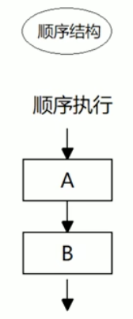

## 分支流程

### if

```javascript
if (条件表达式) {
  // 执行语句;
}
```

```javascript
if (条件表达式) {
  // 执行语句;
} else {
  // 执行语句;
}
```

```javascript
if (条件表达式) {
  // 执行语句;
} else if (条件表达式) {
  // 执行语句;
} else {
  // 执行语句;
}
```

### switch

> case匹配的时候，必须是全等
>
> break不写的话，还会执行下一个case，不管匹不匹配（和go的fallthrough效果一样）

```javascript
switch(表达式) {
  case value1:
    // 执行语句1;
    break;
  case value2:
    // 执行语句2;
    break;
  default:
    // 执行最后的语句;
}
```

## 三元表达式

三元运算符：`? :`

```javascript
条件 ? 表达式1 : 表达式2	// 如果条件为真则返回表达式1的值，如果条件为假则返回表达式2的值 
```

## 循环流程

## for

```javascript
for (初始化变量; 条件表达式; 操作表达式) {
  循环体;
}
```

## while

```javascript
初始化变量;
while (条件表达式) {
  循环体;
  操作表达式;	// 也可在循环体前面
}
```

## do while

至少执行一次

```js
初始化变量;
do {
  循环体;
  操作表达式;	// 也可在循环体前面
} while (条件表达式)
```

## continue和break

用法和其他语言一样。

# 数组

一组数据的集合，存储在单个变量下，每个数据称作元素，js的数组可以放任何类型的元素。

## 创建

- new：var 数组名 = new Array();
- 数组字面量
  - 空数组：var 数组名 = [];
  - 有元素的数组：var 数组名 = [1, 5.3, 'abc', true];

## 操作

### 访问元素

- 索引：数组名[索引号]，==越界后得到的是undefined==

### 遍历

```js
for (var i = 0; i < arr.length; i++) {
  arr[i]
}
```

### 新增元素

- 修改数组的长度（此时多出来的空元素是undefined）；给空元素赋值。
- 直接用索引塞进去

```js
// 从一个数组筛选元素塞进新数组
for (var i = 0; i < arr.length; i++) {
  if (筛选条件) {
    newArr[newArr.length] = arr[i]
  }
}
```

# 函数

## 声明

参数和返回值不需要写类型

```js
function demo(para1, para2) {
  // do something
}
demo()
```

js中也有匿名函数，可以赋值给变量

```js
var fun = function() {
  // do something
}
fun()
```

## 参数

- 如果实参的个数和形参的个数相等，则正常输出结果
- 如果实参的个数多于形参的个数，则多出的实参忽略
- 如果实参的个数少于形参的个数，则缺的参数是undefined

## 返回值

- 不需要返回变量名，直接return，return之后的代码都不会执行
- ==return只能返回一个值，有多个值的话用逗号隔开，则只返回最右边的值==
- ==需要返回多个值时，返回数组==
- 函数没有return时，返回的是undefined

## arguments

不确定有多少个参数传递时，用arguments来获取。JS中，arguments是当前函数的一个内置对象，所有函数都内置了一个arguments对象，**存储了传递的所有实参**。

arguments展示形式是一个伪数组，有以下特点

- 有length属性
- 按索引方式存储数据，因此可以遍历
- 不具有数组的push、pop等方法

## 调用

函数可以互相调用，可以调用后面声明的函数

## 箭头函数

`=>`操作符用于定义箭头函数。箭头函数是ES6（ECMAScript 2015）中引入的一种新的函数写法，提供了一种更简洁的方式来写函数表达式。箭头函数有几个特点：

1. 更短的函数写法：箭头函数提供了一种更简洁的语法来声明函数。
2. 没有自己的`this`：箭头函数不绑定自己的`this`，它们会捕获其所在上下文的`this`值作为自己的`this`值，这对于回调函数特别有用。
3. 没有`arguments`对象：箭头函数没有自己的`arguments`对象，但是可以访问外围函数的`arguments`对象。
4. 不能作为构造函数：箭头函数不能用作构造函数，即不能使用`new`关键字。
5. 没有`prototype`属性：箭头函数没有`prototype`属性。
6. 不能改变`this`：箭头函数的`this`是在定义时绑定的，之后不能被修改。

箭头函数的基本语法如下：

```js
const functionName = (参数1, 参数2, ..., 参数N) => { 函数体 };
```

如果箭头函数直接返回一个表达式的结果，可以省略大括号并且自动返回该表达式的结果：

```js
const functionName = (参数1, 参数2, ..., 参数N) => 表达式;
```

## 立即执行函数

不需要调用，立即执行，写法：

- 无参数
  - `(function() {})();`
  - `(function() {}());`
- 有参数
  - `(function(形参列表) {})(实参列表);`
  - `(function(形参列表) {}(实参列表));`
- 以上都可以在function后面写函数名

作用：创建了一个独立的作用域，避免了变量的命名冲突

# 作用域

## 全局作用域

- script标签
- 单独的js文件

## 局部作用域

在函数内部就是局部作用域，也叫函数作用域

## 块级作用域

变量仅在其声明所在的块（如`if`语句、`for`循环或任何`{}`中）内部可见，var不具备块级作用域，let和const具备

## 全局变量和局部变量

- 全局变量
  - 全局作用域下的变量，全局都能使用
  - 没有声明直接赋值的变量，也是全局变量

- 局部变量
  - 局部作用域下的变量，只能函数内部使用
  - 函数的形参也是局部变量
  - 在别的地方调用局部变量，会报错Uncaught ReferenceError
- 全局变量只有浏览器关闭时才销毁，比较占内存；局部变量在程序执行完毕就会销毁

## 作用域链

内部函数访问外部函数的变量，采取的是链式查找的方式来决定用哪个值（就近原则），称为作用域链

# 预解析

js引擎运行js过程：

1. 预解析：js引擎会把js里面所有的var和function声明提升到当前作用域的最前面
2. 执行代码：按照代码顺序从上往下执行

## 变量预解析

把所有的**变量声明**提升到当前作用域的最前面，**不提升赋值**

## 函数预解析

把所有的函数声明提升到当前作用域的最前面，不提升调用

# 对象

## 概念

js中，对象是一组无序的相关属性和方法的集合

- 属性：事物的特征
- 方法：事物的行为

## 创建方式

### 字面量

使用对象字面量{}创建对象，属性或方法采取键值对的形式，之间用逗号隔开（更推荐）

```js
var obj = {};	// 空对象
obj.uname = 'ls';
obj['age'] = 2;

var obj2 = {
  uname: 'zs',
  age: 10,
  sex: true,
  sayHi: function() {
    // do something
  }
}
```

### new Object()

```js
var obj = new Object();
obj.uname = 'ls';
obj.age = 11;
obj.sex = false;
obj.sayHi = function() {
  // do something
}
```

## 调用方式

- 属性
  - 对象名.属性名
  - 对象名['属性名']
- 方法
  - 对象.方法名()

## 构造函数

把对象里面一些相同的属性和方法抽象出来封装到函数里。

```js
function 构造函数名() {
  this.属性 = 值;
  this.方法 = function() {}
}
new 构造函数名();
```

- 构造函数名的首字母大写
- 构造函数不需要return就能返回结果，返回的是一个对象 

## 构造函数和对象

- 构造函数是抽象的公共部分，泛指某一大类
- 对象是特指某一个，用new创建对象的过程称为对象的实例化

## new执行过程

1. new 构造函数()，在内存中创建一个空对象
2. this指向创建的这个空对象
3. 执行构造函数里的代码，给空对象添加属性和方法
4. 返回这个对象

## 遍历对象

### for...in 循环：

`for...in` 循环可以遍历对象的可枚举属性，包括对象的原型链上的属性。在遍历时，需要使用 `hasOwnProperty` 方法来确保只获取对象自身的属性，而不包括继承的属性。

```js
var person = {
  name: 'Alice',
  age: 25,
  job: 'Engineer'
};

for (var key in person) {
  if (person.hasOwnProperty(key)) {
    console.log(key + ': ' + person[key]);
  }
}
```

### Object.keys 方法：

`Object.keys` 方法返回一个包含对象自身可枚举属性名称的数组。可以遍历这个数组来访问对象的属性。

```js
javascriptCopy code
var person = {
  name: 'Alice',
  age: 25,
  job: 'Engineer'
};

var keys = Object.keys(person);

for (var i = 0; i < keys.length; i++) {
  var key = keys[i];
  console.log(key + ': ' + person[key]);
}
```

### Object.values 方法：

`Object.values` 方法返回一个包含对象自身可枚举属性值的数组。

```js
var person = {
  name: 'Alice',
  age: 25,
  job: 'Engineer'
};

var values = Object.values(person);

for (var i = 0; i < values.length; i++) {
  console.log(values[i]);
}
```

### Object.entries 方法：

`Object.entries` 方法返回一个包含对象自身可枚举属性键值对的数组。

```js
var person = {
  name: 'Alice',
  age: 25,
  job: 'Engineer'
};

var entries = Object.entries(person);

for (var i = 0; i < entries.length; i++) {
  var key = entries[i][0];
  var value = entries[i][1];
  console.log(key + ': ' + value);
}
```

### forEach 方法：

```js
var person = {
  name: 'Alice',
  age: 25,
  job: 'Engineer'
};

Object.keys(person).forEach(function(key) {
  console.log(key + ': ' + person[key]);
});
Object.keys(person).forEach(key => {
  console.log(key + ': ' + person[key]);
});

Object.values(person).forEach(function(value) {
  console.log(value);
});
Object.values(person).forEach(value => {
  console.log(value);
});

// forEach函数是Array对象上的一个方法，允许你为数组中每个元素执行一个回调函数。
array.forEach(function(currentValue, index, arr), thisValue)
// currentValue：数组中正在处理的当前元素。
// index（可选）：数组中正在处理的当前元素的索引。
// arr（可选）：当前数组。
// thisValue（可选）：传递给函数的值用作this，默认为undefined。
```

# 内置对象

> js中的对象分3种：自定义对象，内置对象，浏览器对象

## Math对象

不是一个构造函数，不需要new来调用，直接使用它的属性和方法即可

- Math.PI，圆周率

- Math.floor()，向下取整

- Math.ceil()，向上取整

- Math.round()，四舍五入

- Math.abs()，绝对值

- Math.max()/Math.min()，最大值/最小值

- 随机数

  - Math.random()，返回[0,1)之间的随机小数

  - 获取其他范围的随机数：自己用Math的其他函数结合Math.random()去实现

    - 获取两个数之间的随机整数，并包含这两个数

      ```js
      function getRandomInt(min, max) {
        return Math.floor(Math.random() * (max - min +1)) + min;
      }
      ```

## 日期对象

- 只能通过Date构造函数来实例化日期对象：var date = new Date()

  - 没有传参，则返回当前时间

  - 参数可以
    - 数字型：var date = new Date(2023, 10, 1)，2023年10月1日
    - 字符串型（最常用）：var date = new Date('2023-5-1 8:8:8')

- 日期格式化

  var now = new Date();

  | 方法名            | 说明                     |
  | ----------------- | ------------------------ |
  | now.getFullYear() | 获取当年                 |
  | now.getMonth()    | 获取当月（0-11）         |
  | now.getDate()     | 获取当天日期             |
  | now.getDay()      | 获取周几（周日0到周六6） |
  | now.getHours()    | 获取当前小时             |
  | now.getMinutes()  | 获取当前分钟             |
  | now.getSeconds()  | 获取当前秒钟             |

- 1970年1月1日至今的总的毫秒数（时间戳）

  - var now = new Date();

    - now.valueOf()

    - now.getTime()

  - 最常用写法：var now = +new Date();

    > +new Date()可以传参数

  - H5新增方法：Date.now()

  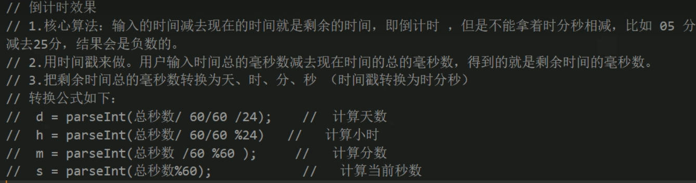

## 数组对象

- 创建

  - 数组字面量：var arr = [];	

  - new Array()

    - 创建一个空数组：var arr = new Array();

    - 创建长度为2且有两个空元素的数组：var arr = new Array(2);

    - 创建有元素的数组：至少传两个参数 var arr = new Array(2, 3);

      > 等价于 var arr = [2, 3];

- 检测是否为数组

  - instanceof：if (arr instanceof Array) {}

    > `instanceof`用于检查一个对象是否为特定构造函数的实例

  - Array.isArray()：if (Array.isArray(arr)) {}

    > H5新增的方法 

- 添加元素

  - push：在末尾添加元素，返回push后数组的长度，var arr = []; arr.push(1, 'abc');
  - unshift：在开头添加元素，返回unshift后数组的长度

- 删除元素

  - pop：删除最后一个元素，返回被删除的元素
  - shift：删除第一个元素，返回被删除的元素

- 排序

  - reverse()：翻转数组

  - sort() 

    - 排序，默认按照元素转换为字符串的各字符的Unicode位点进行排序（和mysql的排序一样）

    - 自定义排序：

      ```js
      arr.sort(function(a, b) {
        return a - b;	// 升序排序，b-a则是降序
      })
      ```

- 索引

  - indexof(target, [start])：查找给定元素的第一个索引，不存在则返回-1
  - lastIndexOf(target, [start])：查找给定元素的最后一个索引，不存在则返回-1

- 转换为字符串

  - toString()：得到的字符串，数组元素间用逗号分隔
  - join(分隔符)：默认分隔符是逗号 

- 其他

  - concat()：连接两个或多个数组，返回连接后的数组，不影响原数组
  - slice(begin, end)：截取数组，返回begin到end之间的新数组
  - splice(begin, n)：从begin开始删除n个元素，返回被删除元素后的新数组，会影响原数组

## 字符串对象

> 所有字符串的方法都不会修改字符串本身

- 根据字符返回索引：indexof(target, [start])和lastIndexof(target, [start])
  - str.indexOf('a'); 默认从0开始查找，lastIndexof一样
  - str.indexOf('a', 3); 从索引3的位置开始查找，lastIndexof一样
- 根据索引返回字符
  - charAt(index)，返回index位置的字符
  - charCodeAt(index)，返回index位置的字符的ASCII码，作用：**判断用户按了哪个键**
  - str[index]，H5新增，和charAt等效
- 操作字符串
  - concat，拼接字符串，用+拼接更常用
  - substr(start,length)，从start开始，截取length长度的字符串
  - slice(start,end)，从start开始截取到end，不包括end
  - substring(start,end)，基本和slice相同，不接受负值
  - replace('被替换的字符', '替换为的字符')，替换字符，只替换第一个出现的字符
  - split，把字符串转换为数组

# 数据类型总结

## 简单类型

> 也叫基本数据类型或值类型

- string、number、boolean、undefined、null（空的object）  
- 如果有个变量以后打算存储为对象，暂时没想好放什么，就给null

## 复杂类型

> 也叫引用类型

- 用new关键字创建，Object、Array、Date等

## 堆栈

- 栈：操作系统自动分配释放内存，存放参数、局部变量等变量的值
- 堆：手动分配释放内存，复杂数据类型的值存在堆里，若不手动释放，由垃圾回收机制回收
- 简单数据类型的值存在栈里；复杂数据类型的地址存在在栈里，值存放在堆里

# Web API

## 简介

### API

Application Programming Interface，应用程序编程接口，一些预先定义的函数，目的是提供应用程序与开发人员基于软件或硬件得以访问一组例程的能力，而无需访问源码或理解内部工作机制的细节。

### Web APIs

是浏览器提供的一套操作浏览器功能和页面元素的API（BOM和DOM）

## DOM

Document Object Model，文档对象模型，通过DOM接口可以改变网页的内容、结构和样式

### DOM树

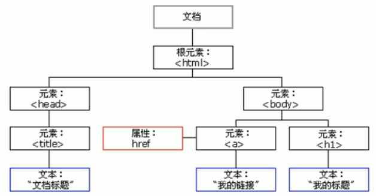

- 文档：一个页面就是一个文档，DOM中用document表示
- 元素：所有的标签就是元素，DOM中有element表示
- 节点：网页中的所有内容都是节点（标签、属性、文本、注视等），DOM中用node表示
- DOM中把以上内容都看做对象

### 获取元素

> 以下函数的传参都是字符串

- 根据ID获取：document.getElementById(id)，id是大小写敏感的字符串，找到则返回DOM的element对象，否则返回null
- 根据标签名获取
  - document.getElementsByTagName(name)，找到则返回一组对象（伪数组的形式存储），否则返回null，得到的元素是动态的（原始元素中的内容发生变化，得到的就会变化）
  - element.getElementsByTagName(name)
    - document.getElementsByTagName(name)[index].getElementsByTagName(name)
    - document.getElementById(id).getElementsByTagName(name)
- 通过H5新增的方法获取
  - document.getElementsByClassName(name)
  - document.querySelector(选择器)，返回指定选择器选中的第一个元素
  - document.querySelectorAll(选择器)，返回指定选择器选中的所有元素
- 特殊元素获取
  - document.body，获取body标签
  - document.documentElement，获取html标签


### 事件

触发-响应机制，网页中的每个元素都可以产生某些可以触发js的事件，事件由三部分组成

- 事件源，触发事件的对象，html中的元素
- 事件类型，如何触发，比如鼠标点击(onclick)、鼠标经过、键盘按下等
- 事件处理程序，处理事件的函数

  ==事件函数中也可以用this，指向的是事件函数的调用者==

```js
<script>
  var btn = document.getElementById('btn');	// 获取事件源

	// 绑定/注册事件
	btn.onclick = function() {
    alert('点击了按钮');
    this.disabled = true;
  }	//  
</script>
```

| 鼠标事件    | 触发条件         |
| ----------- | ---------------- |
| onclick     | 鼠标点击左键触发 |
| onmouseover | 鼠标经过触发     |
| onmouseout  | 鼠标离开触发     |
| onfocus     | 获得鼠标焦点触发 |
| onblur      | 失去鼠标焦点触发 |
| onmouseup   | 鼠标弹起触发     |
| onmousedown | 鼠标按下触发     |

### 操作元素

> 利用DOM来改变元素的内容、属性等，可以通过事件来修改，也可以直接修改，打开或刷新页面后直接显示修改后的内容。

#### 修改或获取元素内容

- element.innerText，非标准，从起始位置到终止位置到内容，不识别标签，且去掉空格和换行
- element.innerHTML，W3C标准，从起始位置到终止位置到内容，识别标签，且会包含空格和换行

#### 常用元素的属性操作

- innerText、innerHTML，改变元素内容
- src、href
- id、alt、title

#### 表单元素的操作

- type 
- value
- checked
- selected
- disabled

样式属性操作（自动把修改后的样式设为行内样式，因此优先级比css高，会覆盖css）

- element.style，行内样式操作，适用于样式少或功能简单的场景，如：`this.style.backgroundColor = ''`

- element.className，类名样式操作

  ```html
  .change {
    // 别的样式
  }
  <div class = "first">文本</div>
  
  this.className = 'change';	// 调用函数的元素的类改成change类，覆盖原来的类名
  this.className = 'first change';	// 多类名选择器，保留了原来的类（原先类中的部分样式还要继续用）
  ```

#### 操作一组元素

- 利用for循环获取一组元素，然后给每个元素.操作 = function{}
- 利用排他思想把其他元素的样式设为未点击时的样式，然后当前元素修改样式

### 自定义属性

#### 介绍

- 目的：保存并使用数据，有些数据可以保存到页面中而不用存到数据库中
- 规范：命名以`data-`开头

#### 操作

> \<div myAttr = 'demo'>文本\</div>，myAttr就是自定义属性

- 获取属性值：element.getAttribute(属性名)
- 设置属性值：element.setAttribute(属性名，属性值)
- 移除属性：element.removeAttribute(属性名)
- 以上函数也可以用来操作内置属性，只不过内置属性的操作还是更常用原本的方法
- H5新增，只能获取`data-`开头的自定义属性
  - element.dataset.自定义属性名（去掉`data-`前缀的属性名，且把多个-连接的单词转成小驼峰命名）
  - element.dataset['属性名']，属性名同上

### 节点

> 利用DOM提供的方法获取元素逻辑性不强且繁琐，常用节点的层级关系获取元素

#### 概述

- 网页中的所有内容都说节点（标签、属性、文本、注释等），在DOM中用node表示
- 节点至少拥有nodeType、nodeName、nodeValue三个基本属性
  - 元素节点的nodeType为1
  - 属性节点的nodeType为2
  - 文本节点（包含文字、空格、换行等）的nodeType为3

#### 节点层级

- 利用DOM树可以把节点划分为不同的层级关系，常见的是父子兄层级关系
- 父节点：element.parentNode，得到的是离元素最近的元素父节点，找不到父节点就返回null
- 子节点（比较麻烦，一般不使用）
  - element.childNodes，得到所有的子节点
    - 包含元素节点、文本节点等
    - 如果只想获得元素子节点，则for循环根据nodeType判断来获取
  - element.children（非标准），获取所有元素子节点，最常用
  - element.firstChild、element.lastChild、element.firstElementChild、element.lastElementChild，第一个子节点、最后一个子节点、第一个元素子节点、最后一个元素子节点（有兼容性问题）
- 兄弟节点
  - node.nextSibling，node.previousSibling，下一个和上一个兄弟节点，包含元素、文本等等
  - node.nextElementSibling，node.previousElementSibling，下一个和上一个兄弟元素节点，有兼容性问题
  - 避免兼容性问题：用nextSibling和previousSibling，for循环判断nodeType为1的时候返回

#### 节点操作

- 新增节点
  1. 创建节点：var child = document.cerateElement(标签名)
  2. 添加节点
     - 在元素后面添加节点：node.appendChild(child)，node是父级，child是子级，是上一步创建好的节点
     - 在元素前面添加节点：node.insertBefore(child, 指定元素)，node是父级，child是子级，是上一步创建好的节点，指定元素是通过前面的各种方法获取到的元素
- 删除节点：node.removeChild(child)，node是父级，child是子级
- 复制节点
  1. node.cloneNode()，相当于创建节点
     - 参数为空或false，则是浅拷贝，只复制标签，不复制内容
     - 参数为true，则是深拷贝，复制标签和内容
  2. 添加节点

### 三种动态创建元素的区别

- document.write()，直接将内容写入页面，但是当文档流执行完毕，会导致页面全部重绘（即只留下write进页面的内容）

  ```js
  document.write('<div>demo</div>')
  ```

- element.innerHTML，效率较低，如果改成把元素塞进数组，再把数组转换成字符串赋值给innerHTML，则效率比createElement还要高

- document.createElement()，效率比innerHTML直接拼接高很多，但是不如innerHTML数组的方式，不过结构更清晰

## DOM高级

### 注册事件

- 传统方式注册
  - 利用on开头的事件
  - 特点：注册事件的唯一性，即同一个元素同一个事件只能设置一个处理函数，最后注册的处理函数会覆盖前面注册的
- 方法监听注册，推荐方式
  - eventTarget.addEventListener(type, listener[, useCapture])，将指定的监听器注册到eventTarget上
    - type：事件类型字符串，不带on，入click，mouseover等
    - listener：事件处理函数
    - useCapture，默认false
      - true则该事件处于捕获阶段，父元素如果绑定了某个事件，在子元素上进行了该事件的操作时，不管子元素有没有绑定该事件，总是先执行父元素的事件
      - false则该事件处于冒泡阶段，父元素如果绑定了某个事件，在子元素上进行了该事件的操作时，不管子元素有没有绑定该事件，总是后执行父元素的事件
      - eg：如冒泡阶段，给父元素绑定了onClick，若子元素绑定了onClick，则点击子元素时，先执行子元素的onClick监听函数，后执行父元素的onClick监听函数；若子元素没有绑定onClick，则直接执行父元素的onClick监听函数
  - 特点：同一个元素同一个事件可以注册多个监听器，事件触发后，事件处理函数依次执行

### 删除事件

- 传统删除方式：事件处理函数设为null

  ```js
  element.onclick = null;
  ```

- 监听方式删除：eventTarget.removeEventListener(type, listener)，listener必须是命名函数，不能匿名，可以在事件处理函数内部进行，eg：

  ```js
  element.addEventListener('click', fn)
  function fn() {
    // do something
    element.removeEventListener('click', fn);
  }
  ```

### DOM事件流

事件流描述的是从页面中接收事件的顺序，事件发生时会在元素节点之间按照特定的顺序传播，这个传播过程即为DOM事件流

DOM事件流分3个阶段

1. 捕获阶段
2. 当前目标阶段
3. 冒泡阶段
   - 实际开发更关注冒泡
   - 有些事件没有冒泡，如onblur、onfocus、onmouseover、onmouseleave

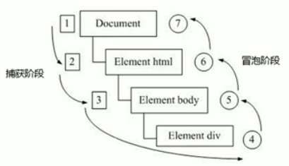

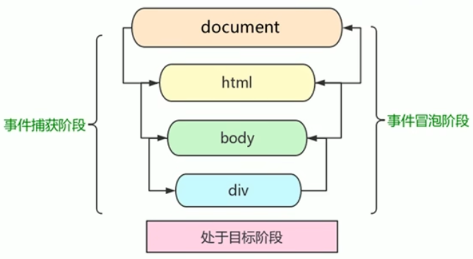

### 事件对象

- 事件对象是事件处理函数的形参

- 是系统自动创建的，不需要传递参数；若声明事件处理函数时给了形参，则这个形参就是事件对象

  ```js
  element.onClick = function(e) {
    console.log(e)	// e就是事件对象，包含了和该事件相关的信息
  }
  ```

- 是事件的一系列和事件相关数据的集合，如鼠标按下事件对象包含了鼠标按下时的坐标、被哪个元素绑定了等等

- 事件对象可以自己命名，有兼容性问题

事件对象的常见属性和方法

| 事件对象属性方法    | 说明                                                         |
| ------------------- | ------------------------------------------------------------ |
| e.target            | 触发事件的元素（this是绑定了事件的元素，注意区别，如ul绑定，但是点击时一般都点击的li） |
| e.type              | 事件的类型，如click、mouseover，不带on                       |
| e.preventDefault()  | 阻止默认行为，如不让链接跳转、不让提交按钮提交，e.returnValue、return false也可以，但不常用 |
| e.stopPropagation() | 阻止冒泡，e.cancelBubble也可以，但不常用                     |

### 事件委托

==不给每个子节点添加事件监听器，而是把事件监听器注册在其父节点上，然后利用冒泡原理影响每个子节点==

### 鼠标事件

#### 常用事件

- 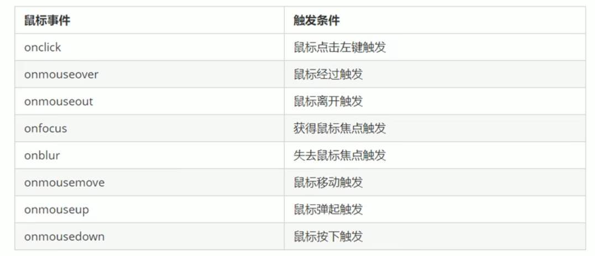

- contextmenu，用于控制何时显示上下文菜单，一般用法：

  ```js
  document.addEventListener('contextmenu', function(e) {
    e.preventDefault();	// 禁用鼠标右键菜单
  })
  ```

- selectstart，开始选中，一般用法

  ```js
  document.addEventListener('selectstart', function(e) {
    e.preventDefault();	// 禁止选中文字
  })
  ```

#### 鼠标事件对象

| 鼠标事件对象 | 说明                                                         |
| ------------ | ------------------------------------------------------------ |
| e.clientX    | 鼠标相对于浏览器窗口可视区的X坐标（距离上方的坐标），滚动条不会产生影响 |
| e.clientY    | 鼠标相对于浏览器窗口可视区的Y坐标（距离左方的坐标），滚动条不会产生影响 |
| e.pageX      | 鼠标相对于文档页面的X坐标，滚动后坐标会发生变化              |
| e.pageY      | 鼠标相对于文档页面的Y坐标，滚动后坐标会发生变化              |
| e.screenX    | 鼠标相对于电脑屏幕的X坐标                                    |
| e.screenY    | 鼠标相对于电脑屏幕的Y坐标                                    |

### 键盘事件

#### 常用事件

- 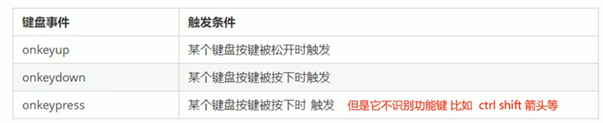

- 若一个对象同时绑定了三个事件，则三个事件的执行顺序：keydown --> keypress --> keyup
- keyup、keydown不区分大小写，keypress区分
- 还有一个特点：keydown和keypress事件触发时，文字还没有落入文本框中；而keyup触发时，文字先落入文本框

#### 键盘事件对象

| 鼠标事件对象 | 说明                                                         |
| ------------ | ------------------------------------------------------------ |
| e.keyCode    | 按下键的ASCII值，keyup、keydown不区分大小写，keypress区分    |
| e.clientY    | 鼠标相对于浏览器窗口可视区的Y坐标（距离左方的坐标），滚动条不会产生影响 |
| e.pageX      | 鼠标相对于文档页面的X坐标，滚动后坐标会发生变化              |
| e.pageY      | 鼠标相对于文档页面的Y坐标，滚动后坐标会发生变化              |
| e.screenX    | 鼠标相对于电脑屏幕的X坐标                                    |
| e.screenY    | 鼠标相对于电脑屏幕的Y坐标                                    |

## BOM

### 概述

- 浏览器对象模型，提供了独立于内容而与浏览器窗口进行交互的对象，核心对象是window

  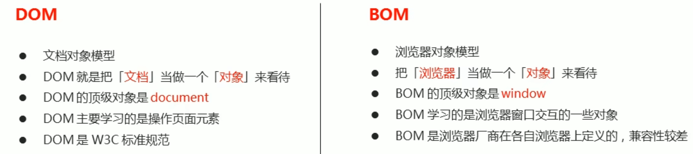

- BOM比DOM更大，包含了DOM

  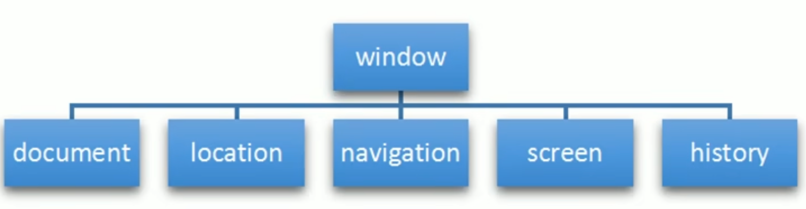

- window对象是浏览器的顶级事件，具有双重角色
  1. 是JS访问浏览器的一个接口
  2. 是一个全局对象，定义在全局作用域中的变量和函数都会变成window对象的属性和方法
- window对象的属性和方法调用时，可以省略window关键字
- window对象有一个特殊属性name，因此全局变量不要叫这个名字

### window对象常见事件

#### 窗口加载事件

- `window.onload = function() {}`或`window.addEventListener("load", function() {})`，推荐addEventListener

  当文档内容**完全**加载完成会触发该事件

- `document.addEventListener("DOMContentLoaded", function() {})`，仅当DOM元素加载完成

  > 如果页面图片很多的话，用这个事件更合适，否则图片还没加载完成时，交互效果都无法实现

#### 调整窗口大小事件

- `window.onresize = function() {}` 或 `window.addEventListener("resize", function() {})`

  只要窗口大小发生像素变化，就会触发该事件

- `window.innerWidth`获取窗口的宽度

### 定时器

- `window.setTimeout(回调函数, [延迟的毫秒数])`

  - 用于设置一个定时器，在定时器到期后执行调用函数
  - 延迟的毫秒数可以省略，省略时为0（立即执行）
  - 调用函数可以直接写函数，也可以写函数名
  - 页面中可能有多个定时器，使用时一般给定时器加名字：`var timer1 = window.setTimeout(调用函数, [延迟的毫秒数]  `

- window.clearTimeout(定时器的名字)，停止定时器

  > 定时器的名字不用带引号

- `window.setInterval(回调函数, [延迟的毫秒数])`，重复调用一个函数，每隔一个周期就调用一次

- window.clearInterval(定时器的名字)，停止定时器

### this指向

- 全局作用域或普通函数中，this指向window，定时器中this也指向window
- 方法中，this指向调用方法的对象
- 构造函数中，this指向构造函数的实例

### JS执行机制

JS是单线程语言，在H5提出的Web Worker标准中，提出了同步和异步的概念

JS的异步是通过回调函数实现的，一般异步任务有三种类型：

- 普通事件，如click、resize等
- 资源加载，如load、error等
- 定时器

JS先把同步任务全部执行完，再依次执行任务队列中的异步任务，然后进行事件循环，反复查看任务队列中是否有异步任务可以执行

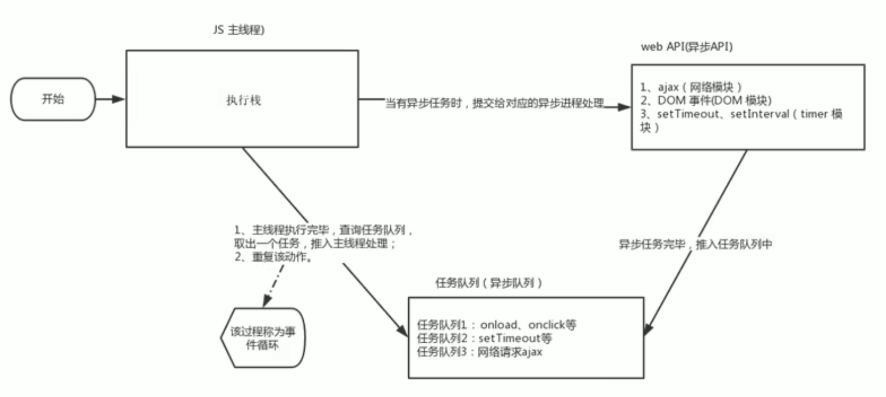

### location对象

window有一个location属性，返回的是一个对象，因此成为location对象，location对象用于获取或设置窗体的url，并且可以解析url

#### 属性

| location对象属性  | 返回值                                |
| ----------------- | ------------------------------------- |
| location.href     | 获取或设置整个url                     |
| location.host     | 返回主机域名                          |
| location.port     | 返回端口号，如果未写，返回空字符串    |
| location.pathname | 返回路径                              |
| location.search   | 返回参数                              |
| location.hash     | 返回片段，#后面的内容，常见于锚点链接 |

#### 方法

| location对象方法   | 作用                                                         |
| ------------------ | ------------------------------------------------------------ |
| location.assign()  | 跟href一样，可以跳转页面（也称为页面重定向），记录历史，可以后退 |
| location.replace() | 替换当前页面，因为不记录历史，所以不能后退页面               |
| location.reload()  | 重新加载页面，相当于刷新按钮或f5，如果参数为true，则是强制刷新ctrl+f5 |

### navigator对象

包含浏览器的相关信息，有很多属性，最常用的是userAgent，返回请求头里user-agent的值

### history对象

与浏览器历史记录进行交互，包含用户访问过的URL

| history对象方法 | 作用                                                |
| --------------- | --------------------------------------------------- |
| back()          | 后退                                                |
| forward()       | 前进                                                |
| go(参数)        | 前进后退，参数为1则前进一个页面，为-1则后退一个页面 |

## 网页特效

### offset系列

使用offset系列相关属性可以**动态**的得到该元素的位置、大小等

- 获取元素距离带有定位父元素的位置
- 获得元素自身的大小（宽度高度）
- 返回的值都不带单位

| offset系列属性       | 作用                                                         |
| -------------------- | ------------------------------------------------------------ |
| element.offsetParent | 返回作为该元素带有定位的父元素，如果父级元素都没有定位则返回body |
| element.offsetTop    | 返回元素相对带有定位父元素上方的偏移                         |
| element.offsetLeft   | 返回元素相对带有定位父元素左方的偏移                         |
| element.offsetWidth  | 返回自身包括padding、边框、内容区的宽度，返回数值不带单位    |
| element.offsetHeight | 返回自身包括padding、边框、内容区的高度，返回数值不带单位    |

####  offset和style的区别

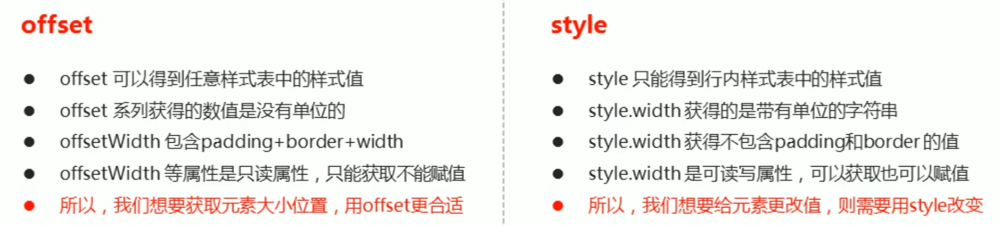

### client系列

使用client系列相关属性可以动态的获得元素的边框大小、元素大小等

| client系列属性       | 作用                                                         |
| -------------------- | ------------------------------------------------------------ |
| element.clientTop    | 元素上边框的大小                                             |
| element.clientLeft   | 元素左边框的大小                                             |
| element.clientWidth  | 返回自身包括padding、内容区的宽度，不含边框，返回数值不带单位 |
| element.clientHeight | 返回自身包括padding、内容区的高度，不含边框，返回数值不带单位 |

### scroll系列

### 动画函数封装