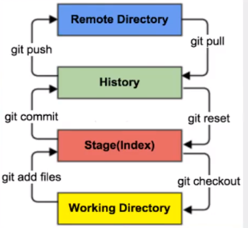
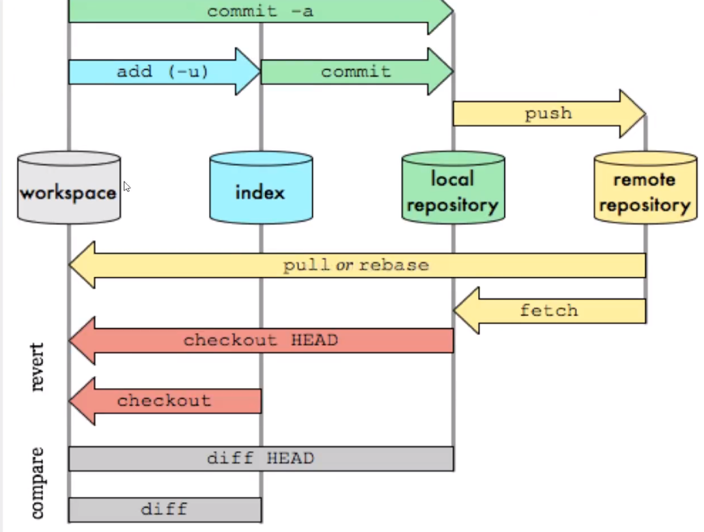
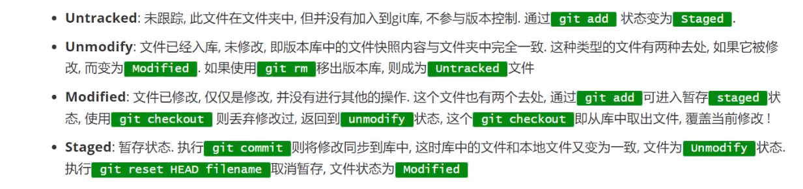
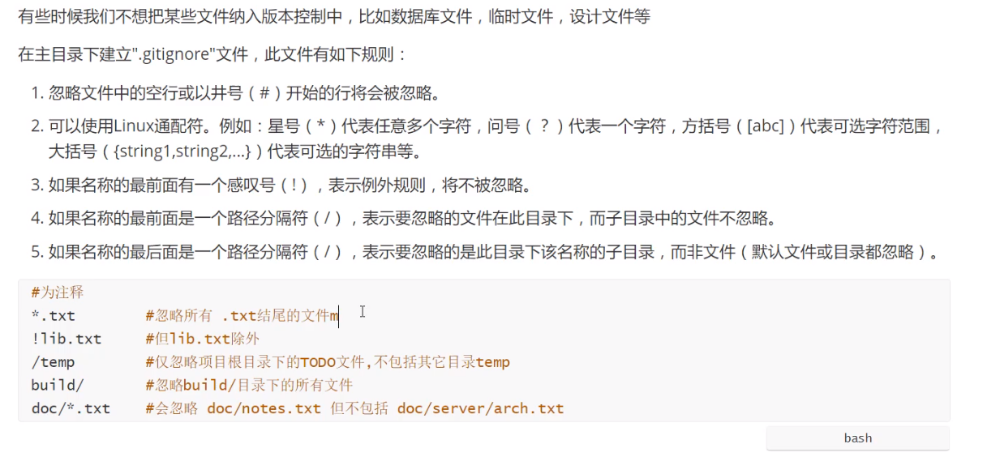

# 个人总结

### 一、完整的 Git 工作流程（包括后悔过程）

1. **初始化和设置**

   - 初始化一个新的 Git 仓库：

     ```shell
     git init
     ```

   - 设置用户信息：

     ```shell
     git config --global user.name "Your Name"
     git config --global user.email "your.email@example.com"
     ```

   - 添加远程仓库：

     ```shell
     git remote add origin https://github.com/username/repo.git
     ```

2. **创建和切换分支**

   - 创建新的分支：

     ```shell
     git branch feature-branch
     ```

   - 切换到新的分支：

     ```shell
     git checkout feature-branch
     ```

3. **修改文件**

   - 编辑文件并保存更改。

4. **查看状态**

   - 查看文件的更改状态：

     ```shell
     git status
     ```

5. **撤销文件更改（后悔修改）**

   - 撤销工作目录中的更改：

     ```shell
     git restore <file>
     ```

6. **添加文件到索引**

   - 将文件添加到索引（暂存区）：

     ```shell
     git add <file>
     ```

7. **撤销添加到索引（后悔 add）**

   - 从索引中移除文件（恢复到工作目录）：

     ```shell
     git restore --staged <file>
     ```

8. **提交更改**

   - 提交更改到本地仓库：

     ```shell
     git commit -m "Commit message"
     ```

9. **撤销提交（后悔 commit）**

   - 仅撤销提交，保留文件更改在索引中：

     ```shell
     git reset --soft HEAD~
     ```

   - 撤销提交和索引中的更改，保留文件更改在工作目录中：

     ```shell
     git reset --mixed HEAD~
     ```

10. **合并多个提交（保持历史干净）**

    - 使用交互式变基合并提交：

      ```shell
      git rebase -i HEAD~3
      ```

11. **推送到远程仓库**

    - 首次推送并设置跟踪关系：

      ```shell
      git push -u origin feature-branch
      ```

    - 推送更新到远程：

      ```shell
      git push
      ```

12. **从远程仓库拉取更新**

    - 获取远程更新并合并到当前分支：

      ```shell
      git pull origin master
      ```

13. **合并远程分支**

    - 获取远程更新：

      ```shell
      git fetch origin
      ```

    - 合并远程跟踪分支的更新到当前分支：

      ```shell
      git merge origin/master
      ```

14. **解决冲突**

    - 解决合并冲突，编辑冲突文件并添加解决冲突的文件：

      ```shell
      git add <resolved-file>
      git commit
      ```

15. **删除本地和远程分支**

    - 删除本地分支：

      ```shell
      git branch -d <branch-name>
      ```

    - 删除远程分支：

      ```shell
      git push origin --delete <branch-name>
      ```

16. **删除本地和远程标签**

    - 删除本地标签：

      ```shell
      git tag -d <tag-name>
      ```

    - 删除远程标签：

      ```shell
      git push origin --delete tag <tag-name>
      ```

### 二、补充的 Git 知识点

1. **本地分支、远程分支和远程跟踪分支**

   - **本地分支**：你在本地创建和操作的分支（`refs/heads/`）。
   - **远程分支**：远程仓库中的分支（`refs/remotes/`）。
   - **远程跟踪分支**：本地对远程分支状态的引用和跟踪（`refs/remotes/origin/`）。

2. **`refs/heads` 和 `refs/remotes`**

   - **`refs/heads`**：用于本地分支，如 `refs/heads/master`。
   - **`refs/remotes`**：用于远程跟踪分支，如 `refs/remotes/origin/master`。

3. **`git push -u` 的作用**

   - **设置跟踪关系**：`-u` 选项设置本地分支与远程分支的跟踪关系。
   - **简化操作**：设置跟踪关系后，可以省略远程仓库和分支名称。

4. **推送和删除标签与分支**

   - **推送标签**：`git push origin --tags` 推送所有标签。
   - **删除标签**：`git push origin --delete tag <tag-name>` 删除远程标签。
   - **删除分支**：`git push origin --delete <branch-name>` 删除远程分支。

5. **使用简化和完整的分支引用**

   - **简化引用**：如 `git push origin master`。
   - **完整引用**：如 `git push origin refs/heads/master`，通常不需要，简化引用就足够。

6. **远程仓库的添加和推送**

   - **添加远程仓库**：

     ```shell
     git remote add origin <repository-url>
     ```

   - **推送到远程仓库**：

     ```shell
     git push origin <branch-name>
     ```

7. **拉取和合并远程分支**

   - **获取更新**：

     ```shell
     git fetch origin
     ```

   - **合并远程分支**：

     ```shell
     git merge origin/master
     ```

8. **删除远程仓库**

   - 删除远程仓库引用：

     ```shell
     git remote remove origin
     ```

9. **查看和管理分支跟踪关系**

   - 查看分支的跟踪关系：

     ```shell
     git branch -vv
     ```

   - 更改跟踪关系：

     ```shell
     git branch --set-upstream-to=origin/new-branch
     ```

   - 移除跟踪关系：

     ```shell
     git branch --unset-upstream
     ```

   - 更改远程仓库url

     ```shell
     git remote set-url origin <newurl>
     ```

   - #### 使用场景

     - **`git remote set-url`**：适用于远程仓库迁移、更改访问协议或修正 URL。
       - **示例**：将仓库从 GitHub 迁移到 GitLab。
     - **`git branch --set-upstream-to`**：适用于设置或更改本地分支与远程分支的跟踪关系。
       - **示例**：推送新分支并设置其跟踪关系，以便后续同步（更多用git push -u）；或者已经有一个分支，并且想设置或更改它的跟踪关系

# 常用命令

- `git config -l`：查看所有配置
- `git config --system --list`：只查看系统配置，保存在git安装目录`/etc/gitconfig`中
- `git config --global --list`：只查看用户配置，保存在C盘用户目录`/.gitconfig`中，相关配置如下
  - `user.name xxx`
  - `user.email xxx`
  - `http.sslVerify false`
- 在C盘用户目录`.ssh/`里面通过`ssh-keygen -t rsa`生成公钥（`.pub`文件）（官方推荐用RSA算法），把公钥信息添加到仓库
- `git push origin HEAD:/refs/for/master`：推送到`gerrit`

# Git基本理论

## 工作区

> Git本地有三个工作区域：工作目录(Working Directory)、暂存区(Stage/Index)、资源库(Repository / Git Directory)。如果再加上远程的git仓库(Remote Directory)就是四个工作其区域。



- Working Directory：工作区，就是平时放代码的地方
- Index/Stage：暂存区，临时存放你的改动，事实上只是一个文件，保存即将体积到文件列表信息
- Repository：仓库区（本地仓库），就是安全存放数据的位置，有提交的所有版本的数据。其中`HEAD`指向最新放入仓库的版本
- Remote Directory：远程仓库，托管代码的服务器



## 文件状态



## 忽略文件



# 撤销修改

- `git checkout`：撤销`ctrl+s`保存的

- `git reset HEAD`：撤销add的（和`--mixed`等效）（如果是HEAD~的话则是先移动HEAD，再把HEAD指向的commit同步到index）

  >  也就是把上一次commit的记录拿来覆盖`stage`区的（上一次的commit即最新的commit，HEAD指向的是这个commit)，不会覆盖工作区

- `git reset --soft HEAD~`：把本地仓库的`HEAD`指向最新提交的上一次，（即修改`HEAD`指向的位置）

- `git reset --hard HEAD~`：把本地仓库的内容直接覆盖本地所有，连工作区也覆盖了

# IDEA集成git

`.git`文件夹内容直接复制到IDEA的项目目录下

# 分支

- `git branch`

- `git branch -r`

- `git branch xxx`

- `git checkout -b xxx`

- `git merge xxx`

- `git branch -d xxx`

- `git push origin --delete xxx`

- `git branch -dr origin/xxx`

- 一般的开发过程如下

  > Git merge 和rebase的作用是一样的，都是将多个分支合并成一个。
  >
  > merge后两个分支的commit历史不变，而rebase后会把commit的历史也合并进去
  >
  > 本地开发分支拉取远程开发分支用rebase，开发分支合并主干分支的时候用rebase(就是题主说的这些)，最后主干分支合并开发分支用merge，最后推送各分支。

  ```shell
  #切到master分支
  git checkout master
  
  #拉取最新的master分支。如果修改过本地master，可以先stash把修改放进缓存，然后pull，然后unstash从缓存里拿出修改，有冲突的话就解决冲突（本地多分支的话就不用这样了，本地的master是永远干净的）
  git pull
  
  #切换到local分支
  git checkout local
  
  #修改代码，如果修改的时间很长，可以改完之后再pull最新的master
  
  #修改完了， 就正常提交代码
  git commit
  
  #1. 如果有多次local分支的提交，就合并，只有一次可以不合并
  #2. 然后我们开始输入i进入编辑页面开始修改，把需要压缩的提交，前面pick关键字改成squash，注意，git squash 只支持依次修改，必须保留最上面的pick关键字不变，否则会报错，无法squash成功
  #3. 最后，我们第一次 esc，:wq保存 会进入到如下图commit message 的编辑界面，继续输入i进行压缩后提交信息命名的修改，然后第二次 esc，:wq保存，最后看到successfully的字样就说明成功了
  git rebase -i HEAD~2  //合并提交 --- 2表示合并两个
  git rebase master---->解决冲突--->git rebase --continue #将master的最新内容合并到local
  git checkout master #再次切换到master或其他目标分支
  git merge local #将local的所有修改合并到master
  git push #推送到远程仓库
  ```

# gitee给的命令大全

## 仓库

```
# 在当前目录新建一个Git代码库
$ git init

# 新建一个目录，将其初始化为Git代码库
$ git init [project-name]

# 下载一个项目和它的整个代码历史
$ git clone [url]
```

## 配置

```
# 显示当前的Git配置
$ git config --list

# 编辑Git配置文件
$ git config -e [--global]

# 设置提交代码时的用户信息
$ git config [--global] user.name "[name]"
$ git config [--global] user.email "[email address]"

# git bash终端中文乱码
$ git config --global core.quotepath false

# 报错fatal: the remote end hung up unexpectedly
git config http.postBuffer 524288000

# 忽略chmod引起的变化
git config --add core.filemode false

# 忽略CRLF(windows)自动转换成LF(linux)
git config core.autocrlf false
```

## 增加/删除文件

```
# 添加指定文件到暂存区
$ git add [file1] [file2] ...

# 添加指定目录到暂存区，包括子目录
$ git add [dir]

# 添加当前目录的所有文件到暂存区
$ git add .

# 添加每个变化前，都会要求确认
# 对于同一个文件的多处变化，可以实现分次提交
$ git add -p

# 删除工作区文件，并且将这次删除放入暂存区
$ git rm [file1] [file2] ...

# 停止追踪指定文件，但该文件会保留在工作区
$ git rm --cached [file]

# 改名文件，并且将这个改名放入暂存区
$ git mv [file-original] [file-renamed]
```

## 代码提交

```
# 提交暂存区到仓库区
$ git commit -m [message]

# 提交暂存区的指定文件到仓库区
$ git commit [file1] [file2] ... -m [message]

# 提交工作区自上次commit之后的变化，直接到仓库区
$ git commit -a

# 提交时显示所有diff信息
$ git commit -v

# 使用一次新的commit，替代上一次提交
# 如果代码没有任何新变化，则用来改写上一次commit的提交信息
$ git commit --amend -m [message]

# 重做上一次commit，并包括指定文件的新变化
$ git commit --amend [file1] [file2] ...
```

## 分支

> remote一般是origin，branch是对应的分支名

```
# 列出所有本地分支
$ git branch

# 列出所有远程分支
$ git branch -r

# 列出所有本地分支和远程分支
$ git branch -a

# 新建一个分支，但依然停留在当前分支
$ git branch [branch-name]

# 新建一个分支，并切换到该分支
$ git checkout -b [branch]

# 新建一个分支，指向指定commit
$ git branch [branch] [commit]

# 新建一个分支，与指定的远程分支建立追踪关系
$ git branch --track [branch] [remote/branch]

# 切换到指定分支，并更新工作区
$ git checkout [branch-name]

# 切换到上一个分支
$ git checkout -

# 建立追踪关系，在现有分支与指定的远程分支之间
$ git branch --set-upstream-to=origin/branch branch

# 创建远程分支并建立追踪关系

# 合并指定分支到当前分支
$ git merge [branch]

# 选择一个commit，合并进当前分支
$ git cherry-pick [commit]

# 删除分支
$ git branch -d [branch-name]

# 删除远程分支
$ git push origin --delete [branch-name]
$ git branch -dr [remote/branch]
```

### 标签

```
# 列出所有tag
$ git tag

# 新建一个tag在当前commit
$ git tag [tag]

# 新建一个tag在指定commit
$ git tag [tag] [commit]

# 删除本地tag
$ git tag -d [tag]

# 删除远程tag
$ git push origin :refs/tags/[tagName]

# 查看tag信息
$ git show [tag]

# 提交指定tag
$ git push [remote] [tag]

# 提交所有tag
$ git push [remote] --tags

# 新建一个分支，指向某个tag
$ git checkout -b [branch] [tag]
```

### 查看信息

```
# 显示有变更的文件
$ git status

# 显示当前分支的版本历史
$ git log

# 显示commit历史，以及每次commit发生变更的文件
$ git log --stat

# 搜索提交历史，根据关键词
$ git log -S [keyword]

# 显示某个commit之后的所有变动，每个commit占据一行
$ git log [tag] HEAD --pretty=format:%s

# 显示某个commit之后的所有变动，其"提交说明"必须符合搜索条件
$ git log [tag] HEAD --grep feature

# 显示某个文件的版本历史，包括文件改名
$ git log --follow [file]
$ git whatchanged [file]

# 显示指定文件相关的每一次diff
$ git log -p [file]

# 显示过去5次提交
$ git log -5 --pretty --oneline

# 显示所有提交过的用户，按提交次数排序
$ git shortlog -sn

# 显示指定文件是什么人在什么时间修改过
$ git blame [file]

# 显示暂存区和工作区的差异
$ git diff

# 显示暂存区和上一个commit的差异
$ git diff --cached [file]

# 显示工作区与当前分支最新commit之间的差异
$ git diff HEAD

# 显示两次提交之间的差异
$ git diff [first-branch]...[second-branch]

# 显示今天你写了多少行代码
$ git diff --shortstat "@{0 day ago}"

# 显示某次提交的元数据和内容变化
$ git show [commit]

# 显示某次提交发生变化的文件
$ git show --name-only [commit]

# 显示某次提交时，某个文件的内容
$ git show [commit]:[filename]

# 显示当前分支的最近几次提交
$ git reflog
```

### 远程同步

```
# 下载远程仓库的所有变动
$ git fetch [remote]

# 显示所有远程仓库
$ git remote -v

# 显示某个远程仓库的信息
$ git remote show [remote]

# 增加一个新的远程仓库，并命名
$ git remote add [shortname] [url]

# 取回远程仓库的变化，并与本地分支合并
$ git pull [remote] [branch]

# 上传本地指定分支到远程仓库
$ git push [remote] [branch]

# 强行推送当前分支到远程仓库，即使有冲突
$ git push [remote] --force

# 推送所有分支到远程仓库
$ git push [remote] --all
```

### 撤销

```
# 恢复暂存区的指定文件到工作区
$ git checkout [file]

# 恢复某个commit的指定文件到暂存区和工作区
$ git checkout [commit] [file]

# 恢复暂存区的所有文件到工作区
$ git checkout .

# 重置暂存区的指定文件，与上一次commit保持一致，但工作区不变
$ git reset [file]

# 重置暂存区与工作区，与上一次commit保持一致
$ git reset --hard

# 重置当前分支的指针为指定commit，同时重置暂存区，但工作区不变
$ git reset [commit]

# 重置当前分支的HEAD为指定commit，同时重置暂存区和工作区，与指定commit一致
$ git reset --hard [commit]

# 重置当前HEAD为指定commit，但保持暂存区和工作区不变
$ git reset --keep [commit]

# 新建一个commit，用来撤销指定commit
# 后者的所有变化都将被前者抵消，并且应用到当前分支
$ git revert [commit]

暂时将未提交的变化移除，稍后再移入
$ git stash
$ git stash pop

建立追踪关系的三种方式
1.1 手动建立追踪关系
 $ git branch --set-upstream-to=<远程主机名>/<远程分支名> <本地分支名>
1
1.2 push时建立追踪关系
 $ git push -u <远程主机名> <本地分支名>
1
加上-u参数，这样push时，本地指定分支就和远程主机的同名分支建立追踪关系。

1.3 新建分支时建立跟踪关系
 $ git checkout -b <本地分支名> <远程主机名>/<远程分支名>
1
新分支指针指向 <远程主机名>/<远程分支名> 所指的位置。具体位置可用 git log --oneline --graph 查看。

注意：
使用 1 和 3 命令前要先确保本地有名为 <远程主机名>/<远程分支名> 的远程跟踪分支，没有就要先用 git fetch 或 git pull 命令从远程主机上抓取，抓取后自动产生。远程跟踪分支是远程分支状态的引用， 它们是你不能移动的本地引用。用 git branch 看不到，用 git branch -r 才可以看到。
```

### 其他

```
# 生成一个可供发布的压缩包
$ git archive

# 获取最新commit id或sha的简短结果
$ git rev-parse --short HEAD
```

以上常用命令来自阮一峰老师的博客文章《常用 Git 命令清单》，感谢阮老师！