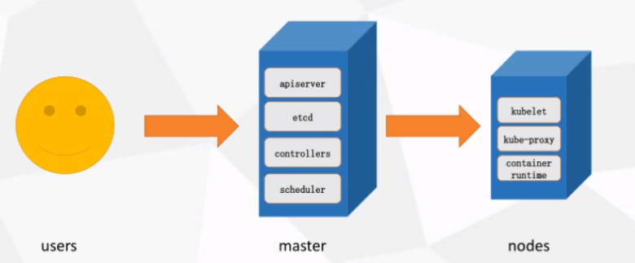
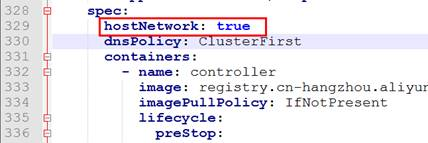
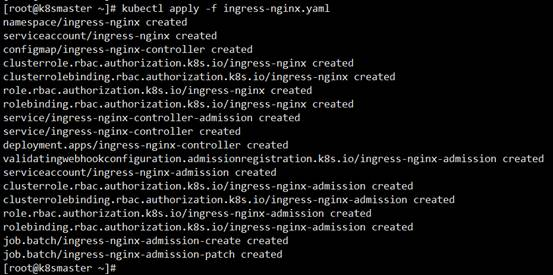
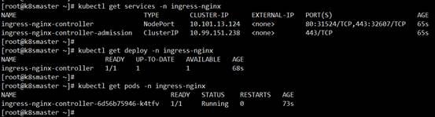
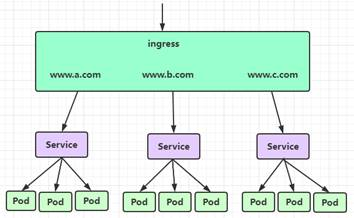
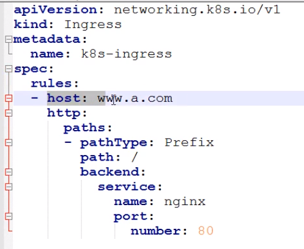
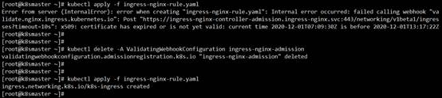

# 概述

> Kubernetes，是Google开源的容器编排引擎，用于自动化容器应用程序的部署、规划、扩展和管理

- 整体结构：高可用时master两个，node多个

  - master是集群的控制节点，对集群进行调度管理
  - nodes是工作节点

  

- 环境准备、安装配置：见课件

- 组件介绍

  - Kubelet：运行在cluster所有节点上，负责启动POD（对数个容器的抽象/包装）和容器
  - Kubeadm：用于初始化cluster的工具
  - Kubectl：k8s的命令行工具

# 使用

```bash
#启动kubelet服务和docker
systemctl enable kubelet.service
systemctl enable docker.service

#在master机器上部署Kubernetes Master主节点，此命令会下载一些镜像
#第一个参数是通知master节点中apiserver的地址，最后一个参数是固定写法，其他参数见名知意
kubeadm init --apiserver-advertise-address=192.168.172.134 --image-repository registry.aliyuncs.com/google_containers --kubernetes-version v1.21.1 --service-cidr=10.96.0.0/12 --pod-network-cidr=10.244.0.0/16

#接下来在master机器上执行（10~14行都是kubeadm init完成后输出的提示）
mkdir -p $HOME/.kube
sudo cp -i /etc/kubernetes/admin.conf $HOME/.kube/config
sudo chown $(id -u):$(id -g) $HOME/.kube/config
#在node机器上把node节点加入master
kubeadm join xxx	

#用wget下载kube-flannel.yml文件，然后在master机器上应用它得到运行时容器
kubectl apply -f kube-flannel.yml
```

```bash
#k8s部署应用的步骤：
1. 项目打包
2. 制作DockerFile构建镜像
3. 通过控制器管理pod（其实就是镜像启动得到容器，容器在pod里运行）（此时能查到pod和控制器，但查不到service）
   kubectl create deployment mynginx --image=nginx	#deployment是控制器，后面跟的是控制器名字
4. 暴露应用供外部访问（暴露完service才能被查到）（这里指定的port是k8s服务之间访问的端口，对外端口是nodeport随机生成的）
   kubectl expose deployment mynginx --port=80 --type=NodePort
5. 访问应用
```

# 命令

- 查看一下，相关命令：

  - kubectl get node(s)

  - kubectl get service(s)

    > 查看后的信息中，端口号由两部分组成，80:3xxxx，容器间访问是80，3xxxx是供外部访问，一般都在3万以上

  - kubectl get deployment (deploy)

  - kubectl get pod(s)

    > 可以跟-n和其参数，是指空间中的pod，不带时为默认空间deafult

- 删除service

  - kubectl delete service nginx

    > 删除时先删service，再删控制器，pod就会自动跟着删了

- 删除控制器
  
- kubectl delete deployment nginx
  
- 删除pod

  - kubectl delete pod nginx-6799fc88d8-zc48m（pod名字）

- 部署

  - 命令部署：kubectl create deployment mynginx --image=nginx

    > 此命令可以跟--dry-run -o yaml > depoly.yaml：空运行，然后输出一个yml，此yml会发给master的apiserver，后续可以直接通过此yml部署

  - yml部署：kubectl apply -f depoly.yaml

    > 需要改拉取精确的仓库：在文件中"containers:"下面添加`imagePullPolicy:Never`

- 暴露给外部访问

  - kubectl expose deployment mynginx --port=80 --type=NodePort

# 知识点

- 关系：Mater控制Node --> ingress --> service --> deployment(控制器) --> pod --> docker

- 暴露端口的方式

  - NodePort：让外部请求直接访问应用，指定或随机产生一个30000以上的端口供外部访问（用于临时测试）
  - LoadBalancer：云厂商提供的一种负载均衡的方式
  - Ingress：定义一些路由规则来转发、暴露服务，对外暴露统一的ip和端口（生产环境常用）

- 端口的类型：nodePort是外部机器访问的端口；targetPort是容器的端口；port是k8s服务之间访问的端口

- 真正的暴露流程：

  - 创建完控制器后，暴露它，三种port都设置一下

    `kubectl expose deployment spring-cloud-alibaba-consumer --port=9090 --target-port=9090 --type=NodePort`

  - 部署ingress统一入口，一般都是Ingress Nginx（直接下载对应的yaml，然后apply它即可）

    > [下载地址](https://kubernetes.github.io/ingress-nginx/deploy/)
    >
    > ingress-nginx是使用NGINX作为反向代理和负载均衡器的Kubernetes的Ingress控制器；
    >
    > wget https://raw.githubusercontent.com/kubernetes/ingress-nginx/controller-v0.46.0/deploy/static/provider/baremetal/deploy.yaml
    >
    > 从[阿里云镜像](http://dev.aliyun.com/ )里搜索ingress，332行修改成阿里云镜像：
    >
    > 搜到谷歌的ingress-nginx后复制其公网地址，去掉@sha256和它后面的部分
    >
    > 添加一个配置项：
    >
    > 
    >
    > 应用：
    >
    > kubectl apply -f deploy.yaml
    >
    > 
    >
    > 1、查看Ingress的状态
    >
    > kubectl get service -n ingress-nginx
    >
    > kubectl get deploy -n ingress-nginx
    >
    > kubectl get pods -n ingress-nginx
    >
    > 
    >
    > 2、创建Ingress规则
    >
    > 
    >
    > kubectl apply -f ingress-nginx-rule.yaml（规则文件自己写）
    >
    > 
    >
    > 报如下错误：
    >
    > 
    >
    > 解决：kubectl delete -A ValidatingWebhookConfiguration ingress-nginx-admission
    >
    > 然后再次执行：kubectl apply -f ingress-nginx-rule.yaml
    >
    > 然后把规则中的域名添加到hosts文件中
    >
    > 检查一下：
    >
    > kubectl get ing(ress) --查规则

# 知识点2

==Kubernetes架构及和核心组件==


API server是所有请求的唯一入口；

api server管理所有的事务，并把信息记录到etcd数据库中，etcd有一个自动服务发现的特性机制，etcd会搭建有三个节点的集群，实现三副本；

scheduler 调度器用来调度资源，查看业务节点的资源情况，确定在哪个node上创建pod，把指令告知给api server；

控制管理器controller-manager管理pod；

pod可以分为有状态和无状态的pod，一个pod里最好只放一个容器；大部分都是无状态。

| 有状态和无状态区别                                           |
| ------------------------------------------------------------ |
| 有状态服务可以说是需要数据存储功能的服务、或者指多线程类型的服务，队列等。（mysql数据库、kafka、zookeeper等） |
| 无状态服务是指该服务运行的实例不会在本地存储需要持久化的数据，并且多个实例对于同一个请求响应的结果是完全一致的。多个实例可以共享相同的持久化数据。 |

api server把任务下发给业务节点的kubelet去执行；

客户访问通过kube-proxy去访问pod；

pod下面的不一定是docker，还有别的容器；

一般pod中只包含一个容器，除了一种情况除外，那就是elk，elk会在pod内多放一个logstash去收集日志；

**kubernetes****各个组件及功能**

### 1、master组件

### kube-apiserver

kubernetes api，集群的统一入口，各组件之间的协调者，以restful api提供接口服务，所有对象资源的增删改查和监听操作都交给apiserver处理后在提交给etcd存储记录；

### kube-controller-manager

处理集群中常规的后台任务，一种资源对应一个控制器，controller-manager就是负责管理这些控制器的；

### kube-scheduler

根据调度算法为新创建的pod选择一个node节点，可以任意部署，可以部署在同一个节点上，也可以部署在不同节点上；

### etcd

分布式键值存储系统，用户保存集群状态数据，比如pod、service等对象信息；

### 2、node组件

### kubelet

kubelet时master在node节点上的代理agent，管理本node运行容器的生命周期，比如创建容器、pod挂载数据卷、下载sercet、获取容器和节点状态等工作，kubelet将每个pod转换成一组容器；

### kube-proxy

在node节点上实现pod的网络代理，维护网络规则和四层的负载均衡工作；

### docker

容器引擎，运行容器；

### kubernetes核心概念

### pod

最小部署单元；

一组容器的集合；

一个pod中的容器共享网络命名空间；

pod是短暂的；

### controllers

replicaset：确保预期的pod副本数量；

deployment：无状态应用部署，比如nginx、apache，一定程度上的增减不会影响客户体验；

statefulset：有状态应用部署，是独一无二型的，会影响到客户的体验；

daemonset：确保所有node运行同一个pod，确保pod在统一命名空间；

job：一次性任务；

cronjob：定时任务；

### service

防止pod失联；

定义一组pod的访问策略；

确保了每个pod的独立性和安全性；

### storage

volumes

persistent volumes

### pollcies策略

resource quotas

### 其他

label：标签，附加到某个资源上，用户关联对象、查询和筛选；

namespaces：命名空间，将对象从逻辑上隔离；

annotations：注释；

 

Kubectl：k8s提供的终端控制命令；

Kubeadm：可以用来初始化或加入一个k8s集群；