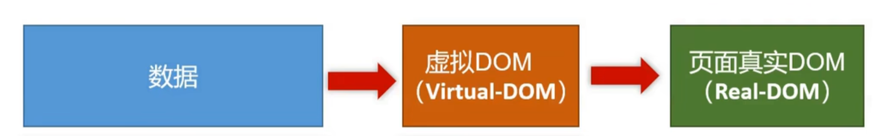
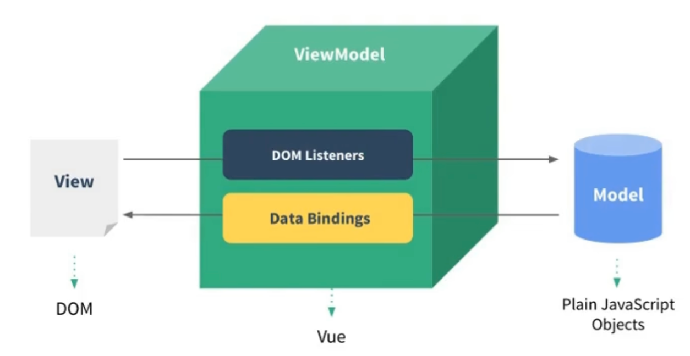
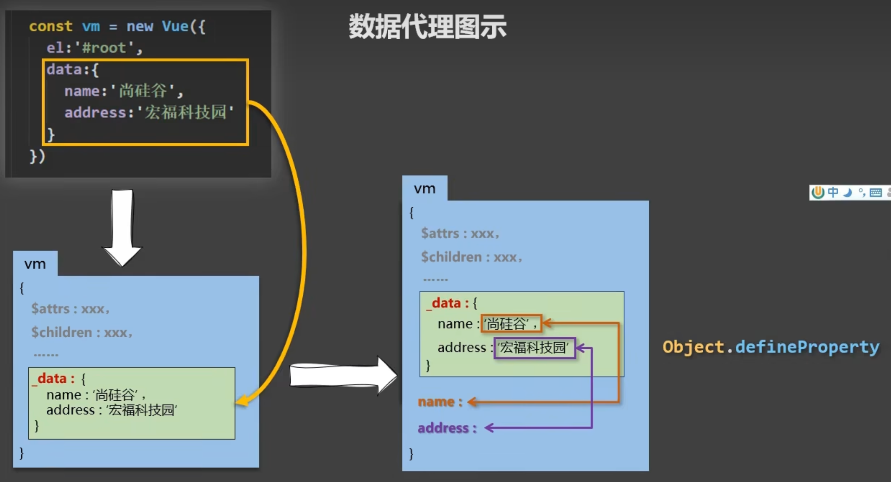
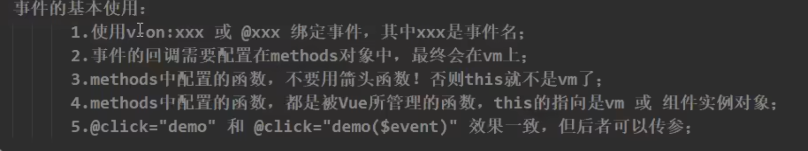

# vue教程

## 基础

- 一套用于构建用户界面的渐进式JavaScript框架

- 特点

  - 采用组件化模式，提高代码复用率，一个模块/组件所需的html、css、js都在xxx.vue里

  - 声明式编码，无需直接操作DOM

  - 采用虚拟DOM+优秀的Diff算法，尽量复用DOM节点

    

## 基本使用

`new Vue({el:'css选择器',data:{}})`，vue实例和容器只能一一对应

### 模板语法

- 插值语法：`{{}}`，用于标签体的内容，匹配vue实例属性(如果是methods里定义的函数的话，需要加()才能执行函数)或js表达式，如`{{key}}`、`{{Date.now()}}`、`{{1+1}}`

  ```js
  <div>
      <h1>
          helllo, {{key}}, {{key1}}
      </h1>
  </div>
  new Vue({
  	el: 'css选择器',
  	data: {
  		key: val,
  		key1: val1,
          key2: {
              subkey: subval
          }
  	}
  })
  ```

- 指令语法：`v-bind:`，或简写`:`，用于标签属性的值、标签体内容、绑定事件等，匹配vue实例data的属性或js表达式，，如`:href=key1`、`:href:Date.now()`

- 当data的属性也是个对象时，用插值或指令语法匹配时，就用`key.subkey`的形式

### 数据绑定

- `v-bind:`是单向的数据绑定，数据只能从data流向页面，即只能把vue实例的属性绑定给容器的属性，改变容器的属性值，不会影响vue实例的属性值，如

  ```js
  <div id="root">
      <input type="text", :value="key">
  </div>
  new Vue({
      el: '#root',
      data: {
          key: val
      }
  })
  ```

  在界面上改变输入框的内容时，不会改变vue实例的key的值

- `v-model:`是双向的数据绑定，数据既能从data流向页面，也能从页面流向data，即在界面上修改属性值时，也会影响vue实例属性的值

  - 但是只能用于表单类元素（输入类元素）
  - `v-model:value`可以简写为`v-model`，因为它默认收集的就是表单的value值

### el和data其他写法

```js
const v = new Vue()
// el的其他写法
v.$mount('css选择器')

// data的其他写法：函数式（日常开发基本只用这种方式），不能是箭头函数
const v = new Vue({
  data: function() {
    return {
      key: val
    }
  }
})
const v = new Vue({
  data() {
    return {
      key: val
    }
  }
})
```

### MVVM模型

- M：model，模型，对应data中的数据

- V：view，视图，对应Vue模板

- VM：ViewModel，视图模型，对应Vue实例对象

  

  > 此图就是双向数据绑定，model的数据通过data bindings映射到view，而ViewModel要监听view的变化来改变model中的数据
  >
  > 所以用变量接收vue实例时，变量名称一般都是vm

- vue模板匹配的值，除了前面说的那些，vm对象里的所有属性都能得到

### 数据代理

通过一个对象代理另一个对象中属性的操作（读/写）



### 事件处理

`v-on:`，和vue对象的`methods`属性匹配

- 简写形式：`@`
- 只能传一个参数，要么是普通形参，要么是event
- 如果既需要普通形参和event，就写成`$event`，且普通形参只能有一个
- 如果只需要event参数，则调用的地方可以不用传参，定义的地方需要写event形参

```html
<button v-on:click="clickFunc1">点击</button>
<button @click="clickFunc2(1)">点击</button>	<-- 简写形式，传普通参数 -->
<button @click="clickFunc3(1,$event)">点击</button>	<-- 传参，既需要普通参数，也需要event，event的位置随便 -->
<button @click="clickFunc4">点击</button> <-- 不传参，也能有event -->
<script>
  new Vue({
  ...
  methods: {
    clickFunc1() {	// 不需要function关键字，可以接受event（事件对象）形参
      
    },
    clickFunc2(num) {
      
    },
    clickFunc3(num, event) {
      
    },
    clickFunc4(event) {
      
    },
  }
})
</script>
```



### 事件修饰符

`@click.prevent="clickFunc"`，直接在绑定事件的地方调用修饰符，vue有6种修饰符，常用前三个，可以链式调用

- prevent，阻止默认事件，相当于`e.preventDefault()`
- stop，阻止事件冒泡
- once，事件只触发一次
- capture，使用事件的捕获模式
- self，只有event.targe是当前操作的元素时才触发
- passive，事件的默认行为立即执行，无需等待事件回调即可执行完毕（移动端可能会用）

### 键盘事件对象的别名

vue常用的键盘事件的别名，也是在绑定事件的地方调用，比如：`@keydown.enter="keyFunc"`，相当于`if e.keyCode === 回车的ASCII码`时再触发事件，其他类似

- 回车，enter
- 删除，delete（捕获删除和退格键）
- 退出，esc
- 空格，space
- 换行，tab
- 上下左右，up、down、left、right

vue未提供的别名，可以使用按下键位的名称（即e.key的值）去绑定，但要转换为短横线连接小写单词的格式，比如`caps-lock`

几个特殊的键：系统修饰键，tab、ctrl、shift、alt、win/commadn键，需要用keydown绑定

Vue.config.keyCodes.自定义键名 = 键码（keycode），可以自定义别名

