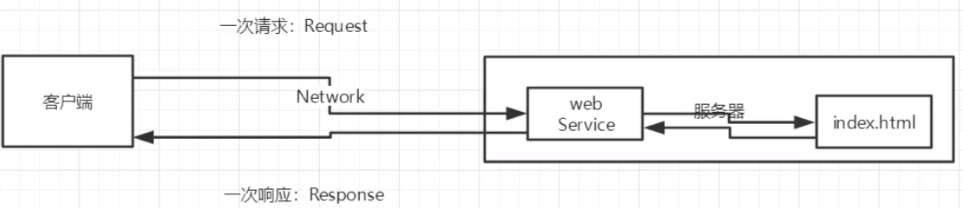
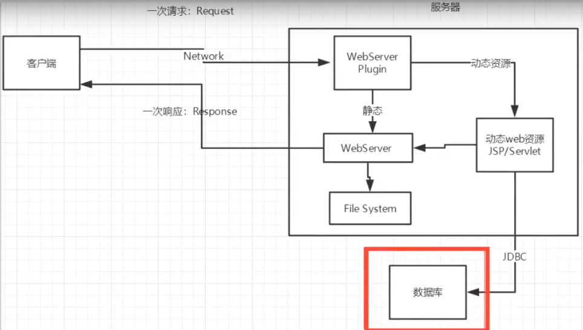
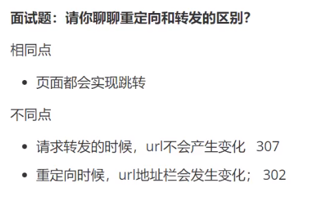

# 基本概念

- 静态web：html、css，数据始终不变

  - 缺点：web页面无法动态更新，所有用户看到的都是同一个页面（伪动态：轮播图，JavaScript）；

    ​			无法和数据库交互，即数据无法持久化

  

- 动态web：几乎所有网站都是，页面会动态展示， 数据始终在变化。技术栈：Servlet/JSP、ASP、PHP

  - 缺点：假如服务器的动态web资源出现了问题，需要重新编写后台程序重新发布

  

- web程序

  - 多个web资源（html、css等）整合起来可以被外界访问，这些资源都存在某台服务器的文件夹下
  - `www.baidu.com:80/webapps/xxx/index.html`，ping域名可以看到服务器的ip
  - web应用程序编写完毕后，若想提供给外界访问，需要一个服务器来统一管理

- web服务器

  - 技术栈
    - ASP：微软开发，在HTML中嵌入了VB、C#脚本，业务逻辑代码都在页面中，IIS服务器
    - PHP：开发速度快、跨平台，代码简单；但无法承载大访问量的情况
    - JSP/Servlet：sun开发，B/S架构（浏览器/服务器，jiava的C/S是客户端/服务器架构），基于java，可承载三高问题
  - 服务器
    - IIS：Internet Information Services，微软开发，Windows自带，ASP
    - Tomcat：运行JSP页面和Servlet，属于轻量级的应用服务器

# HTTP

- 超文本传输协议，运行在TCP之上。超文本：除了文本，还有图片、音乐、视频、定位、地图
- ==是一种无状态的协议==
- http：80，https：443

  - http1.0：客户端与服务器连接后，只能获得一个资源，然后断开连接

  - http2.0：可以获得多个资源

==http请求==

- 请求行

  ```java
    Request URL: https://www.baidu.com/	//统一资源定位符
    Request Method: GET					//请求方法
    Status Code: 200 OK					//状态码
    Remote Address: 14.215.177.38:443	//远程服务器地址
  ```

  - 请求方式：GET、POST，HEAD、DELETE、PUT、TRACE
    - get：请求能够携带的参数比较少，大小有限制，会在浏览器的URL地址栏显示数据内容，不安全但高效
    - post：请求能携带的参数无限制，大小无限制，不会在URL显示内容但高效

- 消息头

  ```java
  Accept			//告诉浏览器，它所支持的数据类型
  Accept-Encoding	//支持哪种编码，GBK、UTF-8、GB2312、ISO8859-1
  Accept-Language	//告诉浏览器，它的语言环境
  Cache-Control	//缓存控制
  Connection		//告诉浏览器，请求完成是断开还是保持连接
  HOST			//主机
  ```


==http响应==

```java
Cache-Control: private					//缓存控制
Connection: keep-alive					//连接：保持连接
Content-Encoding: gzip					//编码
Content-Type: text/html;charset=utf-8	//类型
```

- 响应体

```java
Accept			//告诉浏览器，它所支持的数据类型
Accept-Encoding	//支持哪种编码，GBK、UTF-8、GB2312、ISO8859-1
Accept-Language	//告诉浏览器，它的语言环境
Cache-Control	//缓存控制
Connection		//告诉浏览器，请求完成是断开还是保持连接
HOST			//主机
Refrush			//告诉客户端，多久刷新一次
Location		//让网页重新定位
```

- 响应状态码

  2xx：响应成功；4xx：资源不存在；3xx：请求重定向；5xx：服务器代码错误（502网关错误）

# [cookie、session](https://www.cnblogs.com/whgk/p/6422391.html)

- 会话：用户打开一个浏览器，点击了很多超链接，访问多个web资源，关闭浏览器。这个过程称为会话
- cookie（客户端技术）：服务器通过响应给客户端发cookie，客户端下次访问时通过请求带上cookie就能直接访问。在客户端保持状态
- session（服务器技术）：服务器登记了客户端的访问，保存了用户的会话信息，把信息和数据放在session中，下次客户端再访问的时候去匹配。在服务端保持状态

> 工作流程：
>
> 1. servlet创建cookie，保存少量数据，发送浏览器。
>
> 2. 浏览器获得服务器发送的cookie数据，将自动的保存到浏览器端。
>
> 3. 下次访问时，浏览器将自动携带cookie数据发送给服务器。
>
> cookie操作
>
> 1. 创建cookie：new Cookie(name,value)
>
> 2. 发送cookie到浏览器：HttpServletResponse.addCookie(Cookie)
>
> 3. servlet接收cookie：HttpServletRequest.getCookies() 浏览器发送的所有cookie
> 4. 一个cookie只能存储一个键值对，所以在获取cookie时，是会获取到所有的cookie，然后从其中遍历
>
> cookie特点
>
> 1. 每一个cookie文件大小：4kb ， 如果超过4kb浏览器不识别
>
> 2. 一个web站点（web项目）：发送20个
>
> 3. 一个浏览器保存总大小：300个
>
> 4. cookie 不安全，可能泄露用户信息。浏览器支持禁用cookie操作。
>
> 5. 默认情况生命周期：与浏览器会话一样，当浏览器关闭时cookie销毁的。---临时cookie

> session是一种在服务端记录用户信息的技术，一般session用来在服务器端共享数据
>
> session的工作原理就是依靠cookie来做支撑，第一次使用request.getSession()时session被创建，并且会为该session创建一个独一无二的sessionid存放到cookie中，然后发送会浏览器端，浏览器端每次请求时，都会带着这个sessionid，服务器就会认识该sessionid，知道了sessionid就找得到哪个session。以此来达到共享数据的目的。 这里需要注意的是，session不会随着浏览器的关闭而死亡，而是等待超时时间。
>
> 恰恰是由于关闭浏览器不会导致session被删除，迫使服务器为seesion设置了一个失效时间，一般是30分钟，当距离客户端上一次使用session的时间超过这个失效时间时，服务器就可以认为客户端已经停止了活动，才会把session删除以节省存储空间

# URI URL

> URL就是用定位的方式实现的URI
>
> 回到Web上，假设所有的Html文档都有唯一的编号，记作html:xxxxx，xxxxx是一串数字，即Html文档的身份证号码，这个能唯一标识一个Html文档，那么这个号码就是一个URI。
> 而URL则通过描述是哪个主机上哪个路径上的文件来唯一确定一个资源，也就是定位的方式来实现的URI。
> 对于现在网址我更倾向于叫它URL，毕竟它提供了资源的位置信息

# 面试题

==转发和重定向的区别==



==浏览器输入URL回车后发生了什么==

> ==第一步：浏览器输入域名==
>
> ==第二步：浏览器查找域名的IP地址==
>
> 浏览器会把输入的域名解析成对应的IP，其过程如下：
>
> ==1.查找浏览器缓存==：因为浏览器一般会缓存DNS记录一段时间，不同浏览器的时间可能不一样，一般2-30分钟不等，浏览器去查找这些缓存，如果有缓存，直接返回IP，否则下一步。
>
> ==2.查找系统缓存==：浏览器缓存中找不到IP之后，浏览器会进行系统调用（windows中是gethostbyname），查找本机的hosts文件，如果找到，直接返回IP，否则下一步。
>
> ==3.查找路由器缓存==：路由器一般都有自己的DNS缓存，将前面的请求发给路由器，查找ISP 服务商缓存 DNS的服务器，如果查找到IP则直接返回，没有的话继续查找。
>
> ==4.递归查询==：如果以上步骤还找不到，则ISP的DNS服务器就会进行递归查询，所谓递归查询就是如果主机所询问的本地域名服务器不知道被查询域名的IP地址，那么本地域名服务器就以DNS客户的身份，向其他根域名服务器继续发出查询请求报文，而不是让该主机自己进行下一步查询。（本地域名服务器地址是通过DHPC协议获取地址，DHPC是负责分配IP地址的）
>
> ==5.迭代查询==：本地域名服务器采用迭代查询，它先向一个根域名服务器查询。本地域名服务器向根域名服务器的查询一般都是采用迭代查询。所谓迭代查询就是当根域名服务器收到本地域名服务器发出的查询请求报文后，要么告诉本地域名服务器下一步应该查询哪一个域名服务器，然后本地域名服务器自己进行后续的查询。（而不是替代本地域名服务器进行后续查询）。
>
> 本例子中：根域名服务器告诉本地域名服务器，下一次应查询的顶级域名服务器dns.net的IP地址。本地域名服务器向顶级域名服务器dns.net进行查询。顶级域名服务器dns.net告诉本地域名服务器，下一次应查询的权限域名服务器dns.csdn.net的IP地址。本地域名服务器向权限域名服务器dns.csdn.net进行查询。权限域名服务器dns.csdn.net告诉本地域名服务器，所查询的主机www.csdn.net的IP地址。本地域名服务器最后把结果告诉主机。
>
> ==第三步 ：浏览器与目标服务器建立TCP连接==
>
> 1.      主机浏览器通过DNS解析得到了目标服务器的IP地址后，与服务器建立TCP连接。
>
> 2.      TCP3次握手连接：浏览器所在的客户机向服务器发出连接请求报文（SYN标志为1）；服务器接收报文后，同意建立连接，向客户机发出确认报文（SYN，ACK标志位均为1）；客户机接收到确认报文后，再次向服务器发出报文，确认已接收到确认报文；此处客户机与服务器之间的TCP连接建立完成，开始通信。
>
> ==第四步：浏览器通过http协议发送请求==
>
> 浏览器向主机发起一个HTTP-GET方法报文请求。请求中包含访问的URL，也就是http://www.csdn.com/ ，KeepAlive，长连接，还有User-Agent用户浏览器操作系统信息，编码等。值得一提的是Accep-Encoding和Cookies项。Accept-Encoding一般采用gzip，压缩之后传输html文件。Cookies如果是首次访问，会提示服务器建立用户缓存信息，如果不是，可以利用Cookies对应键值，找到相应缓存，缓存里面存放着用户名，密码和一些用户设置项。
>
> ==第4.1步：某些服务会做永久重定向响应==
>
> 对于大型网站存在多个主机站点，了负载均衡或者导入流量，提高SEO排名，往往不会直接返回请求页面，而是重定向。返回的状态码就不是200OK，而是301,302以3开头的重定向码，浏览器在获取了重定向响应后，在响应报文中Location项找到重定向地址，浏览器重新第一步访问即可。
>
> 重定向的作用：重定向是为了负载均衡或者导入流量，提高SEO排名。利用一个前端服务器接受请求，然后负载到不同的主机上，可以大大提高站点的业务并发处理能力；重定向也可将多个域名的访问，集中到一个站点；由于baidu.com，www.baidu.com会被搜索引擎认为是两个网站，照成每个的链接数都会减少从而降低排名，永久重定向会将两个地址关联起来，搜索引擎会认为是同一个网站，从而提高排名。
>
> ==第4.2步：浏览器跟踪重定向地址==
>
> 当浏览器知道了重定向后最终的访问地址之后，重新发送一个http请求，发送内容同上。
>
> ==第五步：服务器处理请求==
>
> 服务器接收到获取请求，然后处理并返回一个响应。
>
> ==第六步：服务器发出一个HTML响应==
>
> 返回状态码200 OK，表示服务器可以响应请求，返回报文，由于在报头中Content-type为“text/html”，浏览器以HTML形式呈现，而不是下载文件。
>
> ==第七步：释放TCP连接==
>
> 1.     浏览器所在主机向服务器发出连接释放报文，然后停止发送数据；
>
> 2.     服务器接收到释放报文后发出确认报文，然后将服务器上未传送完的数据发送完；
>
> 3.     服务器数据传输完毕后，向客户机发送连接释放报文；
>
> 4.     客户机接收到报文后，发出确认，然后等待一段时间后，释放TCP连接；
>
> ==第八步：浏览器显示页面==
>
> 在浏览器没有完整接受全部HTML文档时，它就已经开始显示这个页面了，浏览器接收到返回的数据包，根据浏览器的渲染机制对相应的数据进行渲染。渲染后的数据，进行相应的页面呈现和脚步的交互。
>
> ==第九步：浏览器发送获取嵌入在HTML中的其他内容==
>
> 比如一些样式文件，图片url，js文件url等，浏览器会通过这些url重新发送请求，请求过程依然是HTML读取类似的过程，查询域名，发送请求，重定向等。不过这些静态文件是可以缓存到浏览器中的，有时访问这些文件不需要通过服务器，直接从缓存中取。某些网站也会使用第三方CDN进行托管这些静态文件。