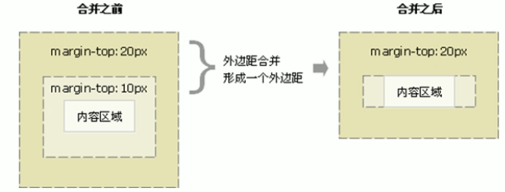
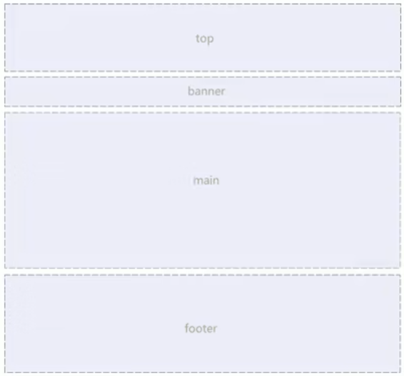
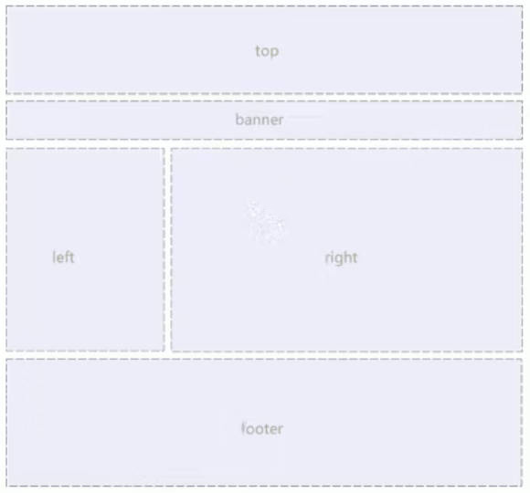
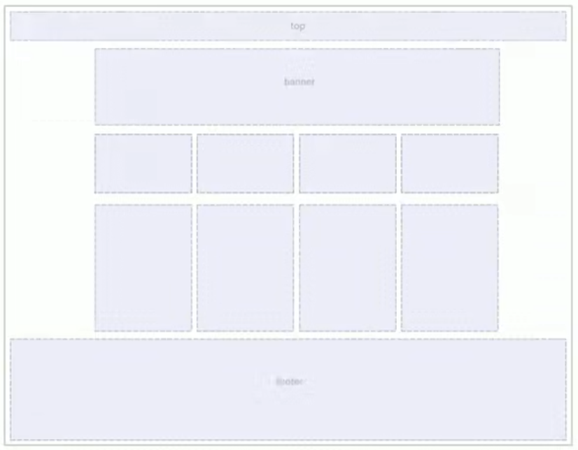
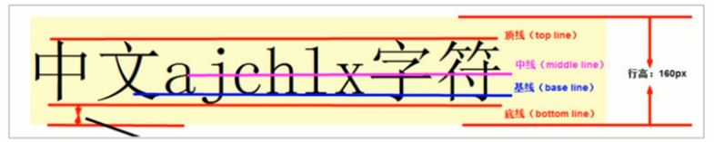

# html5

## 简介

- html：超文本标记语言，是一种标记语言，是一套标记标签(markup tag)，html文档的后缀名必须是html或htm
- 浏览器：firefox、chrome、edge、safari、opera
- 浏览器内核：解释网页的语法并渲染，Trident(IE、猎豹、360、百度)，Gecko(firefox)、Webkit(safari)、Blink(chrome、opera、yandex，来源于Webkit)
- web标准：W3C指定的标准，由结构、表现、行为组成
  - 结构(Structure)：用于对网页元素进行整理和分类，HTML
  - 表现(Presentation)：用于设置网页元素的版式、颜色、大小等外观样式，CSS
  - 行为(Behavior)：指网页模型的定义及交互的编写，JavaScript

## 语法规范

- html标签是由尖括号包围的关键词
- html标签通常是成对出现的，称为双标签；一些特殊标签必须是单个标签，称为单标签
- 标签的关系可以分为两类：包含关系和并列关系

| 标签名            | 定义       | 说明                            |
| ----------------- | ---------- | ------------------------------- |
| \<html>\</html>   | HTML标签   | 页面中最大的标签，称为根标签    |
| \<head>\</head>   | 文档的头部 | 在head标签中必须要设置title标签 |
| \<title>\</title> | 文档的标题 | 网页标题                        |
| \<body>\</body>   | 文档的主体 | 页面内容基本都是放到body里面    |

## 常用标签

### 文档类型声明标签

\<!DOCTYPE html>，告诉浏览器使用哪种HTML版本来显示网页，固定在文档的第一行。不是html标签，只是一个声明标签。

### 显示语言标签

\<html lang="en"></html>（en英文，zh-CN中文，fr法语）。主要给浏览器提供提示作用（浏览器会提示“是否翻译成xx语言”）。

### 字符集标签

\<meta charset="UTF-8">，没有此标签可能会乱码。charset常用值：GB2312(简体中文)、BIG5(繁体中文)、GBK(包含前两个)、UTF-8(万国码)。

### 标题标签

\<h1>\</h1>~\<h6>\</h6>，作为标题使用，只有六级，等级依次递减，每个标题独占一行，加了标题的文字会变大加粗。

### 段落标签

\<p>\</p>，paragraph的缩写，把html文档分成若干段落。段落中的内容会根据浏览器的大小字段换行，段落之间保有空隙

### 换行标签

\<br\>，break的缩写，是个单标签，遇到br会强制换行，行和行之间没有缝隙

### 文本格式化标签

- 加粗：\<strong>\</strong>，\<b>\</b>（bold的缩写），更推荐strong
- 倾斜：\<em>\</em>（emphasis），\<i>\</i>（incline的缩写），更推荐em
- 删除线：\<del>\</del>，\<s>\</s>（strikethrough的缩写），更推荐del
- 下划线：\<ins>\</ins>（insert的缩写），\<u>\</u>（underlined的缩写），更推荐ins

- 特殊标签：\<div>\</div>和\<span>\</span>，没有语义，就是一个盒子，用来装内容

  - \<div>\</div>（division的缩写，表示分割、分区），用来布局，div独占一行，大盒子
  - \<span>\</span>（表示跨度、跨距），用来布局，一行可以有多个span，小盒子

### 图像标签

  - \，是个单标签，src是图像标签的必须属性，用与指定图像文件的路径和文件名

  - 图像文件和html必须在同一目录

  - 图像标签的属性：属性之间不分先后，属性之间要有空格，属性采取键值对的格式

  - 图像的路径分为相对路径（\，相对html文件的位置，可以是同级、下级、上级目录）和绝对路径（/，一般用于网络路径）

    | 属性   | 属性值   | 说明                                                         |
    | ------ | -------- | ------------------------------------------------------------ |
    | src    | 图片路径 | 必须属性                                                     |
    | alt    | 文本     | 替换文本，图像不能显示时，用来替换的文字                     |
    | title  | 文本     | 提示文本，鼠标放到图像上，显示的文字                         |
    | width  | 像素     | 图像的宽度（宽高一般只修改一个，浏览器会等比例缩放）         |
    | height | 像素     | 图像的高度                                                   |
    | border | 像素     | 图像的边框粗细（一般通过css指定，所以IDE中对border的显示和其他属性不一样） |

### 超链接标签

  - 语法规范：\<a>\</a>（anker的缩写）

    | 属性   | 说明                                                         |
    | ------ | ------------------------------------------------------------ |
    | href   | 用于指定链接目标的url地址，必须属性                          |
    | target | 用于指定链接页面的打开方式，默认值为\_self当前窗口打开，\_blank为在新窗口中打开 |

  - 分类

    - 外部链接：必须有完整的协议名（如 https://）
    - 内部链接：网站内部页面之间的相互链接，如html文件或图片等的路径
    - 空链接：href的值为#
    - 下载链接：href的值是一个二进制文件或压缩包等
    - 网页元素链接：给文本、图像、表格、音频、视频等设置超链接
    - 锚点链接：定位到页面中的某个位置，href的值以#开头，后面是目标位置的ID值；在目标位置设置一个标签及ID值

- 注释标签：以 \<!-- 开头，以 --> 结尾

- 特殊字符

  | 特殊字符 | 描述     | 字符代码  |
  | -------- | -------- | --------- |
  |          | 空格     | \&nbsp;   |
  | <        | 小于     | \&lt;     |
  | >        | 大于     | \&gt;     |
  | &        | 和       | \&amp;    |
  | ￥       | 人民币   | \&yen;    |
  | ©        | 版权     | \&copy;   |
  | ®        | 注册商标 | \&reg;    |
  | °        | 度       | \&deg;    |
  | ±        | 正负     | \&plusmn; |
  | ×        | 乘       | \&times;  |
  | ÷        | 除       | \&divide; |
  | ²        | 平方     | \&sup2;   |
  | ³        | 立方     | \&sup3;   |
  

### 表格标签

  - 基本语法

    - \<table>\</table>用与定义表格
    - \<tr>\</tr>用于定义行，必须嵌套在table标签中
    - \<td>\</td>用与定义单元格必须嵌套在tr标签中，单元格内可以放任何元素，table data的缩写
    - \<th>\</th>用与定义表头单元格，其中的文字会自动加粗并居中，table head的缩写

  - 表格属性，不常用，一般通过CSS来设置，必须写在table标签的尖括号中

    | 属性名        | 属性值              | 描述                                        |
    | ------------- | ------------------- | ------------------------------------------- |
    | align         | left、center、right | 规定表格相对周围元素的对齐方式              |
    | border        | 数字 或 “”          | 规定表格单元是否有边框，默认是"''，没有边框 |
    | cellpadding   | 像素值              | 规定单元格边框与其内容之间的空白，默认1像素 |
    | cellspacing   | 像素值              | 规定单元格之间的空白，默认2像素             |
    | width、height | 像素值或百分比      | 规定表格的宽度、高度                        |

  - 表格结构标签，可以使table结构更清晰：
  
    - \<thead>\</thead>表示表格的头部区域，一般包含第一行的tr
    - \<tbody>\</tbody>表示表格主体区域，包含剩余的tr
  
  - 合并单元格
  
    - 跨行合并：rowspan=“合并单元格的个数""
    - 跨列合并：colspan=“合并单元格的个数""
    - 目标单元格
      - 跨行：最上侧单元格为目标单元格，写合并代码，删除多余的单元格
      - 跨列：最左侧单元格为目标单元格，写合并代码，删除多余的单元格

### 列表标签

#### 无序列表（重点）

\<ul>\</ul>标签，里面包含了数个\<li>\</li>

- 无序列表的各个列表项之间没有顺序级别之分，是并列的
- \<ul>中只能嵌套\<li>，其余标签都不能放
- \<li>中能放任何元素
- 无序列表会带有自己的样式属性（默认黑色圆点），实际使用时会使用CSS来设置

#### 有序列表

\<ol>\</ol>标签，包含了数个\<li>\</li>

- 有序列表的排序以数字显示
- \<ol>中只能嵌套\<li>，其余标签都不能放
- \<li>中能放任何元素
- 有序列表会带有自己的样式属性（默认黑色圆点），实际使用时会使用CSS来设置

#### 自定义列表（重点）

> 用于对术语或名词进行解释和描述，列表项前没有任何项目符号（即一个标题下面的若干个元素围绕此标题进行解释说明）

\<dl><\dl>标签，包含了一个\<dt>\</dt>和若干个\<dd>\</dd>

- \<dl>中只能包含\<dt>和\<dd>
- \<dt>和\<dd>的数量没有限制，通常是一个\<dt>和对应多个\<dd>
- \<dt>和\<dd>中可以放任何元素

#### 使用场景

- 多个元素完全并列，用无序列表
- 多个元素按需排列，用有序列表
- 一个大元素下面有几个小元素，用自定义列表

### 表单标签

- 使用场景：和用户进行交互，收集用户信息

- 表单的组成：一个完整的表单域、表单控件（表单元素）和提示信息3部分组成

#### 表单域

包含表单元素的区域，\<form>\</form>标签

  - \<form>会把它范围内的表单元素信息提交给服务器

  - 常用属性

    | 属性   | 属性值    | 作用                                               |
    | ------ | --------- | -------------------------------------------------- |
    | action | url地址   | 用于指定接收数据的服务器地址                       |
    | method | get或post | 用于设置表单数据的提交方式                         |
    | name   | 名称      | 用于指定表单的名称，以区分同一个页面中的多个表单域 |

#### 表单控件（表单元素）

允许用户输入或选择的内容控件

- \<input>标签：是单标签

  - 必须有type属性

    | 属性值   | 描述                                                         |
    | -------- | ------------------------------------------------------------ |
    | button   | 定义可点击按钮（不提交数据，多数情况下，和Javascripti搭配使用） |
    | checkbox | 定义复选框（一组的checkbox的name必须相同）                   |
    | file     | 定义输入字段和浏览按钮，供文件上传                           |
    | hidden   | 定义隐藏的输入字段                                           |
    | image    | 定义图像形式的提交按钮                                       |
    | password | 定义密码字段，其中的字符被掩码                               |
    | radio    | 定义单选按钮（要实现单选一，几个radio的name属性的值必须相等） |
    | reset    | 定义重置按钮，重置会清除表单中的所有数据                     |
    | submit   | 定义提交按钮，提交会把表单数据发送到服务器（如果是get请求，提交后url是?name=value）（默认文字是”选择文件“，不能通过修改value的方式改文字） |
    | text     | 定义单行的输入字段，用户可在其中输入文本，默认宽度20个字符   |

  - 其他属性

    | 属性      | 属性值     | 描述                                                         |
    | --------- | ---------- | ------------------------------------------------------------ |
    | name      | 用户自定义 | 定义input元素的名称（radio和checkbox必须有相同的name ）      |
    | value     | 用户自定义 | 规定input元素的值，提交给后端的值（在text中定义时才能看到效果） |
    | checked   | checked    | 规定此input元素首次加载时应当被选中（radio和checkbox使用）   |
    | maxlength | 正整数     | 规定输入字段中的字符的最大长度                               |

- \<lable>标签

  - 为input标签定义标注，当点击lable标签内的文本时，浏览器会自动将焦点转到或选择对应的表单元素上
  - 语法：\<lable for="input的ID">文字\</lable>

- \<select>标签：下拉列表，语法：

  - \<select>\</select>中间包含若干个\<option>\</option>
  - 至少包含一对option
  - 在option中
  - 定义selected属性的值为"selected"时，该option默认选中；都没有selected属性时，默认选中第一个option

- \<textarea>标签：文本域，可以输入多行文本，语法：

  - \<textarea>\</textarea>
  - 属性：cols一行可以写多少个字；rows可以写多少行，超过rows时，会自动加滚动条（cols和rows都不用，都用css设置）

#### 提示信息

表单元素填写/勾选内容的提示文字


## 不常用标签

- \<hr>：水平线标签

# css3

## 简介

- HTML只关注内容的语义，CSS则美化网页并定义网页的布局
- CSS是层叠样式表（Cascading Style Sheets）的简称，也称为级联样式表，也是一种标记语言
- CSS的价值：结构（html）和样式（css）分离

## 语法规范

- CSS放在\<style>\</style>标签中，CSS规则由两个主要部分构成
  - 选择器：修改谁的样式，用来选择标签的
  - 一条或多条声明：修改成什么样式，用{}包含的键值对，每组键值对后面必须有分号
- 书写风格

  - 紧凑风格：所有属性放在一行
  - 展开风格（推荐）：一个属性占一行
- 大小写：全部使用小写，特殊情况除外
- 空格规范：键值对的冒号后一个空格；选择器和{}之间一个空格

## 基础选择器

由单个选择器组成，分四类

### 标签选择器

用html标签名称作为选择器，为页面中某一类标签指定统一的css样式

```css
标签名 {
    属性: 属性值;
}
```

### 类选择器（最常用）

为标签的class属性的值为类名的所有标签设置样式

```css
.类名 {
    属性: 属性值;
}
```

类名注意

- 不能和标签关键字冲突
- 没有驼峰，多个单词用`-`连接
- 不要使用纯数字、中文等命名，见名知意，遵循统一的规范

多类名

- 要给标签可以有多个类名，之间用空格隔开，这个标签就分别具有这些类名的样式
- 通用的样式可以作为一个类，方便统一修改

### id选择器

为标签的id属性的值为id的标签设置样式

```css
#id值 {
    属性: 属性值;
}
```

注意：id选择器只能调用一次

### 通配符选择器

```css
* {
    margin: 0;
    padding: 0;
}
```

- css中使用`*`通配符来表示所有标签
- 通配符不需要调用，自动给所有标签使用样式

## 复合选择器

对基础选择器进行组合形成复合选择器

### 后代选择器（重点）

也称为包含选择器，可以选择父元素中的子元素

```css
父元素 子元素 {
    属性: 属性值;
}
```

- 只要一个标签包含了标签，就属于父子关系，不一定非得是ol、li的关系

- 父子元素之间用空格隔开，最终选择的是子标签

- 如果只选了一级子元素，则会把和子元素是同种标签的所有后代都选中（继承性）；如果要选更深层级的子元素，则把后代的子标签挨个跟在后面直到目标层级（虽然不写完也能选中目标元素，但一般写全层级，不容易出问题）

  ```html
  <div>
      <a href="#">儿子</a>
      <ol>
          <li><a href="#">孙子</a></li>
      </ol>
  </div>
  ```

  ```css
  /* 会把上述的儿子和孙子都选中 */
  div a {
      corlor: red;
  }
  
  /* 只选中孙子，虽然可以直接使用div a选中孙子，但一般把层级写全，不容易出问题 */
  div ol li a {
      corlor: red;
  }
  ```

- 父子元素可以是任意基础选择器

### 子选择器（重点）

称为子元素选择器，只能选择最近一级的子元素

```css
/* 大于号 */
父元素 > 子元素 {
    属性: 属性值;
}
```

### 并集选择器

可以选择多组标签，同时为他们定义相同的样式，通常用于集体声明

```css
/* 英文逗号 */
元素1, 元素2 {
    属性: 属性值;
}
```

- 任何基础、复合选择器都可以作为并集选择器的元素
- 一般逗号之后另起一行

### 伪类选择器

用于向某些选择器添加特殊的效果，如鼠标移动到链接上时，链接底色变色

伪类选择器的种类：

- 链接伪类（a标签可以换成类名、ID或其他标签）

  ```css
  a:link		/* 选择所有未被访问的链接 */
  a:visited 	/* 选择所有已被访问的链接 */
  a:hover		/* 选择鼠标指针位于其上的链接 */
  a:active	/* 选择活动链接（鼠标按下未弹起的链接） */
  ```

  - 链接伪类的声明顺序：LVHA，即linke、visited、hover、active，否则不会生效
  - 全局的样式对链接不生效（浏览器对链接有默认样式），一般需要单独指定

- foucs伪类：用于选择获得光标的input表单元素

  ```css
  input:focus
  ```

- 结构伪类

## 常用样式

### 字体属性

> 所有color的值都包括transparent，且color值可以是rgb、rgba、十六进制、字符串；所有的尺寸都可以是像素值、em、百分比等等

- font-family：字体
  - 属性值如果是一个单词，不用引号；如果是空格隔开的多个单词，用引号括起来（一般用单引号）
  - 可以设置值以提高兼容性，之间用逗号隔开，浏览器会按序读取字体，没有安装时则读取下一个字体，都没有时用浏览器的默认字体
  - 一般直接给body标签中设置字体
  
- font-size：字体大小
  - 用px（像素）作为单位，默认值是16px
  - 不同浏览器的默认字号不一样，一般需要给出具体值
  - 一般直接给body中设置字体大小，但是不会影响标题标签，需要单独指定文字大小
  
- font-weight：字体的粗细，值可以是：
  - normal，bold，bolder，lighter
  - 数字（更常用，100-900，间隔100），400正常（常用于把加粗的字体变成不加粗），700加粗
  
- font-style：文字样式，有两个重要的值
  - normal：正常（常用于把em标签的字体变成不倾斜）
  - italic：倾斜
  
- 复合属性：文字属性合并到一起简写

  - 严格按照以下顺序，中间用空格隔开，line-height可以省略（`/`是写的时候用的符号，不是或的意思）

    ```css
    div {
        font: style weight size/line-height family;
        /* font后面的各种属性，替换成属性值 */
    }
    ```

  - 不需要的属性可以省略（取默认值），但font-size和font-family必须有

### 文本属性

- color：文本颜色，值可以是字符串（包括transparent），十六进制（两两相同时可以省略，如#ff00ff->#f0f），RGB格式（可以是rgb值，也可以是rgb百分比）

  ```css
  div {
      color: red;
      color: #ff0000;
      color: rgb(255,0,0);
      color: rgb(100%,0%,0%);
  }
  ```

- text-align：文本对齐方式，默认左对齐，只能设置水平对齐方式，值是left、right、center，当需要修改图片对齐方式时，需要给img标签外面包一个标签，如div、span、p等

- text-decoration：装饰文本，给文本加下划线、上划线、删除线，值是none（默认值）、underline（a标签自带下划线）、overline、line-through

- text-indent：给文本的第一行缩进，值可以是

  - 像素值px（可以是负值，文本会超出界面）
  - 相对单位em（当前元素一个文字的距离），如果当前元素没有设置大小，则会按照父元素的1个文字的大小

- line-height：行间距，行间距由上间距、文字高度、下间距组成（上下间距永远相等），加起来才是完整的行间距（字体大于行间距时，文字会交叠）

- 垂直居中：css没有提供垂直居中的代码，解决方案：让文字的行高等于盒子的高度

### 背景属性

- background-color：背景颜色，位于最底层，背景图片会覆盖于背景色之上

  - transparent，默认值
  - 颜色值
- 半透明：`background: rgba(r,g,b,a);`
  - 最后一个参数是alpha透明度，取值是范围0~1；其他取值是rgb值，取值0~255
  - 小数的0可以省掉，即0.3写成.3
  - IE9+版本才支持
- background-image：背景图片，背景图片会平均分布于盒子中，常见于logo、小装饰图片、超大的图片等

  - none，默认值
  - url()，图片的路径写在括号中
- background-repeat：背景平铺（让图片复制n份充满盒子）

  - repeat，默认值
  - no-repeat
  - repeat-x，沿x轴平铺
  - repeat-y，沿y轴平铺
- background-position：背景图片的位置，`background-position: x y;`，x和y坐标可以使用：

  - 方位名词：top、center、bottom、left、right
    - 图片的位置x和y的前后顺序无关
    - 如果省略一个，则另一个默认center
  - 精确单位：距离左边和上边的像素值
    - x和y有严格的先后顺序
    - 如果省略一个，则没省略的必定是x，y必定是垂直居中
  - 混合单位：精确单位和方位名称混合使用，且第一个必定是x，第二个必定是y

- background-attachment：背景图像固定（背景附着）：设置背景图像是否固定或随着页面的其余部分滚动

  - scroll，默认，随滚动条滚动（即随着滚动条上下移动）
  - fixed，固定不动

- 复合属性：背景的属性合并到一起简写

  - 严格按照以下顺序，中间用空格隔开，不需要的属性可以省略

    ```css
    div {
        background: color url() repeat attachment position
    }
    ```

### 列表属性

- 列表的标签：list-style，值为none时去掉左边的标签

## 引入方式

css的引入方式分三大类

- 行内样式表（行内式）：直接在标签中设置style属性，值是需要样式的键值对，各样式用分号隔开，以分号结尾

  ```css
  <div style="color: red; font-size: 20px;"></div>
  ```

- 内部样式表（嵌入式）：把css代码放到\<style>\</style>标签中，可以放在任何地方，一般放在head标签中

  ```css
  <style>
      div {
          color: red;
          font-size: 20px;
      }
  </style>
  ```

- 外部样式表（链接式）：样式单独写到css文件中（文件中只有样式，没有标签），使用link标签把css文件引入html页面中，，rel的值固定是stylesheet（表示引入的是样式表）

  ```css
  <link rel="stylesheet" href="css文件的路径">
  ```

## Emmet语法

Emmet语法的前身是Zen coding，使用缩写来提高html/css的编写速度

### HTML

- tab键快速生成标签
- 标签`*`数字，快速得到n个标签，如div\*3
- 父子级关系的标签，用`>`，如div>span，ul>li
- 并行关系的标签，用`+`
- 标签`.`类名，快速生成标签和类名，省略标签时，默认为div标签
- 标签`#`ID，快速生成标签和ID，省略标签时，默认为div标签
- 标签`.`类名`$*`数字，快速生成n个标签和类名，声明的类名后面的数字从1开始自增（`$`是自增符号）
- 标签`{文字}`，括号中的文字会快速生成在标签中，可以和`$`、`*`组合使用

### CSS

- 样式名的首字母缩写+tab键可以快速生成标签名，如：td->text-decoration
- 样式名的首字母和样式值的缩写或数字+tab键可以快速生成标签名和值，如w200->width: 200px，tdn->text-decoration: none

### 通用

- vscode格式化代码：`shift+alt+f`

- vscode保持时自动格式化：首选项（或左下角齿轮图标）-->设置-->搜索`emmit.include`或`emmet:Preference`-->在`setting.json`中编辑，增加如下两个选项

  ```json
  "editor.formatOnType": true,
  "editor.formatOnSave": true
  ```

## 元素显示模式

元素以什么方式进行显示，一般分为块元素和行内元素

### 块元素

div、p、ol、ul、br等是典型的块元素，块元素的特点

- 独占一行
- 高度、宽度、外边距及内外边距都可以控制
- 宽度默认父级元素一样大（最上层的元素则是默认和浏览器一样大）
- 是一个容器及盒子，里面可以放行内或块元素

特别注意：文字类的元素内不能包含块元素，如p、h1~h6中不能嵌套div（会导致后代选择器无法选择等问题）

### 行内元素

span、a、i、em等是典型的行内元素，也称为内联元素，行内元素的特点

- 相邻行内元素在一行上， 一行可以显示多个
- 高、宽直接设置没有效果
- 默认宽度是本身内容的宽度
- 行内元素只能容纳文本或其他行内元素

特别注意

- a元素中不能再放链接
- a元素中可以放块元素，但是给a元素转换成块级模式最安全

### 行内块元素

img、input、td同时具有块元素和行内元素的特点

- 相邻元素在一行中，之间会有空白空隙，一行可以显示多个
- 默认宽度是其本身内容的宽度
- 高度、宽度、行高、内外边距都可以控制

### 显示模式转换

一个显示模式需要另外一种模式的特性，需要进行元素模式的转换

- 转换为块元素

  ```css
  选择器 {
      display: block;
  }
  ```

- 换行为行内元素

  ```css
  选择器 {
      display: inline;
  }
  ```

- 转换为行内块元素

  ```css
  选择器 {
      display: inline-block;
  }
  ```

## css三大特性

### 层叠性

给相同的选择器设置同一个属性，遵循层叠（覆盖）原则

- 样式冲突，遵循就近原则，冲突的样式会被后面的覆盖
- 样式不冲突，不会覆盖

### 继承性

子标签会继承父标签的某些样式（不一定是直接的父级）

- 只会继承text-、front-、line-、color等样式

- 行高的继承：可以是像素值，也可以是纯数字。当行高是纯数字时，子元素的行高等于数字*子元素的字体大小（子元素字体大小可以是设置的，也可以是继承过来的）

  ```css
  div {
      font: 12px/1.5 Microsoft YaHei;
  }
  /* div的子元素的行高=子元素的行高*1.5 */
  ```

### 优先级

同一个元素有多个选择器，相同的属性就会产生优先级

- 选择器相同，执行层叠性

- 选择器不同，根据选择器的权重执行，按下表，权重依次变大

  | 选择器                                                       | 权重     |
  | ------------------------------------------------------------ | -------- |
  | 继承 或者 *                                                  | 0,0,0,0  |
  | 元素选择器                                                   | 0,0,0,1  |
  | 类选择器 伪类选择器                                          | 0,0,1,0  |
  | ID选择器                                                     | 0,1,0,0  |
  | 行内样式 style=""                                            | 1,0,0,0  |
  | !important (把!important这个放在属性值后面，分号前面，就会把元素设置成最高的权重) | ∞ 无穷大 |

- 浏览器默认给a标签指定了默认样式，相当于`a {color:blue;}`，要覆盖a的默认样式时，不能用继承

- 权重叠加：复合选择器（包括伪类选择器）的权重会累加，即复合选择器的元素会从左到右累加，权重的累加只是数字的加法，不会进位（即0,0,0,1+0,0,0,9=0,0,0,10）

## 页面布局

页面布局的三大核心：盒子模型、浮动和定位

### 盒子模型

html中的布局元素都可以看成一个盒子（不一定是div），是一个盛放内容的容器，包括边框、内容、内边距、外边距四个属性

#### border

| 属性                                                 | 说明                                                         |
| ---------------------------------------------------- | ------------------------------------------------------------ |
| border-width                                         | 边框的粗细，一般用像素值                                     |
| border-style                                         | 边框的样式，虚实线，常用：solid，dashed，dotted              |
| border-color                                         | 边框的颜色                                                   |
| border                                               | 复合写法，三个属性没有先后顺序，通俗约定width style color    |
| border-top、border-bottom、border-left、border-right | 上下左右边框，都用复合写法，可以利用css的层叠性设置“其余边”的属性 |
| border-collaspse                                     | 控制相邻单元格的边框是否合并（不合并时，相邻单元格的边框会叠加变粗） |

- 表格的边框，table和单元格标签都要设置样式

  ```css
  table,
  td,
  th {
      border: 1px solid black;
      border-collaspse: collapse;
  }
  ```

- 边框会影响盒子的实际大小：设置盒子的宽高后，再设置边框，会让盒子变大

#### content

内容，盒子中可以装任何元素

#### padding

> 内边距，默认是紧贴盒子的左边和上边，值是像素值或auto，一般上下边距称为垂直边距，左右边距称为水平边距

<table>
<thead>
<tr>
<th>属性</th>
<th>说明</th>
</tr>
</thead>
<tbody>
<tr>
<td>padding-top</td>
<td>内容距离盒子上边的像素值</td>
</tr>
<tr>
<td>padding-right</td>
<td>内容距离盒子右边的像素值</td>
</tr>
<tr>
<td>padding-bottom</td>
<td>内容距离盒子下边的像素值</td>
</tr>
<tr>
<td>padding-left</td>
<td>内容距离盒子左边的像素值</td>
</tr>
<tr>
<td rowspan="4">padding（复合写法，值之间用空格隔开）</td>
<td>1个值，上下左右内边距都是此像素值</td>
</tr>
<tr>
<td>2个值，上下内边距是第一个像素，左右内边距是第二个像素</td>
</tr>
<tr>
<td>3个值，上内边距是第一个像素，左右内边距是第二个像素，下内边距是第三个像素</td>
</tr>
<tr>
<td>4个值，上、右、下、左内边距顺时针赋值</td>
</tr>
</tbody>
</table>


- padding也会影响盒子的实际大小：设置盒子的宽高后，再设置内边距，会让盒子变大
- 如果盒子本身没有明确指定宽度或高度（子元素继承的宽度也属于此场景），则padding不影响盒子宽度大小或高度大小

#### margin

> 外边距，控制盒子和盒子之间的距离，值是像素值或auto，一般上下边距称为垂直边距，左右边距称为水平边距

<table>
<thead>
<tr>
<th>属性</th>
<th>说明</th>
</tr>
</thead>
<tbody>
<tr>
<td>margin-top</td>
<td>盒子的上边距离其他盒子像素值</td>
</tr>
<tr>
<td>margin-right</td>
<td>盒子的右边距离其他盒子像素值</td>
</tr>
<tr>
<td>margin-bottom</td>
<td>盒子的下边距离其他盒子像素值</td>
</tr>
<tr>
<td>margin-left</td>
<td>盒子的左边距离其他盒子像素值</td>
</tr>
<tr>
<td rowspan="4">margin（复合写法，值之间用空格隔开）</td>
<td>1个值，上下左右外边距都是此像素值</td>
</tr>
<tr>
<td>2个值，上下外边距是第一个像素，左右外边距是第二个像素</td>
</tr>
<tr>
<td>3个值，上外边距是第一个像素，左右外边距是第二个像素，下内边距是第三个像素</td>
</tr>
<tr>
<td>4个值，上、右、下、左外边距顺时针赋值</td>
</tr>
</tbody>
</table>


- 外边距的典型应用：让块级盒子水平居中
  - 盒子必须设置宽度，左右外边距都设置auto（常用：`margin: 0 auto)`
  - 只对块级元素生效，如果要对行内或行内块元素居中，则给其父元素设置text-align: center

- 外边距合并：设置块元素的垂直外边距时，可能会出现外边距的合并，会出现嵌套块元素垂直外边距的塌陷，即两个嵌套的块元素，父元素和子元素都有垂直边距，此时父元素会塌陷较大的外边距值



- 塌陷的解决方案
  - 为父元素定义边框
  - 为父元素定内边距
  - 为父元素添加`overflow: hidden`（不会增加盒子的大小）
  - 浮动、固定定位、绝对定位的盒子不会塌陷

#### 边距注意事项

- 内外边距的清除：网页的元素很多都带有默认的内外边距，不同的浏览器也不一致，因此布局前要先清除内外边距

  ```css
  * {
      margin: 0;
      padding: 0;
  }
  ```

- 行内元素为了照顾兼容性，尽量只设置左右内外边距；块元素或行内块元素可以自由设置所有边距

#### 圆角边框

圆与矩形框的四个角相交形成圆角效果；圆角的半径等于正方形框的一半时，得到圆形框

- 设置四个圆角：`border-radius: 圆角半径;	`，半径可以是像素值，也可以是百分比
- 设置指定角的圆角
  - 从左上角开始按顺时针设置四个角的半径，值之间用空格隔开；只给了两个值则是两个对角线的角的圆角
  - 分开设置，使用border-top-left-raudius，其他三个角以此类推（不常用）

#### 盒子阴影

box-shadow，值如下，值之间用空格隔开；阴影不占盒子的大小

| 值       | 描述                                                         |
| -------- | ------------------------------------------------------------ |
| h-shadow | 必须，水平阴影的位置（像素值），正值向右，负值向左           |
| v-shadow | 必须，垂直阴影的位置（像素值），正值向下，负值向上           |
| blur     | 可选，模糊距离（像素值），值越大阴影越模糊                   |
| spread   | 可选，阴影的尺寸（像素值），值越大阴影越大，可以是负值       |
| color    | 可选，阴影的颜色（常用rgba设置颜色）                         |
| inset    | 可选，是内阴影还是外阴影，默认外阴影（不写是外阴影，写inset是内阴影） |

#### 文字阴影

text-shadow，值如下，值之间用空格隔开

| 值       | 描述                                               |
| -------- | -------------------------------------------------- |
| h-shadow | 必须，水平阴影的位置（像素值），正值向右，负值向左 |
| v-shadow | 必须，垂直阴影的位置（像素值），正值向下，负值向上 |
| blur     | 可选，模糊距离（像素值），值越大阴影越模糊         |
| color    | 可选，阴影的颜色（常用rgba设置颜色）               |

#### 总结

- 标签都是由语义的，合理的地方用合理的标签，不要无脑div
- 每个盒子都给类名，选择盒子更容易，后期维护也更方便
- margin和padding一般可以混用，各有优缺点，需要根据实际情况选择更简单的实现

### 浮动

#### 语法

float属性用于创建浮动框，将其移动到一边，直到左边缘或右边缘触及包含块或另一个浮动框的边缘

```css
div {
    float: 值;
}
```

值可以是

- none不浮动（默认值）
- lef向左浮动
- right向右浮动

#### 浮动特性

- 浮动元素会脱离标准流（脱标）：脱离标准流的控制，不再保留原先的位置；其他的标准流占有该浮动元素的原有位置（文字除外，文字会环绕浮动元素）

  > 两个盒子，对前面的盒子设置浮动后，则前面的盒子会浮起来，标准流盒子在浮动盒子的下面；但反过来不会，即浮动只会影响自己后面的标准流

- 如果多个盒子都设置了浮动，则它们会按照属性值一行内显示并顶端对齐排列，盒子之间没有空隙；一行内装不下时，则另起一行

- 浮动元素具有行内块元素的特性

- 浮动最初的作用：在文字中插入图片并设置浮动，产生文字环绕图片的效果

#### 浮动策略

- 标准流的父级盒子中包含浮动的子盒子，即先用标准流父元素排列上下，再用浮动子元素排列左右
- 一个元素浮动了，理论上兄弟元素也要浮动，避免出现排列错乱的问题
- 不是所有的父盒子都给高度，让子盒子把父盒子撑开

#### 清除浮动

> 很多情况下父级盒子不方便给高度，但是浮动的子盒子又不占位置，则会使父盒子的高度为0，需要进行浮动清除
>
> 清除浮动的本质是清除浮动造成的影响，父级盒子就会根据浮动的子盒子自动检测高度

语法：`clear: 值;`，值可以是

- left，不允许左侧有浮动元素
- right，不允许左侧有浮动元素
- both，同时清除左右两侧的浮动（常用），即闭合浮动

清除浮动的方法

- 额外标签法（隔墙法）：在最后一个浮动元素后面添加一个空的块级元素，并为其设置`clear: both`属性

- 父元素添加overflow属性：值可以是hidden（常用）、auto或scroll，但是无法显示盒子溢出的部分

- 父元素添加after伪元素：额外标签法的升级版，类名习惯上为clearfix

  ```css
  .clearfix: after {
      content: "";
      display: block;
      height: 0;
      clear: both;
      visibility: hidden;
  }
  .clearfix {
      *zoom: 1; /* IE6、7转有*/
  }
  ```

- 父元素添加双伪元素

  ```css
  .clearfix:before,
  .clearfix:after {
      content: "";
      display: table;
  }
  .clearfix:after {
  	clear: both;
  }
  .clearfix {
      *zoom: 1; /* IE6、7转有*/
  }
  ```

#### 总结

为什么清除浮动

- 父级没有高度
- 子盒子浮动了
- 影响下面布局

### 定位

> 浮动可以让多个块级盒子一行没有缝隙排列显示，常用于横向排列盒子
>
> 而定位可以让盒子自由地在某个盒子内移动位置或固定到屏幕中某个位置，且可以压住其他盒子

定位的组成

- 定位模式：指定元素在页面中的定位方式
- 边偏移：决定元素的最终位置

#### 定位模式

position，值如下

- static，静态定位，具有标准流的特性，没有边偏移，使用少
- relative，相对定位
  - 移动元素的位置时，边偏移是相对于它原来的位置
  - 原来在标准流的位置继续占有（不脱标），会压住其他盒子，后面的标准流盒子不会占用它的原有位置
  - 最典型的应用：给绝对定位当父级元素
- absolute，绝对定位
  - 移动位置时，边偏移是相对于它祖先元素的位置；如果没有祖先元素或祖先元素没有定位，则以浏览器为准进行定位
  - 定位时，以最近一级有定位的祖先元素为准进行定位
  - 原来的位置不再保留，后面的标准流会占有它的原有位置
- fixed，固定定位
  - 元素固定于浏览器可视区的位置，即浏览器页面滚动时，元素不会改变位置
  - 以浏览器的可视窗口为参照进行定位，和父元素无关
    - 固定在版心右侧：先设定边偏移`left: 50%`；再设定外边距`margin-left: 版心宽度/2px;`
  - 不占有原先的位置，即脱标
- sticky，粘性定位，相对和绝对定位的混合
  - 以浏览器的可视窗口为参照点
  - 会占有原来的位置
  - 必须添加top、left、right、bottom其中一个才有效（盒子距离边多少像素时才会固定）

#### 边偏移

有四个属性，值为像素值（可以是0或负值）

- top：顶端偏移量，元素相对于上边线的距离
- bottom：底端偏移量，元素相对于下边线的距离
- left：左端偏移量，元素相对于其左边线的距离
- right：右端偏移量，元素相对于右边线的距离

#### 子绝父相

子级是绝对定位的话，父级要用相对定位，原因：

1. 子级绝对定位，不会占有位置，可以放到父盒子中的任何地方，不会影响其他兄弟盒子
2. 父盒子需要加定位来限制盒子在父盒子中的显示
3. 父盒子布局时，需要占有位置，因此只能用相对定位

子绝父相不是永远不变的，也可能出现其他情况

#### 叠放顺序

使用定位布局时，可能会出现盒子重叠的情况。可以使用z-index控制盒子的前后次序

```css
div {
    z-index: 1;	
}
```

- 数值可以是正整数、负整数、0，默认是auto，数字越大，盒子越靠上
- 如果值相同，则按书写顺序，后写的在上面
- 只有定位的盒子才有z-index属性

#### 拓展知识点

- 绝对定位盒子的居中
  - 绝对定位的盒子不能通过`margin: auto`进行居中
  - 先设置边偏移`left: 50%`，再设置外边距`margin-left: -本身的宽度;`，盒子会随着浏览器窗口的变化而始终保持居中
- 定位的特殊属性
  - 元素添加绝对或固定定位，元素具有行内块元素的特性
  - 脱标的盒子不会触发外边距合并
- 浮动会压住下面的标准流盒子，但是不会压住盒子里的内容（文字或图片等）；而绝对或固定定位则会完全压住

### 显示隐藏

让一个元素在页面中显示或隐藏，常用下面三个属性

- display，设置一个元素应如何显示，显示隐藏相关的值

  - none，隐藏元素，元素也不再占有原来的位置
  - block，除了把元素转成块级元素，还有显示元素的作用

- visibility，指定元素的可见性

  - inherit，继承父元素的可见性
  - hidden，元素隐藏，元素保留原来的位置
  - visible，元素可见
  - collapse，主要用来隐藏表格的行或列，基本不用

- overflow，指定溢出内容的属性

  > 有定位的盒子，慎用overflow: hidden

  - visible，默认值，显示溢出的内容
  - hidden，隐藏溢出的内容
  - scroll，给盒子增加滚动条
  - auto，如果内容溢出盒子则增加滚动条，没有溢出则无滚动条

### css书写顺序

1. 布局定位属性：display/position/float/clear/visibility/overflow
2. 自身属性：width/height/margin/padding/border/background
3. 文本属性：color/font/text-decoration/text-align/vertical-align/white-space/break-word
4. 其他属性（css3）：content/cursor/border-radius/box-shadow/text-shadow/background:line-gradient...

### 网页布局总结

传统网页布局的三种方式，实际开发中一个页面基本都包含了如下三种布局方式

- 普通流（标准流/文档流）：让盒子上下排列或左右排列，垂直的块级盒子显示就用标准流布局
- 浮动：让多个块元素一行显示或左右对齐盒子，多个块级盒子水平显示就用浮动
- 定位：定位最大的特点是有层叠的概念，让多个盒子前后叠压来显示，元素自由地在某个盒子内移动就用定位

常用的页面布局：







## css高级技巧

- 精灵图：向服务器发送一次请求获得大图片，包含了其他请求所需的小图片

  - 精灵技术的目的：减少服务接收和处理请求的次数，提高页面加载速度
  - 精灵技术的核心
    1. 主要针对背景图片使用，把多个小背景图片整合到一张大图片中（大图片称为sprites，精灵图或雪碧图）
    2. 使用background-postion把大图片中的目标移动到指定位置（网页中的坐标往右是正x，往下是正y，实际开发基本都是负值）

- 字体图标：iconfont，本质上是字体，主要用于显示网页中通用的小图标，解决了精灵图放大缩小会失真、更换复杂的缺点

  - 有以下优点

    - 轻量级，图标一旦加载就会马上渲染出来，减少了服务器的请求
    - 灵活性，本质上是文字，可以随意改变显示效果
    - 兼容性，几乎所有浏览器都支持

  - 使用

    - 下载字体图标：[icomoon](https://icomoon.io/)，[阿里iconfont](https://www.iconfont.cn/)，选择需要的图标，生成，下载

    - 把下载的包里的fonts文件夹放到页面根目录，把如下代码复制到style标签中（从下载包中的style.css中截取）

      ```css
      @font-face {
        font-family: 'icomoon';
        src:  url('fonts/icomoon.eot?8voe9k');
        src:  url('fonts/icomoon.eot?8voe9k#iefix') format('embedded-opentype'),
          url('fonts/icomoon.ttf?8voe9k') format('truetype'),
          url('fonts/icomoon.woff?8voe9k') format('woff'),
          url('fonts/icomoon.svg?8voe9k#icomoon') format('svg');
        font-weight: normal;
        font-style: normal;
        font-display: block;
      }
      ```

    - 在下载包中的demo.html找到需要的图标，复制它的小方框：，然后把盒子的font-family设成icomoon

    - 追加字体图标：把已下载包里的selection.json上传到icomoon网站，选择需要的新图标再重新下载

- 三角：网页中一些三角形直接使用css就能画出来，不用做成图片或字体图标

  - 盒子的高宽均是0，设置其中一个方向边框的粗细、颜色、线型属性，其他边框透明
  - 为了兼容性，可以把line-heignt、font-size也设为0

- 用户界面样式

  - 更改用户的鼠标样式，cursor属性，值如下

    | 属性值      | 描述                |
    | ----------- | ------------------- |
    | default     | 箭头，默认值        |
    | pointer     | 手                  |
    | move        | 移动十字            |
    | text        | 文字（一个大写的I） |
    | not-allowed | 禁止                |

  - 表单轮廓线，给表单元素添加`outline: 0;`或`outline: none;`后，可以去掉默认的蓝色边框

  - 防止textarea被拖拽，给表单元素添加`resize: none;`，可以禁止文本域被拖拽放大缩小；textarea标签最好写在同一行

- 垂直居中，vertical-align，只针对行内元素或行内块元素，修改元素的垂直对齐方式 ，值如下

  | 属性值   | 描述                               |
  | -------- | ---------------------------------- |
  | baseline | 行中元素的基线对齐，默认值         |
  | top      | 元素的顶端与行中最高元素的顶端对齐 |
  | middle   | 元素放置在父元素的中部             |
  | bottom   | 元素的顶端与行中最低元素的顶端对齐 |

  

  > 盒子中添加图片后，因为基线对齐的原因，图片（行内块元素）下面会和盒子的底线有空白缝隙，可以通过把vertical-align的值设置成非baseline或把img转成块级元素都可解决

- 溢出内容省略号

  - 单行文本溢出显示省略号
    1. 强制文本一行内显示：`white-spae: nowrap;`，默认normal自动换行
    2. 溢出的部分隐藏：`overflow: hidden;`
    3. 用省略号代替超出的部分：`text-overflow: ellipsis;`
  - 多行文本溢出显示省略号(兼容性较差，适合webkit浏览器)
    1. 溢出部分的处理：`overflow: hidden;`，`text-overflow: ellipsis;`
    2. 弹性伸缩盒子模型显示：`display: -webkit-box;`
    3. 超出后显示省略号的行数：`-webkit-line-clamp: 2;`
    4. 设置或检索伸缩盒对象的子元素的排列方式`-webkit-box-orient: vertical;`

- 常见布局技巧

  - 巧妙运用margin负值：一行内多个浮动的盒子，用负值可以实现两个相邻边框紧挨着，且贴合出是细边框。鼠标经过盒子时，改变边框的颜色，因为前面设置了负值，所以盒子的右边框不会变色，解决方法：鼠标经过时，定位设置成relative（盒子没有定位），或鼠标经过时，设置z-index（盒子有定位）
  - 巧妙运用浮动元素被文字环绕的特性：盒子中直接写文字（可给文字套一个p标签），给左侧的图片包一个div，并设置浮动，文字不会跑到图片下面，而是直接在右侧显示
  - 巧妙运用行内块元素：使用行内块元素之间有缝隙、高宽均可设置、给父元素设置对齐后子元素都会对齐的特性来画页码
  - 巧妙运用css三角：把其中三个边设为透明，上边框宽度较大，则右条边框生成的三角形就是一个直角三角形。其他方向的以此类推。
  
- css初始化：为了照顾浏览器的兼容性，每个网页都需要对css初始化以重设浏览器样式（称为css reset），常用的初始化如下

  ```css
  /*把内外边距清零*/
  * {
      margin: 0;
      padding: 0;
  }
  
  /*em和i的文字不倾斜*/
  em,
  i {
      font-style: normal;
  }
  
  /*去掉li的小圆点*/
  li {
      list-style: none;
  }
  
  img {
      /*border0照顾低版本浏览器，如果图片外面包含了链接会有边框的问题*/
      border: 0;
      /*取消图片底侧有空白缝隙的问题*/
      vertical-align: middle;
  }
  
  button {
      /*当鼠标经过button的时候，鼠标变成手*/
      cursor: pointer;
  }
  
  a {
      color: #666;
      text-decoration: none;
  }
  
  a:hover {
      color: #c81623;
  }
  
  button,
  input {
      /*\5B8B\4F53是宋体，用Unicode编码代替汉字，避免出现乱码*/
      font-family: "Microsoft YaHei", "\5B8B\4F53", sans-serif;
  }
  
  body {
      /*文字的抗锯齿性*/
      -webkit-font-smoothing: antialiased;
      background-color: #fff;
      font: 12px/1.5 "Microsoft YaHei";
      color: #666;
  }
  
  /*清除浮动*/
  .clearfix:after {
      visibility: hidden;
      clear: both;
      display: block;
      content: ".";
      height: 0;
  }
  
  .clearfix {
      *zoom: 1
  }
  ```


# H5 CSS3新特性