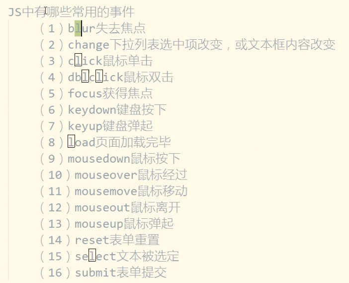

# 前言

- C/S结构：Client/Serve
  - 缺点：需要安装特定的客户端；不好升级，不好维护
  - 优点：大部分数据在客户端上，服务器只用发少量的数据，速度快
- B/S结构：Browser/Server
  - 优点：所有数据都在服务器上，升级时只用升级服务器；浏览器就是客户端，不用安装其他特定软件
  - 缺点：服务器要发送大量数据，速度慢
- 相关技术
  - elementui/easyui/bootstrap 叫做组件库（toolkit），帮你实现了的按钮，表格等等 UI 组件。你需要一个 UI 组件直接调 API ，不用自己在用 js 做一个。
  - jquery则只是封装了浏览器的接口和一些常用操作而已（library），是一系列操作DOM和AJAX的API组成的方法库，它和上面的东西一样都是库而不是框架。作为库，你只需要调 API 就可以了，它无法约束你整个网页怎么组织代码。
  - 而真正框架（framework）
    - angular 不仅仅是是提供了 API 实现了几个功能，而是提供了一套组件化以及MVVM的方案，在这个方案内，对调用者组织代码的方式也作了要求。
    - react 单独而言也就仅是 view 层面的一个库，然后和其配套的库配合在一起，就成了框架。
    - vue 则是以渐进式为特点，你将其用在单个的元素上（比如在vue官网上的入门案例那样），那就只是一个用于 model/view 双向绑定的的库罢了。但如果你将其用在整个网页上，甚至以 .vue 模板文件去组织网页，它就成了框架。

# HTML

## 概述

> hyper text markup language：超文本标记语言
>
> html语法是松散的，不区分大小写，最好全部小写
>
> 开始、结束标签之间没有任何东西的时候，结束标签可以省略，在开始标签末尾添加 /

```html
<!--2行的代码表示是html5.0语法，没有则是4.0-->
<!doctype html>
<html> <!--跟节点-->
    <head> <!--头节点-->
        <meta charset="utf-8"> <!--告知浏览器用哪种字符编码打开当前文件-->
        <title></title>  <!--title是网页的标题，显示在浏览器的左上角-->
    </head>
    
    <!--body是网页的主体，显示在浏览器页面上的内容-->
    <body> <!--网页体-->
        
    </body>
</html>
```

## 基本标签

> 从上往下是段落、标题、换行、水平线、预留格式、以及字

```html
<p>包裹的文字会自动成一个段落</p>
<h1>最多到h6，标题字独自占用一行</h1>
是个独目标记<br>多个连起来用就是换多行
<hr color="red" width=300px> <!--width可按百分比设-->
<pre>中间的文字会保留代码中的格式</pre>
<b>粗体字</b>
<i>斜体字</i>
<ins>插入字</ins>
<del>删除字</del>
字<sup>右上角</sup>
字<sub>右下角</sub>
<font color="red" size="10">字体标签</font>
```

## 实体符号

> 所有的实体符号语法规则都是：&开头，;结尾
>
> 如下是空格、小于号、大于号

```html
&nbsp;
&lt; &gt;
```

## 表格

```html
<!--居中对齐、边框、表格整体的宽高，tr是一行，td是一个单元格-->
<table align="center" border="1px" width="300px" height="200px">
    <tr align="center">
        <td>单元格</td>
        <td>单元格</td>
        <td rowspan="2">单元格</td>  <!--行合并：把后面的单元格注释掉，前面的单元格加rowspan属性，合并几个值是几-->
    </tr>
    <tr>
        <td>单元格</td>
        <td align="center">单元格</td>
        <!--<td>单元格</td>-->
    </tr>
    <tr>
        <td>单元格</td>
        <td colspan="2">单元格</td>  <!--列合并：随便注释几个，在另一个单元格加colspan，-->
        <td>单元格</td>
    </tr>
    <tr>
        <th>单元格</th>	<!--th标签中的内容自动加粗居中-->
        <th>单元格</th>
        <th>单元格</th>
    </tr>
</table>
```

```html
表格可以分割为三部分：<thead></thead>、<tbody></tbody>、<tfoot></tfoot>
最终显示结果上没区别，为了后期操作方便
```

## 背景

```html
<!--背景颜色，背景图片（图片路径能是相对、绝对、网络路径）-->
<body bgcolor="red" background="path/xxx.jpg"></body>
```

## 图片

```html
</img>	 <!--一般高、宽只设一个，会等比例缩放的-->
</img>		<!--title是鼠标悬停于图片时的提示信息-->
 			<!--alt是图片加载失败时的提示信息-->
```

## 超链接/热链接

```html
<a href="www.baidu.com">打开百度</a>	<!--href是hot references，值是一个请求路径，可以是网络或硬盘上的路径-->
```

```html
<!--target设定目标资源最终显示的位置，默认当前窗口，_blank在新窗口显示，_self在当前窗口显示，_parent在父窗口显示，_top在顶级窗口显示-->
<a href="www.baidu.com" target="_blank">打开百度</a>

<iframe src="son.html"></iframe> <!--inner frame，内部窗体，可设width、height等属性-->
<a href="www.baidu.com" target="_parent">打开百度</a> <!--son.html中有这两个超链接-->
<a href="www.baidu.com" target="_self">打开百度</a> <!--一个打开后在son的窗口显示，一个在父窗口显示-->
```

## 列表

```html
<!--无序列表，可嵌套列表-->
<ul> <!--type属性是序号的显示类型，有圆圈circle、方块square、点点disc-->
    <li>内容</li>
    <li>内容</li>
</ul>

<!--有序列表，可嵌套列表-->
<ol type="A"> <!--type属性是序号的显示类型，有数字1、字母A/a、罗马数字I/i等-->
    <li>内容</li>
    <li>内容</li>
</ol>
```

## 表单

> 收集用户的数据，提交表单时向服务器发送请求并携带用户填写的数据

```html
<!--
    action指定请求的路径，和href一样；method指定表单提交的方式，默认get
    提交表单后url后面是?name=value&name=value
-->
<form action="www.baidu.com" method="POST">
<!--
	input是输入域，当type是submit时具有提交当前表单的能力，必须在form当中，否则不起作用
    用户向input输入数据，type属性有多种值：submit、reset、text、textarea、password、radio、checkbox
    非按钮类的input，name属性必须有；按钮类的input，name属性不要有，否则也会提交上去
-->
    <input type="submit" value="按钮显示的文本">
    <input type="text" name="username">
</form>
```

```html
<form action="localhost:8080/register" method="post">
    <!--文本框类（由用户填）的value属性不用写；选择框类（由用户选）的value属性必须写-->
    用户名<input type="text" name="username">
    密码<input type="password" name="password">
    <!--单选框的name必须一样，表示同一组按钮，否则不是单选；checked表示默认选中-->
    性别
    	男<input type="radio" name="sex" value="1" checked>
    	女<input type="radio" name="sex" value="0">
    学历
    <!--下拉按钮，value必须写；selected表示默认选中；multi表示支持多选；size表示一次显示的条目数量-->
    <select name="grade" size="4" multiple>
        <option value ="" selected>--请选择学历--</option>
        <option value ="1">高中</option>
        <option value ="2">大学</option>
    </select>
    兴趣
        <!--复选框的name必须一样，表示同一组按钮；checked表示默认选中-->
        抽烟<input type="checkbox" name="hobby" value="smoke" checked>
        喝酒<input type="checkbox" name="hobby" value="drink">
    简介
    	<!--文本域，可以用rows、cols指定尺寸-->
    	<textaera rows="10" cols="60" name="brief"></textaera>
    <input type="reset" value="充值">
</form>
```

```html
<input type="file">		<!--file控件用来上传文件-->
<input type="hidden">	<!--hidden控件用来隐藏属性-->
<input type="text" name="zs" value="1" readonly> <!--readonly只读的，不能修改，能被用户看到。会被提交-->
<input type="text" name="ls" value="2" disabled> <!--disabled表示废弃。只读，不能修改，能被用户看到。不会被提交-->
<input type="text" maxlength=3>	<!--允许输入的最大长度-->
```

## id

> html是树结构（==DOM树==），有父节点和子节点。每个节点都有id属性，id不可重复

## div和span

- `div`：图层，也和叫盒子，专门做网页布局。div靠左上角的x、y轴坐标定位，可以用绝对坐标或相对坐标，也可以嵌套div
- `span`：图块，也可以看做盒子
- 区别：默认情况下div独自占一行，span不会

# CSS

## 概述

> Cascading Style Sheet：层叠样式表语言，专门用来修饰HTML页面

## 语法

- 嵌入方式

  - 内联嵌入

    ```html
    <!--
    	语法格式：<标签 styl="样式名=样式值;样式名=样式值;"/>
    -->
    <div style="width=200px;background:#66FF66;">  </div>
    ```

  - 样式块对象

    ```html
    <!--
    	设置某个元素的样式，首先要选中此元素，常见的有三种选择方式：
    	id选择器：#id。只能作用于当前页面的某个节点（因为id不重复）。优先级最高
    	类选择器：.类名。作用于当前页面的所有类名是此类名的节点。优先级第二
    	标签选择器：标签名。作用于当前页面的所有此标签。优先级最低
    -->
    <style type="text/css">
        #mydiv {
            width:200px;
            background-color:green;
        }
        input {
            width:500px;
            border:1px solid red;
        }
        .stu {
            width:500px;
            border:1px solid red;
        }
    </style>
    <div id="div1">  </div>
    <!--html中任何一个节点都有class属性，来指定标签类名。以下三个虽然标签不同，但属于同一类-->
    <span class="stu"></span>
    <input class="stu"/>
    <div class="stu"></div>
    ```

  - 引入外部独立的css文件（最常用）

    ```html
    <link rel="stylesheet" type="text/css" href="css/my.css"/>
    ```

- 常用样式

  ```html
  <style type="text/css">
      .cities {
          display:none; /*属于布局样式。隐藏none；显示block（独占一行）或inline-block（不占行）*/
          font-size:12px;/*字体样式，如大小颜色等*/
          text-decoration: none;/*文本装饰，如下划线等*/
          list-style-type: circle;/*列表样式，列表显示为圆、方块、数字等*/
      }
  </style>
  ```

  ```html
  <style type="text/css">
      /*鼠标悬停效果：hover表示鼠标悬停到此节点上时有效果，离开时即没有*/
      #myspan:hover {
          color:red;
          cursor:pointer;/*有多种效果，等待、禁止、小手等*/
      }
  </style>
  ```

  ```html
  <style type="text/css">
      .mydiv {
          /*
          	外补丁，在元素外部打补丁（即整个元素移动，给外补丁留出空位）
          	以下两个外补丁的效果相当于设置了xy坐标
          */
          margin-top:100px;
          margin-left:100px;
          
          /*
          	内补丁，把元素内部的东西往外延
          	下面的效果类似元素往右延长200px
          */
          padding-right:200px;
      }
  </style>
  ```

  ```html
  <style type="text/css">
  	/*浮动效果float样式，设置当前元素在父元素中的浮动效果*/
      #outerdiv {
          float:right;
      }
      #innerdiv {
          float:right;
      }
      <div id="outerdiv">
          <div id="innerdiv">
          </div>
      </div>
  </style>
  ```

  ```html
  <style type="text/css">
      #mydiv {
          /*绝对定位：设置x、y坐标*/
          position:absolute; 
          top:100px;
          left:300px
      }
  </style>
  ```

# JavaScript

## 前言

> JavaScript运行在浏览器中，是一个脚本语言，不需要编译。是弱类型语言

## 嵌入方式

==方式一：事件句柄==

- JS是事件驱动型的语言，要依靠事件来出发JS代码的执行，事件有click、dblclick、focus、blur等
- 每个事件都有对应的一个事件句柄（即在事件前加on），所有的句柄都是以“标签的属性”形式存在
- JS中字符串可以是双引号或单引号，分号可有可无；但双引号中只能包含单引号，单引号也只能包含双引号
- JS有一个内置的隐含对象window，代表浏览器窗口，能直接使用；document对象代表浏览器窗口中的文档
  - `onclick="window.alert('hello')"`

==方式二：脚本块==

- 打开页面的时候就执行，块中的代码自上而下依次执行；块的位置随意

- ```html
  <script type="text/javascript">
      alert("hello")
  </script>
  ```

==方式三：引入外部独立的js文件==

- 也是打开页面的时候自上而下依次执行

- ```html
  <script src="js/my.js" type="text/javascript"></script>
  ```

  

## 语法

- `var name = "zhangsan"`定义变量并复制；没赋值时默认值是==undefined==，undefined是JS中一个具体存在的值；一个var只能赋值一个变量

- `console.log(name)`输出到控制台

- ==innerHTML==是一个非常重要的属性，它可以获取也可以设置元素内部的内容
  - `getElementById`获取对象并赋值给变量后，通过变量获取此属性
  - 会将后面的字符串当做一段html代码解释并执行，最终展示一个效果
  
- `innerText`：即使后面的字符串是html代码，也视为普通字符串

- 通过==getElementById==获取对象后，可以获取、修改它的value、type等属性，方法是通过`.`获取属性，获取后可以改值

- `getElementsByName`根据name获取对象数组

- `trim`去除字符串空白

- `JSON.stringify`把数组、map、结构体等转成json字符串

- ==/^[0-9a-zA-Z]+$/==：正则表达式，`^/`和`$/`是正则表达式的开头和结尾；`[]`中是允许出现的字符（0\~9，a\~z，A~Z）；`+`表示允许出现0到多个

- ```javascript
  //能传任何类型的数据，返回任何类型的数据
  //函数必须调用才能执行，可以在函数定义之前调用（因为函数的声明优先级是最高的，声明后再自上而下执行script中的逻辑）
  function sum(a,b) {
  	return a+b  
  }
  sub = function(a,b) {
      return a-b
  }
  ```


## 案例

  ```html
复选框全选、取消全选
  	<!-- 页面加载完成时调用bindClink函数 -->
  	<body onload="bindClick()">
  		<script type="text/javascript">
  			// 全选的功能
  			function checkall() {
  				var firstchk = document.getElementById("firstchk")
  				var hobbies = document.getElementsByName("hobby")
  				for(var i = 0; i < hobbies.length; i++) {
  					hobbies[i].checked = firstchk.checked
  				}
  			}
  			// 取消全选的功能
  			function bindClick() {
  				var hobbies = document.getElementsByName("hobby")
  				// 1. 对每个复选框绑定onclick事件
  				for(var i = 0; i < hobbies.length; i++) {
  					hobbies[i].onclick = function() {
  						var count = hobbies.length
  						var checkedCount = 0
  						// 2. 每个复选框触发onclick事件时都遍历所有复选框，如果有一个被选中就把checkedCount+1
  						for (var i = 0; i < hobbies.length; i++) {
  							if (hobbies[i].checked) {
  								checkedCount++
  							}
  						}
  						// 3. 然后判断所有被选中的数量和总的复选框数量是否相当,相当则全选,不等则取消全选
  						document.getElementById("firstchk").checked = (count == checkedCount)
  					}
  				}
  			}
  		</script>
  		<input type="checkbox" name="firstchk" id="firstchk" onclick="checkall()" /><br>
  		<input type="checkbox" name="hobby" id="hobby" value="1" />爱好1<br>
  		<input type="checkbox" name="hobby" id="hobby" value="1" />爱好2<br>
  	</body>
  ```

```html
表单验证
<body>
    <script type="text/javascript">
        function checkName(username) {
            var username = document.getElementById("username")
            username = username.trim()
            var err = document.getElementById("usernameErr")
            if (username == "") {
                err.innerHTML="用户名不能为空"
            }else if (username.length < 6 || username.length > 14) {
                err.innerHTML="用户名长度非法[6-14]"
            }else {
                var regExp = /^[0-9a-zA-Z]+$/
                var ok = regExp.test(username)
                if (!ok) {
                    err.innerHTML="用户名只能由数字和字母组成"
                }
            }
        }

        function clearErr() {
            var err = document.getElementById("usernameErr")
            err.innerHTML = ""
        }
    </script>
    <form action="localhost:8080/save" method="post">
        用户名<input type="text" name="username" id="username"
                  onblur="checkName*(this.value)"
                  onfocus="clearErr()" />
        <span id="usernameErr" style="color: red;font-size: 5px;"></span>
        <br>
        <input type="button" value="保存" />
    </form>
</body>
```

# Ajax

## 相关概念

- 全局和局部刷新
  - 全局刷新：整个浏览器被新的数据覆盖，传输数据量大，渲染时间长
  - 局部刷新（ajax的作用）：在浏览器内部发起请求、获取数据，改变页面中的部分内容
- Ajax的核心对象：==异步对象（XMLHttpRequest）==，存在浏览器内存中，由异步对象发送请求和接收响应。可创建多个异步对象，对象之间是独立的。
- Asynchronous Javascript And XML：是一种做局部刷新的方法，不是语言
  - Javascript：用来创建异步对象、发送请求、更新页面的dom对象
  - xml：作为网络中传输的数据格式。现已用json替换了xml

# 使用

```javascript
//使用四步：new，绑定onreadystatechange事件，open，send
const xhr = new XMLHttpRequest();	//创建异步对象，浏览器调试中的XHR就是ajax对象。有如下三个属性
/*
xhr.readyState表示异步对象请求的状态变化，0创建对象，1初始化对象；2发送请求；3接收响应；4处理完成数据，进行局部刷新。主要关心3、4
xhr.status表示网络请求的状况，200、404等
xhr.responseText表示服务器端返回的数据
*/

//三个参数是请求方式,URL,异步或同步（默认true，异步）
xhr.open('GET','http://127.0.0.1:8080/server');
//发送请求
xhr.send()
//给异步对象绑定事件，只要异步对象readyState发生变化都会触发这个事件
xhr.onreadystatechange = function() {
    if (xhr.readyState == 4) {
        if (xhr.status >= 200 && xhr.status < 300) {
            console.log(xhr.status); //状态码
            console.log(xhr.statusText); //状态字符串
            console.log(xhr.getAllResponseHeaders()); //所有响应头
            console.log(xhr.response); //响应体
        }
    }
}
```


# beego前端记录

- ajax
  - 点击变换验证码图片

    > style="cursor: pointer"是显示小手
    >
    > 后台serverjson传过来的值（map、结构体等），ajax自动转成map
    >
    > 把base64字符串转换成图片，最快捷的方法是document.getElementById().setAttribute("src",xxx)

  ```html
  
  <input type="hidden" value="{{.captcha.Id}}" id="captcha_id">
  ```

  ```javascript
  var bs64 = {{.captcha.BS64}}
  document.getElementById("captcha_img").setAttribute("src",bs64);
  var btn = document.getElementById("captcha_img");
  btn.onclick = function(ev) {
      $.ajax({
          url:"/change_captcha",
          data:{
  
          },
          type:"GET",
          dataType:"json",
          success:function(data){
              var code = data["Code"]
              if (code != 200) {
                  alert(data["msg"])
              }else {
                  var bs64val = data["BS64"]
                  btn.setAttribute("src",bs64val)
              }
          },
          fail:function(data){
              alert("处理异常")
          }
      });
  };
  ```


- 校验规则

  ```html
  <!--lay-verify的值就是校验规则，有phone、email等；还有lay-submit、lay-filter等属性-->
  <input name="username" placeholder="用户名"  type="text" lay-verify="required" class="layui-input">
  <input value="登录" lay-submit lay-filter="login" style="width:100%;" type="button" id = "loginbtn">
  ```

  ```javascript
  $(function  () {
              layui.use('form', function(){
                var form = layui.form;
                //监听提交
                form.on('submit(login)', function(data){
                  // alert(888)
                  var username = document.getElementById("username").value;
                  var password = document.getElementById("password").value;
                  var captcha = document.getElementById("captcha").value;
                  var captcha_id = document.getElementById("captcha_id").value;
                  if (password.length < 6) {
                      ions_alert.alertError("密码长度不能少于6位")
                      return
                  }
                  $.ajax({
                      url:"/",
                      type:"POST",
                      data:{
                          "username":username,
                          "password":password,
                          "captcha":captcha,
                          "captcha_id":captcha_id
                      },
                      success:function(data){
                          var code = data["code"]
                          if (code == 200) {
                              window.location.href = "{{urlfor "HomeController.Get"}}"
                          }else {
                              ions_alert.alertError(data["msg"])
                          }
                      },
                      fail:function(data){
  
                      }
                  })
                });
              });
          })
  ```

## layui

- 常用属性

```html
<!--layui-btn-warm黄色；layui-btn-normal蓝色；layui-btn-danger红色-->
<span class="layui-btn layui-btn-warm layui-btn-mini">已停用</span></td>
<!--四种图标：向下箭头，向上箭头，编辑按钮，修改按钮，删除按钮-->
<td class="td-manage">
    {{if eq .IsActive 1}}
    <a onclick="member_stop(this,'10001')" href="javascript:;"  title="停用">
        <i class="layui-icon">&#xe601;</i>
    </a>
    {{else if eq .IsActive 0}}
    <a onclick="member_stop(this,'10001')" href="javascript:;"  title="启用">
        <i class="layui-icon">&#xe62f;</i>
    </a>
    {{end}}
    <a title="编辑"  onclick="x_admin_show('编辑','member-edit.html',600,400)" href="javascript:;">
        <i class="layui-icon">&#xe642;</i>
    </a>
    <a onclick="x_admin_show('修改密码','member-password.html',600,400)" title="修改密码" href="javascript:;">
        <i class="layui-icon">&#xe631;</i>
    </a>
    <a title="删除" onclick="member_del(this,'要删除的id')" href="javascript:;">
        <i class="layui-icon">&#xe640;</i>
    </a>
</td>
```

- 点击后弹出小窗口

```html
<xblock>
    <button class="layui-btn layui-btn-danger" onclick="delAll()"><i class="layui-icon"></i>批量删除</button>
    <button class="layui-btn" onclick="x_admin_show('添加用户','{{urlfor "UserController.Add"}}',600,400)"><i class="layui-icon"></i>添加</button>
    <span class="x-right" style="line-height:40px">共有数据：{{.all}} 条</span>
</xblock>
```

- 多选框

```html
<th>
	<div class="layui-unselect header layui-form-checkbox" lay-skin="primary"><i class="layui-icon">&#xe605;</i></div>
</th>
```

- 使用ajax添加完成后，跳出“添加成功”提醒，两秒后跳转到list页面而非iframe页面

```javascript
layui.use(['form'], function(){
          var form = layui.form;
          //监听提交
          form.on('submit(add)', function(data){
            var username = document.getElementById("username").value;
            var password = document.getElementById("password").value;
            var age = document.getElementById("age").value;
            var gender = $('input[name="gender"]:checked').val();   //layui固定写法，获取input标签中name是gende且checked的值，下面isactive类似
            var phone = document.getElementById("phone").value;
            var addr = document.getElementById("addr").value;
            var isactive = $('input[name="isactive"]:checked').val();
            if (password.length < 6) {
                alert("密码长度不能小于6个字符");
                return
            }
            $.ajax({
                url:"{{urlfor "UserController.Submit"}}",
                type:"post",
                data:{
                    "username":username,
                    "password":password,
                    "age":age,
                    "gender":gender,
                    "phone":phone,
                    "addr":addr,
                    "isactive":isactive,
                },
                success: function(data) {
                    var code = data["code"];
                    if (code == 200) {
                        ions_alert.alertSuccessToast(data["msg"]);
                        setTimeout(succReload,2000)
                        
                    } else {
                        ions_alert.alertErrorToast(data["msg"]);
                    }
                },
                faile: function(data) {
                    alert(data)
                }
            });
            function succReload() {
                //获取当前frame索引
                var index = parent.layer.getFrameIndex(window.name);
                //关闭当前iframe
                parent.layer.close(index); //或者使用layer.close(index);来关闭提示框
                window.location.href = "{{urlfor "UserController.List"}}";
            }
          });
        });
```

