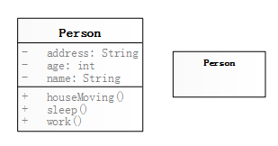
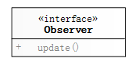
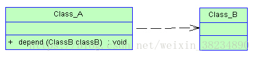
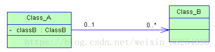
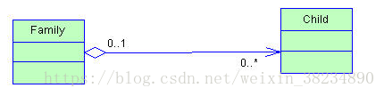
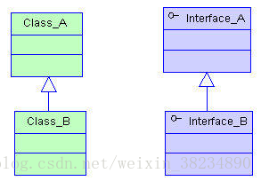
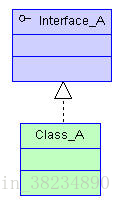
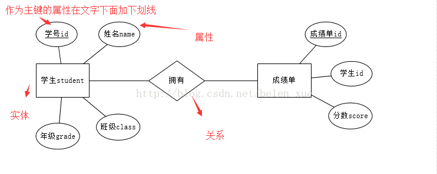
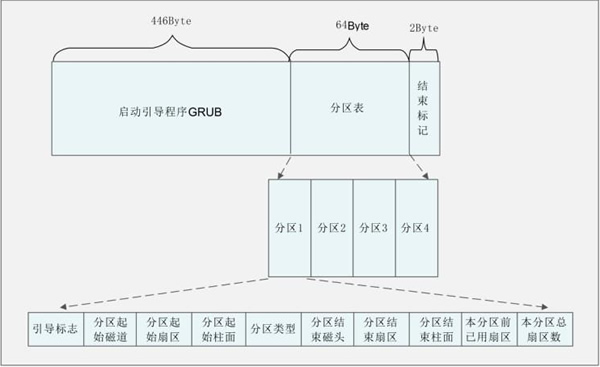

# 系统分析与设计

## UML

Unified Modeling Language（统一建模语言）是面向对象设计的建模工具，用来描述、可视化、构造和文档化软件系统，独立于任何具体的程序设计语言。

UML的构造块：事物、关系、图

### 事物

模型中的元素，分为

- 结构事物：类、接口、用例、组件、节点
- 行为事物：状态机、活动
- 分组事物：包
- 注释事物：注解

### 关系

模型元素之间的连接，分为

- 关联关系：描述不同类的实例之间的连接
- 依赖关系：描述一对模型元素之间的内在联系
- 泛化关系：描述特殊到一般的一种归纳和分类关系
- 实现关系：描述规格说明和起实现的元素之间的连接

### 图

根据基本功能和作用，UML图分为结构图和行为图

- 结构图：系统的静态结构模型，描述事物与事物之间的静态关系
  - 类图：系统中类的静态结构
  - 对象图：系统中多个对象在某一时刻的状态
  - 组件图：系统的静态实现视图
  - 部署图：系统中软硬件的物理体系结构
- 行为图：系统的动态行为模型，描述事务的交互过程
  - 序列图：对象之间的动态合作关系，强调对象发送消息的顺序，同时显示对象之间的交互
  - 协作图：对象之间的协助关系
  - 状态图：状态到状态控制流，常用于动态特性建模
  - 活动图：业务实现用例的工作流程
  - 用例图：从用户角度描述系统功能

#### 类图

> 类图是最重要和最常用的图，是定义其他图的基础。

描述系统中的类、接口及它们之间的关联和约束。

- 类：一组拥有相同的属性、方法、关系的对象。UML中，类表达成一个有三个分隔区的矩形，其中顶端显示类名，中间显示类的属性，尾端显示类的方法。其中`-`表示私有即只对本类可见，`+`表示公有即其他类可以访问，`#`表示保护即对本类及其派生类可见。



- 接口：不包含属性，但可以有一些操作。接口的所有内容都是公有的。接口代表了一份契约，实现该接口的类必须履行它。UML中，接口由一个带名称的小圆圈表示；也可以表示为带有<\<interface>>类

  

  

- 类图中的关系

  - 依赖关系：依赖就是一个类A使用到了另一个类B，而这种使用关系是具有偶然性的、临时性的、非常弱的，但是类B的变化会影响到类A。比如某人要过河，需要借用一条船，此时人与船之间的关系就是依赖。表现在代码层面，类B作为参数被类A在某个method方法中使用。

    

  - 关联关系：两个类之间语义级别的一种强依赖关系，比如我和我的身份证，这种关系比依赖更强、不存在依赖关系的偶然性、关系也不是临时性的，一般是长期性的，而且双方的关系一般是平等的。关联可以是单向、双向的。表现在代码层面，被关联类B以类的属性形式出现在关联类A中，也可能是关联类A引用了一个类型为被关联类B的全局变量。

    

  - 两种特殊的关联关系

    - 聚合关系：体现的是整体与部分的关系，即has-a的关系。此时整体与部分之间是可分离的，它们可以具有各自的生命周期，部分可以属于多个整体对象，也可以为多个整体对象共享。比如计算机与CPU、公司与员工的关系等，比如一个航母编队包括海空母舰、驱护舰艇、舰载飞机及核动力攻击潜艇等。表现在代码层面，和关联关系是一致的，只能从语义级别来区分。

      

    - 组合关系：体现的是一种contains-a的关系，这种关系比聚合更强，也称为强聚合。它同样体现整体与部分间的关系，但此时整体与部分是不可分的，整体的生命周期结束也就意味着部分的生命周期结束，比如人和人的大脑。表现在代码层面，和关联关系是一致的，只能从语义级别来区分。

      

  - 泛化关系：描述一般的元素称为父，描述特殊的元素称为子，子类是父类的继承，父类是子类的泛化。 继承指的是一个类/接口继承另外的一个类/接口的功能，并可以增加它自己的新功能的能力。

    

  - 实现关系：表示规格说明与实现之间的关系

    

#### 时序图

按时间顺序显示对象交互的图，强调消息的时间顺序。主要包括四个元素：对象、生命线、激活和消息。

在UML中，顺序图将交互关系表示为一张二维图。其中纵向是代表时间维度，时间向下延伸，按时间依次列出各个对象所发出和接收的消息。水平方向是代表对象的维度，排列着参与交互的各个独立的对象。

- 对象
- 生命线
- 激活
- 消息

#### 用例图

#### 活动图

## E-R

ER图分为实体、属性、关系三个核心部分。实体是长方形，属性是椭圆形，关系是菱形。

### 实体

即数据模型中的数据对象，每个实体都有自己的实体成员（entity member）或者说实体实例（entity instance），例如学生实体里包括张三、李四等，实体成员（entity member）/实体实例（entity instance） 不需要出现在ER图中。

实体的细分

- 强弱实体：一个实体必须依赖于另一个实体存在，那么前者是弱实体，后者是强实体。弱实体和强实体的联系必然只有1：N或者1：1，这是由于弱实体完全依赖于强实体，强实体不存在，那么弱实体就不存在，所以弱实体是完全参与联系的，因此弱实体与联系之间的联系也是用的双线菱形。
- 复合实体：也称联合实体或桥接实体，常常用于实现两个或多个实体间的M：N联系，它由每个关联实体的主玛组成，用长方体内加一个菱形来表示。

### 属性

即数据对象所具有的属性，属性分为唯一属性（unique attribute）和非唯一属性，唯一属性指的是唯一可用来标识该实体实例或者成员的属性，用下划线表示，一般来讲实体都至少有一个唯一属性。

属性的细分

- 复合属性：多个属性的组合，复合属性也有唯一属性。例如学生的所在班级属性，由于多个年级都有班级，所以单单班级属性（如一班）是不唯一的，但是和年级组成的复合属性（如三年级一班）后则可以匹配成唯一属性。
- 多值属性：可以有多个不同取值的属性，用双线椭圆表示。如一本书的分类属性，这本书有多个分类。
- 派生属性：非永久性存于数据库的属性，派生属性的值可以从别的属性值或其他数据（如当前日期）派生出来，用虚线椭圆表示。一般来讲派生属性不存在于数据库中，而是通过相应的公式进行计算得到，如果要放到数据库中，那么隔一段时间就要进行更新，否则会出现数据错误。
- 可选属性：有些属性的可以没有值，这就是可选属性，在椭圆的文字后用（O）来表示。
- 联系属性：表示多个实体之间的联系所具有的属性，一般来讲M:N的两个实体的联系具有联系属性。

### 关系

用来表现数据对象与数据对象之间的联系。

关系有三种

- 1:1：1对1关系是指对于实体集A与实体集B，A中的每一个实体至多与B中一个实体有关系；反之，在实体集B中的每个实体至多与实体集A中一个实体有关系。
- 1:N：1对多关系是指实体集A与实体集B中至少有N(N>0)个实体有关系；并且实体集B中每一个实体至多与实体集A中一个实体有关系。多
- M:N：多对多关系是指实体集A中的每一个实体与实体集B中至少有M(M>0)个实体有关系，并且实体集B中的每一个实体与实体集A中的至少N(N>0)个实体有关系。



## 设计原则和设计模式

### 设计原则

- 单一职责原则（SRP）：只能让一个类/接口有且仅有一个职责。

  > 如果一个类需要改变，改变它的理由永远只有一个。如果存在多个改变它的理由，就需要重新设计该类。

- 开闭原则：软件实体（模块，类，方法等）应该对扩展开放，对修改关闭。为了满足开闭原则的对修改关闭以及扩展开放，应该把软件系统中的不变的部分抽象成不变的接口，原有的接口可以应对未来的扩展，不足以应对的部分可以通过定义新的接口来实现。现在多把开闭原则等同于面向接口的软件设计。

  > 开闭原则的相对性：软件系统的构建是一个需要不断重构的过程，在这个过程中，模块的功能抽象，模块与模块间的关系，都不会从一开始就非常清晰明了，所以构建100%满足开闭原则的软件系统是相当困难的。

- 接口分离原则（ISP）：使用多个专门的接口比使用单一的总接口总要好。它包含了2层意思：

  - 接口的设计原则：接口的设计应该遵循最小接口原则，不要把用户不使用的方法塞进同一个接口里。如果一个接口的方法没有被使用到，则说明该接口过胖，应该将其分割成几个功能专一的接口。
  - 接口的依赖（继承）原则：如果一个接口a继承另一个接口b，则接口a相当于继承了接口b的方法，那么继承了接口b后的接口a也应该遵循上述原则：不应该包含用户不使用的方法。 反之，则说明接口a被b给污染了，应该重新设计它们的关系。

  > 注意适度原则，接口分隔要适度，避免产生大量的细小接口。

- 依赖倒置原则（DIP）：面向对象程序设计相对于面向过程（结构化）程序设计而言，依赖关系被倒置了。因为传统的结构化程序设计中，高层模块总是依赖于低层模块。依赖倒置原则是在高层模块与低层模块之间，引入一个抽象接口层。高层模块不直接依赖低层模块，而是依赖抽象接口层。抽象接口也不依赖低层模块的实现细节，而是低层模块依赖（继承或实现）抽象接口。

  1. 高层模块不应该依赖于低层模块，二者都应该依赖于抽象
  2. 抽象不应该依赖于细节，细节应该依赖于抽象
  3. 针对接口编程，不要针对实现编程。

  > 一个良好的设计应该是系统的每一部分都是可替换的

- 组合/聚合复用原则：尽量使用组合/聚合，不要使用类继承。即在一个新的对象里面使用一些已有的对象，使之成为新对象的一部分，新对象通过向这些对象的委派达到复用已有功能的目的。

- 迪米特原则(LoD)：最少知道原则，每个类尽量减少对其他类的依赖，如果真的需要建立联系，也希望能通过它的友元类来转达（中介类）。

  > 迪米特原则要求类尽量不要对外公布太多的public方法和非静态的public变量，尽量内敛，多使用private、protected等访问权限。

- 里氏替换原则(LSP)：所有引用基类的地方必须能透明地使用其派生类的对象，只有满足以下2个条件的OO设计才可被认为是满足了LSP原则

  - 不应该在代码中出现if/else之类对派生类类型进行判断的条件
  - 派生类应当可以替换基类并出现在基类能够出现的任何地方，或者说如果我们把代码中使用基类的地方用它的派生类所代替，代码还能正常工作

  > 里式替换原则的引申意义：子类可以扩展父类的功能，但不能改变父类原有的功能。

- 低内聚高耦合原则

不同设计原则的区别

- 单一职责原则注重的是职责的划分，而接口隔离原则注重的是类对接口的依赖的隔离，两个定义站的角度是不同的。在设计接口时单一职责原则和接口隔离原则可能会无法两全。

### 设计模式

#### 创建型模式

- 工厂方法模式
- 抽象工厂模式
- 单例模式
- 建造者模式
- 原形模式

#### 结构型模式

- 适配器模式
- 装饰器模式
- 代理模式
- 外观模式
- 桥接模式
- 组合模式
- 享元模式

#### 行为型模式

- 策略模式
- 模板方法模式
- 观察者模式
- 迭代子模式
- 责任链模式
- 命令模式
- 备忘录模式
- 状态模式
- 访问者模式
- 中介者模式
- 解释器模式

# 操作系统

## 启动阶段

1. 通电

2. BIOS

   - BIOS(*Basic Input/Output System*)会先检查硬件能否满足运行的基本条件，称为硬件自检（*Power-On Self-Test*），缩写为POST。如果硬件出现问题，主板会发出不同含义的蜂鸣，启动中止。如果没有问题，屏幕就会显示出CPU、内存、硬盘等信息。
   - 硬件自检完成后，BIOS会有一个外部存储设备的排序，叫做启动顺序（Boot Sequence），BIOS会把控制权交给顺序最靠前的设备。

3. 主引导记录：BIOS把控制权转交给排在第一位的存储设备后，计算机读取该设备的第一个扇区，即最前面的512个字节。如果这512个字节的最后两个字节是0x55和0xAA，则这个设备可以用于启动，否则控制权被转交给"启动顺序"中的下一个设备。最前面的这512个字节称为主引导记录（Master boot record，缩写为MBR）。

   - MBR的结构：第1-446字节是启动引导程序（称为GRUB）；第447-510字节（64个字节）是分区表（Partition table）；最后两个字节是结束标记（0x55和0xAA）

   - 分区表：每个分区必须占16字节，所以分区表就被分为4项，因此每个硬盘最多只能分四个一级分区，叫做主分区。每个主分区的16字节由6个部分组成，称为分区的标识数据，具体如下

     | 存储字节      | 数据内容及含义                                               |
     | ------------- | ------------------------------------------------------------ |
     | 第 1 字节     | 引导标志。如果为0x80，就表示该主分区是激活分区，控制权要转交给这个分区。四个主分区里面只能有一个是激活的。 |
     | 第 2-4 字节   | 分区第一个扇区的物理位置（起始磁道号、起始扇区号、起始柱面号） |
     | 第 5 字节     | 分区类型，可以识别主分区和扩展分区                           |
     | 第 6-8 字节   | 分区最后一个扇区的物理位置（结束磁道号、结束扇区号、结束柱面号） |
     | 第 9-12 字节  | 分区之前已经占用的扇区数                                     |
     | 第 13-16 字节 | 分区的总扇区数                                               |

     

   - 控制权交给硬盘的分区时，又分成三种情况

     - VBR(*Volume boot record*)：四个主分区里面只有一个是激活的，计算机会读取激活分区的第一个扇区，称为卷引导记录
     - EBR(*Extended boot record*)：当硬盘越来越大导致四个分区不够用时，有且仅有一个区可以被定义成扩展分区（指这个区里面又分成多个区，称为逻辑分区），计算机依次读取逻辑分区。这种方法几乎不用。
     - 启动管理器：计算机读取主引导记录前面446字节的机器码之后，不再把控制权转交给某一个分区，而是运行事先安装的启动管理器(boot loader），由用户选择启动哪一个操作系统。Linux目前最流行的启动管理器是Grub。

4. 操作系统

   - 加载内核：操作系统接管硬件以后，首先载入/boot目录下的kernel文件（内核文件）

   - 启动初始化进程：内核加载成功后，运行/sbin/init来初始化系统环境。它读取配置文件产生init进程，这是linux启动后的第一个进程，pid为1，其他进程都是它的子进程

   - 确定运行级别：许多程序需要开机启动，即Windows的服务（service）、Linux的守护进程（daemon）。init进程的一大任务就是去运行这些程序。Linux允许为不同的场合，分配不同的开机启动程序，这就叫做运行级别（runlevel）。比如用作服务器时，需要启动Apache，用作桌面就不需要。也就是说，启动时根据运行级别，确定要运行哪些程序。

     - linux的运行级别有6个：

       | 运行级别 | 说明                                                        |
       | -------- | ----------------------------------------------------------- |
       | 0        | 系统停机状态，系统默认运行级别不能设为0，否则不能正常启动   |
       | 1        | 单用户工作状态，root权限，用于系统维护，禁止远程登陆        |
       | 2        | 多用户状态(没有NFS)                                         |
       | 3        | 完全的多用户状态(有NFS)，登陆后进入控制台命令行模式         |
       | 4        | 系统未使用，保留                                            |
       | 5        | X11控制台，登陆后进入图形GUI模式                            |
       | 6        | 系统正常关闭并重启，默认运行级别不能设为6，否则不能正常启动 |

     - 运行级别的目录：`/etc/rcN.d/`，N为1-6。在指定级别的目录中，除了README外，其他文件名都是字母S+两位数字+程序名的形式

       | 标识符       | 说明                                                         |
       | ------------ | ------------------------------------------------------------ |
       | 字母S        | Start 启动——启动的脚本运行参数为start                        |
       | 字母K        | Kill 关闭(如果从其他运行级别切换过来，需要关闭的程序)——启动脚本的运行参数为stop |
       | 后面两位数字 | 处理顺序，数字越小越早处理                                   |

   - 加载开机启动程序：七个`/etc/rcN.d`目录里列出的程序，都设为链接文件，指向另外一个目录`/etc/init.d` ，真正的启动脚本都统一放在这个目录中。init进程逐一加载开机启动程序，其实就是运行这个目录里的启动脚本。

   - 用户登录：有三种方式

     - 命令行登录：init进程调用getty程序（意为get teletype），让用户输入用户名和密码。输入完成后，再调用login程序，核对密码（linux还会再多运行一个身份核对程序/etc/pam.d/login）。如果密码正确，就从文件 /etc/passwd 读取该用户指定的shell，然后启动这个shell
     - ssh登录：系统调用sshd程序（linux还会再运行/etc/pam.d/ssh ），取代getty和login，然后启动shell
     - 图形界面登录：init进程调用显示管理器，Gnome图形界面对应的显示管理器为gdm（GNOME Display Manager），然后用户输入用户名和密码。如果密码正确，就读取/etc/gdm3/Xsession，启动用户的会话

   - 进入login shell（命令行界面）：linux默认的shell是Bash，它会先读取`/etc/profile`，再依次寻找下列文件，找到一个就不再读取后面的了。

     ```sh
     ~/.bash_profile
     ~/.bash_login
     ~/.profile
     ```

     > 对于图形界面，只加载 /etc/profile 和 ~/.profile

   

## 内存机制


## 文件系统

## IO模型

## 进程线程

# 数据结构及算法

## 数据结构

### 堆栈

### 链表

- 单向链表
- 双向链表
- 循环链表

### 树

- 二叉树
- 二叉搜索树
- 平衡二叉树
- 红黑树
- B+树

## 算法

- 二分查找
- 快速排序
- 插入排序
- 归并排序
- 堆排序

# 数据库

# GDB调试

# 网络协议

## TCP/IP

## HTTP

# 项目管理

- CBB：可以在不同是产品、系统间共用的基础模块、组件等