# 网络

## 基础篇

### TCP/IP网络模型

- **应用层**：只专注于为用户提供应用功能，不关心数据如何传输，如HTTP、FTP、Telnet、DNS、SMTP等，工作在OS中的用户态。

- **传输层**：为应用层提供网络支持，分为TCP和UDP。

  - TCP：大部分应用使用的传输层协议，有UDP没有的流量控制、超时重传、拥塞控制等特性，确保数据可靠地传输给对方。

    - **分段**：传输层的数据包大小超过MSS(TCP最大报文段长度)就要对数据分段(**TCP Segment**)，若有分段丢失或损坏，重传即可。

    - **端口**：一台设备上有多个应用接收或传输数据，用端口号进行区分，传输层的报文中携带端口号。

      > 浏览器中的每个标签栏都是独立的进程，OS会给它们分配临时的端口号。

  - UDP：比TCP简单，只负责发送数据包，不保证能否抵达，实时性更好，传输效率也高。把TCP的特性在应用层实现则能让UDP实现可靠传输。

- **网络层**：实际将数据从一个设备传输到另一个设备的分层，进行路径和节点的选择。最常用的是IP协议，有**寻址**和**路由**功能。

  - IP包：把传输层的报文作为数据部分，再加上IP包头组成IP包。如果包的大小超过MTU(一般1500Bytes)会**再次分片**（每个分片都有各自的包头）。

    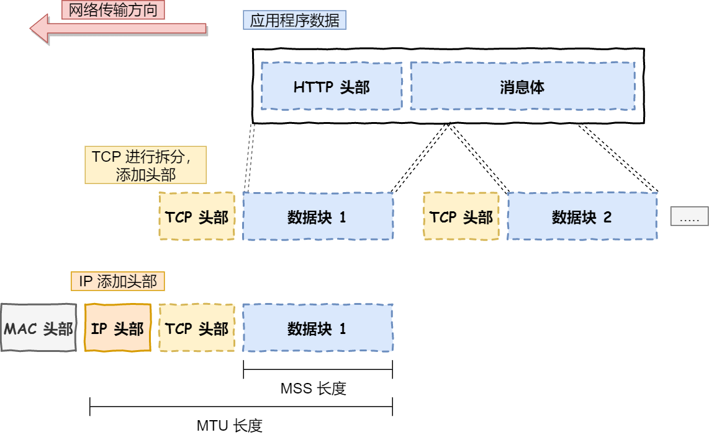

  - IP地址：对于IPv4协议，IP地址分4段32位，每段8位，由**网络号**和**主机号**组成。

    > 子网掩码为0-32，每个数字表示IPv4格式的地址从最左边开始有几个1
    >
    > 如16 --> 255.255.0.0(11111111.11111111.00000000.00000000)

    - 网络号标识该地址属于哪个子网，由**子网掩码**和地址进行**与运算**得到。
    - 主机号标识同一子网下的不同主机，由**子网掩码取反**后和地址进行**与运算**得到。
    - 寻址过程中先匹配网络号找到子网，再匹配主机号找对应的主机。
    - 实际网络是通过很多网关、路由器、交换机等众多设备连接的，因此数据包到达一个网络节点后，通过**路由**算法决定下一步走哪条路径。

  - ==IP协议的寻址作用是告诉我们去往目的地该朝哪个方向走，即导航；路由则是根据下一个目的（网络节点）地选择路径，即操作方向盘。==

- **网络接口层**：为网络层提供链路级别传输的服务，负责在以太网、WiFi等底层网络上发送数据包，工作在网卡这个层次，使用MAC地址标识网络上的设备。

  - MAC地址：网络接口层给IP报文加上MAC头部(包含接收方和发送方的MAC地址)并封装成数据帧(Data frame)，然后发送到网络上，其中接收方的MAC地址通过ARP协议获取，通过匹配MAC地址在以太网中通讯。

  > 以太网就是在局域网内，把附件的设备连接起来，使它们之间可以通讯的技术。

**总结**

TCP/IP 网络通常是由上到下分成 4 层，分别是应用层，传输层，网络层和网络接口层。

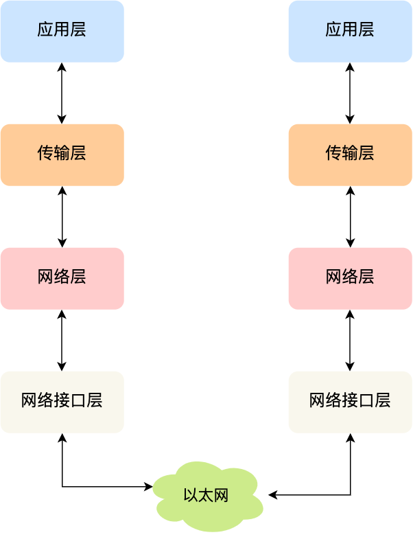

HTTP的传输单位是消息或报文（message），TCP的传输单位是段（segment），IP的传输单位是包（packet），网络接口层的传输单位是帧（frame）。

> HTTP也可以分割报文：使用分块传输编码技术把报文的主体分块后发送，客户端通过接收数据块并解码后逐步显示页面。

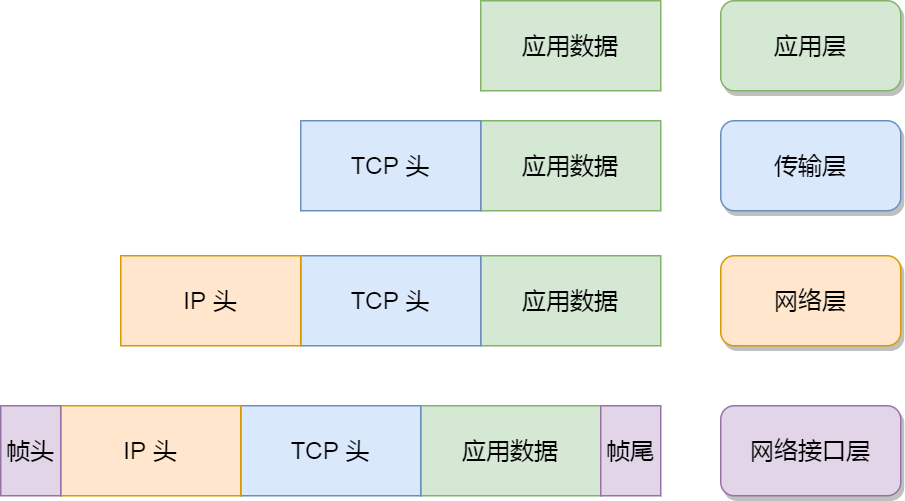

### 协议栈

应用程序（如浏览器）通过调用socket库，委托OS的协议栈工作。OS的协议栈包括传输层的TCP和UDP，网络层的IP、ICMP、ARP，协议栈的下层是网卡驱动程序和物理硬件网卡

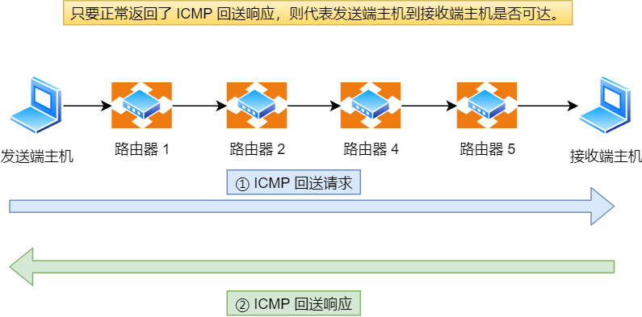

### 打开网页全过程

> 每往下走一层，就会把上一层的报文作为本层报文的数据部分，再加上本层的报文头。

#### HTTP

浏览器先解析URL以确定Web服务器的域名和资源的目录，解析完后根据这些信息生成HTTP请求消息。

> HTTP详解参考《HTTP笔记.md》

#### DNS

发送数据前，需要查询服务器域名对应的IP地址，DNS服务器专门保存了域名和IP的对应关系

- 层级：域名用`.`分割成不同的层级，**越靠右层级越高**。

- 树状结构：域名的层级关系类似一个树状结构。

  > 根域：域名最右边的`.`（如`www.server.com.`）。根域服务器的信息保存在所有DNS服务器中，因此客户端只要能够找到任意一台 DNS 服务器，就可以通过它找到根域 DNS 服务器，然后再一路顺藤摸瓜找到位于下层的某台目标 DNS 服务器。

  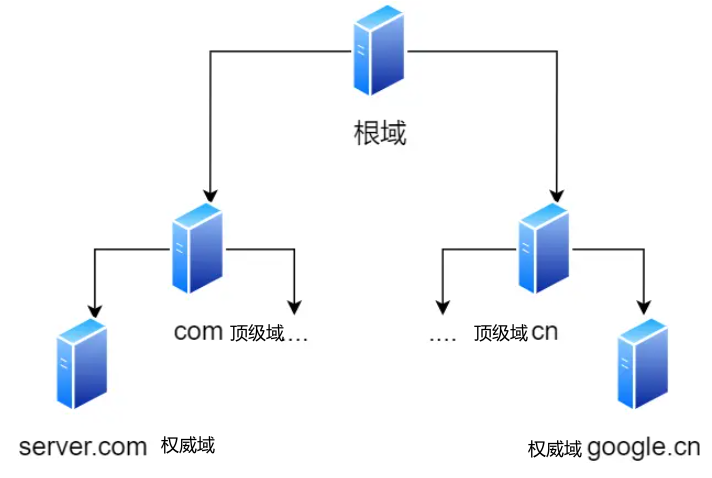

- 解析流程

  1. 浏览器查看自身有没有缓存域名的IP地址，有则返回，没有则下一步
  2. OS查看有没有缓存，有则返回，没有则下一步
  3. hosts文件中有则返回，没有则下一步
  4. 客户端发出DNS请求给本地DNS服务器（客户端的TCP/IP设置中填写的DNS服务器地址）
  5. 本地DNS服务器收到请求后在缓存表格中查找，找到则返回IP地址，找不到则将请求发给根域名服务器
  6. 根DNS收到本地DNS请求后，根据顶级域名的不同把对应的顶级域服务器的地址回给本地DNS服务器
  7. 本地DNS收到顶级域服务器地址后向其发起请求
  8. 顶级域服务器收到后根据权威域名的不同把对应的权威域服务器的地址回给本地DNS服务器
  9. 权威DNS服务器负责解析域名，将查到的IP地址回给本地DNS
  10. 本地DNS把IP地址回给客户端

  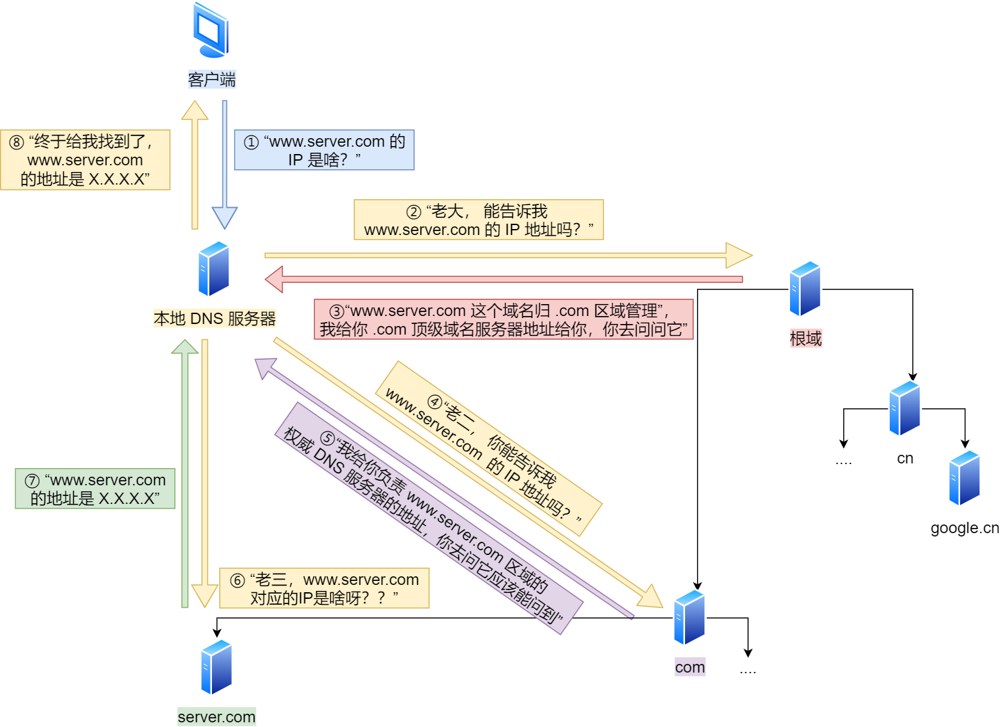

#### TCP

- TCP头部主要包括
  - **源端口号**和**目的端口号**。
  - **包的序号**：解决包乱序的问题。
  - **确认号**：确认对方是否收到，没有则重发，直到送达，解决丢包问题。
  - **状态位**：`SYN`是发起连接，`ACK`是回复，`RST`是重新连接，`FIN`是结束连接。带状态位的包发送后，会引起双方状态的变更。
  - **窗口大小**：通信双方各声明一个窗口（缓存大小）标识自己当前的处理能力，进行**流量控制**。

- TCP传输数据前要**三次握手**建立连接，保证**双方都有发送和接收的能力**。

  > 所谓的连接，只是双方计算机里维护一个状态机，建立连接过程中，双方的状态发生变化

  1. 客户端和服务端都处于`CLOSED`状态。
  2. 服务端主动监听某个端口，处于`LISTEN`状态。
  3. 客户端主动发起连接`SYN`，处于`SYN-SENT`状态。
  4. 服务端收到发起的连接，返回`SYN`，并`ACK`客户端的`SYN`，处于`SYN-RCVD`状态。
  5. 客户端收到服务端的`SYN`和`ACK`后，发送对服务端的`SYN`的`ACK`，处于`ESTABLISHED`状态。
  6. 服务端收到客户端的`ACK`后，处于`ESTABLISHED`状态。

  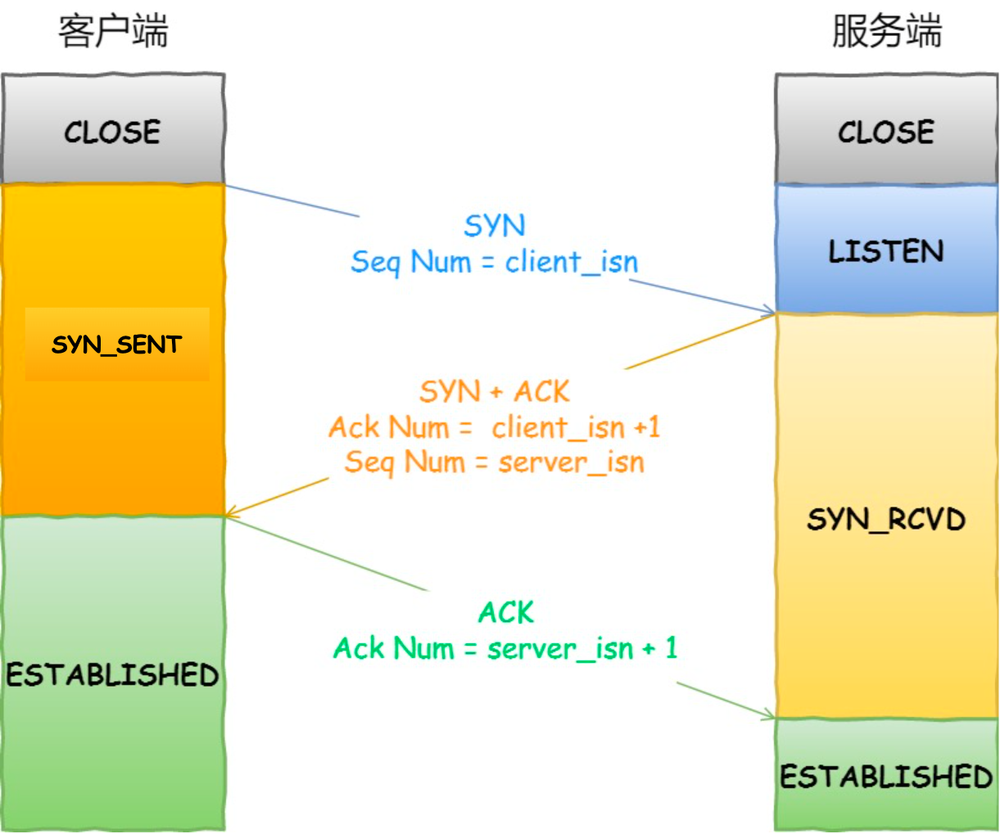

- TCP分割数据

  > MTU：一个网络包的最大长度，以太网中一般1500Bytes；MSS：除去IP和TCP头部后，一个网络包所能容纳的TCP数据的最大长度。

  - HTTP消息超过了`MSS`长度时，TCP会把数据拆解成一块块的数据。
  - 拆分出来的每块数据都放进单独的网络包中，即每块都有TCP头信息。

  

#### IP

- IP头部主要包括
  - **源IP地址**：客户端若存在多个网卡，则由目标IP地址和各个网卡的`Genmask`进行**与运算**，得到的结果与网卡的`Destination`匹配，相同则使用此网卡作为源IP（使用`ip addr show 网卡名称`命令查看）都匹配不到则使用默认网关（`Genmask`和`Destination`都是`0.0.0.0`），后续把包发给路由器（`Flags中有G标识的`，`GateWay`是路由器的IP地址）。详解参考[route命令用法](https://segmentfault.com/a/1190000039410494)。
  - **目标IP地址**：由DNS解析获得。
  - **协议号**（`06`表示TCP）。

#### MAC

- MAC头部主要包括

  - **接收方MAC地址**：通过ARP协议，先查询ARP缓存中是否有目标IP的MAC地址，没有在以太网中以广播的形式获取目标IP的MAC地址。

    > 获取到的一般都是网络路径中下一个节点（如网卡、路由器等节点）的MAC地址，到达节点后先去掉包中的MAC地址，再获取下一个节点的MAC地址，通过不断地转发到达目的地。

  - **发送方MAC地址**：写在网卡的ROM中（只读存储器，只能读出无法写入信息，信息一旦写入后就固定下来，即使切断电源，信息也不会丢失）。

  - **协议类型**：在TCP/IP通信里，MAC头部中的协议类型只有`0800`（IP协议）和`0806`（ARP协议）。

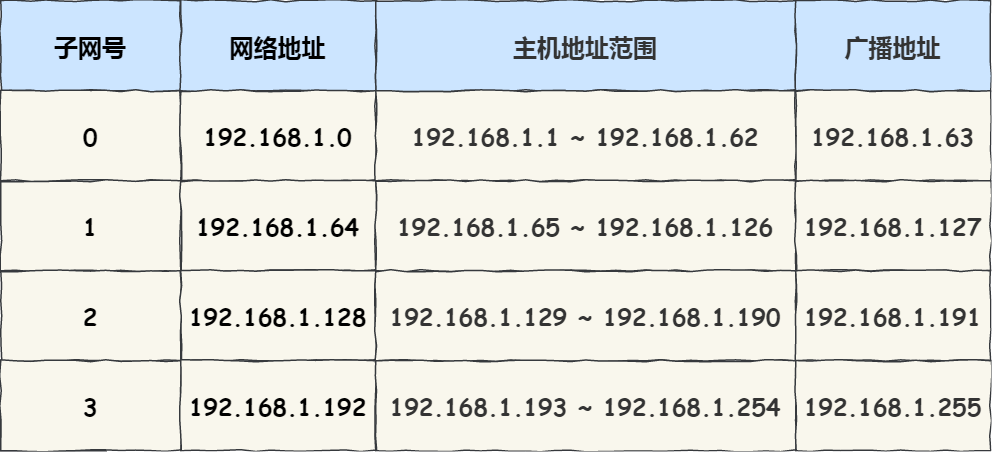

#### 网卡

- **网卡驱动程序**获取网络包后
  1. 核对接收方MAC地址，判断是否是发给自己的，是则将其复制到网卡内的缓存区中，不是则丢弃。
  2. 在开头加上**报头**和**起始帧分界符。**
  3. 在末尾加上**FCS**（用于检测错误的校验帧序列）。

- 网卡驱动程序控制**网卡**，将网络包这种**数字信号转换为电信号**，在网线上发出去。


#### 交换机

> 现在家里的路由器其实有了交换机的功能了。

交换机将网络包**原样**转发到目的地，工作在**MAC层**，称为**二层网络设备**。交换机不核对接收方的MAC地址，而是接收所有的包，因此交换机的端口不具有MAC地址。

1. 电信号到达网线接口，交换价中的模块接收后转换成数字信号。

2. 通过`FCS`校验错误，没错则放入缓冲区。

3. 查询包的接收方MAC地址是否在地址表中，在则发送到相应的端口中，不在则转发到除了源端口之外的所有端口上。目标设备收到包后会作出响应，交换机就会将它的MAC地址写入地址表，下次就不需要广播了。

   > 交换机的MAC地址表保存了设备的MAC地址和该设备连接在交换机的哪个端口上。
   >
   > 若接收方MAC地址是广播地址，则直接转发到除源端口的所有端口。MAC地址FF:FF:FF:FF:FF:FF和IP地址255.255.255.255属于广播地址。

4. 数据包离开交换机到达路由器后，就准备离开好离开子网了。

#### 路由器

路由器基于IP设计，称为**三层网络设备**，各个端口都具有MAC地址和IP地址。

1. 电信号到达网线接口，路由器中的模块接收后将电信号转成数字信号并通过`FCS`进行校验。
2. 核对接收方MAC地址判断是否是发给自己的，是则放入缓冲区，不是则丢弃。
3. 去掉包的MAC头部。
4. 根据IP头部的目标IP地址，查找路由表得到转发目标。
5. 若转发目标的网关是IP地址，则此IP就是要转发的目标地址，继续转发；若网关是空，则说明到达目的地了。
6. 继续转发时，也是根据上一步获得的IP通过ARP查询接收方的MAC地址，加上MAC包头后转成电信号发送出去，通过交换机到达下一个路由器。

> 在网络包传输的过程中，**源 IP 和目标 IP 始终是不会变的，一直变化的是 MAC 地址**，因为需要 MAC 地址在以太网内进行**两个设备**之间的包传输。

#### 目的地服务器

数据包到达服务器后，服务器会查看MAC头部判断是否是发给自己的，是就接收，然后一层一层去掉头部。

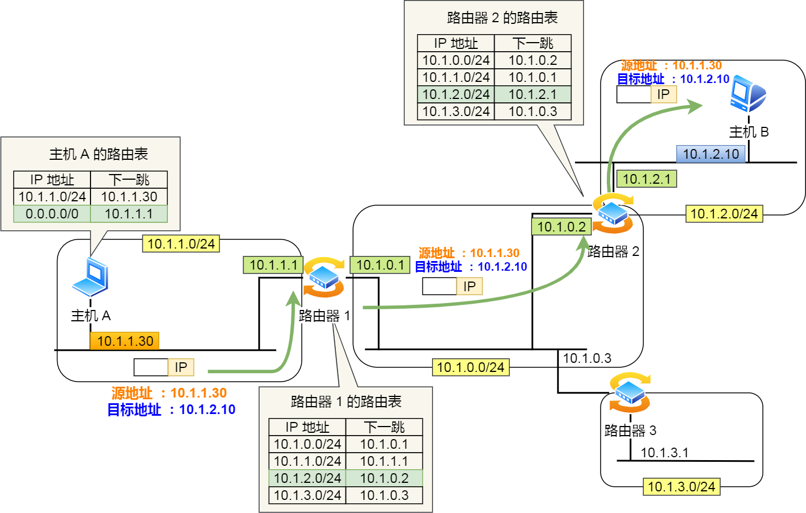

### Linux网络

#### 网络模型

国际标准化组织制定了7层OSI网络模型，分别是应用层、表示层、会话层、传输层、网络层、数据链路层、物理层。

但OSI模型太复杂，也只是概念上的分成，比较常见且使用的是四层模型，即TCP/IP网络模型，Linux就是按照这套模型实现网络协议栈的。

#### 网络协议栈

网络模型的每一层都会对数据包进行封装，即添加各自的协议头，网络包的大小就会增大。以太网中规定MTU是1500Bytes，即单次传输的最大IP包的大小。网络包超过MTU的大小后就会分片，所以MTU越小，需要的分片就越多，网络的吞吐能力就越差。

Linux的网络协议栈如下图

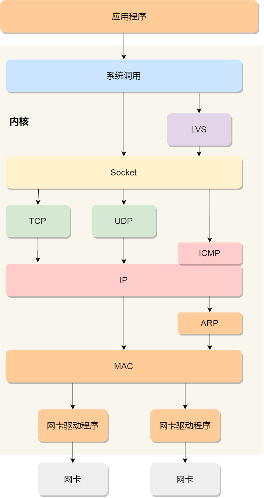

Linux接收网络包流程

Linux发送网络包流程

## HTTP篇

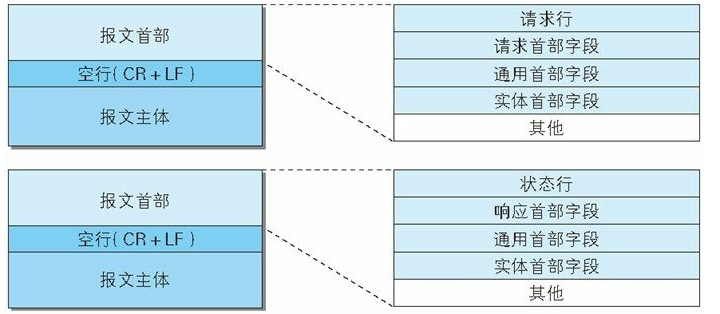

请求行：`方法 URI HTTP版本`；响应行：`HTTP版本 状态码 原因短语`

### 基本认识

- HTTP是什么？

  > HTTP是超文本传输协议，HyperText Transfer Protocol。HTTP是一个在计算机世界里专门在**两点之间传输**文字、图片、音频、视频等**超文本数据**的**约定和规范**。


- HTTP常见的状态码有哪些？

  > - 1xx属于**提示信息**，是协议处理中的一种**中间状态**，还需要后续的操作，实际用的较少。
  >
  > - 2xx表示服务器**成功**处理了客户端的请求。
  >
  >   - `200 OK`表示一切正常，如果是非`HEAD`请求，响应都会有body数据。
  >   - `204 No Centent`含义和`200 OK`相同，但响应没有body数据。
  >   - `206 Partial Content`用于HTTP分块下载或断点续传，表示body数据只是资源的一部分，也表示成功。
  >
  > - 3xx表示客户端请求的资源发生了变动，需要客户端用新的URL重新发送请求获取资源，即**重定向**。
  >
  >   - `301 Moved Permanently`表示永久重定向，说明请求的资源已经不在了需要改用新的URL。
  >
  >   - `302 Found`、`307 Temporay Redirect`表示临时重定向，说明请求的资源还在，但暂时需要用另一个URL访问。
  >
  >     301、302、307都会在响应头里使用`Location`字段，指明要跳转的URL，浏览器会自动重新定向新的URL。
  >
  >   - `304 Not Modified`不具有跳转的含义，表示资源未修改，重定向已存在的缓存文件，告诉客户端可以继续使用缓存资源，用于缓存控制，称为缓存重定向。
  >
  > - 4xx表示客户端发送的**报文有误**，服务器无法处理。
  >
  >   - `400 Bad Request`表示客户端请求的报文有误，但只是个笼统的错误码。
  >   - `401 Unauthorised`表示认证失败。
  >   - `403 Forbidden`表示服务器禁止访问资源，并非客户端的请求出错。
  >   - `404 Not Found`表示请求的资源在服务器上未找到。
  >   - `405 Not Allowed`表示对于请求的资源，不允许使用请求行中指定的方法。
  >
  > - 5xx表示客户端的请求报文正确，但**服务器处理时内部发生了错误**。
  >
  >   - `500 Internal Server Error`表示服务器发生了错误，与400类似是个笼统的错误。
  >   - `501 Not Implemented`表示客户端请求的功能还不支持。
  >   - `502 Bad Gateway`表示访问服务器时网关或代理出现了错误。
  >   - `503 Service Unavailable`表示服务器无法响应客户端。

- HTTP常见首部字段有哪些？

  > - *Host*：客户端发送请求时，指定服务器的域名。
  > - *Content-Length*：服务器返回响应时，表示响应资源的数据长度。HTTP通过设置`CRLF`作为报文首部的边界，通过`Content-Length`字段作为报文主体的边界，以此解决TCP的粘包问题。
  > - *Connection*：用于客户端要求服务器使用HTTP长连接机制以便其他请求复用。HTTP/1.1的默认连接都是长连接，但为了兼容老版本，需要指定`Connection: Keep-Alive`。开启长连接后，只要没有一端提出断开连接，TCP连接就不会断开，客户端发送另一个请求时，会使用同一个TCP连接。当然如果一段时间内没有任何数据交互，服务端会主动断开这个连接。（注意：TCP Keepalive和HTTP Keep-Alive不一样）
  > - *Content-Type*：告诉客户端本次响应的数据是什么格式。`Content-Type: text/html; charset=utf-8`说明返回的数据是网页，且是utf-8编码。
  > - *Accept*：客户端请求时声明自己可以接受哪些数据格式。`Accept: */*`声明自己可以接受任何格式的数据。
  > - *Content-Encoding*：说明返回的数据用了什么压缩方法。eg：`Content-Encoding: gzip`。
  > - *Accept-Encoding*：客户端请求时声明可以接受哪些压缩方法。eg：`Accept-Encoding: gzip, deflate`。

- GET、POST、PUT、PATCH有什么区别？

  > 

- GET和POST方法都是安全幂等的吗？

  > 安全：请求方法不会**破坏**服务器上的资源。
  >
  > 幂等：多次执行相同的操作，结果都是**相同**的。
  >
  > - GET是只读操作，因此是**安全且幂等**的，可以被浏览器**缓存**（彻底避免浏览器发请求）或被代理缓存。
  > - POST是根据请求的负载（报文主体）新增或修改数据，会修改服务器上的资源，且多次提交会多次创建或修改，因此是**不安全且不幂等**的。
  >
  > 以上只是RFC的规范，GET可以带body，可以实现新增或删除资源；POST的URL中可以有query string，可以实现查询数据的请求。

- HTTP缓存有哪些实现方式？

  > 对于一些具有重复性的HTTP请求，比如每次请求得到的数据都一样，可以把这对请求-响应的数据缓存在本地，下次直接读取本地的数据。分为**强制缓存**和**协商缓存**。

- 什么是强制缓存？

  > 只要浏览器判断缓存没有过期，则直接使用浏览器的本地缓存，决定是否使用缓存的主动性在浏览器。状态码右边的size标识中是`from disk cache`或`from memory cache`的话就是使用了强制缓存。
  >
  > 强制缓存利用`Cache-control`(相对时间)或`Expires`(绝对时间)首部字段来标识资源缓存的有效期，都有的话则`Cache-control`的优先级更高，且它的选项更多、设置更精细，一般用它来实现强制缓存。
  >
  > 具体的流程：
  >
  > 1. 浏览器第一次请求时，服务器返回资源时在响应首部用Cache-Control设置过期时间。
  > 2. 浏览器再次请求该资源时，先**比较请求资源的时间是否超过Cache-control设置的过期时间**，没有则使用缓存，否则重新请求。
  > 3. 服务器再次收到请求后，更新Cache-Control的过期时间。

- 什么是协商缓存？

  > 与服务端协商后，通过协商结果判断是否使用本地缓存，若服务器返回`304`状态码，则使用缓存，否则重新请求。
  >
  > 协商缓存利用两个首部字段实现：
  >
  > - 请求首部`If-Modified-Since`，当资源过期后，浏览器发现响应首部有`Last-Modified`，则再次请求时把`If-Modified-Since`的值设为`Last-Modified`的值，服务器收到后发现请求首部有`If-Modified-Since`，则与被请求资源的最后修改时间进行对比，若最后修改时间较新，说明资源修改过，返回`200 OK`、新的修改时间和新资源；若最后修改时间较旧，说明资源无修改，返回空body和`304 Not Modified`。
  > - 响应首部`Last-Modified`表示响应资源最后的修改时间。
  >
  > 或者利用另外两个首部字段实现：
  >
  > - `If-None-Match`，当资源过期后，浏览器发现响应首部有`Etag`，则再次请求时把`If-None-Match`的值设为`Etag`的值，服务端收到请求后发现首部有`If-None-Match`则进行对比，如果资源未修改返回`304`，已修改返回`200`、新的`Etag`和新资源。
  > - `Etag`用来唯一标识响应的资源。

- 缓存补充

  > 若响应的首部中Etag和Last-Modified都有，则再次请求时会都带上，这时**Etag的优先级更高**，因为：
  >
  > - Etag基于标识实现，比基于时间实现的Last-Modified更准确，避免由于时间篡改导致的不可靠问题。
  > - If-Modified-Since能检查的粒度是秒级的，若文件在秒级以内被修改则无法发现。
  > - 一些服务器不能精确获取文件最后的修改时间。
  >
  > **协商缓存的字段都要配合强制缓存的Cache-control使用，只有强制缓存过期的时候，才能发起带有协商缓存字段的请求。**
  >
  > 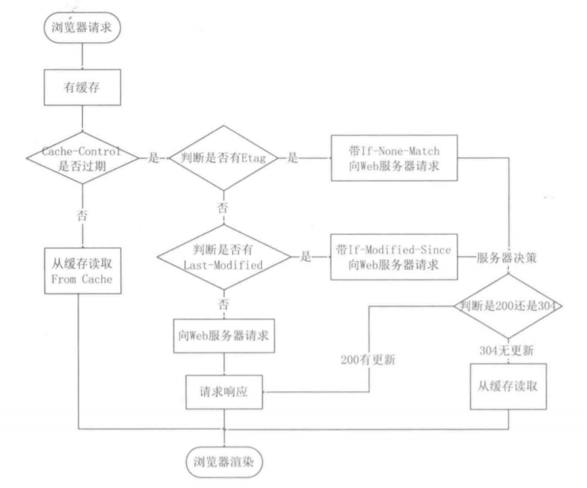

- HTTP/1.1的优点有哪些？

  > - *简单*：报文格式基于报文首部和报文主体，首部字段也是键值对的形式，**易于理解**。
  > - *灵活且易于扩展*：HTTP协议中的要求没有被固定死，允许开发人员**自定义和扩充**；HTTP位于应用层，**下层可以随意变化**（如HTTPS就在TCP上加了SSL/TLS层；HTTP/3就把TCP改成了UDP）。
  > - *应用广泛且跨平台*

- HTTP/1.1的缺点有哪些？

  > - *无状态*：是一把双刃剑，**好处**是服务器**不需要额外的资源**记录状态信息，减轻CPU和内存负担；**坏处**是在完成有关联性的操作时会非常麻烦，因为服务器没有记忆能力。
  > - *明文传输*：是一把双刃剑，好处是方便阅读，为抓包调试带来了极大的便利性；坏处是信息很容易被窃取。
  > - *不安全*：**通信明文**，内容可能被窃听；**不验证通信方身份**，可能遭遇伪装；**无法证明报文完整性**，内容可能遭篡改。

- 什么是cookie和token？

  > - cookie：客户端第一次请求时，服务器会创建session并下发带有sessionID的cookie（响应头中设置`set-cookie: value[; expires=date][; domain=domain][; path=path][; secure]`），服务器把cookie保存在数据库或redis中，后续客户端请求服务器时带上这个cookie，服务器校验cookie来辨别用户。
  >
  > - jwt token：`header.claim/payload.signature`格式的字符串
  >
  >   - `header`固定为**{"alg":"加密算法","typ":"token类型"}**。
  >   - `claim/payload`中是用户信息和过期时间。
  >   - `signature`是把`header`和`claim/payload`分别base64编码后再加盐加密得到。
  >   - 以上三部分再分别经过base64编码后用`.`隔开，得到token字符串。
  >   - 第一次请求时由服务器下发，但服务器不保存，后续请求时客户端带上，服务器收到后先解码得到claim/payload中保存的用户信息，再根据这个信息加密生成signature，然后和客户端发来的signature比较，若一致则校验通过。
  >
  > - jwt token+refresh token：jwt token一旦签发则在过期时间内一直可用，服务端无法控制其过期时间或对其进行禁用。通过引入refresh token可用进行改进，refresh token需要由服务端保存在redis或数据库中。
  >
  >   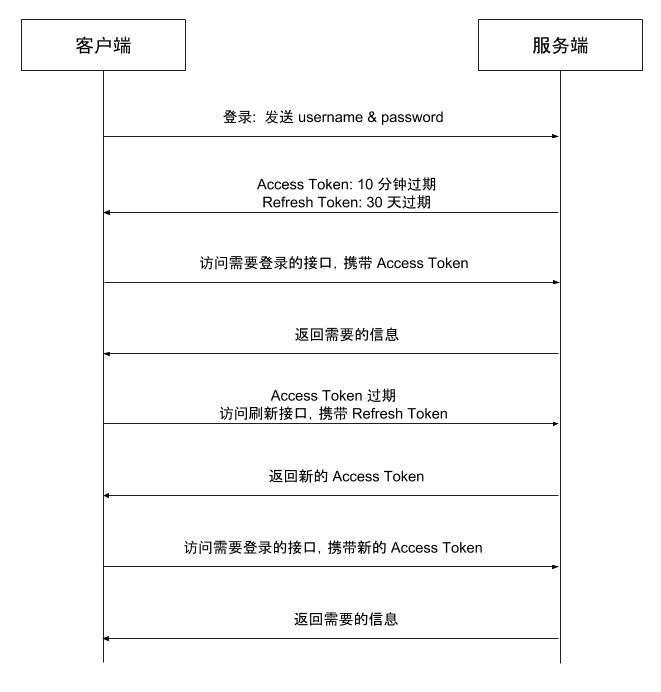

- HTTP/1.1的性能如何？

  > HTTP/1.1通过以下方式提升性能
  >
  > - *长连接*，避免了重复建立和端口TCP连接造成的额外开销。
  > - *管道网络传输*，请求发出后不用等待响应就可以发送后续的请求出去，可以减少整体的响应时间，即**解决了请求的队头阻塞**。但服务端必须按照接收请求的顺序发送响应，因此**没有解决响应队头阻塞**。（实际上HTTP/1.1管道化技术不是默认开启，而且浏览器基本都没有支持）
  > - *队头阻塞*，请求-应答的模式加剧了性能问题，一个请求被阻塞后，后面的请求都收不到响应。

- HTTP与HTTPS有哪些区别？

  > - HTTPS在TCP和HTTP之间加入了**SSL/TLS层**，使报文能够加密传输。
  > - HTTPS在TCP三次握手之后还要进行**SSL/TLS握手**，才可进入加密报文传输。
  > - HTTP默认端口80，HTTPS默认端口**443**。
  > - HTTPS需要向CA机构申请**数字证书**，来保证服务器的身份是可信的。

- HTTPS使用什么方式解决了HTTP的哪些问题？

  > - *混合加密*：采用对称加密和非对称加密结合的混合加密方式，解决了被窃听的风险。（下图第5步只传输用key加密后的密文，key分别保存在客户端和服务端本地）
  >
  >   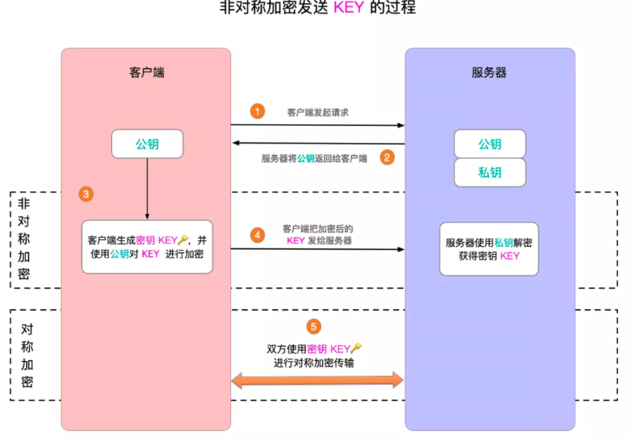
  >
  > - *摘要算法+数字签名*：用摘要算法（哈希函数）计算内容的哈希值，此值唯一且无法用值反推内容。对哈希值使用私钥加密得到数字签名后和内容一起发送，接收方用公钥解密，若能解出，则说明消息是来源于持有私钥的一方（保证消息的来源可靠性）。接收方用同样的哈希算法对内容进行计算，比较计算出的哈希值和用公钥解密出的哈希值，一致则说明内容未被篡改（保证消息的完整性）。
  >
  > - *数字证书*：如果公私钥被伪造并用伪造的私钥加密内容，接收方只能拿到伪造的公钥后解密，则会认为内容无误且来源可靠。因此服务器需要把真正的公钥注册到CA（数字证书认证机构），CA颁发数字证书给服务器。接收方收到服务器的证书后，用CA的公钥（内置在浏览器或OS中）确认证书是否是注册到CA的。解决了身份被伪造的风险。（详解见数字证书的流程？）

- HTTPS是如何建立连接的？其间交互了什么？

  > HTTPS需要先建立TCP连接，然后TLS握手后，才能建立通信安全的连接。
  >
  > 细节详见HTTPS RSA握手和HTTPS ECDHE握手。

- 数字证书的流程？

  > CA签发证书流程：
  >
  > 1. CA把服务器的公钥、用途、颁发者、有效时间等信息打包，再进行Hash计算得到Hash值。
  > 2. CA用自己的私钥将Hash值加密，生成Certificate Signature，即CA对证书做了签名。
  > 3. 将Certificate Signature添加在证书上颁发给服务器。
  >
  > 客户端校验证书流程：
  >
  > 1. 客户端使用同样的Hash算法获取证书的Hash值H1。
  > 2. 客户端使用浏览器或OS内置的CA公钥对收到的服务器证书的Certificate Signature进行解密，得到Hash值H2。
  > 3. 比较H1和H2，相同则证书可信赖。
  >
  > 实际过程中存在证书信任链，即CA颁发的证书并不是最终的证书。这是为了保证根证书的绝对安全性，将根证书隔离地越严格越好，否则根证书如果失守，整个信任链都会有问题。
  >
  > 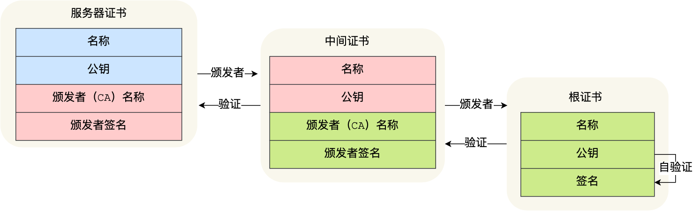

- HTTPS的应用数据是如何保证完整性的？

  > 通过**握手协议**和**记录协议**保证，位于下层的记录协议负责进行加密传输，而位于上层的握手协议则负责TLS四次握手，记录协议完成后，最终的报文数据将传递到TCP层进行传输。。详解见[理解SSL/TLS系列 (四) 记录协议](https://blog.csdn.net/zhanyiwp/article/details/105627799)

- HTTPS一定安全可靠吗？

  > 如果有假基站转发了全部信息给中间服务器，中间服务器与真正的服务器完成TLS握手，则中间服务器可以解密请求和响应的内容。不过证书仍然是伪造的，浏览器能识别出是非法的，就会提醒证书存在问题。所以，**HTTPS 协议本身到目前为止还是没有任何漏洞的，即使你成功进行中间人攻击，本质上是利用了客户端的漏洞（用户点击继续访问或者被恶意导入伪造的根证书），并不是 HTTPS 不够安全**。

- HTTP/2做了哪些优化？

  > - 头部压缩，使用HPACK算法在客户端和服务器同时维持一张头信息表，所有字段都在此表中，传输时只传输字段在表中的索引号。
  > - 报文采用二进制格式（头信息帧和数据帧）便于计算机解析。
  > - 并发传输，1个TCP连接中有多个Stream，1个Stream包含多个Message（请求或响应），1个Message包含多个帧（二进制的报文），每个Stream有独一无二的ID，不同Stream的帧可以乱序发送，接收端通过StreamID有序组装成HTTP消息。
  > - 服务器推送，和websocket的区别在于：websocket是主动推送，建立的是双向的实时通信；而http/2的推送只有在收到客户端的请求后才能推送。

- HTTP/3做了哪些优化？

  > 使用基于UDP的QUIC协议，无队头阻塞，更快地建立连接，连接迁移。

### HTTP/1.1优化

- 尽量避免发送HTTP请求：**缓存**技术。
- 在需要发送HTTP请求时，尽量减少请求次数：将**重定向交给代理服务器**完成以减少重定向的次数；把多个访问小文件的请求**合并成大请求**（如CSS精灵图）；延迟发送请求，当用户下**滑页面时再**向服务器获取接下来的资源。
- 减少服务器的HTTP响应的数据大小：**压缩**技术
  - 无损压缩：gzip，deflate，br（谷歌的Brotli），适用于文本、可执行文件。源代码等。
  - 有损压缩：舍弃次要的数据来提高压缩比，适用于多媒体文件。通过Accept字段的**q质量因子**告诉服务器期望的资源质量。`Accept: audio/*; q=0.2, audio/basic`。目前压缩比较高的是Google的**WebP**格式。

### HTTPS RSA握手

1. 第一次握手：客户端发送**Client Hello**，携带客户端使用的TLS版本号、支持的密码套件列表、生成的**随机数（Client Random）**，这个随机数会被服务端保留。

   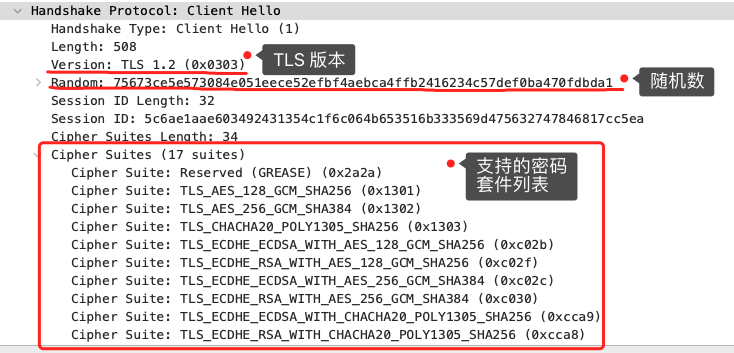

   > 密码套件：基本的形式是*协议名称\_密钥交换算法\_签名算法\_WITH\_对称加密算法\_密钥长度\_分组模式\_摘要算法*。
   >
   > Cipher Suite: TLS_RSA_WITH_AES_128_GCM_SHA256（WITH左边只有一个算法，则密钥交换和签名都用RSA；对称加密算法是握手后使用的加密算法）

2. 第二次握手：

   - 服务端发送**Server Hello**，携带服务器确认支持的TLS版本号、选择的密码套件列表、生成的**随机数（Server Random）**。

     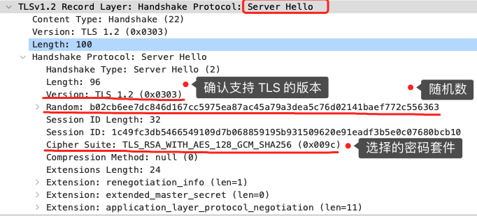

   - 服务端发送**Certificate**，包含服务器的**证书**。

     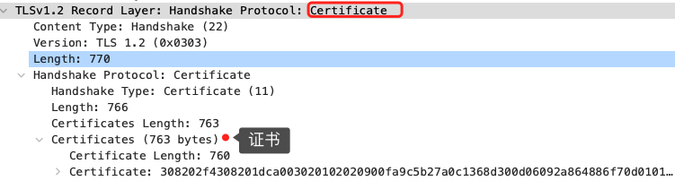

   - 服务端发送**Server Hello Done**，告诉客户端Hello完成。

     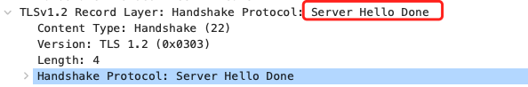

3. 第三次握手：

   - 客户端收到Certificate后，验证服务端的证书是否可信（详解见*常见面试题：数字证书的流程？*）。

   - 客户端发送**Client Key Exchange**，包含客户端生成的用服务端的RSA**公钥加密**后的新**随机数（pre-master）**。

     

   - 双方根据三个随机数，生成**会话密钥（Master Secret）**。

   - 客户端发送**Change Cipher Spec**，告知服务端开始用对称加密方式发送消息。

     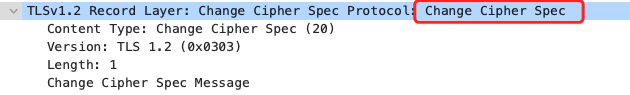

   - 客户端发送**Encrypted Handshake Massage**，对之前的数据做个**摘要**并用会话密钥加密，服务器收到后验证加密通信是否可用及之前的握手信息是否被篡改过。

     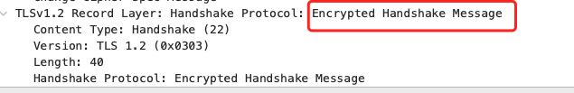

4. 第四次握手：服务端发送**Change Cipher Spec**和**Encrypted Handshake Massage**，如果双方都验证加密和解密没问题，那么握手正式完成。

5. 双方使用会话密钥加解密HTTP请求和响应。

> RSA握手的缺陷：服务端的私钥固定，一旦泄露，之前被截获的TLS密文都会被破解。

### HTTPS ECDHE握手

> - 离散对数：a<sup>i</sup>(mod p) = b，a是底数，i是对数，p是模数，b是真数。当p是很大的质数时，以当前的计算机很难由真数b推导出对数i。
> - DH算法：客户端的公钥A=g<sup>a</sup>(mod p)，服务端的公钥B=g<sup>b</sup>(mod p)。g和p是算法的公共参数（公开的），a和b是各自的私钥。双方交换公钥后，根据理算对数幂运算的交换律，客户端进行运算B<sup>a</sup>(mod p)得到K，服务端进行运算A<sup>b</sup>(mod p)得到K，K即为对称加密的会话密钥。
> - DHE算法：双方的私钥在每次交换通信时都是随机生成的、临时的，E是ephemeral。
> - ECDHE算法：利用ECC椭圆曲线特性，用更少的计算量计算出公钥和会话密钥。客户端的公钥A=aG，服务端的公钥B=bG，使用哪种椭圆曲线和曲线上的基点G是公共参数。双方交换公钥后，客户端计算点(x1,y1)=aB，服务端计算点(x2,y2)=bA，根据椭圆曲线上交换律和结合律，aB=abG=baG=bA，因此点x的坐标是一样的，它就是会话密钥。

1. 第一次握手：客户端发送**Client Hello**，携带客户端使用的TLS版本号、支持的密码套件列表、生成的**随机数（Client Random）**。

   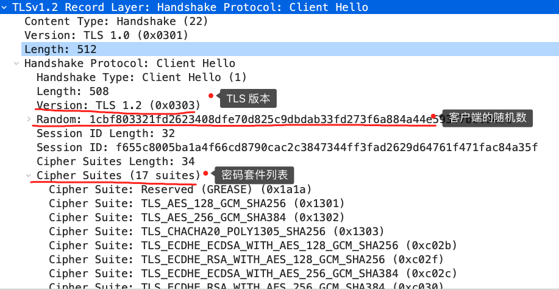

2. 第二次握手

   - 服务端发送**Server Hello**，携带服务器确认支持的TLS版本号、选择的密码套件列表、生成的**随机数（Server Random）**。

     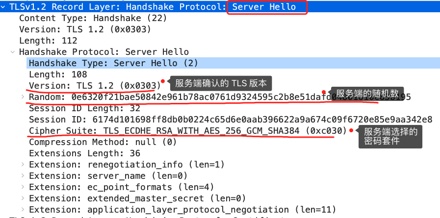

   - 服务端发送**Certificate**，包含服务器的**证书**。

     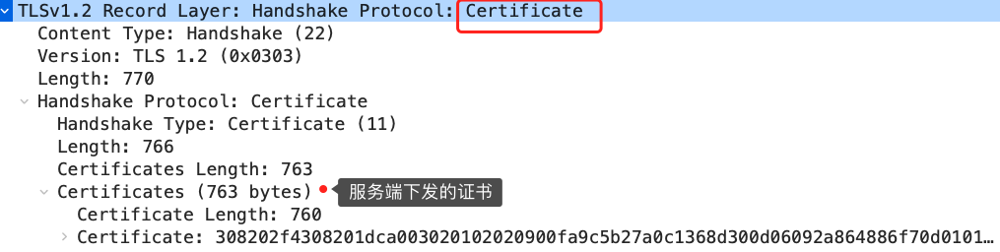

   - 服务端发送**Server Key Exchange**，这个过程中服务器做了三件事

     - 选择椭圆曲线类型，包含椭圆曲线的基点G。
     - 生成**随机数**作为服务端**椭圆曲线的私钥**，保留本地。
     - 根据基点G和私钥计算出服务端的**椭圆曲线公钥**。
     - 用签名算法给服务端的椭圆曲线公钥做**签名**。

     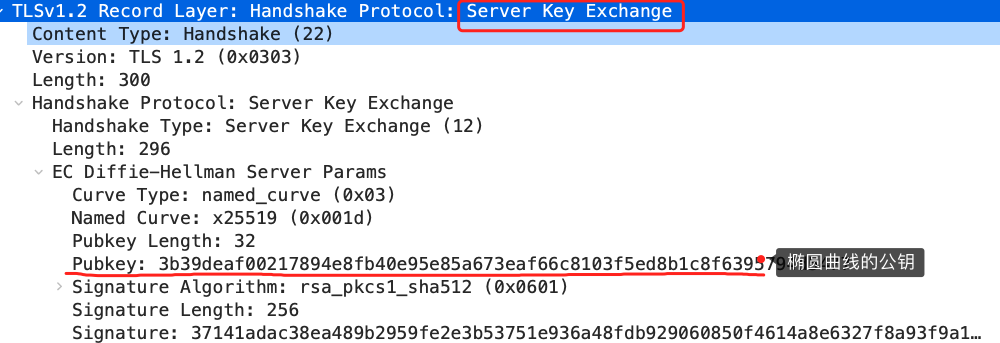

   - 服务端发送**Server Hello Done**。

     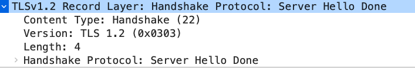

3. 第三次握手：

   - 客户端发送**Client Key Exchange**，这个过程中客户端做了三件事
     - 验证服务端的证书是否合法。
     - 生成**随机数**作为客户端**椭圆曲线的私钥**，保留本地。
     - 根据发来的基点G和私钥计算出客户端的**椭圆曲线公钥**。

     

   - 双方根据对方的公钥、各自的私钥、椭圆曲线基点G计算出点(x,y)，其中x的坐标双方都都一样。再由**Client Random+Server Random+x**共同生成会话密钥。（TLS设计者不信任计算机伪随机数的可靠性，需要三个结合。）

   - 客户端发送**Change Cipher Spec**，告知服务端开始用对称加密方式发送消息。

     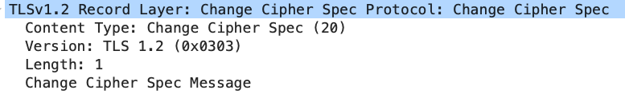

   - 客户端发送**Encrypted Handshake Massage**，对之前的数据做个**摘要**并用会话密钥加密，服务器收到后验证加密通信是否可用及之前的握手信息是否被篡改过。

     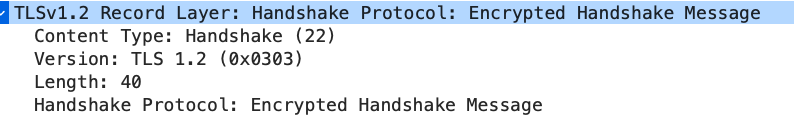

4. 服务端发送**Change Cipher Spec**和**Encrypted Handshake Massage**，如果双方都验证加密和解密没问题，那么握手正式完成。

5. 双方使用会话密钥加解密HTTP请求和响应。

### RSA和ECDHE区别

- RSA密钥协商算法不支持前向保密，ECDHE密钥协商算法支持前向保密。
- 使用了RSA密钥协商算法，TLS完成四次握手后，才能进行应用数据传输；而对于ECDHE算法，客户端可以不用等服务端的最后一次TLS握手，就可以**提前发出加密的HTTP数据**（`TLS False Start`，抢跑），节省了一个消息的往返时间（这个是 RFC 文档规定的，具体原因文档没有说明）。
- 使用ECDHE， 在TLS第2次握手中，会出现服务器端发出的Server Key Exchange消息，而RSA握手过程没有该消息。

### HTTPS优化

> HTTPS相比HTTP多了TLS握手过程，目的是通过非对称加密握手来协程或交换出对称加密密钥，最多可以花费2 RTT（Round-Trip Time，消息往返时间），且后续都要用对称加密密钥来加解密。因此HTTPS的优化非常重要。

- *性能损耗*：TLS握手不仅增加网络延时（最大2 RTT），且图中暖色部分也会产生性能损耗。

  

- *硬件优化*：HTTPS是**计算密集型**，不是I/O密集型，因此需要提高CPU性能，且尽可能选择**支持AES-NI特性的CPU**（在指令级别优化了AES算法）。若CPU不支持该特性，则尽可能选择**ChaCha20**对称加密算法，此算法的指令运算和AES更友好。

- *软件优化*：升级Linux内核，升级OpenSSL等。

- *协议优化*

  - 优先选择ECDHE算法，比RSA效率和安全性都高；椭圆曲线尽量选x25519曲线，是目前最快的椭圆曲线；对称加密算法选AES_128_GCM，比AES_256_GCM快。

    > nginx可以通过
    >
    > `ssl_ecdh_curve X25519:secp384r1;`配置椭圆曲线集合
    >
    > `ssl_ciphers 'EECDH+ECDSA+AES128+SHA:RSA+AES128+SHA;'`配置加密算法集合。

  - 把TLS的版本从1.2升级到1.3，握手只要1 RTT（把hello消息和公钥交换消息合并成一个消息且废除了不支持前向安全性的RSA和DH算法，只支持ECDHE算法）。

- *证书优化*：客户端验证证书时，为了判断证书是否被吊销，需要访问CA下载CRL（*Certificate Revocation List*，证书吊销列表，由CA定期更新，实时性差，且吊销证书增多后下载会慢）或OCSP（*Online Certificate Status Protocol*，在线证书状态协议，向CA发送查询请求，CA返回证书的有效状态）。可以使用**OCSP Stapling**，服务器周期性地向CA查询证书状态，获得一个带有时间戳和签名的响应并缓存它，在TLS握手过程中把它发给客户端，且由于有签名的存在，服务器无法篡改。

- *会话复用*：对于重连 HTTPS 时，我们可以使用一些技术让客户端和服务端使用上一次 HTTPS 连接使用的会话密钥，直接恢复会话，而不用再重新走完整的 TLS 握手过程。常见的会话重用技术有 **Session ID** 和 **Session Ticket**，用了会话重用技术，当再次重连 HTTPS 时，只需要 1 RTT 就可以恢复会话。对于 TLS1.3 使用 **Pre-shared Key** 会话重用技术，只需要 0 RTT 就可以恢复会话。这些会话重用技术虽然好用，但是存在一定的安全风险，它们不仅不具备前向安全，而且有重放攻击的风险，所以应当对会话密钥设定一个**合理的过期时间**。

### RPC

- RPC是一种调用方式，不是协议，一般基于TCP实现，也可基于HTTP、UDP实现，著名的实现方式有gRPC（底层使用HTTP/2）、thrift。
- RPC需要知道服务器的IP和端口才能建立连接，因此需要有中间服务来保存服务器名和IP信息，如consul、etcd、redis等。DNS也是服务发现的一种，如CoreDNS就是基于DNS实现的服务发现组件。

### WebSocket

## TCP篇

### 基本认识

- TCP头主要有哪些字段？

  > - 源端口、目的端口
  > - 序列号：建立连接时由计算机生成的随机数作为初始值，通过SYN包传给接收端。每发送一次数据就累加一次。用来**解决网络包乱序问题**。
  > - 确认应答号：发送端收到确认应答后会认为这个序号以前的数据都正常接收，ACK置为1时此字段才有效。用来**解决丢包问题**。（一般是序列号+报文长度）
  > - 控制位：
  >   - *ACK*：该位为 `1` 时，「确认应答号」的字段变为有效，TCP 规定除了最初建立连接时的 `SYN` 包之外该位必须设置为 `1` 。
  >   - *RST*：该位为 `1` 时，表示 TCP 连接中出现异常必须强制断开连接。
  >   - *SYN*：该位为 `1` 时，表示希望建立连接，并在其「序列号」的字段进行序列号初始值的设定。
  >   - *FIN*：该位为 `1` 时，表示今后不会再有数据发送，希望断开连接。当通信结束希望断开连接时，通信双方的主机之间就可以相互交换 `FIN` 位为 1 的 TCP 段。
  > - 窗口大小：用于流量控制。
  > - 校验和：检验包是否受损。
  > - 首部长度：TCP头的长度（TCP有可变长的*选项*字段）。
  >
  > 

- 为什么需要 TCP 协议？ TCP 工作在哪一层？

  > `IP` 层是「不可靠」的，它不保证网络包的交付、不保证网络包的按序交付、也不保证网络包中的数据的完整性。如果需要保障网络数据包的可靠性，那么就需要由上层（传输层）的 `TCP` 协议来负责。
  >
  > 因为 TCP 是一个工作在**传输层**的**可靠**数据传输的服务，它能确保接收端接收的网络包是**无损坏、无间隔、非冗余和按序的。**

- 什么是TCP？

  > TCP 是**面向连接的、可靠的、基于字节流**的传输层通信协议。
  >
  > - **面向连接**：一定是「一对一」才能连接，不能像 UDP 协议可以一个主机同时向多个主机发送消息，也就是一对多是无法做到的；
  > - **可靠的**：无论的网络链路中出现了怎样的链路变化，TCP 都可以保证一个报文一定能够到达接收端；
  > - **字节流**：用户消息通过 TCP 协议传输时，消息可能会被操作系统「分组」成多个的 TCP 报文，如果接收方的程序如果不知道「消息的边界」，是无法读出一个有效的用户消息的。并且 TCP 报文是「有序的」，当「前一个」TCP 报文没有收到的时候，即使它先收到了后面的 TCP 报文，那么也不能扔给应用层去处理，同时对「重复」的 TCP 报文会自动丢弃。

- 什么是TCP连接？

  > **用于保证可靠性和流量控制维护的某些状态信息，这些信息的组合，包括Socket、序列号和窗口大小称为连接。**
  >
  > - **Socket**：由 IP 地址和端口号组成
  > - **序列号**：用来解决乱序问题等
  > - **窗口大小**：用来做流量控制

- 如何唯一确定一个TCP连接？

  > TCP 四元组可以唯一的确定一个连接，四元组包括如下：
  >
  > - 源地址、目的地址：32位，在 IP 头部中，作用是通过 IP 协议发送报文给对方主机。
  > - 源端口、目的端口：16位，在 TCP 头部中，作用是告诉 TCP 协议应该把报文发给哪个进程。

- 服务端TCP的最大连接数是多少？

  > 理论值计算公式：最大TCP连接数=客户端IP数*客户端的端口数。对 IPv4，客户端的 IP 数最多为 `2` 的 `32` 次方，客户端的端口数最多为 `2` 的 `16` 次方，也就是服务端单机最大 TCP 连接数，约为 `2` 的 `48` 次方。
  >
  > 当然，服务端最大并发 TCP 连接数远不能达到理论上限，会受以下因素影响：
  >
  > - **文件描述符限制**，每个 TCP 连接都是一个文件，如果文件描述符被占满了，会发生 too many open files。Linux 对可打开的文件描述符的数量分别作了三个方面的限制：
  >   - **系统级**：当前系统可打开的最大数量，通过 cat /proc/sys/fs/file-max 查看；
  >   - **用户级**：指定用户可打开的最大数量，通过 cat /etc/security/limits.conf 查看；
  >   - **进程级**：单个进程可打开的最大数量，通过 cat /proc/sys/fs/nr_open 查看；
  > - **内存限制**，每个 TCP 连接都要占用一定内存，操作系统的内存是有限的，如果内存资源被占满后，会发生 OOM。

- UDP是什么？

  > UDP 不提供复杂的控制机制，利用 IP 提供面向「无连接」的通信服务。
  >
  > UDP 协议非常简，头部只有 `8` 个字节（ 64 位），UDP 的头部格式如下：
  >
  > - 目标和源端口：主要是告诉 UDP 协议应该把报文发给哪个进程。
  > - 包长度：该字段保存了 UDP 首部的长度跟数据的长度之和。
  > - 校验和：校验和是为了提供可靠的 UDP 首部和数据而设计，防止收到在网络传输中受损的 UDP包。
  >
  > 

- TCP和UDP有什么区别？

  > *1. 连接*
  >
  > - TCP 是面向连接的传输层协议，传输数据前先要建立连接。
  > - UDP 是不需要连接，即刻传输数据。
  >
  > *2. 服务对象*
  >
  > - TCP 是一对一的两点服务，即一条连接只有两个端点。
  > - UDP 支持一对一、一对多、多对多的交互通信
  >
  > *3. 可靠性*
  >
  > - TCP 是可靠交付数据的，数据可以无差错、不丢失、不重复、按序到达。
  > - UDP 是尽最大努力交付，不保证可靠交付数据。但是我们可以基于 UDP 传输协议实现一个可靠的传输协议，比如 QUIC 协议，具体可以参见这篇文章：[如何基于 UDP 协议实现可靠传输？](https://xiaolincoding.com/network/3_tcp/quic.html)
  >
  > *4. 拥塞控制、流量控制*
  >
  > - TCP 有拥塞控制和流量控制机制，保证数据传输的安全性。
  > - UDP 则没有，即使网络非常拥堵了，也不会影响 UDP 的发送速率。
  >
  > *5. 首部开销*
  >
  > - TCP 首部长度较长，会有一定的开销，首部在没有使用「选项」字段时是 `20` 个字节，如果使用了「选项」字段则会变长的。
  > - UDP 首部只有 8 个字节，并且是固定不变的，开销较小。
  >
  > *6. 传输方式*
  >
  > - TCP 是流式传输，没有边界，但保证顺序和可靠。
  > - UDP 是一个包一个包的发送，是有边界的，但可能会丢包和乱序。
  >
  > *7. 分割方式不同*
  >
  > - TCP 的数据大小如果大于 MSS 大小，则会在传输层进行分段，目标主机收到后，也同样在传输层组装 TCP 数据包，如果中途丢失了一个分片，只需要传输丢失的这个分片。
  > - UDP 的数据大小如果大于 MTU 大小，则会在 IP 层进行分片，目标主机收到后，在 IP 层组装完数据，接着再传给传输层。
  
- TCP和UDP的应用场景是？

  > - TCP经常用于FTP文件传输、HTTP/HTTPS
  > - UDP经常用于DNS、SNMP、音视频等多媒体通信、广播通信

- 为什么 UDP 头部没有「首部长度」字段，而 TCP 头部有「首部长度」字段呢？为什么 UDP 头部有「包长度」字段，而 TCP 头部则没有「包长度」字段呢？

  > TCP 有**可变长**的「选项」字段，而 UDP 头部长度则是**不会变化**的，无需多一个字段去记录 UDP 的首部长度。
  >
  > TCP的包长度可通过公式计算：`IP包长度-IP首部长度-TCP首部长度`；而UDP的包长度是冗余的，可能的原因是：但了为网络设备硬件设计和处理方便，首部长度需要是 `4`字节的整数倍，包长度是`2`字节；或当年的UDP不是基于IP的。

- TCP和UDP可以使用同一个端口吗？

  > 可以。传输层的「端口号」的作用，是为了区分同一个主机上不同应用程序的数据包。TCP 和 UDP在内核中是两个完全独立的模块。当主机收到数据包后，可以根据 IP 包头的「协议号」字段知道该数据包是 TCP/UDP，可以根据这个信息确定送给哪个模块，送给 TCP/UDP 模块的报文根据「端口号」确定送给哪个应用程序。

### 连接建立（三次握手）


0. 客户端和服务端都处于 `CLOSE` 状态。服务端主动监听某个端口，处于 `LISTEN` 状态。

1. 客户端会随机初始化序号（`client_isn`），将此序号置于 TCP 首部的「序号」字段中，同时把 `SYN` 标志位置为 `1` ，表示 `SYN` 报文。接着把第一个 SYN 报文发送给服务端，表示向服务端发起连接，该报文不包含应用层数据，之后客户端处于 `SYN-SENT` 状态。

   > MSS 位于`可选项`中, 假如对方不传 ,那么 MSS 默认为 : 536 byte 
   >
   > `isn`是初始序列号，`seq`是序列号

   

2. 服务端收到客户端的 `SYN` 报文后，首先服务端也随机初始化自己的序号（`server_isn`），将此序号填入 TCP 首部的「序号」字段中，其次把 TCP 首部的「确认应答号」字段填入 `client_isn + 1`, 接着把 `SYN` 和 `ACK` 标志位置为 `1`，`ACK`是对客户端`SYN`的确认，`SYN`是服务端发起连接，。最后把该报文发给客户端，该报文也不包含应用层数据，之后服务端处于 `SYN-RCVD` 状态。

   

3. 客户端收到服务端报文后，还要向服务端回应最后一个应答报文，首先该应答报文 TCP 首部 `ACK` 标志位置为 `1` ，其次「确认应答号」字段填入 `server_isn + 1` ，最后把报文发送给服务端，这次报文可以携带客户到服务端的数据，之后客户端处于 `ESTABLISHED` 状态。

   

4. 服务端收到客户端的应答报文后，也进入 `ESTABLISHED` 状态。此时双方都处于 `ESTABLISHED` 状态，连接就已建立完成，客户端和服务端就可以相互发送数据了。

   > **第三次握手是可以携带数据的，前两次握手是不可以携带数据的**，这也是面试常问的题。

- 为什么是三次握手，部署两次、四次？

  > - *避免历史连接*：**为了防止旧的重复连接初始化造成混乱**（主要原因）
  >
  >   
  >
  >   - **如果是两次握手连接，就无法阻止历史连接，导致「被动发起方」建立了一个历史连接后再断开，妥妥地浪费了「被动发起方」的资源。**
  >
  >     
  >
  > - *同步双方初始序列号*：序列号能够保证数据包不重复、不丢弃和按序传输。当客户端发送携带「初始序列号」的 `SYN` 报文的时候，需要服务端回一个 `ACK` 应答报文，表示客户端的 SYN 报文已被服务端成功接收，那当服务端发送「初始序列号」给客户端的时候，依然也要得到客户端的应答回应，**这样一来一回，才能确保双方的初始序列号能被可靠的同步。**四次握手其实也能够可靠的同步双方的初始化序号，但由于**第二步和第三步可以优化成一步**，所以就成了「三次握手」。而两次握手只保证了一方的初始序列号能被对方成功接收，没办法保证双方的初始序列号都能被确认接收。
  >
  >   
  >
  > - *避免资源浪费*：如果只有「两次握手」，当客户端的 `SYN` 请求连接在网络中阻塞，客户端没有接收到 `ACK` 报文，就会重新发送 `SYN` ，由于没有第三次握手，服务器不清楚客户端是否收到了自己发送的建立连接的 `ACK` 确认信号，所以每收到一个 `SYN` 就只能先主动建立一个连接。如果客户端的 `SYN` 阻塞了，重复发送多次 `SYN` 报文，那么服务器在收到请求后就会**建立多个冗余的无效链接，造成不必要的资源浪费。**
  >
  > *小结*：TCP 建立连接时，通过三次握手**能防止历史连接的建立，能减少双方不必要的资源开销，能帮助双方同步初始化序列号**。序列号能够保证数据包不重复、不丢弃和按序传输。两次握手做不到这些，而四次握手能做到，但三次就够了。

- 为什么每次建立 TCP 连接时，初始化的序列号都要求不一样呢？

  > - 为了防止历史报文被下一个相同四元组的连接接收（主要方面）；
  >
  >   
  >
  > - 为了安全性，防止黑客伪造的相同序列号的 TCP 报文被对方接收；

- 初始序列号 ISN 是如何随机产生的？

  > 初始化序列号 ISN 随机生成算法：ISN = M + F(localhost, localport, remotehost, remoteport)。
  >
  > - `M` 是一个计时器，这个计时器每隔 4 微秒加 1。
  > - `F` 是一个 Hash 算法，根据源 IP、目的 IP、源端口、目的端口生成一个随机数值。要保证 Hash 算法不能被外部轻易推算得出，用 MD5 算法是一个比较好的选择。

- 序列号和初始序列号？

  > - **序列号**，是 TCP 一个头部字段，标识了 TCP 发送端到 TCP 接收端的数据流的一个字节，因为 TCP 是面向字节流的可靠协议，为了保证消息的顺序性和可靠性，TCP 为每个传输方向上的每个字节都赋予了一个编号，以便于传输成功后确认、丢失后重传以及在接收端保证不会乱序。**序列号是一个 32 位的无符号数，因此在到达 4G 之后再循环回到 0**。
  > - **初始序列号**，在 TCP 建立连接的时候，客户端和服务端都会各自生成一个初始序列号，它是基于时钟生成的一个随机数，来保证每个连接都拥有不同的初始序列号。**初始化序列号可被视为一个 32 位的计数器，该计数器的数值每 4 微秒加 1，循环一次需要 4.55 小时**。
  >
  > **序列号和初始化序列号并不是无限递增的，会发生回绕为初始值的情况，这意味着无法根据序列号来判断新老数据**。

- 既然 IP 层会分片，为什么 TCP 层还需要 MSS 呢？

  > **如果一个 IP 分片丢失，整个 IP 报文的所有分片都得重传**。因为 IP 层本身没有超时重传机制，那么发送方的 TCP 在超时后，就会重发「整个 TCP 报文（头部 + 数据）」，非常没有效率。为了达到最佳的传输效能 TCP 协议在**建立连接的时候通常要协商双方的 MSS 值**，当 TCP 层发现数据超过 MSS 时，则就先会进行分片，当然由它形成的 IP 包的长度也就不会大于 MTU ，自然也就不用 IP 分片了。如果一个 TCP 分片丢失后，**进行重发时也是以 MSS 为单位**，而不用重传所有的分片，大大增加了重传的效率。
  >
  > 

- 第一次握手丢失了，会发生什么？

  > 当客户端想和服务端建立 TCP 连接的时候，首先第一个发的就是 SYN 报文，然后进入到 `SYN_SENT` 状态。在这之后，如果客户端迟迟收不到服务端的 SYN-ACK 报文（第二次握手），就会触发「超时重传」机制，重传 SYN 报文。不同版本的操作系统可能超时时间不同，有的 1 秒的，也有 3 秒的，这个超时时间是写死在内核里的。在 Linux 里，客户端的 SYN 报文最大重传次数由 `tcp_syn_retries`内核参数控制，这个参数是可以自定义的，默认值一般是 5。**每次超时的时间是上一次的 2 倍**。当第五次（等了16秒）超时重传后，会继续等待 32 秒，如果服务端仍然没有回应 ACK，客户端就不再发送 SYN 包，然后断开 TCP 连接。总耗时是 1+2+4+8+16+32=63 秒，大约 1 分钟左右。

- 第二次握手丢失了，会发生什么？

  > 因为第二次握手报文里是包含对客户端的第一次握手的 ACK 确认报文，所以，如果客户端迟迟没有收到第二次握手，那么客户端就觉得可能自己的 SYN 报文（第一次握手）丢失了，于是**客户端就会触发超时重传机制，重传 SYN 报文**。最大重传次数由 `tcp_syn_retries`内核参数控制，默认值是 5。
  >
  > 然后，因为第二次握手中包含服务端的 SYN 报文，所以当客户端收到后，需要给服务端发送 ACK 确认报文（第三次握手），服务端才会认为该 SYN 报文被客户端收到了。如果第二次握手丢失了，服务端就收不到第三次握手，于是**服务端这边会触发超时重传机制，重传 SYN-ACK 报文**。SYN-ACK 报文的最大重传次数由`tcp_synack_retries`内核参数决定，默认值是 5。

- 第三次握手丢失了，会发生什么？

  > 客户端收到服务端的 SYN-ACK 报文后，就会给服务端回一个 ACK 报文，也就是第三次握手，此时客户端状态进入到 `ESTABLISH` 状态。当第三次握手丢失了，如果服务端那一方迟迟收不到这个确认报文，就会触发超时重传机制，重传 SYN-ACK 报文，直到收到第三次握手，或者达到最大重传次数。注意，**ACK 报文是不会有重传的，当 ACK 丢失了，就由对方重传对应的报文**。

- 什么是 SYN 攻击？如何避免 SYN 攻击？

  > *SYN 攻击*：攻击者短时间伪造不同 IP 地址的 `SYN` 报文，服务端每接收到一个 `SYN` 报文，就进入`SYN_RCVD` 状态，但服务端发送出去的 `ACK + SYN` 报文，无法得到未知 IP 主机的 `ACK` 应答，久而久之就会**占满服务端的半连接队列**，使得服务器不能为正常用户服务。
  >
  > *避免 SYN 攻击（了解）*：修改 Linux 内核参数，控制队列大小和当队列满时应做什么处理。

-  Linux 内核的 `SYN` 队列（半连接队列）与 `Accpet` 队列（全连接队列）是如何工作的？

  > - 当服务端接收到客户端的 SYN 报文时，会将其加入到内核的「 SYN 队列」；
  > - 接着发送 SYN + ACK 给客户端，等待客户端回应 ACK 报文；
  > - 服务端接收到 ACK 报文后，从「 SYN 队列」移除放入到「 Accept 队列」；
  > - 应用通过调用 `accpet()` socket 接口，从「 Accept 队列」取出连接。
  >
  > 

### 连接断开（四次挥手）


1. 客户端打算关闭连接，会发送一个 TCP 首部 `FIN` 标志位被置为 `1` 的报文，也即 `FIN` 报文，之后客户端进入 `FIN_WAIT_1` 状态。

2. 服务端收到该报文后，就向客户端发送 `ACK` 应答报文，接着服务端进入 `CLOSED_WAIT` 状态。客户端收到服务端的 `ACK` 应答报文后，之后进入 `FIN_WAIT_2` 状态。

3. 等待服务端处理完数据后，也向客户端发送 `FIN` 报文，之后服务端进入 `LAST_ACK` 状态。

4. 客户端收到服务端的 `FIN` 报文后，回一个 `ACK` 应答报文，之后进入 `TIME_WAIT` 状态服务器收到了 `ACK` 应答报文后，就进入了 `CLOSED` 状态，至此服务端已经完成连接的关闭。客户端在经过 `2MSL` 一段时间后，自动进入 `CLOSED` 状态，至此客户端也完成连接的关闭。

   > **主动关闭连接的，才有 TIME_WAIT 状态。**
   >
   > **实际情况中，客户端和服务端发的FIN是FIN+ACK，因为RFC793 15页提到：一旦建立了连接，ACK就会始终发送。除了第一个SYN报文和RST报文不用置ACK为1，其他都需要**

- 为什么挥手需要四次？

  > - 关闭连接时，客户端向服务端发送 `FIN` 时，仅仅表示**客户端不再发送数据了但是还能接收数据**。
  > - 服务器收到客户端的 `FIN` 报文时，先回一个 `ACK` 应答报文，而**服务端可能还有数据需要处理和发送**，等服务端不再发送数据时，才发送 `FIN` 报文给客户端来表示同意现在关闭连接。
  >
  > 服务端通常需要等待完成数据的发送和处理，所以服务端的 `ACK` 和 `FIN` 一般都会分开发送。

- 第一次挥手丢失了，会发生什么？

  > 客户端迟迟收不到被动方的 ACK 的话，也就会触发超时重传机制，重传 FIN 报文，重发次数由 `tcp_orphan_retries` 参数控制。当客户端重传 FIN 报文的次数超过 `tcp_orphan_retries` 后，就不再发送 FIN 报文，直接进入到 `close` 状态（对于调用 close 关闭的连接，一直收不到后续的挥手，则在 60 秒后直接关闭）。

- 第二次挥手丢失了，会发生什么？

  > ACK 报文是不会重传的，所以如果服务端的第二次挥手丢失了，客户端就会触发超时重传机制，重传 FIN 报文，直到收到服务端的第二次挥手，或者达到最大的重传次数。
  >
  > 当客户端收到第二次挥手，客户端就会处于 `FIN_WAIT2` 状态，对于 close 函数关闭的连接，由于无法再发送和接收数据，所以`FIN_WAIT2` 状态不可以持续太久，而 `tcp_fin_timeout` 控制了这个状态下连接的持续时长，默认值是 60 秒，所以如果在 60 秒后还没有收到 FIN 报文，客户端（主动关闭方）的连接就会直接关闭。
  >
  > 但是注意，如果主动关闭方使用 shutdown 函数关闭连接且指定只关闭发送方向，而接收方向并没有关闭，那么意味着主动关闭方还是可以接收数据的。如果主动关闭方一直没收到第三次挥手，那么主动关闭方的连接将会一直处于 `FIN_WAIT2` 状态（`tcp_fin_timeout` 无法控制 shutdown 关闭的连接）。

- 第三次挥手丢失了，会发生什么？

  > 当服务端（被动关闭方）收到客户端（主动关闭方）的 FIN 报文后，内核会自动回复 ACK，同时连接处于 `CLOSE_WAIT` 状态，顾名思义，它表示等待应用进程调用 close 函数关闭连接。此时，内核是没有权利替代进程关闭连接，必须由进程主动调用 close 函数来触发服务端发送 FIN 报文。
  >
  > 服务端处于 CLOSE_WAIT 状态时，调用了 close 函数，内核就会发出 FIN 报文，同时连接进入 LAST_ACK 状态，等待客户端返回 ACK 来确认连接关闭。
  >
  > 如果FIN丢失，则服务端迟迟收不到这个 ACK，服务端就会重发 FIN 报文，重发次数仍然由 `tcp_orphan_retries` 参数控制。

- close函数和shutdown函数？

  > - close 函数，同时关闭 socket 的发送方向和读取方向，也就是 socket 不再有发送和接收数据的能力。如果有多进程/多线程共享同一个 socket，如果有一个进程调用了 close 关闭只是让 socket 引用计数 -1，并不会导致 socket 不可用，同时也不会发出 FIN 报文，其他进程还是可以正常读写该 socket，直到引用计数变为 0，才会发出 FIN 报文。
  > - shutdown 函数，可以指定 socket 只关闭发送方向而不关闭读取方向，也就是 socket 不再有发送数据的能力，但是还是具有接收数据的能力。如果有多进程/多线程共享同一个 socket，shutdown 则不管引用计数，直接使得该 socket 不可用，然后发出 FIN 报文，如果有别的进程企图使用该 socket，将会受到影响。
  >
  > 确切地说，close() / closesocket() 用来关闭套接字，将套接字描述符（或句柄）从内存清除，之后再也不能使用该套接字，与C语言中的 fclose() 类似。应用程序关闭套接字后，与该套接字相关的连接和缓存也失去了意义，TCP协议会自动触发关闭连接的操作。
  >
  > shutdown() 用来关闭连接，而不是套接字，不管调用多少次 shutdown()，套接字依然存在，直到调用 close() / closesocket() 将套接字从内存清除。
  >
  > 如果客户端是用 close 函数来关闭连接，那么在 TCP 四次挥手过程中，如果收到了服务端发送的数据，由于客户端已经不再具有发送和接收数据的能力，所以客户端的内核会回 RST 报文给服务端，然后内核会释放连接，这时就不会经历完成的 TCP 四次挥手，所以我们常说，调用 close 是粗暴的关闭。
  >
  > 当服务端收到 RST 后，内核就会释放连接，当服务端应用程序再次发起读操作或者写操作时，就能感知到连接已经被释放了：
  >
  > - 如果是读操作，则会返回 RST 的报错，也就是我们常见的Connection reset by peer。
  > - 如果是写操作，那么程序会产生 SIGPIPE 信号，应用层代码可以捕获并处理信号，如果不处理，则默认情况下进程会终止，异常退出。
  >
  > 相对的，shutdown 函数因为可以指定只关闭发送方向而不关闭读取方向，所以即使在 TCP 四次挥手过程中，如果收到了服务端发送的数据，客户端也是可以正常读取到该数据的，然后就会经历完整的 TCP 四次挥手，所以我们常说，调用 shutdown 是优雅的关闭。
  >
  > 但是注意，shutdown 函数也可以指定「只关闭读取方向，而不关闭发送方向」，但是这时候内核是不会发送 FIN 报文的，因为发送 FIN 报文是意味着我方将不再发送任何数据，而 shutdown 如果指定「不关闭发送方向」，就意味着 socket 还有发送数据的能力，所以内核就不会发送 FIN。

- 第四次挥手丢失了，会发生什么？

  > 如果第四次挥手的 ACK 报文没有到达服务端，服务端就会重发 FIN 报文，重发次数仍然由前面介绍过的 `tcp_orphan_retries` 参数控制。

- 为什么 TIME_WAIT 等待的时间是 2MSL？

  > `MSL` 是 Maximum Segment Lifetime，**报文最大生存时间**，它是任何报文在网络上存在的最长时间，超过这个时间报文将被丢弃。因为 TCP 报文基于是 IP 协议的，而 IP 头中有一个 `TTL` 字段，是 IP 数据报可以经过的最大路由数，每经过一个处理他的路由器此值就减 1，当此值为 0 则数据报将被丢弃，同时发送 ICMP 报文通知源主机。
  >
  > **MSL 应该要大于等于 TTL 消耗为 0 的时间**，以确保报文已被自然消亡。
  >
  > **TTL 的值一般是 64，Linux 将 MSL 设置为 30 秒，意味着 Linux 认为数据报文经过 64 个路由器的时间不会超过 30 秒，如果超过了，就认为报文已经消失在网络中了**。
  >
  > TIME_WAIT 等待 2 倍的 MSL，比较合理的解释是： 网络中可能存在来自发送方的数据包，当这些发送方的数据包被接收方处理后又会向对方发送响应，所以**一来一回需要等待 2 倍的时间**。而 **2MSL时长** 相当于**至少允许报文丢失一次**。比如，若最后一个 ACK 在一个 MSL 内丢失，这样被动方重发的 FIN 会在第 2 个 MSL 内到达，TIME_WAIT 状态的连接可以应对。
  >
  > 为什么不是 4 或者 8 MSL 的时长呢？个丢包率达到百分之一的糟糕网络，连续两次丢包的概率只有万分之一，这个概率实在是太小了，忽略它比解决它更具性价比。
  >
  > `2MSL` 的时间是从**客户端接收到 FIN 后发送 ACK 开始计时的**。如果在 TIME-WAIT 时间内，因为客户端的 ACK 没有传输到服务端，客户端又接收到了服务端重发的 FIN 报文，那么 **2MSL 时间将重新计时**。在 Linux 系统里 `2MSL` 默认是 `60` 秒。

- 为什么需要 TIME_WAIT 状态？

  > - 防止历史连接中的数据，被后面相同四元组的连接错误的接收。
  > - 保证「被动关闭连接」的一方，能被正确的关闭。（如果没有TIME_WAIT，当最后一个ACK丢失后，服务端重传FIN，此时客户端已经进入关闭状态，就会回RST报文，服务端收到后将其解释为异常终止，这对于一个可靠的协议来说不是一个优雅的终止方式。）
  >
  > 通过`序列号和初始序列号？`面试题我们知道，**序列号和初始化序列号并不是无限递增的，会发生回绕为初始值的情况，这意味着无法根据序列号来判断新老数据**。
  >
  > 假设 TIME-WAIT 没有等待时间或时间过短：
  >
  > - 服务端在关闭连接之前发送的 `SEQ = 301` 报文，被网络延迟了。
  > - 接着，服务端以相同的四元组重新打开了新连接，前面被延迟的 `SEQ = 301` 这时抵达了客户端，而且该数据报文的序列号刚好在客户端接收窗口内，因此客户端会正常接收这个数据报文，但是这个数据报文是上一个连接残留下来的，这样就产生数据错乱等严重的问题。
  >
  > 为了防止历史连接中的数据，被后面相同四元组的连接错误的接收，因此 TCP 设计了 TIME_WAIT 状态，状态会持续 `2MSL` 时长，这个时间**足以让两个方向上的数据包都被丢弃，使得原来连接的数据包在网络中都自然消失，再出现的数据包一定都是新建立连接所产生的。**

- TIME_WAIT 过多有什么危害？

  > - 第一是内存资源占用；
  > - 第二是对端口资源的占用，一个 TCP 连接至少消耗「发起连接方」的一个本地端口；
  >
  > 端口资源也是有限的，就 65536 个，一般可以开启的端口为 `32768～61000`，也可以通过`net.ipv4.ip_local_port_range`指定。**如果「发起连接方」的 TIME_WAIT 状态过多，占满了所有端口资源，则会导致无法创建新连接。**服务端TCP 连接过多，会占用系统资源，比如文件描述符、内存资源、CPU 资源、线程资源等。

- 如果已经建立了连接，但是客户端突然出现故障了怎么办？

  > TCP 有一个机制是**保活机制**。定义一个时间段，在这个时间段内，如果没有任何连接相关的活动，TCP 保活机制会开始作用，每隔一个时间间隔，发送一个探测报文，该探测报文包含的数据非常少，如果连续几个探测报文都没有得到响应，则认为当前的 TCP 连接已经死亡，系统内核将错误信息通知给上层应用程序。
  >
  > 在 Linux 内核可以有对应的参数可以设置：
  >
  > - tcp_keepalive_time=7200：表示保活时间是 7200 秒（2小时），也就 2 小时内如果没有任何连接相关的活动，则会启动保活机制
  > - tcp_keepalive_intvl=75：表示每次检测间隔 75 秒；
  > - tcp_keepalive_probes=9：表示检测 9 次无响应，认为对方是不可达的，从而中断本次的连接。
  >
  > 如果开启了 TCP 保活，需要考虑以下几种情况：
  >
  > - 第一种，对端程序是正常工作的。当 TCP 保活的探测报文发送给对端, 对端会正常响应，这样 **TCP 保活时间会被重置**，等待下一个 TCP 保活时间的到来。
  > - 第二种，对端程序崩溃并重启。当 TCP 保活的探测报文发送给对端后，对端是可以响应的，但由于没有该连接的有效信息，**会产生一个 RST 报文**，这样很快就会发现 TCP 连接已经被重置。
  > - 第三种，是对端程序崩溃，或对端由于其他原因导致报文不可达。当 TCP 保活的探测报文发送给对端后，石沉大海，没有响应，连续几次，达到保活探测次数后，**TCP 会报告该 TCP 连接已经死亡**。
  >
  > 注意，应用程序若想使用 TCP 保活机制需要通过 socket 接口设置 `SO_KEEPALIVE` 选项才能够生效，如果没有设置，那么就无法使用 TCP 保活机制。

- 如果已经建立了连接，但是服务端的进程崩溃会发生什么？

  > **服务端会发送 FIN 报文，与客户端进行四次挥手**。

### socket编程

- 针对 TCP 应该如何 Socket 编程？

  > - 服务端和客户端初始化 `socket`，得到文件描述符；
  > - 服务端调用 `bind`，将绑定在 IP 地址和端口;
  > - 服务端调用 `listen`，进行监听；
  > - 服务端调用 `accept`，等待客户端连接；
  > - 客户端调用 `connect`，向服务器端的地址和端口发起连接请求；
  > - 服务端 `accept` 返回已完成连接的 `socket` ，是用于传输数据的文件描述符；
  > - 客户端调用 `write` 写入数据；服务端调用 `read` 读取数据（反之亦然）；
  > - 客户端断开连接时，会调用 `close`，那么服务端 `read` 读取数据的时候，就会读取到了 `EOF`，待处理完数据后，服务端调用 `close`，表示连接关闭。
  >
  > 监听的 socket 和真正用来传送数据的 socket，是「两个」 socket，一个叫作**监听 socket**，一个叫作**已完成连接 socket**。
  >
  > 

- accept 发生在三次握手的哪一步？

  > 客户端 connect 成功返回是在第二次握手，服务端 accept 成功返回是在三次握手成功之后。
  >
  > 

### 可靠传输

#### 重传机制

- *超时重传：发送数据时，设定一个定时器，当超过指定的时间后，没有收到对方的 `ACK` 确认应答报文，就会重发该数据。*

  - 两种情况发生超时重传：数据包丢失；确认应答丢失。

  - `RTT` 指的是**数据发送时刻到接收到确认的时刻的差值**，也就是包的往返时间。

    

  - 超时重传时间是以 `RTO` （Retransmission Timeout 超时重传时间）表示。

    - 当超时时间 **RTO 较大**时，重发就慢，丢了老半天才重发，没有效率，性能差；
    - 当超时时间 **RTO 较小**时，会导致可能并没有丢就重发，于是重发的就快，会增加网络拥塞，导致更多的超时，更多的超时导致更多的重发。

  - 超时重传时间 RTO 的值应该**略大于报文往返 RTT 的值**，且是一个**动态变化的值**。

  - 需要 TCP 通过**采样 RTT 的时间**，然后进行**加权平均**，算出一个**平滑 RTT** 的值，而且这个值还是要不断变化的，因为网络状况不断地变化。除了采样 RTT，还要**采样 RTT 的波动范围**，这样就避免如果 RTT 有一个大的波动的话，很难被发现的情况。

  - 如果超时重发的数据，再次超时的时候，又需要重传的时候，TCP 的策略是**超时间隔加倍。**也就是**每当遇到一次超时重传的时候，都会将下一次超时时间间隔设为先前值的两倍。两次超时，就说明网络环境差，不宜频繁反复发送。**

- *快速重传：当收到三个相同的 ACK 报文时，会在定时器过期之前，重传丢失的报文段。*

  

  - 第一份 Seq1 先送到了，于是就 Ack 回 2（预期下一个应该发Seq2）；
  - 结果 Seq2 因为某些原因没收到，Seq3 到达了，于是还是 Ack 回 2（收到的不是预期的Seq2，就继续发ACK　２）；
  - 后面的 Seq4 和 Seq5 都到了，但还是 Ack 回 2，因为 Seq2 还是没有收到；
  - **发送端收到了三个 Ack = 2 的确认，知道了 Seq2 还没有收到，就会在定时器过期之前，重传丢失的 Seq2。**
  - 最后，收到了 Seq2，此时因为 Seq3，Seq4，Seq5 都收到了，于是 Ack 回 6（表示６之前的都收到了） 。

- *SACK*：*Selective Acknowledgment 选择性确认。在 TCP 头部「选项」字段里加一个 `SACK` 的东西，它**可以将缓存的地图发送给发送方**，这样发送方就可以知道哪些数据收到了，哪些数据没收到，知道了这些信息，就可以**只重传丢失的数据**。*

  

  > 发送方收到了三次同样的 ACK 确认报文，于是就会触发快速重发机制，通过 `SACK` 信息发现只有 `200~299` 这段数据丢失，则重发时，就只选择了这个 TCP 段进行重复。

- *D-SACK：Duplicate SACK，**使用了 SACK 来告诉「发送方」有哪些数据被重复接收了。***

  - ACK 丢包

    

    - 「接收方」发给「发送方」的两个 ACK 确认应答都丢失了，所以发送方超时后，重传第一个数据包（3000 ~ 3499）
    - **于是「接收方」发现数据是重复收到的，于是回了一个 SACK = 3000~3500**，告诉「发送方」 3000~3500 的数据早已被接收了，因为 ACK 都到了 4000 了，已经意味着 4000 之前的所有数据都已收到，所以这个 SACK 就代表着 `D-SACK`。
    - 这样「发送方」就知道了，数据没有丢，是「接收方」的 ACK 确认报文丢了。

  - 网络延时

    

    - 数据包（1000~1499） 被网络延迟了，导致「发送方」没有收到 Ack 1500 的确认报文。
    - 而后面报文到达的三个相同的 ACK 确认报文，就触发了快速重传机制，但是在重传后，被延迟的数据包（1000~1499）又到了「接收方」；
    - **所以「接收方」回了一个 SACK=1000~1500，因为 ACK 已经到了 3000，所以这个 SACK 是 D-SACK，表示收到了重复的包。**
    - 这样发送方就知道快速重传触发的原因不是发出去的包丢了，也不是因为回应的 ACK 包丢了，而是因为网络延迟了。

  > SACK携带的是已收到的包。当SACK左边的值大于ACK时，说明有丢包，需要重传的是ACK~SACK左边值之间的包；当SACK左边的值小于ACK时，说明收到了重复包。

#### 滑动窗口

- 窗口大小就是指**无需等待确认应答，而可以继续发送数据的最大值**。

- 窗口的实现实际上是操作系统开辟的一个缓存空间，发送方主机在等到确认应答返回之前，必须在缓冲区中保留已发送的数据。如果按期收到确认应答，此时数据就可以从缓存区清除。

- 

  > 图中的 ACK 600 确认应答报文丢失，也没关系，因为可以通过下一个确认应答进行确认，只要发送方收到了 ACK 700 确认应答，就意味着 700 之前的所有数据「接收方」都收到了。这个模式就叫**累计确认**或者**累计应答**。

- TCP 头里有一个字段叫 `Window`，也就是窗口大小。**这个字段是接收端告诉发送端自己还有多少缓冲区可以接收数据。于是发送端就可以根据这个接收端的处理能力来发送数据，而不会导致接收端处理不过来。**发送方发送的数据大小不能超过接收方的窗口大小。

- 发送方的滑动窗口

  下图就是发送方缓存的数据，根据处理的情况分成四个部分，其中深蓝色方框是发送窗口，紫色方框是可用窗口。

  

  - \#1 是已发送并收到 ACK确认的数据：1~31 字节
  - \#2 是已发送但未收到 ACK确认的数据：32~45 字节
  - \#3 是未发送但总大小在接收方处理范围内（接收方还有空间）：46~51字节
  - \#4 是未发送但总大小超过接收方处理范围（接收方没有空间）：52字节以后

  在下图，当发送方把数据「全部」都一下发送出去后，可用窗口的大小就为 0 了，表明可用窗口耗尽，在没收到 ACK 确认之前是无法继续发送数据了。

  

  在下图，当收到之前发送的数据 `32~36` 字节的 ACK 确认应答后，如果发送窗口的大小没有变化，则**滑动窗口往右边移动 5 个字节，因为有 5 个字节的数据被应答确认**，接下来 `52~56` 字节又变成了可用窗口，那么后续也就可以发送 `52~56` 这 5 个字节的数据了。

  

- TCP 滑动窗口方案使用三个指针来跟踪在四个传输类别中的每一个类别中的字节。其中两个指针是绝对指针（指特定的序列号），一个是相对指针（需要做偏移）。

  

  - `SND.WND`：表示发送窗口的大小（大小是由接收方指定的）；
  - `SND.UNA`（*Send Unacknoleged*）：是一个绝对指针，它指向的是已发送但未收到确认的第一个字节的序列号，也就是 #2 的第一个字节。
  - `SND.NXT`：也是一个绝对指针，它指向未发送但可发送范围的第一个字节的序列号，也就是 #3 的第一个字节。
  - 指向 #4 的第一个字节是个相对指针，它需要 `SND.UNA` 指针加上 `SND.WND` 大小的偏移量，就可以指向 #4 的第一个字节了。

  **可用窗口大 = SND.WND -（SND.NXT - SND.UNA）**

- 接收方的滑动窗口

  

  接收窗口相对简单一些，根据处理的情况划分成三个部分：

  - \#1 + #2 是已成功接收并确认的数据（等待应用进程读取）；
  - \#3 是未收到数据但可以接收的数据；
  - \#4 未收到数据并不可以接收的数据；

  其中三个接收部分，使用两个指针进行划分:

  - `RCV.WND`：表示接收窗口的大小，它会通告给发送方。
  - `RCV.NXT`：是一个指针，它指向期望从发送方发送来的下一个数据字节的序列号，也就是 #3 的第一个字节。
  - 指向 #4 的第一个字节是个相对指针，它需要 `RCV.NXT` 指针加上 `RCV.WND` 大小的偏移量，就可以指向 #4 的第一个字节了。

- 接收窗口的大小是**约等于**发送窗口的大小的。因为滑动窗口并不是一成不变的。比如，当接收方的应用进程读取数据的速度非常快的话，这样的话接收窗口可以很快的就空缺出来。那么新的接收窗口大小，是通过 TCP 报文中的 Windows 字段来告诉发送方。那么这个传输过程是存在时延的，所以接收窗口和发送窗口是约等于的关系。

#### 流量控制

**TCP 提供一种机制可以让「发送方」根据「接收方」的实际接收能力控制发送的数据量，这就是所谓的流量控制。**

考虑以下场景：

- 客户端是接收方，服务端是发送方
- 假设接收窗口和发送窗口相同，都为 `200`
- 假设两个设备在整个传输过程中都保持相同的窗口大小，不受外界影响


1. 客户端向服务端发送请求数据报文。这里要说明下，本次例子是把服务端作为发送方，所以没有画出服务端的接收窗口。
2. 服务端收到请求报文后，发送确认报文和 80 字节的数据，于是可用窗口 `Usable` 减少为 120 字节，同时 `SND.NXT` 指针也向右偏移 80 字节后，指向 321，**这意味着下次发送数据的时候，序列号是 321。**
3. 客户端收到 80 字节数据后，于是接收窗口往右移动 80 字节，`RCV.NXT` 也就指向 321，**这意味着客户端期望的下一个报文的序列号是 321**，接着发送确认报文给服务端。
4. 服务端再次发送了 120 字节数据，于是可用窗口耗尽为 0，服务端无法再继续发送数据。
5. 客户端收到 120 字节的数据后，于是接收窗口往右移动 120 字节，`RCV.NXT` 也就指向 441，接着发送确认报文给服务端。
6. 服务端收到对 80 字节数据的确认报文后，`SND.UNA` 指针往右偏移后指向 321，于是可用窗口 `Usable` 增大到 80。
7. 服务端收到对 120 字节数据的确认报文后，`SND.UNA` 指针往右偏移后指向 441，于是可用窗口 `Usable` 增大到 200。
8. 服务端可以继续发送了，于是发送了 160 字节的数据后，`SND.NXT` 指向 601，于是可用窗口 `Usable` 减少到 40。
9. 客户端收到 160 字节后，接收窗口往右移动了 160 字节，`RCV.NXT` 也就是指向了 601，接着发送确认报文给服务端。
10. 服务端收到对 160 字节数据的确认报文后，发送窗口往右移动了 160 字节，于是 `SND.UNA` 指针偏移了 160 后指向 601，可用窗口 `Usable` 也就增大至了 200。

*操作系统缓冲区与滑动窗口的关系*


1. 客户端发送 140 字节数据后，可用窗口变为 220 （360 - 140）。
2. 服务端收到 140 字节数据，**但是服务端非常繁忙，应用进程只读取了 40 个字节，还有 100 字节占用着缓冲区，于是接收窗口收缩到了 260 （360 - 100）**，最后发送确认信息时，将窗口大小通告给客户端。
3. 客户端收到确认和窗口通告报文后，发送窗口减少为 260。
4. 客户端发送 180 字节数据，此时可用窗口减少到 80。
5. 服务端收到 180 字节数据，**但是应用程序没有读取任何数据，这 180 字节直接就留在了缓冲区，于是接收窗口收缩到了 80 （260 - 180）**，并在发送确认信息时，通过窗口大小给客户端。
6. 客户端收到确认和窗口通告报文后，发送窗口减少为 80。
7. 客户端发送 80 字节数据后，可用窗口耗尽。
8. 服务端收到 80 字节数据，**但是应用程序依然没有读取任何数据，这 80 字节留在了缓冲区，于是接收窗口收缩到了 0**，并在发送确认信息时，通过窗口大小给客户端。
9. 客户端收到确认和窗口通告报文后，发送窗口减少为 0。

可见最后窗口都收缩为 0 了，也就是发生了窗口关闭。当发送方可用窗口变为 0 时，发送方实际上会定时发送窗口探测报文，以便知道接收方的窗口是否发生了改变，这个内容后面会说，这里先简单提一下。


1. 客户端发送 140 字节的数据，于是可用窗口减少到了 220。
2. **服务端因为现在非常的繁忙，操作系统于是就把接收缓存减少了 120 字节，当收到 140 字节数据后，又因为应用程序没有读取任何数据，所以 140 字节留在了缓冲区中，于是接收窗口大小从 360 收缩成了 100**，最后发送确认信息时，通告窗口大小给对方。
3. 此时客户端因为还没有收到服务端的通告窗口报文，所以不知道此时接收窗口收缩成了 100，客户端只会看自己的可用窗口还有 220，所以客户端就发送了 180 字节数据，于是可用窗口减少到 40。
4. 服务端收到了 180 字节数据时，**发现数据大小超过了接收窗口的大小，于是就把数据包丢失了。**
5. 客户端收到第 2 步时，服务端发送的确认报文和通告窗口报文，尝试减少发送窗口到 100，把窗口的右端向左收缩了 80，此时可用窗口的大小就会出现诡异的负值。

所以，如果发生了先减少缓存，再收缩窗口，就会出现丢包的现象。

**为了防止这种情况发生，TCP 规定是不允许同时减少缓存又收缩窗口的，而是采用先收缩窗口，过段时间再减少缓存，这样就可以避免了丢包情况。**

*窗口关闭*

**如果窗口大小为 0 时，就会阻止发送方给接收方传递数据，直到窗口变为非 0 为止，这就是窗口关闭。**

那么，当发生窗口关闭时，接收方处理完数据后，会向发送方通告一个窗口非 0 的 ACK 报文，如果这个通告窗口的 ACK 报文在网络中丢失了，那麻烦就大了。这会导致发送方一直等待接收方的非 0 窗口通知，接收方也一直等待发送方的数据，如不采取措施，这种相互等待的过程，会造成了死锁的现象。

为了解决这个问题，TCP 为每个连接设有一个持续定时器，**只要 TCP 连接一方收到对方的零窗口通知，就启动持续计时器。**

如果持续计时器超时，就会发送**窗口探测 ( Window probe ) 报文**，而对方在确认这个探测报文时，给出自己现在的接收窗口大小。

- 如果接收窗口仍然为 0，那么收到这个报文的一方就会重新启动持续计时器；
- 如果接收窗口不是 0，那么死锁的局面就可以被打破了。

窗口探测的次数一般为 3 次，每次大约 30-60 秒（不同的实现可能会不一样）。如果 3 次过后接收窗口还是 0 的话，有的 TCP 实现就会发 `RST` 报文来中断连接。

*糊涂窗口综合征*

如果接收方太忙了，来不及取走接收窗口里的数据，那么就会导致发送方的发送窗口越来越小。

到最后，**如果接收方腾出几个字节并告诉发送方现在有几个字节的窗口，而发送方会义无反顾地发送这几个字节，这就是糊涂窗口综合症**。

解决方法

- 接收方：当「窗口大小」小于 min( MSS，缓存空间/2 ) ，也就是小于 MSS 与 1/2 缓存大小中的最小值时，就会向发送方通告窗口为 `0`，也就阻止了发送方再发数据过来。

  等到接收方处理了一些数据后，窗口大小 >= MSS，或者接收方缓存空间有一半可以使用，就可以把窗口打开让发送方发送数据过来。

- 发送方：使用 Nagle 算法，该算法的思路是延时处理，它满足以下两个条件中的一条才可以发送数据：

  - 要等到窗口大小 >= `MSS` 或是 数据大小 >= `MSS`
  - 收到之前发送数据的 `ack` 回包

  只要没满足上面条件中的一条，发送方一直在囤积数据，直到满足上面的发送条件。

#### 拥塞控制

控制的目的就是**避免「发送方」的数据填满整个网络。**为了在「发送方」调节所要发送数据的量，定义了一个叫做「**拥塞窗口**」的概念。**拥塞窗口 cwnd**是发送方维护的一个的状态变量，它会根据**网络的拥塞程度动态变化的**。拥塞窗口是发送端维护的一个值，不会像接收方窗口（rwnd）那样通告给对端，**发送方窗口的大小是cwnd和rwnd的最小值**。目前的linux的拥塞窗口初始值为10个MSS。

拥塞控制主要是四个算法：

- 慢启动：**当发送方每收到一个 ACK，拥塞窗口 cwnd 的大小就会加 1（1个MSS大小）。**可以看出慢启动算法，发包的个数是**指数性的增长**。有一个叫慢启动门限 `ssthresh` （slow start threshold）状态变量。
  - 当 `cwnd` < `ssthresh` 时，使用慢启动算法。
  - 当 `cwnd` >= `ssthresh` 时，就会使用「拥塞避免算法」。
- 拥塞避免：一般来说 `ssthresh` 的大小是 `65535` 字节。它的规则是：**每当收到一个 ACK 时，cwnd 增加 1/cwnd。**
- 拥塞发生：当网络出现拥塞，也就是会发生数据包重传，重传机制主要有两种：
  - 超时重传：当发生了「超时重传」，则就会使用拥塞发生算法。这个时候，ssthresh 和 cwnd 的值会发生变化：`ssthresh` 设为 `cwnd/2`；`cwnd` 重置为 `1` （是恢复为 cwnd 初始化值，我这里假定 cwnd 初始化值 1）。接着，就重新开始慢启动，慢启动是会突然减少数据流的。
  - 快速重传：`ssthresh` 和 `cwnd` 变化如下：`cwnd = cwnd/2` ，也就是设置为原来的一半；`ssthresh = cwnd`；进入快速恢复算法。
- 快速恢复：快速重传和快速恢复算法一般同时使用，快速恢复算法是认为，你还能收到 3 个重复 ACK 说明网络也不那么糟糕，所以没有必要像 `RTO` 超时那么强烈。快速恢复算法如下：
  - 拥塞窗口 `cwnd = ssthresh + 3` （ 3 的意思是确认有 3 个数据包被收到了）；
  - 重传丢失的数据包；
  - 如果再收到重复的 ACK，那么 cwnd 增加 1；
  - 如果收到新数据的 ACK 后，把 cwnd 设置为第一步中的 ssthresh 的值，原因是该 ACK 确认了新的数据，说明从 duplicated ACK 时的数据都已收到，该恢复过程已经结束，可以回到恢复之前的状态了，也即再次进入拥塞避免状态；


### 半连接和全连接队列

在 TCP 三次握手的时候，Linux 内核会维护两个队列，分别是：

- **半连接队列（SYN队列）**，服务端收到**第一次握手**后，会将`sock`加入到这个队列中，队列内的`sock`都处于`SYN_RECV` 状态。是个链表，
- **全连接队列（ACCEPT队列）**，在服务端收到**第三次握手**后，会将半连接队列的`sock`取出，放到全连接队列中。队列里的`sock`都处于 `ESTABLISHED`状态。这里面的连接，就**等着服务端执行accept()后被取出了。**是个哈希表。

服务端收到客户端发起的 SYN 请求后，**内核会把该连接存储到半连接队列**，并向客户端响应 SYN+ACK，接着客户端会返回 ACK，服务端收到第三次握手的 ACK 后，**内核会把连接从半连接队列移除，然后创建新的完全的连接，并将其添加到 accept 队列，等待进程调用 accept 函数时把连接取出来。**


不管是半连接队列还是全连接队列，都有最大长度限制，超过限制时，内核会直接丢弃，或返回 RST 包。

#### 为什么半连接队列要设计成哈希表

先对比下**全连接里队列**，他本质是个链表，因为也是线性结构，说它是个队列也没毛病。它里面放的都是已经建立完成的连接，这些连接正等待被取走。而服务端取走连接的过程中，并不关心具体是哪个连接，只要是个连接就行，所以直接从队列头取就行了。这个过程算法复杂度为`O(1)`。

而**半连接队列**却不太一样，因为队列里的都是不完整的连接，嗷嗷等待着第三次握手的到来。那么现在有一个第三次握手来了，则需要从队列里把相应IP端口的连接取出，**如果半连接队列还是个链表，那我们就需要依次遍历，才能拿到我们想要的那个连接，算法复杂度就是O(n)。**

而如果将半连接队列设计成哈希表，那么查找半连接的算法复杂度就回到`O(1)`了。

因此出于效率考虑，全连接队列被设计成链表，而半连接队列被设计为哈希表。

#### 全连接队列满了会怎么样

如果队列满了，服务端还收到客户端的第三次握手ACK，默认当然会丢弃这个ACK。

但除了丢弃之外，还有一些附带行为，这会受 `tcp_abort_on_overflow` 参数的影响。

- `tcp_abort_on_overflow`设置为 0，全连接队列满了之后，会丢弃这个第三次握手ACK包，并且开启定时器，重传第二次握手的SYN+ACK，如果重传超过一定限制次数，还会把对应的**半连接队列里的连接**给删掉。
- `tcp_abort_on_overflow`设置为 1，全连接队列满了之后，就直接发RST给客户端，效果上看就是连接断了。

这个现象是不是很熟悉，服务端**端口未监听**时，客户端尝试去连接，服务端也会回一个RST。这两个情况长一样，所以客户端这时候收到RST之后，其实无法区分到底是**端口未监听**，还是**全连接队列满了**。

#### 半连接队列要是满了会怎么样

一般是丢弃。半连接队列满了，可能是因为受到了`SYN Flood`攻击，可以设置`tcp_syncookies`，绕开半连接队列。

### TCP优化


#### TCP Fast Open


在客户端首次建立连接时的过程：

1. 客户端发送 SYN 报文，该报文包含 Fast Open 选项，且该选项的 Cookie 为空，这表明客户端请求 Fast Open Cookie；
2. 支持 TCP Fast Open 的服务器生成 Cookie，并将其置于 SYN-ACK 数据包中的 Fast Open 选项以发回客户端；
3. 客户端收到 SYN-ACK 后，本地缓存 Fast Open 选项中的 Cookie。

所以，第一次发起 HTTP GET 请求的时候，还是需要正常的三次握手流程。

之后，如果客户端再次向服务器建立连接时的过程：

1. 客户端发送 SYN 报文，该报文包含「数据」（对于非 TFO 的普通 TCP 握手过程，SYN 报文中不包含「数据」）以及此前记录的 Cookie；
2. 支持 TCP Fast Open 的服务器会对收到 Cookie 进行校验：如果 Cookie 有效，服务器将在 SYN-ACK 报文中对 SYN 和「数据」进行确认，服务器随后将「数据」递送至相应的应用程序；如果 Cookie 无效，服务器将丢弃 SYN 报文中包含的「数据」，且其随后发出的 SYN-ACK 报文将只确认 SYN 的对应序列号；
3. 如果服务器接受了 SYN 报文中的「数据」，服务器可在握手完成之前发送「数据」，**这就减少了握手带来的 1 个 RTT 的时间消耗**；
4. 客户端将发送 ACK 确认服务器发回的 SYN 以及「数据」，但如果客户端在初始的 SYN 报文中发送的「数据」没有被确认，则客户端将重新发送「数据」；
5. 此后的 TCP 连接的数据传输过程和非 TFO 的正常情况一致。

所以，之后发起 HTTP GET 请求的时候，可以绕过三次握手，这就减少了握手带来的 1 个 RTT 的时间消耗。

### 面向字节流

当用户消息通过 TCP 协议传输时，**消息可能会被操作系统分组成多个的 TCP 报文**，也就是一个完整的用户消息被拆分成多个 TCP 报文进行传输。**因此我们不能认为一个用户消息对应一个 TCP 报文，所以 TCP 是面向字节流的协议**。

当两个消息的某个部分内容被分到同一个 TCP 报文时，就是我们常说的 TCP 粘包问题，这时接收方不知道消息的边界的话，是无法读出有效的消息。

#### TCP粘包

粘包的问题出现是因为不知道一个用户消息的边界在哪，如果知道了边界在哪，接收方就可以通过边界来划分出有效的用户消息。

一般有三种方式分包的方式：

- 固定长度的消息：这种是最简单方法，即每个用户消息都是固定长度的，比如规定一个消息的长度是 64 个字节，当接收方接满 64 个字节，就认为这个内容是一个完整且有效的消息。但是这种方式灵活性不高，实际中很少用。

- 特殊字符作为边界：我们可以在两个用户消息之间插入一个特殊的字符串，这样接收方在接收数据时，读到了这个特殊字符，就把认为已经读完一个完整的消息。HTTP 通过设置回车符、换行符作为 HTTP 报文协议的边界。有一点要注意，这个作为边界点的特殊字符，如果刚好消息内容里有这个特殊字符，我们要对这个字符转义，避免被接收方当作消息的边界点而解析到无效的数据。

  

- 自定义消息结构：我们可以自定义一个消息结构，由包头和数据组成，其中包头包是固定大小的，而且包头里有一个字段来说明紧随其后的数据有多大。当接收方接收到包头的大小（比如 4 个字节）后，就解析包头的内容，于是就可以知道数据的长度，然后接下来就继续读取数据，直到读满数据的长度，就可以组装成一个完整到用户消息来处理了。

  ```c++
  struct { 
      u_int32_t message_length; 
      char message_data[]; 
  } message;
  ```

### 异常断开

#### 主机崩溃

客户端主机崩溃了，服务端是**无法感知到的**，如果服务端没有开启 TCP keepalive，在没有数据交互的情况下，**服务端的 TCP 连接将会一直处于 ESTABLISHED 连接状态**，直到服务端重启进程。

所以，我们可以得知一个点，在没有使用 TCP 保活机制且双方不传输数据的情况下，一方的 TCP 连接处在 ESTABLISHED 状态，并不代表另一方的连接还一定正常。

如果开启保活机制，则客户端崩溃一段时间后，达到了触发 TCP 保活机制的条件，那么内核里的 TCP 协议栈就会发送探测报文。

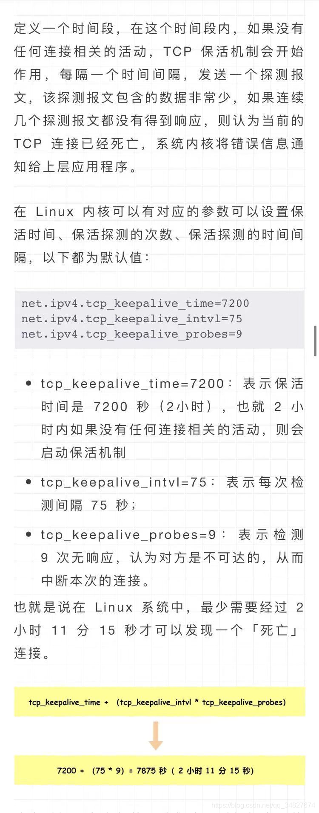

#### 进程崩溃

TCP 的连接信息是由内核维护的，所以当服务端的进程崩溃后，内核需要回收该进程的所有 TCP 连接资源，于是内核会发送第一次挥手 FIN 报文，后续的挥手过程也都是在内核完成，并不需要进程的参与，所以即使服务端的进程退出了，还是能与客户端完成 TCP四次挥手的过程。

使用 kill -9 来模拟进程崩溃的情况，发现**在 kill 掉进程后，服务端会发送 FIN 报文，与客户端进行四次挥手**。

所以，即使没有开启 TCP keepalive，且双方也没有数据交互的情况下，如果其中一方的进程发生了崩溃，这个过程操作系统是可以感知的到的，于是就会发送 FIN 报文给对方，然后与对方进行 TCP 四次挥手。

#### 客户端主机宕机后快速重启

在客户端主机宕机后，服务端向客户端发送的报文会得不到任何的响应，在一定时长后，服务端就会触发**超时重传**机制，重传未得到响应的报文。

服务端重传报文的过程中，客户端主机重启完成后，客户端的内核就会接收重传的报文，然后根据报文的信息传递给对应的进程：

- 如果客户端主机上**没有**进程绑定该 TCP 报文的目标端口号，那么客户端内核就会**回复 RST 报文，重置该 TCP 连接**；
- 如果客户端主机上**有**进程绑定该 TCP 报文的目标端口号，由于客户端主机重启后，之前的 TCP 连接的数据结构已经丢失了，客户端内核里协议栈会发现找不到该 TCP 连接的 socket 结构体，于是就会**回复 RST 报文，重置该 TCP 连接**。

所以，**只要有一方重启完成后，收到之前 TCP 连接的报文，都会回复 RST 报文，以断开连接**。

#### 客户端主机宕机后不重启

服务端的数据报文会超时重传，当重传总间隔时长达到一定阈值（内核会根据 tcp_retries2 设置的值计算出一个阈值）后，会断开 TCP 连接

#### 总结

如果「**客户端进程崩溃**」，客户端的进程在发生崩溃的时候，内核会发送 FIN 报文，与服务端进行四次挥手。

但是，「**客户端主机宕机**」，那么是不会发生四次挥手的，具体后续会发生什么？还要看服务端会不会发送数据？

- 如果服务端会发送数据，由于客户端已经不存在，收不到数据报文的响应报文，服务端的数据报文会超时重传，当重传总间隔时长达到一定阈值（内核会根据 tcp_retries2 设置的值计算出一个阈值）后，会断开 TCP 连接；
- 如果服务端一直不会发送数据，再看服务端有没有开启 TCP keepalive 机制？
  - 如果有开启，服务端在一段时间没有进行数据交互时，会触发 TCP keepalive 机制，探测对方是否存在，如果探测到对方已经消亡，则会断开自身的 TCP 连接；
  - 如果没有开启，服务端的 TCP 连接会一直存在，并且一直保持在 ESTABLISHED 状态。

### 端口使用

- TCP和UDP能同时绑定相同的端口吗

  > 可以的。
  >
  > TCP 和 UDP 传输协议，在内核中是由两个完全独立的软件模块实现的。
  >
  > 当主机收到数据包后，可以在 IP 包头的「协议号」字段知道该数据包是 TCP/UDP，所以可以根据这个信息确定送给哪个模块（TCP/UDP）处理，送给 TCP/UDP 模块的报文根据「端口号」确定送给哪个应用程序处理。
  >
  > 因此， TCP/UDP 各自的端口号也相互独立，互不影响。

- 多个TCP进程能绑定同一个端口吗

  > 如果两个 TCP 服务进程同时绑定的 IP 地址和端口都相同，那么执行 bind() 时候就会出错，错误是“Address already in use”。
  >
  > 如果两个 TCP 服务进程绑定的端口都相同，而 IP 地址不同，那么执行 bind() 不会出错。

- 如何解决服务端重启时，报错“Address already in use”的问题？

  > 当我们重启 TCP 服务进程的时候，意味着通过服务器端发起了关闭连接操作，于是就会经过四次挥手，而对于主动关闭方，会在 TIME_WAIT 这个状态里停留一段时间，这个时间大约为 2MSL。
  >
  > 当 TCP 服务进程重启时，服务端会出现 TIME_WAIT 状态的连接，TIME_WAIT 状态的连接使用的 IP+PORT 仍然被认为是一个有效的 IP+PORT 组合，相同机器上不能够在该 IP+PORT 组合上进行绑定，那么执行 bind() 函数的时候，就会返回了 Address already in use 的错误。
  >
  > 要解决这个问题，我们可以对 socket 设置 SO_REUSEADDR 属性。
  >
  > 这样即使存在一个和绑

- 客户端的端口可以重复使用吗

  > 在客户端执行 connect 函数的时候，只要客户端连接的服务器不是同一个，内核允许端口重复使用。
  >
  > TCP 连接是由四元组（源IP地址，源端口，目的IP地址，目的端口）唯一确认的，那么只要四元组中其中一个元素发生了变化，那么就表示不同的 TCP 连接的。
  >
  > 所以，如果客户端已使用端口 64992 与服务端 A 建立了连接，那么客户端要与服务端 B 建立连接，还是可以使用端口 64992 的，因为内核是通过四元祖信息来定位一个 TCP 连接的，并不会因为客户端的端口号相同，而导致连接冲突的问题。

- 多个客户端可以 bind 同一个端口吗

  > bind 函数虽然常用于服务端网络编程中，但是它也是用于客户端的。如果我们想自己指定连接的端口，就可以用 bind 函数来实现：客户端先通过 bind 函数绑定一个端口，然后调用 connect 函数就会跳过端口选择的过程了，转而使用 bind 时确定的端口。如果多个客户端同时绑定的 IP 地址和端口都是相同的，那么执行 bind() 时候就会出错，错误是“Address already in use”。
  >
  > 一般而言，客户端不建议使用 bind 函数，应该交由 connect 函数来选择端口会比较好，因为客户端的端口通常都没什么意义。

- 客户端 TCP 连接 TIME_WAIT 状态过多，会导致端口资源耗尽而无法建立新的连接吗

  > 要看客户端是否都是与同一个服务器（目标地址和目标端口一样）建立连接。
  >
  > 如果客户端都是与同一个服务器（目标地址和目标端口一样）建立连接，那么如果客户端 TIME_WAIT 状态的连接过多，当端口资源被耗尽，就无法与这个服务器再建立连接了。即使在这种状态下，还是可以与其他服务器建立连接的，只要客户端连接的服务器不是同一个，那么端口是重复使用的。

- 如何解决客户端 TCP 连接 TIME_WAIT 过多，导致无法与同一个服务器建立连接的问题

  > 打开 net.ipv4.tcp_tw_reuse 这个内核参数。
  >
  > 因为开启了这个内核参数后，客户端调用 connect 函数时，如果选择到的端口，已经被相同四元组的连接占用的时候，就会判断该连接是否处于 TIME_WAIT 状态。
  >
  > 如果该连接处于 TIME_WAIT 状态并且 TIME_WAIT 状态持续的时间超过了 1 秒，那么就会重用这个连接，然后就可以正常使用该端口了。

### 确认号和序列号

#### 万能公式

发送的 TCP 报文：

- 公式一：**序列号 = 上一次发送的序列号 + len（数据长度）。特殊情况，如果上一次发送的报文是 SYN 报文或者 FIN 报文，则改为 上一次发送的序列号 + 1。**
- 公式二：**确认号 = 上一次收到的报文中的序列号 + len（数据长度）。特殊情况，如果收到的是 SYN 报文或者 FIN 报文，则改为上一次收到的报文中的序列号 + 1。**

重点关注这三个字段的作用：

- **序列号**：在建立连接时由内核生成的随机数作为其初始值，通过 SYN 报文传给接收端主机，每发送一次数据，就「累加」一次该「数据字节数」的大小。**用来解决网络包乱序问题。**
- **确认号**：指下一次「期望」收到的数据的序列号，发送端收到接收方发来的 ACK 确认报文以后，就可以认为在这个序号以前的数据都已经被正常接收。**用来解决丢包的问题。**
- **控制位：**用来标识 TCP 报文是什么类型的报文，比如是 SYN 报文、数据报文、ACK 报文，FIN 报文等。

**客户端与服务端完成 TCP 三次握手后，发送的第一个 「TCP 数据报文的序列号和确认号」都是和「第三次握手的 ACK 报文中序列号和确认号」一样的**。因为单纯的 ACK 报文没有携带用户数据，len = 0。

### 其他面试题

- SYN 报文什么时候情况下会被丢弃

  > *半连接队列满了*
  >
  > 在 TCP 三次握手的时候，Linux 内核会维护两个队列，分别是：
  >
  > - 半连接队列，也称 SYN 队列；
  > - 全连接队列，也称 accepet 队列；
  >
  > 服务端收到客户端发起的 SYN 请求后，**内核会把该连接存储到半连接队列**，并向客户端响应 SYN+ACK，接着客户端会返回 ACK，服务端收到第三次握手的 ACK 后，**内核会把连接从半连接队列移除，然后创建新的完全的连接，并将其添加到 accept 队列，等待进程调用 accept 函数时把连接取出来。**
  >
  > 
  >
  > 当服务器造成syn攻击，就有可能导致 **TCP 半连接队列满了，这时后面来的 syn 包都会被丢弃**。
  >
  > 但是，**如果开启了syncookies 功能，即使半连接队列满了，也不会丢弃syn 包**。
  >
  > syncookies 是这么做的：服务器收到SYN后不把SYN放进队列中，而是根据连接信息计算出一个值，放在己方发出的 SYN+ACK 报文中发出（放在ISN中），当客户端返回 ACK 报文时，取出该值（ISN）还原连接信息，以完成连接的建立。
  >
  > 
  >
  > syncookies 参数主要有以下三个值：
  >
  > - 0 值，表示关闭该功能；
  > - 1 值，表示仅当 SYN 半连接队列放不下时，再启用它；
  > - 2 值，表示无条件开启功能；
  >
  > 这里给出几种防御 SYN 攻击的方法：
  >
  > - 增大半连接队列：**要想增大半连接队列，我们得知不能只单纯增大 tcp_max_syn_backlog 的值，还需一同增大 somaxconn 和 backlog，也就是增大全连接队列**。
  >
  >   - 增大 tcp_max_syn_backlog 和 somaxconn 的方法是修改 Linux 内核参数：
  >
  >     
  >
  >   - 增大 backlog 的方式，每个 Web 服务都不同，比如 Nginx 增大 backlog 的方法如下：
  >
  >     
  >
  > - 开启 tcp_syncookies 功能（设为1）
  >
  >   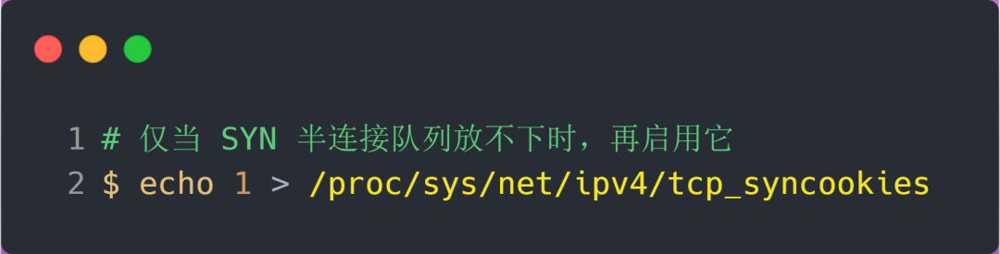
  >
  > - 减少 SYN+ACK 重传次数，以加快处于 SYN_RECV 状态的 TCP 连接断开。（当重传超过次数达到上限后，就会断开连接）
  >
  >   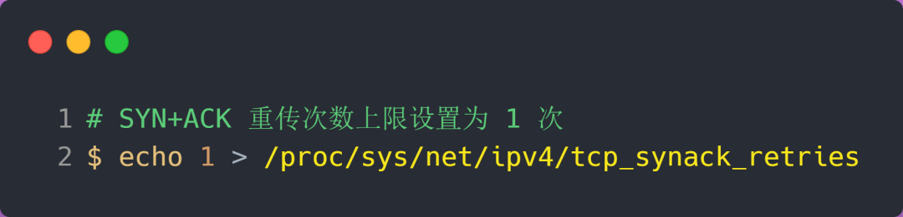
  >
  > *全连接队列满了*
  >
  > **在服务端并发处理大量请求时，如果 TCP accpet 队列过小，或者应用程序调用 accept() 不及时，就会造成 accpet 队列满了 ，这时后续的连接就会被丢弃，这样就会出现服务端请求数量上不去的现象。**
  >
  > 我们可以通过 ss 命令来看 accpet 队列大小，在「LISTEN 状态」时，`Recv-Q/Send-Q` 表示的含义如下：
  >
  > 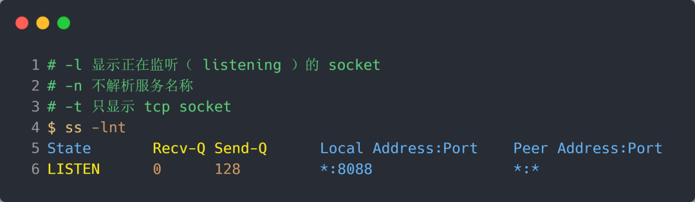
  >
  > - Recv-Q：当前 accpet 队列的大小，也就是当前已完成三次握手并等待服务端 `accept()` 的 TCP 连接个数；
  > - Send-Q：当前 accpet 最大队列长度，上面的输出结果说明监听 8088 端口的 TCP 服务进程，accpet 队列的最大长度为 128；
  >
  > 如果 Recv-Q 的大小超过 Send-Q，就说明发生了 accpet 队列满的情况。
  >
  > 要解决这个问题，我们可以：
  >
  > - 调大 accpet 队列的最大长度，调大的方式是通过**调大 backlog 以及 somaxconn 参数。**
  > - 检查系统或者代码为什么调用 accept() 不及时；

- 处于establish状态的TCP，收到SYN会发生什么

  > TCP 连接是由「四元组」唯一确认的。然后这个场景中，客户端的IP、服务端IP、目的端口并没有变化，所以这个问题关键要看客户端发送的 SYN 报文中的源端口是否和上一次连接的源端口相同。
  >
  > **1. 客户端的 SYN 报文里的端口号与历史连接不相同**
  >
  > 如果客户端恢复后发送的 SYN 报文中的源端口号跟上一次连接的源端口号不一样，此时服务端会认为是新的连接要建立，于是就会通过三次握手来建立新的连接。
  >
  > 那旧连接里处于 establish 状态的服务端最后会怎么样呢？
  >
  > 如果服务端发送了数据包给客户端，由于客户端的连接已经被关闭了，此时客户的内核就会回 RST 报文，服务端收到后就会释放连接。
  >
  > 如果服务端一直没有发送数据包给客户端，在超过一段时间后， TCP 保活机制就会启动，检测到客户端没有存活后，接着服务端就会释放掉该连接。
  >
  > **2. 客户端的 SYN 报文里的端口号与历史连接相同**
  >
  > **处于 establish 状态的服务端如果收到了客户端的 SYN 报文（注意此时的 SYN 报文其实是乱序的，因为 SYN 报文的初始化序列号其实是一个随机数），会回复一个携带了正确序列号和确认号的 ACK 报文，这个 ACK 被称之为 Challenge ACK。**
  >
  > **接着，客户端收到这个 Challenge ACK，发现确认号（ack num）并不是自己期望收到的，于是就会回 RST 报文，服务端收到后，就会释放掉该连接。**
  >
  > 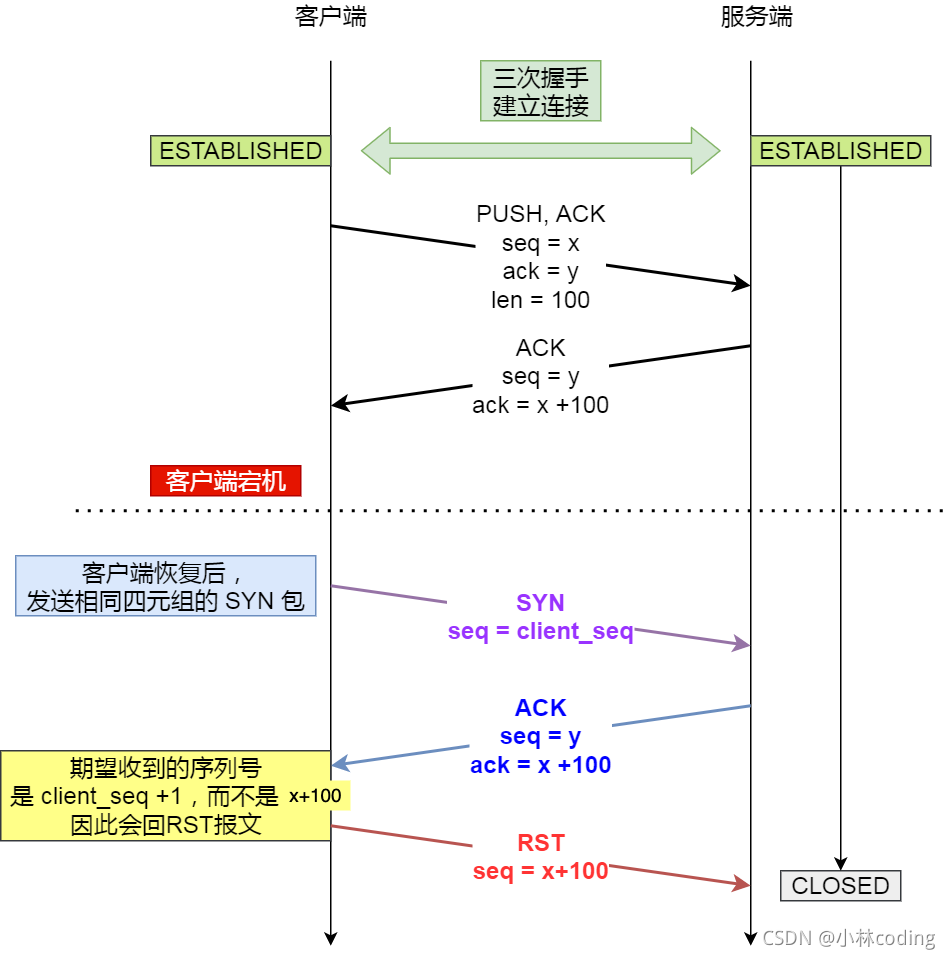

- 如何关闭一个TCP连接？

  > 粗暴做法：kill进程。杀掉客户端进程和服务端进程影响的范围会有所不同：
  >
  > - 在客户端杀掉进程的话，就会发送 FIN 报文，来断开这个客户端进程与服务端建立的所有 TCP 连接，这种方式影响范围只有这个客户端进程所建立的连接，而其他客户端或进程不会受影响。
  > - 而在服务端杀掉进程影响就大了，此时所有的 TCP 连接都会被关闭，服务端无法继续提供访问服务。
  >
  > 精细做法：**我们可以伪造一个四元组相同的 SYN 报文，来拿到“合法”的序列号！**
  >
  > 正如我们最开始学到的，如果处于 establish 状态的服务端，收到四元组相同的 SYN 报文后，**会回复一个 Challenge ACK，这个 ACK 报文里的「确认号」，正好是服务端下一次想要接收的序列号，说白了，就是可以通过这一步拿到服务端下一次预期接收的序列号。**
  >
  > **然后用这个确认号作为 RST 报文的序列号，发送给服务端，此时服务端会认为这个 RST 报文里的序列号是合法的，于是就会释放连接！**
  >
  > 在 Linux 上有个叫 killcx 的工具，就是基于上面这样的方式实现的，它会主动发送 SYN 包获取 SEQ/ACK 号，然后利用 SEQ/ACK 号伪造两个 RST 报文分别发给客户端和服务端，这样双方的 TCP 连接都会被释放，这种方式活跃和非活跃的 TCP 连接都可以杀掉。`./killcx <客户端IP地址>:<客户端端口号>`

- 在FIN_WAIT_2状态下收到乱序的FIN包如何处理？

  > **在 FIN_WAIT_2 状态时，如果收到乱序的 FIN 报文，那么就被会加入到「乱序队列」，并不会进入到 TIME_WAIT 状态。**
  >
  > **等再次收到前面被网络延迟的数据包时，会判断乱序队列有没有数据，然后会检测乱序队列中是否有可用的数据，如果能在乱序队列中找到与当前报文的序列号保持的顺序的报文，就会看该报文是否有 FIN 标志，如果发现有 FIN 标志，这时才会进入 TIME_WAIT 状态。**
  >
  > 

- 在TIME_WAIT状态的TCP连接，收到SYN包会发生什么？

  > 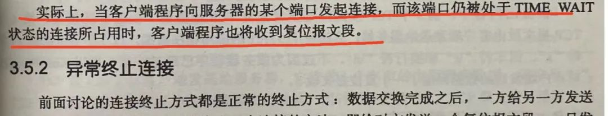

- HTTPS中TLS和TCP能同时握手吗？

  > **一般情况下，不管 TLS 握手次数如何，都得先经过 TCP 三次握手后才能进行**，因为 HTTPS 都是基于 TCP 传输协议实现的，得先建立完可靠的 TCP 连接才能做 TLS 握手的事情。
  >
  > 当满足如下两个条件时，TLS和TCP可以同时握手
  >
  > - **客户端和服务端都开启了 TCP Fast Open 功能，且 TLS 版本是 1.3；**
  > - **客户端和服务端已经完成过一次通信。**
  >
  > **「TCP Fast Open + TLSv1.3」情况下，在第二次以后的通信过程中，TLS 和 TCP 的握手过程是可以同时进行的。**

- TCP的Keepalive和HTTP的Keep-Alive是一个东西吗？

  > **这两个完全是两样不同东西**，实现的层面也不同：
  >
  > - HTTP 的 Keep-Alive，是由**应用层（用户态）** 实现的，称为 HTTP 长连接。
  >
  >   HTTP 长连接不仅仅减少了 TCP 连接资源的开销，而且这给 **HTTP 流水线**技术提供了可实现的基础。
  >
  >   所谓的 HTTP 流水线，是**客户端可以先一次性发送多个请求，而在发送过程中不需先等待服务器的回应**，可以减少整体的响应时间。为了避免资源浪费的情况，web 服务软件一般都会提供 `keepalive_timeout` 参数，用来指定 HTTP 长连接的超时时间。如果客户端在完后一个 HTTP 请求后，在定时器超时时间内都没有再发起新的请求，**定时器的时间一到，就会触发回调函数来释放该连接。**
  >
  > - TCP 的 Keepalive，是由 **TCP 层（内核态）** 实现的，称为 TCP 保活机制，详见前面的`如果已经建立了连接，但是客户端突然出现故障了怎么办？`

- TCP协议有什么缺陷？

  > - 升级 TCP 的工作很困难：TCP 协议是在内核中实现的，应用程序只能使用不能修改，如果要想升级 TCP 协议，那么只能升级内核。
  > - TCP 建立连接的延迟：基于 TCP 实现的应用协议，都是需要先建立三次握手才能进行数据传输，现在大多数网站都是使用 HTTPS 的，这意味着在 TCP 三次握手之后，还需要经过 TLS 四次握手后，才能进行 HTTP 数据的传输，这在一定程序上增加了数据传输的延迟。
  > - TCP 存在队头阻塞问题：TCP 是字节流协议，**TCP 层必须保证收到的字节数据是完整且有序的**，如果序列号较低的 TCP 段在网络传输中丢失了，即使序列号较高的 TCP 段已经被接收了，应用层也无法从内核中读取到这部分数据。
  > - 网络迁移需要重新建立 TCP 连接：**当移动设备的网络从 4G 切换到 WIFI 时，意味着 IP 地址变化了，那么就必须要断开连接，然后重新建立 TCP 连接**。而建立连接的过程包含 TCP 三次握手和 TLS 四次握手的时延，以及 TCP 慢启动的减速过程，给用户的感觉就是网络突然卡顿了一下，因此连接的迁移成本是很高的。

- 服务端没有 listen，客户端发起连接建立，会发生什么？

  > **服务端会回 RST 报文。**

- 不使用 listen ，可以建立 TCP 连接吗？

  > **是可以的，客户端是可以自己连自己的形成连接（TCP自连接），也可以两个客户端同时向对方发出请求建立连接（TCP同时打开），这两个情况都有个共同点，就是没有服务端参与，也就是没有listen，就能建立连接**。

- 没有listen，为什么还能建立连接？

  > 我们知道执行 listen 方法时，会创建半连接队列和全连接队列。
  >
  > 三次握手的过程中会在这两个队列中暂存连接信息。
  >
  > 所以形成连接，前提是你得有个地方存放着，方便握手的时候能根据 IP + 端口等信息找到对应的 socket。
  >
  > 客户端虽然没有半连接队列，但内核还有个全局 hash 表，可以用于存放 sock 连接的信息。这个全局 hash 表其实还细分为 ehash，bhash和listen_hash等。
  >
  > **在 TCP 自连接的情况中，客户端在 connect 方法时，最后会将自己的连接信息放入到这个全局 hash 表中，然后将信息发出，消息在经过回环地址重新回到 TCP 传输层的时候，就会根据 IP + 端口信息，再一次从这个全局 hash 中取出信息。于是握手包一来一回，最后成功建立连接**。

- 没有 accept，能建立 TCP 连接吗？

  > **就算不执行accept()方法，三次握手照常进行，并顺利建立连接。**而且，**在服务端执行accept()前，如果客户端发送消息给服务端，服务端是能够正常回复ack确认包的。**
  >
  > 全连接队列里面的连接，就**等着服务端执行accept()后被取出了。**建立连接的过程中根本不需要`accept()`参与， **执行accept()只是为了从全连接队列里取出一条连接。**
  
- 用了TCP协议，数据一定不会丢吗？

  > - 数据从发送端到接收端，链路很长，任何一个地方都可能发生丢包，几乎可以说丢包不可避免（包括建立连接时丢包、流量控制丢包、接收缓冲区丢包、两端之间的网络丢包）。
  > - 平时没事也不用关注丢包，大部分时候TCP的重传机制保证了消息可靠性。
  > - 当你发现服务异常的时候，比如接口延时很高，总是失败的时候，可以用ping或者mtr命令看下是不是中间链路发生了丢包。
  > - TCP只保证传输层的消息可靠性，并不保证应用层的消息可靠性。如果我们还想保证应用层的消息可靠性，就需要应用层自己去实现逻辑做保证。

- 什么情况会出现三次挥手？

  > 当被动关闭方（上图的服务端）在 TCP 挥手过程中，「**没有数据要发送」并且「开启了 TCP 延迟确认机制」，那么第二和第三次挥手就会合并传输，这样就出现了三次挥手。**

- 什么是TCP 延迟确认机制？

  > 当发送没有携带数据的 ACK，它的网络效率也是很低的，因为它也有 40 个字节的 IP 头 和 TCP 头，但却没有携带数据报文。 为了解决 ACK 传输效率低问题，所以就衍生出了 **TCP 延迟确认**。 TCP 延迟确认的策略：
  >
  > - 当有响应数据要发送时，ACK 会随着响应数据一起立刻发送给对方
  > - 当没有响应数据要发送时，ACK 将会延迟一段时间，以等待是否有响应数据可以一起发送
  > - 如果在延迟等待发送 ACK 期间，对方的第二个数据报文又到达了，这时就会立刻发送 ACK

- 什么是Nagle算法？

  > 使用 Nagle 算法，该算法的思路是延时处理，只有满足下面两个条件中的任意一个条件，才能可以发送数据：
  >
  > - 条件一：要等到窗口大小 >= `MSS` 并且 数据大小 >= `MSS`；
  > - 条件二：收到之前发送数据的 `ack` 回包；
  >
  > 只要上面两个条件都不满足，发送方一直在囤积数据，直到满足上面的发送条件。

- TCP如何减少小报文的传输？

  > - Nagle 算法
  > - 延迟确认

## IP篇

### IP基本认识

- 网络层的主要作用是：**实现主机与主机之间的通信，也叫点对点（end to end）通信。**
- MAC 的作用是**实现「直连」的两个设备之间通信，**而 IP 则负责**在「没有直连」的两个网络之间进行通信传输。**

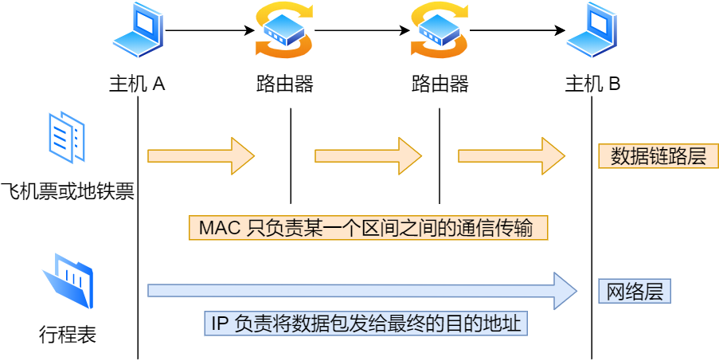

- 在网络中传输的数据包，**源IP地址和目标IP地址在传输过程中是不会变化的（前提：没有使用 NAT 网络），只有源 MAC 地址和目标 MAC 一直在变化。**

### IP地址

IP 地址（IPv4 地址）由 `32` 位正整数来表示，IP 地址在计算机是以二进制的方式处理的。

而人类为了方便记忆采用了**点分十进制**的标记方式，也就是将 32 位 IP 地址以每 8 位为组，共分为 `4` 组，每组以「`.`」隔开，再将每组转换成十进制。

那么，IP 地址最大值也就是2^32^=4,294,967,296。也就说，最大允许 43 亿台计算机连接到网络。

#### IP地址的分类

IP 地址分类成了 5 种类型，分别是 A 类、B 类、C 类、D 类、E 类。


上图中黄色部分为分类号，用以区分 IP 地址类别。

*A、B、C类*：

其中对于 A、B、C 类主要分为两个部分，分别是**网络号和主机号**。

我们可以用下面这个表格， 就能很清楚的知道 A、B、C 分类对应的地址范围、最大主机个数。

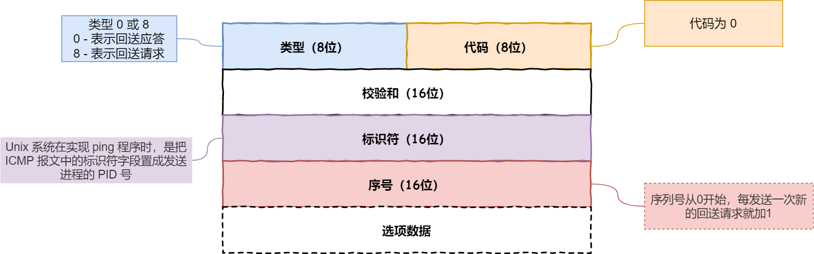

最大主机个数，就是要看主机号的位数，如 C 类地址的主机号占 8 位，那么 C 类地址的最大主机个数：2^8^-2=254，减 2是因为在 IP 地址中，有两个 IP 是特殊的，分别是主机号全为 1 和 全为 0 地址。

- 主机号全为 1 指定某个网络下的所有主机，用于广播
  - 广播地址用于在**同一个链路中相互连接的主机之间发送数据包**。
  - **在本网络内广播的叫做本地广播**。例如网络地址为 192.168.0.0/24 的情况下，广播地址是 192.168.0.255 。因为这个广播地址的 IP 包会被路由器屏蔽，所以不会到达 192.168.0.0/24 以外的其他链路上。
  - **在不同网络之间的广播叫做直接广播。**例如网络地址为 192.168.0.0/24 的主机向 192.168.1.255/24（主机号全为1，是广播地址）的目标地址发送 IP 包。收到这个包的路由器，将数据转发给 192.168.1.0/24（主机号全为0，表示192.168.1.n这个网络），从而使得所有 192.168.1.1~192.168.1.254 的主机都能收到这个包（由于直接广播有一定的安全问题，多数情况下会在路由器上设置为不转发）。
- 主机号全为 0 指定某个网络

*D、E类：*

D 类和 E 类地址是没有主机号的，所以不可用于主机 IP，D 类常被用于**多播**，E 类是预留的分类，暂时未使用。

- 多播用于**将包发送给特定组内的所有主机。**
- 由于广播无法穿透路由，若想给其他网段发送同样的包，就可以使用可以穿透路由的多播。
- 多播使用的 D 类地址，其前四位是 `1110` 就表示是多播地址，而剩下的 28 位是多播的组编号。

*IP地址分类的判断方式：*


*IP地址分类的缺点：*

- **同一网络下没有地址层次**，比如一个公司里用了 B 类地址，但是可能需要根据生产环境、测试环境、开发环境来划分地址层次，而这种 IP 分类是没有地址层次划分的功能，所以这就**缺少地址的灵活性**。
- **不能很好地与现实网络匹配**。C 类地址能包含的最大主机数量实在太少了，只有 254 个，估计一个网吧都不够用。而 B 类地址能包含的最大主机数量又太多了，6 万多台机器放在一个网络下面，一般的企业基本达不到这个规模，闲着的地址就是浪费。

#### 无分类地址CIDR

正因为 IP 分类存在许多缺点，所以提出了无分类地址的方案，即 `CIDR`。

这种方式不再有分类地址的概念，32 比特的 IP 地址被划分为两部分，前面是**网络号**，后面是**主机号**。

- 表示形式 `a.b.c.d/x`，其中 `/x` 表示前 x 位属于**网络号**， x 的范围是 `0 ~ 32`，这就使得 IP 地址更加具有灵活性。
- 还有另一种划分网络号与主机号形式，那就是**子网掩码**，掩码的意思就是掩盖掉主机号，剩余的就是网络号。**将子网掩码和 IP 地址按位计算 AND，就可得到网络号。**

*为什么要分离网络号和主机号？*

> 因为两台计算机要通讯，首先要判断是否处于同一个广播域内，即网络地址是否相同。如果网络地址相同，表明接受方在本网络上，那么可以把数据包直接发送到目标主机。
>
> 路由器寻址工作中，也就是通过这样的方式来找到对应的网络号的，进而把数据包转发给对应的网络内。

*怎么进行子网划分？*

> 在上面我们知道可以通过子网掩码划分出网络号和主机号，那实际上子网掩码还有一个作用，那就是**划分子网**。
>
> **子网划分实际上是将主机地址分为两个部分：子网网络地址和子网主机地址**。
>
> 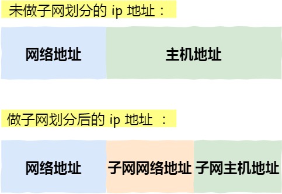
>
> 假设对 C 类地址进行子网划分，网络地址 192.168.1.0，使用子网掩码 255.255.255.192 对其进行子网划分。
>
> C 类地址中前 24 位是网络号，最后 8 位是主机号，根据子网掩码可知**从 8 位主机号中借用 2 位作为子网号**。
>
> 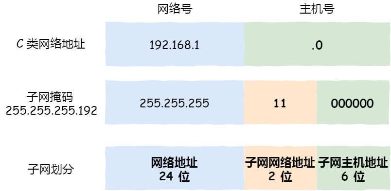
>
> 由于子网网络地址被划分成 2 位，那么子网地址就有 4 个，分别是 00、01、10、11，具体划分如下图：
>
> 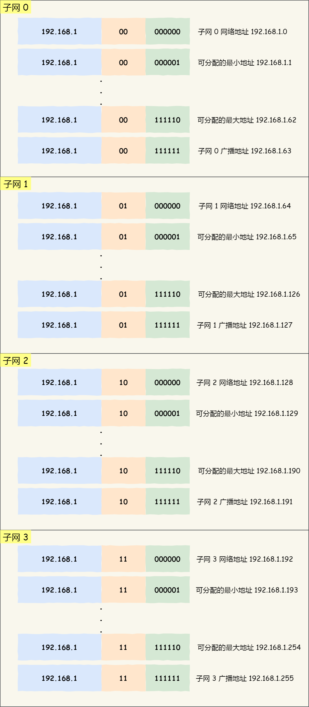
>
> 划分后的 4 个子网如下表格：
>
> 

#### 公有IP和私有IP

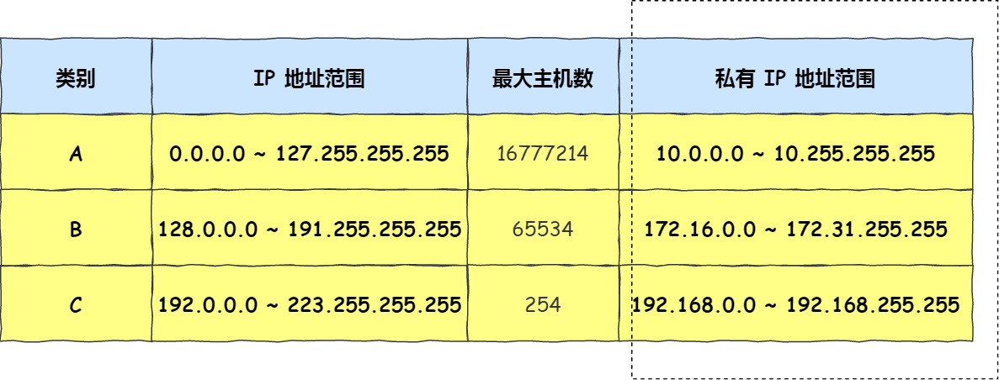

平时我们办公室、家里、学校用的 IP 地址，一般都是私有 IP 地址。因为这些地址允许组织内部的 IT 人员自己管理、自己分配，而且可以重复。因此，你学校的某个私有 IP 地址和我学校的可以是一样的。

就像每个小区都有自己的楼编号和门牌号，你小区家可以叫 1 栋 101 号，我小区家也可以叫 1 栋 101，没有任何问题。但一旦出了小区，就需要带上中山路 666 号（公网 IP 地址），是国家统一分配的，不能两个小区都叫中山路 666。

所以，公有 IP 地址是有个组织统一分配的，假设你要开一个博客网站，那么你就需要去申请购买一个公有 IP，这样全世界的人才能访问。并且公有 IP 地址基本上要在整个互联网范围内保持唯一。

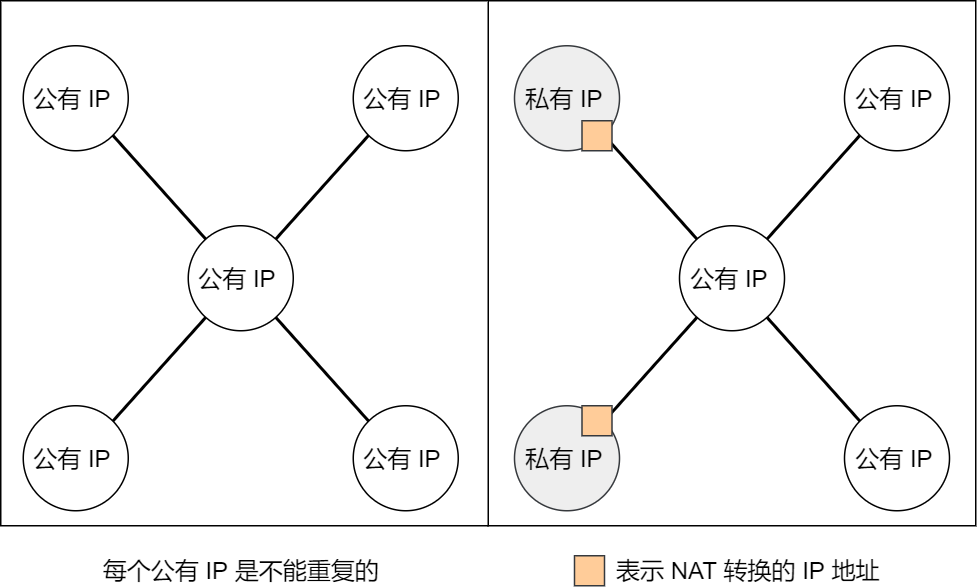

私有 IP 地址通常是内部的 IT 人员管理，公有 IP 地址是由 `ICANN` 组织管理，中文叫「互联网名称与数字地址分配机构」。

#### IP地址与路由控制

IP地址的**网络地址**这一部分是用于进行路由控制。

路由控制表中记录着网络地址与下一步应该发送至路由器的地址。在主机和路由器上都会有各自的路由器控制表。

在发送 IP 包时，首先要确定 IP 包首部中的目标地址，再从路由控制表中找到与该地址具有**相同网络地址**的记录，根据该记录将 IP 包转发给相应的下一个路由器。如果路由控制表中存在多条相同网络地址的记录，就选择相同位数最多的网络地址，也就是最长匹配。

下面以下图的网络链路作为例子说明：


1. 主机 A 要发送一个 IP 包，其源地址是 `10.1.1.30` 和目标地址是 `10.1.2.10`，由于没有在主机 A 的路由表找到与目标地址 `10.1.2.10` 相同的网络地址，于是包被转发到默认路由（路由器 `1` ）
2. 路由器 `1` 收到 IP 包后，也在路由器 `1` 的路由表匹配与目标地址相同的网络地址记录，发现匹配到了，于是就把 IP 数据包转发到了 `10.1.0.2` 这台路由器 `2`
3. 路由器 `2` 收到后，同样对比自身的路由表，发现匹配到了，于是把 IP 包从路由器 `2` 的 `10.1.2.1` 这个接口出去，最终经过交换机把 IP 数据包转发到了目标主机

#### IP分片与重组

每种数据链路的最大传输单元 `MTU` 都是不相同的，如 FDDI 数据链路 MTU 4352、以太网的 MTU 是 1500 字节等。

每种数据链路的 MTU 之所以不同，是因为每个不同类型的数据链路的使用目的不同。使用目的不同，可承载的 MTU 也就不同。

经过分片之后的 IP 数据报在被重组的时候，只能由目标主机进行，路由器是不会进行重组的。

假设发送方发送一个 4000 字节的大数据报，若要传输在以太网链路，则需要把数据报分片成 3 个小数据报进行传输，再交由接收方重组成大数据报。

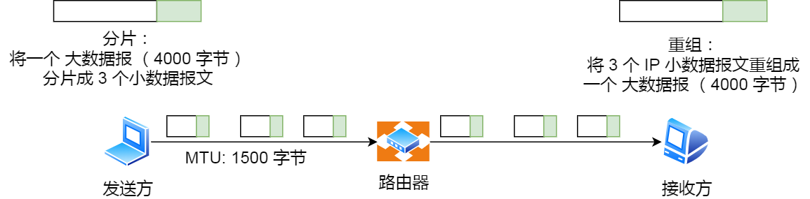

在分片传输中，一旦某个分片丢失，则会造成整个 IP 数据报作废，所以 TCP 引入了 `MSS` 也就是在 TCP 层进行分片不由 IP 层分片，那么对于 UDP 我们尽量不要发送一个大于 `MTU` 的数据报文。

#### IPv6

IPv6 地址长度是 128 位，是以每 16 位作为一组，每组用冒号 「:」 隔开。

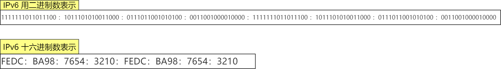

如果出现连续的 0 时还可以将这些 0 省略，并用两个冒号 「::」隔开。但是，一个 IP 地址中只允许出现一次两个连续的冒号。

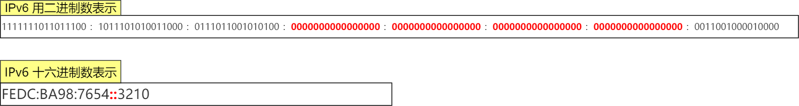

### IP协议相关技术

#### DNS

详见`打开网页全过程：DNS`的内容

#### ARP

主机的路由表中可以找到下一跳的 IP 地址，所以可以通过 **ARP 协议**，求得下一跳的 MAC 地址。

ARP 是借助 **ARP 请求与 ARP 响应**两种类型的包确定 MAC 地址的。

- 主机会通过**广播发送 ARP 请求**，这个包中包含了想要知道的 MAC 地址的主机 IP 地址。
- 当同个链路中的所有设备收到 ARP 请求时，会去拆开 ARP 请求包里的内容，如果 ARP 请求包中的目标 IP 地址与自己的 IP 地址一致，那么这个设备就将自己的 MAC 地址塞入 **ARP 响应包**返回给主机。

操作系统通常会把第一次通过 ARP 获取的 MAC 地址缓存起来，以便下次直接从缓存中找到对应 IP 地址的 MAC 地址。

不过，MAC 地址的缓存是有一定期限的，超过这个期限，缓存的内容将被清除。

ARP 协议是已知 IP 地址求 MAC 地址，那 *RARP* 协议正好相反，它是**已知 MAC 地址求 IP 地址**。例如将打印机服务器等小型嵌入式设备接入到网络时就经常会用得到。

#### DHCP

我们的电脑通常都是通过 DHCP 动态获取 IP 地址，大大省去了配 IP 信息繁琐的过程。


#### NAT

#### ICMP

#### IGMP

### ping的工作原理