# 网络

## 基础篇

### TCP/IP网络模型

- **应用层**：只专注于为用户提供应用功能，不关心数据如何传输，如HTTP、FTP、Telnet、DNS、SMTP等，工作在OS中的用户态。

- **传输层**：为应用层提供网络支持，分为TCP和UDP。

  - TCP：大部分应用使用的传输层协议，有UDP没有的流量控制、超时重传、拥塞控制等特性，确保数据可靠地传输给对方。

    - **分段**：传输层的数据包大小超过MSS(TCP最大报文段长度)就要对数据分段(**TCP Segment**)，若有分段丢失或损坏，重传即可。

    - **端口**：一台设备上有多个应用接收或传输数据，用端口号进行区分，传输层的报文中携带端口号。

      > 浏览器中的每个标签栏都是独立的进程，OS会给它们分配临时的端口号。

  - UDP：比TCP简单，只负责发送数据包，不保证能否抵达，实时性更好，传输效率也高。把TCP的特性在应用层实现则能让UDP实现可靠传输。

- **网络层**：实际将数据从一个设备传输到另一个设备的分层，进行路径和节点的选择。最常用的是IP协议，有**寻址**和**路由**功能。

  - IP包：把传输层的报文作为数据部分，再加上IP包头组成IP包。如果包的大小超过MTU(一般1500Bytes)会**再次分片**（每个分片都有各自的包头）。

    

  - IP地址：对于IPv4协议，IP地址分4段32位，每段8位，由**网络号**和**主机号**组成。

    > 子网掩码为0-32，每个数字表示IPv4格式的地址从最左边开始有几个1
    >
    > 如16 --> 255.255.0.0(11111111.11111111.00000000.00000000)

    - 网络号标识该地址属于哪个子网，由**子网掩码**和地址进行**与运算**得到。
    - 主机号标识同一子网下的不同主机，由**子网掩码取反**后和地址进行**与运算**得到。
    - 寻址过程中先匹配网络号找到子网，再匹配主机号找对应的主机。
    - 实际网络是通过很多网关、路由器、交换机等众多设备连接的，因此数据包到达一个网络节点后，通过**路由**算法决定下一步走哪条路径。

  - ==IP协议的寻址作用是告诉我们去往目的地该朝哪个方向走，即导航；路由则是根据下一个目的（网络节点）地选择路径，即操作方向盘。==

- **网络接口层**：为网络层提供链路级别传输的服务，负责在以太网、WiFi等底层网络上发送数据包，工作在网卡这个层次，使用MAC地址标识网络上的设备。

  - MAC地址：网络接口层给IP报文加上MAC头部(包含接收方和发送方的MAC地址)并封装成数据帧(Data frame)，然后发送到网络上，其中接收方的MAC地址通过ARP协议获取，通过匹配MAC地址在以太网中通讯。

  > 以太网就是在局域网内，把附件的设备连接起来，使它们之间可以通讯的技术。

**总结**

TCP/IP 网络通常是由上到下分成 4 层，分别是应用层，传输层，网络层和网络接口层。


HTTP的传输单位是消息或报文（message），TCP的传输单位是段（segment），IP的传输单位是包（packet），网络接口层的传输单位是帧（frame）。

> HTTP也可以分割报文：使用分块传输编码技术把报文的主体分块后发送，客户端通过接收数据块并解码后逐步显示页面。


### 协议栈

应用程序（如浏览器）通过调用socket库，委托OS的协议栈工作。OS的协议栈包括传输层的TCP和UDP，网络层的IP、ICMP、ARP，协议栈的下层是网卡驱动程序和物理硬件网卡


### 打开网页全过程

> 每往下走一层，就会把上一层的报文作为本层报文的数据部分，再加上本层的报文头。

#### HTTP

浏览器先解析URL以确定Web服务器的域名和资源的目录，解析完后根据这些信息生成HTTP请求消息。

> HTTP详解参考《HTTP笔记.md》

#### DNS

发送数据前，需要查询服务器域名对应的IP地址，DNS服务器专门保存了域名和IP的对应关系

- 层级：域名用`.`分割成不同的层级，**越靠右层级越高**。

- 树状结构：域名的层级关系类似一个树状结构。

  > 根域：域名最右边的`.`（如`www.server.com.`）。根域服务器的信息保存在所有DNS服务器中，因此客户端只要能够找到任意一台 DNS 服务器，就可以通过它找到根域 DNS 服务器，然后再一路顺藤摸瓜找到位于下层的某台目标 DNS 服务器。

  

- 解析流程

  1. 浏览器查看自身有没有缓存域名的IP地址，有则返回，没有则下一步
  2. OS查看有没有缓存，有则返回，没有则下一步
  3. hosts文件中有则返回，没有则下一步
  4. 客户端发出DNS请求给本地DNS服务器（客户端的TCP/IP设置中填写的DNS服务器地址）
  5. 本地DNS服务器收到请求后在缓存表格中查找，找到则返回IP地址，找不到则将请求发给根域名服务器
  6. 根DNS收到本地DNS请求后，根据顶级域名的不同把对应的顶级域服务器的地址回给本地DNS服务器
  7. 本地DNS收到顶级域服务器地址后向其发起请求
  8. 顶级域服务器收到后根据权威域名的不同把对应的权威域服务器的地址回给本地DNS服务器
  9. 权威DNS服务器负责解析域名，将查到的IP地址回给本地DNS
  10. 本地DNS把IP地址回给客户端

  

#### TCP

- TCP头部主要包括
  - **源端口号**和**目的端口号**。
  - **包的序号**：解决包乱序的问题。
  - **确认号**：确认对方是否收到，没有则重发，直到送达，解决丢包问题。
  - **状态位**：`SYN`是发起连接，`ACK`是回复，`RST`是重新连接，`FIN`是结束连接。带状态位的包发送后，会引起双方状态的变更。
  - **窗口大小**：通信双方各声明一个窗口（缓存大小）标识自己当前的处理能力，进行**流量控制**。

- TCP传输数据前要**三次握手**建立连接，保证**双方都有发送和接收的能力**。

  > 所谓的连接，只是双方计算机里维护一个状态机，建立连接过程中，双方的状态发生变化

  1. 客户端和服务端都处于`CLOSED`状态。
  2. 服务端主动监听某个端口，处于`LISTEN`状态。
  3. 客户端主动发起连接`SYN`，处于`SYN-SENT`状态。
  4. 服务端收到发起的连接，返回`SYN`，并`ACK`客户端的`SYN`，处于`SYN-RCVD`状态。
  5. 客户端收到服务端的`SYN`和`ACK`后，发送对服务端的`SYN`的`ACK`，处于`ESTABLISHED`状态。
  6. 服务端收到客户端的`ACK`后，处于`ESTABLISHED`状态。

  

- TCP分割数据

  > MTU：一个网络包的最大长度，以太网中一般1500Bytes；MSS：除去IP和TCP头部后，一个网络包所能容纳的TCP数据的最大长度。

  - HTTP消息超过了`MSS`长度时，TCP会把数据拆解成一块块的数据。
  - 拆分出来的每块数据都放进单独的网络包中，即每块都有TCP头信息。

  

#### IP

- IP头部主要包括
  - **源IP地址**：客户端若存在多个网卡，则由目标IP地址和各个网卡的`Genmask`进行**与运算**，得到的结果与网卡的`Destination`匹配，相同则使用此网卡作为源IP（使用`ip addr show 网卡名称`命令查看）都匹配不到则使用默认网关（`Genmask`和`Destination`都是`0.0.0.0`），后续把包发给路由器（`Flags中有G标识的`，`GateWay`是路由器的IP地址）。详解参考[route命令用法](https://segmentfault.com/a/1190000039410494)。
  - **目标IP地址**：由DNS解析获得。
  - **协议号**（`06`表示TCP）。

#### MAC

- MAC头部主要包括

  - **接收方MAC地址**：通过ARP协议，先查询ARP缓存中是否有目标IP的MAC地址，没有在以太网中以广播的形式获取目标IP的MAC地址。

    > 获取到的一般都是网络路径中下一个节点（如网卡、路由器等节点）的MAC地址，到达节点后先去掉包中的MAC地址，再获取下一个节点的MAC地址，通过不断地转发到达目的地。

  - **发送方MAC地址**：写在网卡的ROM中（只读存储器，只能读出无法写入信息，信息一旦写入后就固定下来，即使切断电源，信息也不会丢失）。

  - **协议类型**：在TCP/IP通信里，MAC头部中的协议类型只有`0800`（IP协议）和`0806`（ARP协议）。


#### 网卡

- **网卡驱动程序**获取网络包后
  1. 核对接收方MAC地址，判断是否是发给自己的，是则将其复制到网卡内的缓存区中，不是则丢弃。
  2. 在开头加上**报头**和**起始帧分界符。**
  3. 在末尾加上**FCS**（用于检测错误的校验帧序列）。

- 网卡驱动程序控制**网卡**，将网络包这种**数字信号转换为电信号**，在网线上发出去。


#### 交换机

> 现在家里的路由器其实有了交换机的功能了。

交换机将网络包**原样**转发到目的地，工作在**MAC层**，称为**二层网络设备**。交换机不核对接收方的MAC地址，而是接收所有的包，因此交换机的端口不具有MAC地址。

1. 电信号到达网线接口，交换价中的模块接收后转换成数字信号。

2. 通过`FCS`校验错误，没错则放入缓冲区。

3. 查询包的接收方MAC地址是否在地址表中，在则发送到相应的端口中，不在则转发到除了源端口之外的所有端口上。目标设备收到包后会作出响应，交换机就会将它的MAC地址写入地址表，下次就不需要广播了。

   > 交换机的MAC地址表保存了设备的MAC地址和该设备连接在交换机的哪个端口上。
   >
   > 若接收方MAC地址是广播地址，则直接转发到除源端口的所有端口。MAC地址FF:FF:FF:FF:FF:FF和IP地址255.255.255.255属于广播地址。

4. 数据包离开交换机到达路由器后，就准备离开好离开子网了。

#### 路由器

路由器基于IP设计，称为**三层网络设备**，各个端口都具有MAC地址和IP地址。

1. 电信号到达网线接口，路由器中的模块接收后将电信号转成数字信号并通过`FCS`进行校验。
2. 核对接收方MAC地址判断是否是发给自己的，是则放入缓冲区，不是则丢弃。
3. 去掉包的MAC头部。
4. 根据IP头部的目标IP地址，查找路由表得到转发目标。
5. 若转发目标的网关是IP地址，则此IP就是要转发的目标地址，继续转发；若网关是空，则说明到达目的地了。
6. 继续转发时，也是根据上一步获得的IP通过ARP查询接收方的MAC地址，加上MAC包头后转成电信号发送出去，通过交换机到达下一个路由器。

> 在网络包传输的过程中，**源 IP 和目标 IP 始终是不会变的，一直变化的是 MAC 地址**，因为需要 MAC 地址在以太网内进行**两个设备**之间的包传输。

#### 目的地服务器

数据包到达服务器后，服务器会查看MAC头部判断是否是发给自己的，是就接收，然后一层一层去掉头部。


### Linux网络

#### 网络模型

国际标准化组织制定了7层OSI网络模型，分别是应用层、表示层、会话层、传输层、网络层、数据链路层、物理层。

但OSI模型太复杂，也只是概念上的分成，比较常见且使用的是四层模型，即TCP/IP网络模型，Linux就是按照这套模型实现网络协议栈的。

#### 网络协议栈

网络模型的每一层都会对数据包进行封装，即添加各自的协议头，网络包的大小就会增大。以太网中规定MTU是1500Bytes，即单次传输的最大IP包的大小。网络包超过MTU的大小后就会分片，所以MTU越小，需要的分片就越多，网络的吞吐能力就越差。

Linux的网络协议栈如下图


Linux接收网络包流程

Linux发送网络包流程

## HTTP篇


请求行：`方法 URI HTTP版本`；响应行：`HTTP版本 状态码 原因短语`

### 基本认识

- HTTP是什么？

  > HTTP是超文本传输协议，HyperText Transfer Protocol。HTTP是一个在计算机世界里专门在**两点之间传输**文字、图片、音频、视频等**超文本数据**的**约定和规范**。


- HTTP常见的状态码有哪些？

  > - 1xx属于**提示信息**，是协议处理中的一种**中间状态**，还需要后续的操作，实际用的较少。
  >
  > - 2xx表示服务器**成功**处理了客户端的请求。
  >
  >   - `200 OK`表示一切正常，如果是非`HEAD`请求，响应都会有body数据。
  >   - `204 No Centent`含义和`200 OK`相同，但响应没有body数据。
  >   - `206 Partial Content`用于HTTP分块下载或断点续传，表示body数据只是资源的一部分，也表示成功。
  >
  > - 3xx表示客户端请求的资源发生了变动，需要客户端用新的URL重新发送请求获取资源，即**重定向**。
  >
  >   - `301 Moved Permanently`表示永久重定向，说明请求的资源已经不在了需要改用新的URL。
  >
  >   - `302 Found`、`307 Temporay Redirect`表示临时重定向，说明请求的资源还在，但暂时需要用另一个URL访问。
  >
  >     301、302、307都会在响应头里使用`Location`字段，指明要跳转的URL，浏览器会自动重新定向新的URL。
  >
  >   - `304 Not Modified`不具有跳转的含义，表示资源未修改，重定向已存在的缓存文件，告诉客户端可以继续使用缓存资源，用于缓存控制，称为缓存重定向。
  >
  > - 4xx表示客户端发送的**报文有误**，服务器无法处理。
  >
  >   - `400 Bad Request`表示客户端请求的报文有误，但只是个笼统的错误码。
  >   - `401 Unauthorised`表示认证失败。
  >   - `403 Forbidden`表示服务器禁止访问资源，并非客户端的请求出错。
  >   - `404 Not Found`表示请求的资源在服务器上未找到。
  >   - `405 Not Allowed`表示对于请求的资源，不允许使用请求行中指定的方法。
  >
  > - 5xx表示客户端的请求报文正确，但**服务器处理时内部发生了错误**。
  >
  >   - `500 Internal Server Error`表示服务器发生了错误，与400类似是个笼统的错误。
  >   - `501 Not Implemented`表示客户端请求的功能还不支持。
  >   - `502 Bad Gateway`表示访问服务器时网关或代理出现了错误。
  >   - `503 Service Unavailable`表示服务器无法响应客户端。

- HTTP常见首部字段有哪些？

  > - *Host*：客户端发送请求时，指定服务器的域名。
  > - *Content-Length*：服务器返回响应时，表示响应资源的数据长度。HTTP通过设置`CRLF`作为报文首部的边界，通过`Content-Length`字段作为报文主体的边界，以此解决TCP的粘包问题。
  > - *Connection*：用于客户端要求服务器使用HTTP长连接机制以便其他请求复用。HTTP/1.1的默认连接都是长连接，但为了兼容老版本，需要指定`Connection: Keep-Alive`。开启长连接后，只要没有一端提出断开连接，TCP连接就不会断开，客户端发送另一个请求时，会使用同一个TCP连接。当然如果一段时间内没有任何数据交互，服务端会主动断开这个连接。（注意：TCP Keepalive和HTTP Keep-Alive不一样）
  > - *Content-Type*：告诉客户端本次响应的数据是什么格式。`Content-Type: text/html; charset=utf-8`说明返回的数据是网页，且是utf-8编码。
  > - *Accept*：客户端请求时声明自己可以接受哪些数据格式。`Accept: */*`声明自己可以接受任何格式的数据。
  > - *Content-Encoding*：说明返回的数据用了什么压缩方法。eg：`Content-Encoding: gzip`。
  > - *Accept-Encoding*：客户端请求时声明可以接受哪些压缩方法。eg：`Accept-Encoding: gzip, deflate`。

- GET、POST、PUT、PATCH有什么区别？

  > 

- GET和POST方法都是安全幂等的吗？

  > 安全：请求方法不会**破坏**服务器上的资源。
  >
  > 幂等：多次执行相同的操作，结果都是**相同**的。
  >
  > - GET是只读操作，因此是**安全且幂等**的，可以被浏览器**缓存**（彻底避免浏览器发请求）或被代理缓存。
  > - POST是根据请求的负载（报文主体）新增或修改数据，会修改服务器上的资源，且多次提交会多次创建或修改，因此是**不安全且不幂等**的。
  >
  > 以上只是RFC的规范，GET可以带body，可以实现新增或删除资源；POST的URL中可以有query string，可以实现查询数据的请求。

- HTTP缓存有哪些实现方式？

  > 对于一些具有重复性的HTTP请求，比如每次请求得到的数据都一样，可以把这对请求-响应的数据缓存在本地，下次直接读取本地的数据。分为**强制缓存**和**协商缓存**。

- 什么是强制缓存？

  > 只要浏览器判断缓存没有过期，则直接使用浏览器的本地缓存，决定是否使用缓存的主动性在浏览器。状态码右边的size标识中是`from disk cache`或`from memory cache`的话就是使用了强制缓存。
  >
  > 强制缓存利用`Cache-control`(相对时间)或`Expires`(绝对时间)首部字段来标识资源缓存的有效期，都有的话则`Cache-control`的优先级更高，且它的选项更多、设置更精细，一般用它来实现强制缓存。
  >
  > 具体的流程：
  >
  > 1. 浏览器第一次请求时，服务器返回资源时在响应首部用Cache-Control设置过期时间。
  > 2. 浏览器再次请求该资源时，先**比较请求资源的时间是否超过Cache-control设置的过期时间**，没有则使用缓存，否则重新请求。
  > 3. 服务器再次收到请求后，更新Cache-Control的过期时间。

- 什么是协商缓存？

  > 与服务端协商后，通过协商结果判断是否使用本地缓存，若服务器返回`304`状态码，则使用缓存，否则重新请求。
  >
  > 协商缓存利用两个首部字段实现：
  >
  > - 请求首部`If-Modified-Since`，当资源过期后，浏览器发现响应首部有`Last-Modified`，则再次请求时把`If-Modified-Since`的值设为`Last-Modified`的值，服务器收到后发现请求首部有`If-Modified-Since`，则与被请求资源的最后修改时间进行对比，若最后修改时间较新，说明资源修改过，返回`200 OK`、新的修改时间和新资源；若最后修改时间较旧，说明资源无修改，返回空body和`304 Not Modified`。
  > - 响应首部`Last-Modified`表示响应资源最后的修改时间。
  >
  > 或者利用另外两个首部字段实现：
  >
  > - `If-None-Match`，当资源过期后，浏览器发现响应首部有`Etag`，则再次请求时把`If-None-Match`的值设为`Etag`的值，服务端收到请求后发现首部有`If-None-Match`则进行对比，如果资源未修改返回`304`，已修改返回`200`、新的`Etag`和新资源。
  > - `Etag`用来唯一标识响应的资源。

- 缓存补充

  > 若响应的首部中Etag和Last-Modified都有，则再次请求时会都带上，这时**Etag的优先级更高**，因为：
  >
  > - Etag基于标识实现，比基于时间实现的Last-Modified更准确，避免由于时间篡改导致的不可靠问题。
  > - If-Modified-Since能检查的粒度是秒级的，若文件在秒级以内被修改则无法发现。
  > - 一些服务器不能精确获取文件最后的修改时间。
  >
  > **协商缓存的字段都要配合强制缓存的Cache-control使用，只有强制缓存过期的时候，才能发起带有协商缓存字段的请求。**
  >
  > 

- HTTP/1.1的优点有哪些？

  > - *简单*：报文格式基于报文首部和报文主体，首部字段也是键值对的形式，**易于理解**。
  > - *灵活且易于扩展*：HTTP协议中的要求没有被固定死，允许开发人员**自定义和扩充**；HTTP位于应用层，**下层可以随意变化**（如HTTPS就在TCP上加了SSL/TLS层；HTTP/3就把TCP改成了UDP）。
  > - *应用广泛且跨平台*

- HTTP/1.1的缺点有哪些？

  > - *无状态*：是一把双刃剑，**好处**是服务器**不需要额外的资源**记录状态信息，减轻CPU和内存负担；**坏处**是在完成有关联性的操作时会非常麻烦，因为服务器没有记忆能力。
  > - *明文传输*：是一把双刃剑，好处是方便阅读，为抓包调试带来了极大的便利性；坏处是信息很容易被窃取。
  > - *不安全*：**通信明文**，内容可能被窃听；**不验证通信方身份**，可能遭遇伪装；**无法证明报文完整性**，内容可能遭篡改。

- 什么是cookie和token？

  > - cookie：客户端第一次请求时，服务器会创建session并下发带有sessionID的cookie（响应头中设置`set-cookie: value[; expires=date][; domain=domain][; path=path][; secure]`），服务器把cookie保存在数据库或redis中，后续客户端请求服务器时带上这个cookie，服务器校验cookie来辨别用户。
  >
  > - jwt token：`header.claim/payload.signature`格式的字符串
  >
  >   - `header`固定为**{"alg":"加密算法","typ":"token类型"}**。
  >   - `claim/payload`中是用户信息和过期时间。
  >   - `signature`是把`header`和`claim/payload`分别base64编码后再加盐加密得到。
  >   - 以上三部分再分别经过base64编码后用`.`隔开，得到token字符串。
  >   - 第一次请求时由服务器下发，但服务器不保存，后续请求时客户端带上，服务器收到后先解码得到claim/payload中保存的用户信息，再根据这个信息加密生成signature，然后和客户端发来的signature比较，若一致则校验通过。
  >
  > - jwt token+refresh token：jwt token一旦签发则在过期时间内一直可用，服务端无法控制其过期时间或对其进行禁用。通过引入refresh token可用进行改进，refresh token需要由服务端保存在redis或数据库中。
  >
  >   

- HTTP/1.1的性能如何？

  > HTTP/1.1通过以下方式提升性能
  >
  > - *长连接*，避免了重复建立和端口TCP连接造成的额外开销。
  > - *管道网络传输*，请求发出后不用等待响应就可以发送后续的请求出去，可以减少整体的响应时间，即**解决了请求的队头阻塞**。但服务端必须按照接收请求的顺序发送响应，因此**没有解决响应队头阻塞**。（实际上HTTP/1.1管道化技术不是默认开启，而且浏览器基本都没有支持）
  > - *队头阻塞*，请求-应答的模式加剧了性能问题，一个请求被阻塞后，后面的请求都收不到响应。

- HTTP与HTTPS有哪些区别？

  > - HTTPS在TCP和HTTP之间加入了**SSL/TLS层**，使报文能够加密传输。
  > - HTTPS在TCP三次握手之后还要进行**SSL/TLS握手**，才可进入加密报文传输。
  > - HTTP默认端口80，HTTPS默认端口**443**。
  > - HTTPS需要向CA机构申请**数字证书**，来保证服务器的身份是可信的。

- HTTPS使用什么方式解决了HTTP的哪些问题？

  > - *混合加密*：采用对称加密和非对称加密结合的混合加密方式，解决了被窃听的风险。（下图第5步只传输用key加密后的密文，key分别保存在客户端和服务端本地）
  >
  >   
  >
  > - *摘要算法+数字签名*：用摘要算法（哈希函数）计算内容的哈希值，此值唯一且无法用值反推内容。对哈希值使用私钥加密得到数字签名后和内容一起发送，接收方用公钥解密，若能解出，则说明消息是来源于持有私钥的一方（保证消息的来源可靠性）。接收方用同样的哈希算法对内容进行计算，比较计算出的哈希值和用公钥解密出的哈希值，一致则说明内容未被篡改（保证消息的完整性）。
  >
  > - *数字证书*：如果公私钥被伪造并用伪造的私钥加密内容，接收方只能拿到伪造的公钥后解密，则会认为内容无误且来源可靠。因此服务器需要把真正的公钥注册到CA（数字证书认证机构），CA颁发数字证书给服务器。接收方收到服务器的证书后，用CA的公钥（内置在浏览器或OS中）确认证书是否是注册到CA的。解决了身份被伪造的风险。（详解见数字证书的流程？）

- HTTPS是如何建立连接的？其间交互了什么？

  > HTTPS需要先建立TCP连接，然后TLS握手后，才能建立通信安全的连接。
  >
  > 细节详见HTTPS RSA握手和HTTPS ECDHE握手。

- 数字证书的流程？

  > CA签发证书流程：
  >
  > 1. CA把服务器的公钥、用途、颁发者、有效时间等信息打包，再进行Hash计算得到Hash值。
  > 2. CA用自己的私钥将Hash值加密，生成Certificate Signature，即CA对证书做了签名。
  > 3. 将Certificate Signature添加在证书上颁发给服务器。
  >
  > 客户端校验证书流程：
  >
  > 1. 客户端使用同样的Hash算法获取证书的Hash值H1。
  > 2. 客户端使用浏览器或OS内置的CA公钥对收到的服务器证书的Certificate Signature进行解密，得到Hash值H2。
  > 3. 比较H1和H2，相同则证书可信赖。
  >
  > 实际过程中存在证书信任链，即CA颁发的证书并不是最终的证书。这是为了保证根证书的绝对安全性，将根证书隔离地越严格越好，否则根证书如果失守，整个信任链都会有问题。
  >
  > 

- HTTPS的应用数据是如何保证完整性的？

  > 通过**握手协议**和**记录协议**保证，位于下层的记录协议负责进行加密传输，而位于上层的握手协议则负责TLS四次握手，记录协议完成后，最终的报文数据将传递到TCP层进行传输。。详解见[理解SSL/TLS系列 (四) 记录协议](https://blog.csdn.net/zhanyiwp/article/details/105627799)

- HTTPS一定安全可靠吗？

  > 如果有假基站转发了全部信息给中间服务器，中间服务器与真正的服务器完成TLS握手，则中间服务器可以解密请求和响应的内容。不过证书仍然是伪造的，浏览器能识别出是非法的，就会提醒证书存在问题。所以，**HTTPS 协议本身到目前为止还是没有任何漏洞的，即使你成功进行中间人攻击，本质上是利用了客户端的漏洞（用户点击继续访问或者被恶意导入伪造的根证书），并不是 HTTPS 不够安全**。

- HTTP/2做了哪些优化？

  > - 头部压缩，使用HPACK算法在客户端和服务器同时维持一张头信息表，所有字段都在此表中，传输时只传输字段在表中的索引号。
  > - 报文采用二进制格式（头信息帧和数据帧）便于计算机解析。
  > - 并发传输，1个TCP连接中有多个Stream，1个Stream包含多个Message（请求或响应），1个Message包含多个帧（二进制的报文），每个Stream有独一无二的ID，不同Stream的帧可以乱序发送，接收端通过StreamID有序组装成HTTP消息。
  > - 服务器推送，和websocket的区别在于：websocket是主动推送，建立的是双向的实时通信；而http/2的推送只有在收到客户端的请求后才能推送。

- HTTP/3做了哪些优化？

  > 使用基于UDP的QUIC协议，无队头阻塞，更快地建立连接，连接迁移。

### HTTP/1.1优化

- 尽量避免发送HTTP请求：**缓存**技术。
- 在需要发送HTTP请求时，尽量减少请求次数：将**重定向交给代理服务器**完成以减少重定向的次数；把多个访问小文件的请求**合并成大请求**（如CSS精灵图）；延迟发送请求，当用户下**滑页面时再**向服务器获取接下来的资源。
- 减少服务器的HTTP响应的数据大小：**压缩**技术
  - 无损压缩：gzip，deflate，br（谷歌的Brotli），适用于文本、可执行文件。源代码等。
  - 有损压缩：舍弃次要的数据来提高压缩比，适用于多媒体文件。通过Accept字段的**q质量因子**告诉服务器期望的资源质量。`Accept: audio/*; q=0.2, audio/basic`。目前压缩比较高的是Google的**WebP**格式。

### HTTPS RSA握手

1. 第一次握手：客户端发送**Client Hello**，携带客户端使用的TLS版本号、支持的密码套件列表、生成的**随机数（Client Random）**，这个随机数会被服务端保留。

   

   > 密码套件：基本的形式是*协议名称\_密钥交换算法\_签名算法\_WITH\_对称加密算法\_密钥长度\_分组模式\_摘要算法*。
   >
   > Cipher Suite: TLS_RSA_WITH_AES_128_GCM_SHA256（WITH左边只有一个算法，则密钥交换和签名都用RSA；对称加密算法是握手后使用的加密算法）

2. 第二次握手：

   - 服务端发送**Server Hello**，携带服务器确认支持的TLS版本号、选择的密码套件列表、生成的**随机数（Server Random）**。

     

   - 服务端发送**Certificate**，包含服务器的**证书**。

     

   - 服务端发送**Server Hello Done**，告诉客户端Hello完成。

     

3. 第三次握手：

   - 客户端收到Certificate后，验证服务端的证书是否可信（详解见*常见面试题：数字证书的流程？*）。

   - 客户端发送**Client Key Exchange**，包含客户端生成的用服务端的RSA**公钥加密**后的新**随机数（pre-master）**。

     

   - 双方根据三个随机数，生成**会话密钥（Master Secret）**。

   - 客户端发送**Change Cipher Spec**，告知服务端开始用对称加密方式发送消息。

     

   - 客户端发送**Encrypted Handshake Massage**，对之前的数据做个**摘要**并用会话密钥加密，服务器收到后验证加密通信是否可用及之前的握手信息是否被篡改过。

     

4. 第四次握手：服务端发送**Change Cipher Spec**和**Encrypted Handshake Massage**，如果双方都验证加密和解密没问题，那么握手正式完成。

5. 双方使用会话密钥加解密HTTP请求和响应。

> RSA握手的缺陷：服务端的私钥固定，一旦泄露，之前被截获的TLS密文都会被破解。

### HTTPS ECDHE握手

> - 离散对数：a<sup>i</sup>(mod p) = b，a是底数，i是对数，p是模数，b是真数。当p是很大的质数时，以当前的计算机很难由真数b推导出对数i。
> - DH算法：客户端的公钥A=g<sup>a</sup>(mod p)，服务端的公钥B=g<sup>b</sup>(mod p)。g和p是算法的公共参数（公开的），a和b是各自的私钥。双方交换公钥后，根据理算对数幂运算的交换律，客户端进行运算B<sup>a</sup>(mod p)得到K，服务端进行运算A<sup>b</sup>(mod p)得到K，K即为对称加密的会话密钥。
> - DHE算法：双方的私钥在每次交换通信时都是随机生成的、临时的，E是ephemeral。
> - ECDHE算法：利用ECC椭圆曲线特性，用更少的计算量计算出公钥和会话密钥。客户端的公钥A=aG，服务端的公钥B=bG，使用哪种椭圆曲线和曲线上的基点G是公共参数。双方交换公钥后，客户端计算点(x1,y1)=aB，服务端计算点(x2,y2)=bA，根据椭圆曲线上交换律和结合律，aB=abG=baG=bA，因此点x的坐标是一样的，它就是会话密钥。

1. 第一次握手：客户端发送**Client Hello**，携带客户端使用的TLS版本号、支持的密码套件列表、生成的**随机数（Client Random）**。

   

2. 第二次握手

   - 服务端发送**Server Hello**，携带服务器确认支持的TLS版本号、选择的密码套件列表、生成的**随机数（Server Random）**。

     

   - 服务端发送**Certificate**，包含服务器的**证书**。

     

   - 服务端发送**Server Key Exchange**，这个过程中服务器做了三件事

     - 选择椭圆曲线类型，包含椭圆曲线的基点G。
     - 生成**随机数**作为服务端**椭圆曲线的私钥**，保留本地。
     - 根据基点G和私钥计算出服务端的**椭圆曲线公钥**。
     - 用签名算法给服务端的椭圆曲线公钥做**签名**。

     

   - 服务端发送**Server Hello Done**。

     

3. 第三次握手：

   - 客户端发送**Client Key Exchange**，这个过程中客户端做了三件事
     - 验证服务端的证书是否合法。
     - 生成**随机数**作为客户端**椭圆曲线的私钥**，保留本地。
     - 根据发来的基点G和私钥计算出客户端的**椭圆曲线公钥**。

     

   - 双方根据对方的公钥、各自的私钥、椭圆曲线基点G计算出点(x,y)，其中x的坐标双方都都一样。再由**Client Random+Server Random+x**共同生成会话密钥。（TLS设计者不信任计算机伪随机数的可靠性，需要三个结合。）

   - 客户端发送**Change Cipher Spec**，告知服务端开始用对称加密方式发送消息。

     

   - 客户端发送**Encrypted Handshake Massage**，对之前的数据做个**摘要**并用会话密钥加密，服务器收到后验证加密通信是否可用及之前的握手信息是否被篡改过。

     

4. 服务端发送**Change Cipher Spec**和**Encrypted Handshake Massage**，如果双方都验证加密和解密没问题，那么握手正式完成。

5. 双方使用会话密钥加解密HTTP请求和响应。

### RSA和ECDHE区别

- RSA密钥协商算法不支持前向保密，ECDHE密钥协商算法支持前向保密。
- 使用了RSA密钥协商算法，TLS完成四次握手后，才能进行应用数据传输；而对于ECDHE算法，客户端可以不用等服务端的最后一次TLS握手，就可以**提前发出加密的HTTP数据**（`TLS False Start`，抢跑），节省了一个消息的往返时间（这个是 RFC 文档规定的，具体原因文档没有说明）。
- 使用ECDHE， 在TLS第2次握手中，会出现服务器端发出的Server Key Exchange消息，而RSA握手过程没有该消息。

### HTTPS优化

> HTTPS相比HTTP多了TLS握手过程，目的是通过非对称加密握手来协程或交换出对称加密密钥，最多可以花费2 RTT（Round-Trip Time，消息往返时间），且后续都要用对称加密密钥来加解密。因此HTTPS的优化非常重要。

- *性能损耗*：TLS握手不仅增加网络延时（最大2 RTT），且图中暖色部分也会产生性能损耗。

  

- *硬件优化*：HTTPS是**计算密集型**，不是I/O密集型，因此需要提高CPU性能，且尽可能选择**支持AES-NI特性的CPU**（在指令级别优化了AES算法）。若CPU不支持该特性，则尽可能选择**ChaCha20**对称加密算法，此算法的指令运算和AES更友好。

- *软件优化*：升级Linux内核，升级OpenSSL等。

- *协议优化*

  - 优先选择ECDHE算法，比RSA效率和安全性都高；椭圆曲线尽量选x25519曲线，是目前最快的椭圆曲线；对称加密算法选AES_128_GCM，比AES_256_GCM快。

    > nginx可以通过
    >
    > `ssl_ecdh_curve X25519:secp384r1;`配置椭圆曲线集合
    >
    > `ssl_ciphers 'EECDH+ECDSA+AES128+SHA:RSA+AES128+SHA;'`配置加密算法集合。

  - 把TLS的版本从1.2升级到1.3，握手只要1 RTT（把hello消息和公钥交换消息合并成一个消息且废除了不支持前向安全性的RSA和DH算法，只支持ECDHE算法）。

- *证书优化*：客户端验证证书时，为了判断证书是否被吊销，需要访问CA下载CRL（*Certificate Revocation List*，证书吊销列表，由CA定期更新，实时性差，且吊销证书增多后下载会慢）或OCSP（*Online Certificate Status Protocol*，在线证书状态协议，向CA发送查询请求，CA返回证书的有效状态）。可以使用**OCSP Stapling**，服务器周期性地向CA查询证书状态，获得一个带有时间戳和签名的响应并缓存它，在TLS握手过程中把它发给客户端，且由于有签名的存在，服务器无法篡改。

- *会话复用*：对于重连 HTTPS 时，我们可以使用一些技术让客户端和服务端使用上一次 HTTPS 连接使用的会话密钥，直接恢复会话，而不用再重新走完整的 TLS 握手过程。常见的会话重用技术有 **Session ID** 和 **Session Ticket**，用了会话重用技术，当再次重连 HTTPS 时，只需要 1 RTT 就可以恢复会话。对于 TLS1.3 使用 **Pre-shared Key** 会话重用技术，只需要 0 RTT 就可以恢复会话。这些会话重用技术虽然好用，但是存在一定的安全风险，它们不仅不具备前向安全，而且有重放攻击的风险，所以应当对会话密钥设定一个**合理的过期时间**。

### RPC

- RPC是一种调用方式，不是协议，一般基于TCP实现，也可基于HTTP、UDP实现，著名的实现方式有gRPC（底层使用HTTP/2）、thrift。
- RPC需要知道服务器的IP和端口才能建立连接，因此需要有中间服务来保存服务器名和IP信息，如consul、etcd、redis等。DNS也是服务发现的一种，如CoreDNS就是基于DNS实现的服务发现组件。

### WebSocket

## TCP篇

### 基本认识

- TCP头主要有哪些字段？

  > - 源端口、目的端口
  > - 序列号：建立连接时由计算机生成的随机数作为初始值，通过SYN包传给接收端。每发送一次数据就累加一次。用来**解决网络包乱序问题**。
  > - 确认应答号：发送端收到确认应答后会认为这个序号以前的数据都正常接收，ACK置为1时此字段才有效。用来**解决丢包问题**。（一般是序列号+报文长度）
  > - 控制位：
  >   - *ACK*：该位为 `1` 时，「确认应答号」的字段变为有效，TCP 规定除了最初建立连接时的 `SYN` 包之外该位必须设置为 `1` 。
  >   - *RST*：该位为 `1` 时，表示 TCP 连接中出现异常必须强制断开连接。
  >   - *SYN*：该位为 `1` 时，表示希望建立连接，并在其「序列号」的字段进行序列号初始值的设定。
  >   - *FIN*：该位为 `1` 时，表示今后不会再有数据发送，希望断开连接。当通信结束希望断开连接时，通信双方的主机之间就可以相互交换 `FIN` 位为 1 的 TCP 段。
  > - 窗口大小：用于流量控制。
  > - 校验和：检验包是否受损。
  > - 首部长度：TCP头的长度（TCP有可变长的*选项*字段）。
  >
  > 

- 为什么需要 TCP 协议？ TCP 工作在哪一层？

  > `IP` 层是「不可靠」的，它不保证网络包的交付、不保证网络包的按序交付、也不保证网络包中的数据的完整性。如果需要保障网络数据包的可靠性，那么就需要由上层（传输层）的 `TCP` 协议来负责。
  >
  > 因为 TCP 是一个工作在**传输层**的**可靠**数据传输的服务，它能确保接收端接收的网络包是**无损坏、无间隔、非冗余和按序的。**

- 什么是TCP？

  > TCP 是**面向连接的、可靠的、基于字节流**的传输层通信协议。
  >
  > - **面向连接**：一定是「一对一」才能连接，不能像 UDP 协议可以一个主机同时向多个主机发送消息，也就是一对多是无法做到的；
  > - **可靠的**：无论的网络链路中出现了怎样的链路变化，TCP 都可以保证一个报文一定能够到达接收端；
  > - **字节流**：用户消息通过 TCP 协议传输时，消息可能会被操作系统「分组」成多个的 TCP 报文，如果接收方的程序如果不知道「消息的边界」，是无法读出一个有效的用户消息的。并且 TCP 报文是「有序的」，当「前一个」TCP 报文没有收到的时候，即使它先收到了后面的 TCP 报文，那么也不能扔给应用层去处理，同时对「重复」的 TCP 报文会自动丢弃。

- 什么是TCP连接？

  > **用于保证可靠性和流量控制维护的某些状态信息，这些信息的组合，包括Socket、序列号和窗口大小称为连接。**
  >
  > - **Socket**：由 IP 地址和端口号组成
  > - **序列号**：用来解决乱序问题等
  > - **窗口大小**：用来做流量控制

- 如何唯一确定一个TCP连接？

  > TCP 四元组可以唯一的确定一个连接，四元组包括如下：
  >
  > - 源地址、目的地址：32位，在 IP 头部中，作用是通过 IP 协议发送报文给对方主机。
  > - 源端口、目的端口：16位，在 TCP 头部中，作用是告诉 TCP 协议应该把报文发给哪个进程。

- 服务端TCP的最大连接数是多少？

  > 理论值计算公式：最大TCP连接数=客户端IP数*客户端的端口数。对 IPv4，客户端的 IP 数最多为 `2` 的 `32` 次方，客户端的端口数最多为 `2` 的 `16` 次方，也就是服务端单机最大 TCP 连接数，约为 `2` 的 `48` 次方。
  >
  > 当然，服务端最大并发 TCP 连接数远不能达到理论上限，会受以下因素影响：
  >
  > - **文件描述符限制**，每个 TCP 连接都是一个文件，如果文件描述符被占满了，会发生 too many open files。Linux 对可打开的文件描述符的数量分别作了三个方面的限制：
  >   - **系统级**：当前系统可打开的最大数量，通过 cat /proc/sys/fs/file-max 查看；
  >   - **用户级**：指定用户可打开的最大数量，通过 cat /etc/security/limits.conf 查看；
  >   - **进程级**：单个进程可打开的最大数量，通过 cat /proc/sys/fs/nr_open 查看；
  > - **内存限制**，每个 TCP 连接都要占用一定内存，操作系统的内存是有限的，如果内存资源被占满后，会发生 OOM。

- UDP是什么？

  > UDP 不提供复杂的控制机制，利用 IP 提供面向「无连接」的通信服务。
  >
  > UDP 协议非常简，头部只有 `8` 个字节（ 64 位），UDP 的头部格式如下：
  >
  > - 目标和源端口：主要是告诉 UDP 协议应该把报文发给哪个进程。
  > - 包长度：该字段保存了 UDP 首部的长度跟数据的长度之和。
  > - 校验和：校验和是为了提供可靠的 UDP 首部和数据而设计，防止收到在网络传输中受损的 UDP包。
  >
  > 

- TCP和UDP有什么区别？

  > *1. 连接*
  >
  > - TCP 是面向连接的传输层协议，传输数据前先要建立连接。
  > - UDP 是不需要连接，即刻传输数据。
  >
  > *2. 服务对象*
  >
  > - TCP 是一对一的两点服务，即一条连接只有两个端点。
  > - UDP 支持一对一、一对多、多对多的交互通信
  >
  > *3. 可靠性*
  >
  > - TCP 是可靠交付数据的，数据可以无差错、不丢失、不重复、按序到达。
  > - UDP 是尽最大努力交付，不保证可靠交付数据。但是我们可以基于 UDP 传输协议实现一个可靠的传输协议，比如 QUIC 协议，具体可以参见这篇文章：[如何基于 UDP 协议实现可靠传输？](https://xiaolincoding.com/network/3_tcp/quic.html)
  >
  > *4. 拥塞控制、流量控制*
  >
  > - TCP 有拥塞控制和流量控制机制，保证数据传输的安全性。
  > - UDP 则没有，即使网络非常拥堵了，也不会影响 UDP 的发送速率。
  >
  > *5. 首部开销*
  >
  > - TCP 首部长度较长，会有一定的开销，首部在没有使用「选项」字段时是 `20` 个字节，如果使用了「选项」字段则会变长的。
  > - UDP 首部只有 8 个字节，并且是固定不变的，开销较小。
  >
  > *6. 传输方式*
  >
  > - TCP 是流式传输，没有边界，但保证顺序和可靠。
  > - UDP 是一个包一个包的发送，是有边界的，但可能会丢包和乱序。
  >
  > *7. 分割方式不同*
  >
  > - TCP 的数据大小如果大于 MSS 大小，则会在传输层进行分段，目标主机收到后，也同样在传输层组装 TCP 数据包，如果中途丢失了一个分片，只需要传输丢失的这个分片。
  > - UDP 的数据大小如果大于 MTU 大小，则会在 IP 层进行分片，目标主机收到后，在 IP 层组装完数据，接着再传给传输层。
  
- TCP和UDP的应用场景是？

  > - TCP经常用于FTP文件传输、HTTP/HTTPS
  > - UDP经常用于DNS、SNMP、音视频等多媒体通信、广播通信

- 为什么 UDP 头部没有「首部长度」字段，而 TCP 头部有「首部长度」字段呢？为什么 UDP 头部有「包长度」字段，而 TCP 头部则没有「包长度」字段呢？

  > TCP 有**可变长**的「选项」字段，而 UDP 头部长度则是**不会变化**的，无需多一个字段去记录 UDP 的首部长度。
  >
  > TCP的包长度可通过公式计算：`IP包长度-IP首部长度-TCP首部长度`；而UDP的包长度是冗余的，可能的原因是：但了为网络设备硬件设计和处理方便，首部长度需要是 `4`字节的整数倍，包长度是`2`字节；或当年的UDP不是基于IP的。

- TCP和UDP可以使用同一个端口吗？

  > 可以。传输层的「端口号」的作用，是为了区分同一个主机上不同应用程序的数据包。TCP 和 UDP在内核中是两个完全独立的模块。当主机收到数据包后，可以根据 IP 包头的「协议号」字段知道该数据包是 TCP/UDP，可以根据这个信息确定送给哪个模块，送给 TCP/UDP 模块的报文根据「端口号」确定送给哪个应用程序。

### 连接建立（三次握手）


0. 客户端和服务端都处于 `CLOSE` 状态。服务端主动监听某个端口，处于 `LISTEN` 状态。

1. 客户端会随机初始化序号（`client_isn`），将此序号置于 TCP 首部的「序号」字段中，同时把 `SYN` 标志位置为 `1` ，表示 `SYN` 报文。接着把第一个 SYN 报文发送给服务端，表示向服务端发起连接，该报文不包含应用层数据，之后客户端处于 `SYN-SENT` 状态。

   > MSS 位于`可选项`中, 假如对方不传 ,那么 MSS 默认为 : 536 byte 
   >
   > `isn`是初始序列号，`seq`是序列号

   

2. 服务端收到客户端的 `SYN` 报文后，首先服务端也随机初始化自己的序号（`server_isn`），将此序号填入 TCP 首部的「序号」字段中，其次把 TCP 首部的「确认应答号」字段填入 `client_isn + 1`, 接着把 `SYN` 和 `ACK` 标志位置为 `1`，`ACK`是对客户端`SYN`的确认，`SYN`是服务端发起连接，。最后把该报文发给客户端，该报文也不包含应用层数据，之后服务端处于 `SYN-RCVD` 状态。

   

3. 客户端收到服务端报文后，还要向服务端回应最后一个应答报文，首先该应答报文 TCP 首部 `ACK` 标志位置为 `1` ，其次「确认应答号」字段填入 `server_isn + 1` ，最后把报文发送给服务端，这次报文可以携带客户到服务端的数据，之后客户端处于 `ESTABLISHED` 状态。

   

4. 服务端收到客户端的应答报文后，也进入 `ESTABLISHED` 状态。此时双方都处于 `ESTABLISHED` 状态，连接就已建立完成，客户端和服务端就可以相互发送数据了。

   > **第三次握手是可以携带数据的，前两次握手是不可以携带数据的**，这也是面试常问的题。

- 为什么是三次握手，部署两次、四次？

  > - *避免历史连接*：**为了防止旧的重复连接初始化造成混乱**（主要原因）
  >
  >   
  >
  >   - **如果是两次握手连接，就无法阻止历史连接，导致「被动发起方」建立了一个历史连接后再断开，妥妥地浪费了「被动发起方」的资源。**
  >
  >     
  >
  > - *同步双方初始序列号*：序列号能够保证数据包不重复、不丢弃和按序传输。当客户端发送携带「初始序列号」的 `SYN` 报文的时候，需要服务端回一个 `ACK` 应答报文，表示客户端的 SYN 报文已被服务端成功接收，那当服务端发送「初始序列号」给客户端的时候，依然也要得到客户端的应答回应，**这样一来一回，才能确保双方的初始序列号能被可靠的同步。**四次握手其实也能够可靠的同步双方的初始化序号，但由于**第二步和第三步可以优化成一步**，所以就成了「三次握手」。而两次握手只保证了一方的初始序列号能被对方成功接收，没办法保证双方的初始序列号都能被确认接收。
  >
  >   
  >
  > - *避免资源浪费*：如果只有「两次握手」，当客户端的 `SYN` 请求连接在网络中阻塞，客户端没有接收到 `ACK` 报文，就会重新发送 `SYN` ，由于没有第三次握手，服务器不清楚客户端是否收到了自己发送的建立连接的 `ACK` 确认信号，所以每收到一个 `SYN` 就只能先主动建立一个连接。如果客户端的 `SYN` 阻塞了，重复发送多次 `SYN` 报文，那么服务器在收到请求后就会**建立多个冗余的无效链接，造成不必要的资源浪费。**
  >
  > *小结*：TCP 建立连接时，通过三次握手**能防止历史连接的建立，能减少双方不必要的资源开销，能帮助双方同步初始化序列号**。序列号能够保证数据包不重复、不丢弃和按序传输。两次握手做不到这些，而四次握手能做到，但三次就够了。

- 为什么每次建立 TCP 连接时，初始化的序列号都要求不一样呢？

  > - 为了防止历史报文被下一个相同四元组的连接接收（主要方面）；
  >
  >   
  >
  > - 为了安全性，防止黑客伪造的相同序列号的 TCP 报文被对方接收；

- 初始序列号 ISN 是如何随机产生的？

  > 初始化序列号 ISN 随机生成算法：ISN = M + F(localhost, localport, remotehost, remoteport)。
  >
  > - `M` 是一个计时器，这个计时器每隔 4 微秒加 1。
  > - `F` 是一个 Hash 算法，根据源 IP、目的 IP、源端口、目的端口生成一个随机数值。要保证 Hash 算法不能被外部轻易推算得出，用 MD5 算法是一个比较好的选择。

- 序列号和初始序列号？

  > - **序列号**，是 TCP 一个头部字段，标识了 TCP 发送端到 TCP 接收端的数据流的一个字节，因为 TCP 是面向字节流的可靠协议，为了保证消息的顺序性和可靠性，TCP 为每个传输方向上的每个字节都赋予了一个编号，以便于传输成功后确认、丢失后重传以及在接收端保证不会乱序。**序列号是一个 32 位的无符号数，因此在到达 4G 之后再循环回到 0**。
  > - **初始序列号**，在 TCP 建立连接的时候，客户端和服务端都会各自生成一个初始序列号，它是基于时钟生成的一个随机数，来保证每个连接都拥有不同的初始序列号。**初始化序列号可被视为一个 32 位的计数器，该计数器的数值每 4 微秒加 1，循环一次需要 4.55 小时**。
  >
  > **序列号和初始化序列号并不是无限递增的，会发生回绕为初始值的情况，这意味着无法根据序列号来判断新老数据**。

- 既然 IP 层会分片，为什么 TCP 层还需要 MSS 呢？

  > **如果一个 IP 分片丢失，整个 IP 报文的所有分片都得重传**。因为 IP 层本身没有超时重传机制，那么发送方的 TCP 在超时后，就会重发「整个 TCP 报文（头部 + 数据）」，非常没有效率。为了达到最佳的传输效能 TCP 协议在**建立连接的时候通常要协商双方的 MSS 值**，当 TCP 层发现数据超过 MSS 时，则就先会进行分片，当然由它形成的 IP 包的长度也就不会大于 MTU ，自然也就不用 IP 分片了。如果一个 TCP 分片丢失后，**进行重发时也是以 MSS 为单位**，而不用重传所有的分片，大大增加了重传的效率。
  >
  > 

- 第一次握手丢失了，会发生什么？

  > 当客户端想和服务端建立 TCP 连接的时候，首先第一个发的就是 SYN 报文，然后进入到 `SYN_SENT` 状态。在这之后，如果客户端迟迟收不到服务端的 SYN-ACK 报文（第二次握手），就会触发「超时重传」机制，重传 SYN 报文。不同版本的操作系统可能超时时间不同，有的 1 秒的，也有 3 秒的，这个超时时间是写死在内核里的。在 Linux 里，客户端的 SYN 报文最大重传次数由 `tcp_syn_retries`内核参数控制，这个参数是可以自定义的，默认值一般是 5。**每次超时的时间是上一次的 2 倍**。当第五次（等了16秒）超时重传后，会继续等待 32 秒，如果服务端仍然没有回应 ACK，客户端就不再发送 SYN 包，然后断开 TCP 连接。总耗时是 1+2+4+8+16+32=63 秒，大约 1 分钟左右。

- 第二次握手丢失了，会发生什么？

  > 因为第二次握手报文里是包含对客户端的第一次握手的 ACK 确认报文，所以，如果客户端迟迟没有收到第二次握手，那么客户端就觉得可能自己的 SYN 报文（第一次握手）丢失了，于是**客户端就会触发超时重传机制，重传 SYN 报文**。最大重传次数由 `tcp_syn_retries`内核参数控制，默认值是 5。
  >
  > 然后，因为第二次握手中包含服务端的 SYN 报文，所以当客户端收到后，需要给服务端发送 ACK 确认报文（第三次握手），服务端才会认为该 SYN 报文被客户端收到了。如果第二次握手丢失了，服务端就收不到第三次握手，于是**服务端这边会触发超时重传机制，重传 SYN-ACK 报文**。SYN-ACK 报文的最大重传次数由`tcp_synack_retries`内核参数决定，默认值是 5。

- 第三次握手丢失了，会发生什么？

  > 客户端收到服务端的 SYN-ACK 报文后，就会给服务端回一个 ACK 报文，也就是第三次握手，此时客户端状态进入到 `ESTABLISH` 状态。当第三次握手丢失了，如果服务端那一方迟迟收不到这个确认报文，就会触发超时重传机制，重传 SYN-ACK 报文，直到收到第三次握手，或者达到最大重传次数。注意，**ACK 报文是不会有重传的，当 ACK 丢失了，就由对方重传对应的报文**。

- 什么是 SYN 攻击？如何避免 SYN 攻击？

  > *SYN 攻击*：攻击者短时间伪造不同 IP 地址的 `SYN` 报文，服务端每接收到一个 `SYN` 报文，就进入`SYN_RCVD` 状态，但服务端发送出去的 `ACK + SYN` 报文，无法得到未知 IP 主机的 `ACK` 应答，久而久之就会**占满服务端的半连接队列**，使得服务器不能为正常用户服务。
  >
  > *避免 SYN 攻击（了解）*：修改 Linux 内核参数，控制队列大小和当队列满时应做什么处理。

-  Linux 内核的 `SYN` 队列（半连接队列）与 `Accpet` 队列（全连接队列）是如何工作的？

  > - 当服务端接收到客户端的 SYN 报文时，会将其加入到内核的「 SYN 队列」；
  > - 接着发送 SYN + ACK 给客户端，等待客户端回应 ACK 报文；
  > - 服务端接收到 ACK 报文后，从「 SYN 队列」移除放入到「 Accept 队列」；
  > - 应用通过调用 `accpet()` socket 接口，从「 Accept 队列」取出连接。
  >
  > 

### 连接断开（四次挥手）


1. 客户端打算关闭连接，会发送一个 TCP 首部 `FIN` 标志位被置为 `1` 的报文，也即 `FIN` 报文，之后客户端进入 `FIN_WAIT_1` 状态。

2. 服务端收到该报文后，就向客户端发送 `ACK` 应答报文，接着服务端进入 `CLOSED_WAIT` 状态。客户端收到服务端的 `ACK` 应答报文后，之后进入 `FIN_WAIT_2` 状态。

3. 等待服务端处理完数据后，也向客户端发送 `FIN` 报文，之后服务端进入 `LAST_ACK` 状态。

4. 客户端收到服务端的 `FIN` 报文后，回一个 `ACK` 应答报文，之后进入 `TIME_WAIT` 状态服务器收到了 `ACK` 应答报文后，就进入了 `CLOSED` 状态，至此服务端已经完成连接的关闭。客户端在经过 `2MSL` 一段时间后，自动进入 `CLOSED` 状态，至此客户端也完成连接的关闭。

   > **主动关闭连接的，才有 TIME_WAIT 状态。**
   >
   > **实际情况中，客户端和服务端发的FIN是FIN+ACK，因为RFC793 15页提到：一旦建立了连接，ACK就会始终发送。除了第一个SYN报文和RST报文不用置ACK为1，其他都需要**

- 为什么挥手需要四次？

  > - 关闭连接时，客户端向服务端发送 `FIN` 时，仅仅表示**客户端不再发送数据了但是还能接收数据**。
  > - 服务器收到客户端的 `FIN` 报文时，先回一个 `ACK` 应答报文，而**服务端可能还有数据需要处理和发送**，等服务端不再发送数据时，才发送 `FIN` 报文给客户端来表示同意现在关闭连接。
  >
  > 服务端通常需要等待完成数据的发送和处理，所以服务端的 `ACK` 和 `FIN` 一般都会分开发送。

- 第一次挥手丢失了，会发生什么？

  > 客户端迟迟收不到被动方的 ACK 的话，也就会触发超时重传机制，重传 FIN 报文，重发次数由 `tcp_orphan_retries` 参数控制。当客户端重传 FIN 报文的次数超过 `tcp_orphan_retries` 后，就不再发送 FIN 报文，直接进入到 `close` 状态（对于调用 close 关闭的连接，一直收不到后续的挥手，则在 60 秒后直接关闭）。

- 第二次挥手丢失了，会发生什么？

  > ACK 报文是不会重传的，所以如果服务端的第二次挥手丢失了，客户端就会触发超时重传机制，重传 FIN 报文，直到收到服务端的第二次挥手，或者达到最大的重传次数。
  >
  > 当客户端收到第二次挥手，客户端就会处于 `FIN_WAIT2` 状态，对于 close 函数关闭的连接，由于无法再发送和接收数据，所以`FIN_WAIT2` 状态不可以持续太久，而 `tcp_fin_timeout` 控制了这个状态下连接的持续时长，默认值是 60 秒，所以如果在 60 秒后还没有收到 FIN 报文，客户端（主动关闭方）的连接就会直接关闭。
  >
  > 但是注意，如果主动关闭方使用 shutdown 函数关闭连接且指定只关闭发送方向，而接收方向并没有关闭，那么意味着主动关闭方还是可以接收数据的。如果主动关闭方一直没收到第三次挥手，那么主动关闭方的连接将会一直处于 `FIN_WAIT2` 状态（`tcp_fin_timeout` 无法控制 shutdown 关闭的连接）。

- 第三次挥手丢失了，会发生什么？

  > 当服务端（被动关闭方）收到客户端（主动关闭方）的 FIN 报文后，内核会自动回复 ACK，同时连接处于 `CLOSE_WAIT` 状态，顾名思义，它表示等待应用进程调用 close 函数关闭连接。此时，内核是没有权利替代进程关闭连接，必须由进程主动调用 close 函数来触发服务端发送 FIN 报文。
  >
  > 服务端处于 CLOSE_WAIT 状态时，调用了 close 函数，内核就会发出 FIN 报文，同时连接进入 LAST_ACK 状态，等待客户端返回 ACK 来确认连接关闭。
  >
  > 如果FIN丢失，则服务端迟迟收不到这个 ACK，服务端就会重发 FIN 报文，重发次数仍然由 `tcp_orphan_retries` 参数控制。

- close函数和shutdown函数？

  > - close 函数，同时关闭 socket 的发送方向和读取方向，也就是 socket 不再有发送和接收数据的能力。如果有多进程/多线程共享同一个 socket，如果有一个进程调用了 close 关闭只是让 socket 引用计数 -1，并不会导致 socket 不可用，同时也不会发出 FIN 报文，其他进程还是可以正常读写该 socket，直到引用计数变为 0，才会发出 FIN 报文。
  > - shutdown 函数，可以指定 socket 只关闭发送方向而不关闭读取方向，也就是 socket 不再有发送数据的能力，但是还是具有接收数据的能力。如果有多进程/多线程共享同一个 socket，shutdown 则不管引用计数，直接使得该 socket 不可用，然后发出 FIN 报文，如果有别的进程企图使用该 socket，将会受到影响。
  >
  > 确切地说，close() / closesocket() 用来关闭套接字，将套接字描述符（或句柄）从内存清除，之后再也不能使用该套接字，与C语言中的 fclose() 类似。应用程序关闭套接字后，与该套接字相关的连接和缓存也失去了意义，TCP协议会自动触发关闭连接的操作。
  >
  > shutdown() 用来关闭连接，而不是套接字，不管调用多少次 shutdown()，套接字依然存在，直到调用 close() / closesocket() 将套接字从内存清除。
  >
  > 如果客户端是用 close 函数来关闭连接，那么在 TCP 四次挥手过程中，如果收到了服务端发送的数据，由于客户端已经不再具有发送和接收数据的能力，所以客户端的内核会回 RST 报文给服务端，然后内核会释放连接，这时就不会经历完成的 TCP 四次挥手，所以我们常说，调用 close 是粗暴的关闭。
  >
  > 当服务端收到 RST 后，内核就会释放连接，当服务端应用程序再次发起读操作或者写操作时，就能感知到连接已经被释放了：
  >
  > - 如果是读操作，则会返回 RST 的报错，也就是我们常见的Connection reset by peer。
  > - 如果是写操作，那么程序会产生 SIGPIPE 信号，应用层代码可以捕获并处理信号，如果不处理，则默认情况下进程会终止，异常退出。
  >
  > 相对的，shutdown 函数因为可以指定只关闭发送方向而不关闭读取方向，所以即使在 TCP 四次挥手过程中，如果收到了服务端发送的数据，客户端也是可以正常读取到该数据的，然后就会经历完整的 TCP 四次挥手，所以我们常说，调用 shutdown 是优雅的关闭。
  >
  > 但是注意，shutdown 函数也可以指定「只关闭读取方向，而不关闭发送方向」，但是这时候内核是不会发送 FIN 报文的，因为发送 FIN 报文是意味着我方将不再发送任何数据，而 shutdown 如果指定「不关闭发送方向」，就意味着 socket 还有发送数据的能力，所以内核就不会发送 FIN。

- 第四次挥手丢失了，会发生什么？

  > 如果第四次挥手的 ACK 报文没有到达服务端，服务端就会重发 FIN 报文，重发次数仍然由前面介绍过的 `tcp_orphan_retries` 参数控制。

- 为什么 TIME_WAIT 等待的时间是 2MSL？

  > `MSL` 是 Maximum Segment Lifetime，**报文最大生存时间**，它是任何报文在网络上存在的最长时间，超过这个时间报文将被丢弃。因为 TCP 报文基于是 IP 协议的，而 IP 头中有一个 `TTL` 字段，是 IP 数据报可以经过的最大路由数，每经过一个处理他的路由器此值就减 1，当此值为 0 则数据报将被丢弃，同时发送 ICMP 报文通知源主机。
  >
  > **MSL 应该要大于等于 TTL 消耗为 0 的时间**，以确保报文已被自然消亡。
  >
  > **TTL 的值一般是 64，Linux 将 MSL 设置为 30 秒，意味着 Linux 认为数据报文经过 64 个路由器的时间不会超过 30 秒，如果超过了，就认为报文已经消失在网络中了**。
  >
  > TIME_WAIT 等待 2 倍的 MSL，比较合理的解释是： 网络中可能存在来自发送方的数据包，当这些发送方的数据包被接收方处理后又会向对方发送响应，所以**一来一回需要等待 2 倍的时间**。而 **2MSL时长** 相当于**至少允许报文丢失一次**。比如，若最后一个 ACK 在一个 MSL 内丢失，这样被动方重发的 FIN 会在第 2 个 MSL 内到达，TIME_WAIT 状态的连接可以应对。
  >
  > 为什么不是 4 或者 8 MSL 的时长呢？个丢包率达到百分之一的糟糕网络，连续两次丢包的概率只有万分之一，这个概率实在是太小了，忽略它比解决它更具性价比。
  >
  > `2MSL` 的时间是从**客户端接收到 FIN 后发送 ACK 开始计时的**。如果在 TIME-WAIT 时间内，因为客户端的 ACK 没有传输到服务端，客户端又接收到了服务端重发的 FIN 报文，那么 **2MSL 时间将重新计时**。在 Linux 系统里 `2MSL` 默认是 `60` 秒。

- 为什么需要 TIME_WAIT 状态？

  > - 防止历史连接中的数据，被后面相同四元组的连接错误的接收。
  > - 保证「被动关闭连接」的一方，能被正确的关闭。（如果没有TIME_WAIT，当最后一个ACK丢失后，服务端重传FIN，此时客户端已经进入关闭状态，就会回RST报文，服务端收到后将其解释为异常终止，这对于一个可靠的协议来说不是一个优雅的终止方式。）
  >
  > 通过`序列号和初始序列号？`面试题我们知道，**序列号和初始化序列号并不是无限递增的，会发生回绕为初始值的情况，这意味着无法根据序列号来判断新老数据**。
  >
  > 假设 TIME-WAIT 没有等待时间或时间过短：
  >
  > - 服务端在关闭连接之前发送的 `SEQ = 301` 报文，被网络延迟了。
  > - 接着，服务端以相同的四元组重新打开了新连接，前面被延迟的 `SEQ = 301` 这时抵达了客户端，而且该数据报文的序列号刚好在客户端接收窗口内，因此客户端会正常接收这个数据报文，但是这个数据报文是上一个连接残留下来的，这样就产生数据错乱等严重的问题。
  >
  > 为了防止历史连接中的数据，被后面相同四元组的连接错误的接收，因此 TCP 设计了 TIME_WAIT 状态，状态会持续 `2MSL` 时长，这个时间**足以让两个方向上的数据包都被丢弃，使得原来连接的数据包在网络中都自然消失，再出现的数据包一定都是新建立连接所产生的。**

- TIME_WAIT 过多有什么危害？

  > - 第一是内存资源占用；
  > - 第二是对端口资源的占用，一个 TCP 连接至少消耗「发起连接方」的一个本地端口；
  >
  > 端口资源也是有限的，就 65536 个，一般可以开启的端口为 `32768～61000`，也可以通过`net.ipv4.ip_local_port_range`指定。**如果「发起连接方」的 TIME_WAIT 状态过多，占满了所有端口资源，则会导致无法创建新连接。**服务端TCP 连接过多，会占用系统资源，比如文件描述符、内存资源、CPU 资源、线程资源等。

- 如果已经建立了连接，但是客户端突然出现故障了怎么办？

  > TCP 有一个机制是**保活机制**。定义一个时间段，在这个时间段内，如果没有任何连接相关的活动，TCP 保活机制会开始作用，每隔一个时间间隔，发送一个探测报文，该探测报文包含的数据非常少，如果连续几个探测报文都没有得到响应，则认为当前的 TCP 连接已经死亡，系统内核将错误信息通知给上层应用程序。
  >
  > 在 Linux 内核可以有对应的参数可以设置：
  >
  > - tcp_keepalive_time=7200：表示保活时间是 7200 秒（2小时），也就 2 小时内如果没有任何连接相关的活动，则会启动保活机制
  > - tcp_keepalive_intvl=75：表示每次检测间隔 75 秒；
  > - tcp_keepalive_probes=9：表示检测 9 次无响应，认为对方是不可达的，从而中断本次的连接。
  >
  > 如果开启了 TCP 保活，需要考虑以下几种情况：
  >
  > - 第一种，对端程序是正常工作的。当 TCP 保活的探测报文发送给对端, 对端会正常响应，这样 **TCP 保活时间会被重置**，等待下一个 TCP 保活时间的到来。
  > - 第二种，对端程序崩溃并重启。当 TCP 保活的探测报文发送给对端后，对端是可以响应的，但由于没有该连接的有效信息，**会产生一个 RST 报文**，这样很快就会发现 TCP 连接已经被重置。
  > - 第三种，是对端程序崩溃，或对端由于其他原因导致报文不可达。当 TCP 保活的探测报文发送给对端后，石沉大海，没有响应，连续几次，达到保活探测次数后，**TCP 会报告该 TCP 连接已经死亡**。
  >
  > 注意，应用程序若想使用 TCP 保活机制需要通过 socket 接口设置 `SO_KEEPALIVE` 选项才能够生效，如果没有设置，那么就无法使用 TCP 保活机制。

- 如果已经建立了连接，但是服务端的进程崩溃会发生什么？

  > **服务端会发送 FIN 报文，与客户端进行四次挥手**。

### socket编程

- 针对 TCP 应该如何 Socket 编程？

  > - 服务端和客户端初始化 `socket`，得到文件描述符；
  > - 服务端调用 `bind`，将绑定在 IP 地址和端口;
  > - 服务端调用 `listen`，进行监听；
  > - 服务端调用 `accept`，等待客户端连接；
  > - 客户端调用 `connect`，向服务器端的地址和端口发起连接请求；
  > - 服务端 `accept` 返回已完成连接的 `socket` ，是用于传输数据的文件描述符；
  > - 客户端调用 `write` 写入数据；服务端调用 `read` 读取数据（反之亦然）；
  > - 客户端断开连接时，会调用 `close`，那么服务端 `read` 读取数据的时候，就会读取到了 `EOF`，待处理完数据后，服务端调用 `close`，表示连接关闭。
  >
  > 监听的 socket 和真正用来传送数据的 socket，是「两个」 socket，一个叫作**监听 socket**，一个叫作**已完成连接 socket**。
  >
  > 

- 针对 UDP 应该如何 Socket 编程？

  > 对于 UDP 来说，不需要要维护连接，那么也就没有所谓的发送方和接收方，甚至都不存在客户端和服务端的概念，只要有一个 socket 多台机器就可以任意通信，因此每一个 UDP 的 socket 都需要 bind。
  >
  > 

- accept 发生在三次握手的哪一步？

  > 客户端 connect 成功返回是在第二次握手，服务端 accept 成功返回是在三次握手成功之后。
  >
  > 

### 可靠传输

#### 重传机制

- *超时重传：发送数据时，设定一个定时器，当超过指定的时间后，没有收到对方的 `ACK` 确认应答报文，就会重发该数据。*

  - 两种情况发生超时重传：数据包丢失；确认应答丢失。

  - `RTT` 指的是**数据发送时刻到接收到确认的时刻的差值**，也就是包的往返时间。

    

  - 超时重传时间是以 `RTO` （Retransmission Timeout 超时重传时间）表示。

    - 当超时时间 **RTO 较大**时，重发就慢，丢了老半天才重发，没有效率，性能差；
    - 当超时时间 **RTO 较小**时，会导致可能并没有丢就重发，于是重发的就快，会增加网络拥塞，导致更多的超时，更多的超时导致更多的重发。

  - 超时重传时间 RTO 的值应该**略大于报文往返 RTT 的值**，且是一个**动态变化的值**。

  - 需要 TCP 通过**采样 RTT 的时间**，然后进行**加权平均**，算出一个**平滑 RTT** 的值，而且这个值还是要不断变化的，因为网络状况不断地变化。除了采样 RTT，还要**采样 RTT 的波动范围**，这样就避免如果 RTT 有一个大的波动的话，很难被发现的情况。

  - 如果超时重发的数据，再次超时的时候，又需要重传的时候，TCP 的策略是**超时间隔加倍。**也就是**每当遇到一次超时重传的时候，都会将下一次超时时间间隔设为先前值的两倍。两次超时，就说明网络环境差，不宜频繁反复发送。**

- *快速重传：当收到三个相同的 ACK 报文时，会在定时器过期之前，重传丢失的报文段。*

  

  - 第一份 Seq1 先送到了，于是就 Ack 回 2（预期下一个应该发Seq2）；
  - 结果 Seq2 因为某些原因没收到，Seq3 到达了，于是还是 Ack 回 2（收到的不是预期的Seq2，就继续发ACK　２）；
  - 后面的 Seq4 和 Seq5 都到了，但还是 Ack 回 2，因为 Seq2 还是没有收到；
  - **发送端收到了三个 Ack = 2 的确认，知道了 Seq2 还没有收到，就会在定时器过期之前，重传丢失的 Seq2。**
  - 最后，收到了 Seq2，此时因为 Seq3，Seq4，Seq5 都收到了，于是 Ack 回 6（表示６之前的都收到了） 。

- *SACK*：*Selective Acknowledgment 选择性确认。在 TCP 头部「选项」字段里加一个 `SACK` 的东西，它**可以将缓存的地图发送给发送方**，这样发送方就可以知道哪些数据收到了，哪些数据没收到，知道了这些信息，就可以**只重传丢失的数据**。*

  

  > 发送方收到了三次同样的 ACK 确认报文，于是就会触发快速重发机制，通过 `SACK` 信息发现只有 `200~299` 这段数据丢失，则重发时，就只选择了这个 TCP 段进行重复。

- *D-SACK：Duplicate SACK，**使用了 SACK 来告诉「发送方」有哪些数据被重复接收了。***

  - ACK 丢包

    

    - 「接收方」发给「发送方」的两个 ACK 确认应答都丢失了，所以发送方超时后，重传第一个数据包（3000 ~ 3499）
    - **于是「接收方」发现数据是重复收到的，于是回了一个 SACK = 3000~3500**，告诉「发送方」 3000~3500 的数据早已被接收了，因为 ACK 都到了 4000 了，已经意味着 4000 之前的所有数据都已收到，所以这个 SACK 就代表着 `D-SACK`。
    - 这样「发送方」就知道了，数据没有丢，是「接收方」的 ACK 确认报文丢了。

  - 网络延时

    

    - 数据包（1000~1499） 被网络延迟了，导致「发送方」没有收到 Ack 1500 的确认报文。
    - 而后面报文到达的三个相同的 ACK 确认报文，就触发了快速重传机制，但是在重传后，被延迟的数据包（1000~1499）又到了「接收方」；
    - **所以「接收方」回了一个 SACK=1000~1500，因为 ACK 已经到了 3000，所以这个 SACK 是 D-SACK，表示收到了重复的包。**
    - 这样发送方就知道快速重传触发的原因不是发出去的包丢了，也不是因为回应的 ACK 包丢了，而是因为网络延迟了。

  > SACK携带的是已收到的包。当SACK左边的值大于ACK时，说明有丢包，需要重传的是ACK~SACK左边值之间的包；当SACK左边的值小于ACK时，说明收到了重复包。

#### 滑动窗口

- 窗口大小就是指**无需等待确认应答，而可以继续发送数据的最大值**。

- 窗口的实现实际上是操作系统开辟的一个缓存空间，发送方主机在等到确认应答返回之前，必须在缓冲区中保留已发送的数据。如果按期收到确认应答，此时数据就可以从缓存区清除。

- 

  > 图中的 ACK 600 确认应答报文丢失，也没关系，因为可以通过下一个确认应答进行确认，只要发送方收到了 ACK 700 确认应答，就意味着 700 之前的所有数据「接收方」都收到了。这个模式就叫**累计确认**或者**累计应答**。

- TCP 头里有一个字段叫 `Window`，也就是窗口大小。**这个字段是接收端告诉发送端自己还有多少缓冲区可以接收数据。于是发送端就可以根据这个接收端的处理能力来发送数据，而不会导致接收端处理不过来。**发送方发送的数据大小不能超过接收方的窗口大小。

- 发送方的滑动窗口

  下图就是发送方缓存的数据，根据处理的情况分成四个部分，其中深蓝色方框是发送窗口，紫色方框是可用窗口。

  

  - \#1 是已发送并收到 ACK确认的数据：1~31 字节
  - \#2 是已发送但未收到 ACK确认的数据：32~45 字节
  - \#3 是未发送但总大小在接收方处理范围内（接收方还有空间）：46~51字节
  - \#4 是未发送但总大小超过接收方处理范围（接收方没有空间）：52字节以后

  在下图，当发送方把数据「全部」都一下发送出去后，可用窗口的大小就为 0 了，表明可用窗口耗尽，在没收到 ACK 确认之前是无法继续发送数据了。

  

  在下图，当收到之前发送的数据 `32~36` 字节的 ACK 确认应答后，如果发送窗口的大小没有变化，则**滑动窗口往右边移动 5 个字节，因为有 5 个字节的数据被应答确认**，接下来 `52~56` 字节又变成了可用窗口，那么后续也就可以发送 `52~56` 这 5 个字节的数据了。

  

- TCP 滑动窗口方案使用三个指针来跟踪在四个传输类别中的每一个类别中的字节。其中两个指针是绝对指针（指特定的序列号），一个是相对指针（需要做偏移）。

  

  - `SND.WND`：表示发送窗口的大小（大小是由接收方指定的）；
  - `SND.UNA`（*Send Unacknoleged*）：是一个绝对指针，它指向的是已发送但未收到确认的第一个字节的序列号，也就是 #2 的第一个字节。
  - `SND.NXT`：也是一个绝对指针，它指向未发送但可发送范围的第一个字节的序列号，也就是 #3 的第一个字节。
  - 指向 #4 的第一个字节是个相对指针，它需要 `SND.UNA` 指针加上 `SND.WND` 大小的偏移量，就可以指向 #4 的第一个字节了。

  **可用窗口大 = SND.WND -（SND.NXT - SND.UNA）**

- 接收方的滑动窗口

  

  接收窗口相对简单一些，根据处理的情况划分成三个部分：

  - \#1 + #2 是已成功接收并确认的数据（等待应用进程读取）；
  - \#3 是未收到数据但可以接收的数据；
  - \#4 未收到数据并不可以接收的数据；

  其中三个接收部分，使用两个指针进行划分:

  - `RCV.WND`：表示接收窗口的大小，它会通告给发送方。
  - `RCV.NXT`：是一个指针，它指向期望从发送方发送来的下一个数据字节的序列号，也就是 #3 的第一个字节。
  - 指向 #4 的第一个字节是个相对指针，它需要 `RCV.NXT` 指针加上 `RCV.WND` 大小的偏移量，就可以指向 #4 的第一个字节了。

- 接收窗口的大小是**约等于**发送窗口的大小的。因为滑动窗口并不是一成不变的。比如，当接收方的应用进程读取数据的速度非常快的话，这样的话接收窗口可以很快的就空缺出来。那么新的接收窗口大小，是通过 TCP 报文中的 Windows 字段来告诉发送方。那么这个传输过程是存在时延的，所以接收窗口和发送窗口是约等于的关系。

#### 流量控制

**TCP 提供一种机制可以让「发送方」根据「接收方」的实际接收能力控制发送的数据量，这就是所谓的流量控制。**

考虑以下场景：

- 客户端是接收方，服务端是发送方
- 假设接收窗口和发送窗口相同，都为 `200`
- 假设两个设备在整个传输过程中都保持相同的窗口大小，不受外界影响


1. 客户端向服务端发送请求数据报文。这里要说明下，本次例子是把服务端作为发送方，所以没有画出服务端的接收窗口。
2. 服务端收到请求报文后，发送确认报文和 80 字节的数据，于是可用窗口 `Usable` 减少为 120 字节，同时 `SND.NXT` 指针也向右偏移 80 字节后，指向 321，**这意味着下次发送数据的时候，序列号是 321。**
3. 客户端收到 80 字节数据后，于是接收窗口往右移动 80 字节，`RCV.NXT` 也就指向 321，**这意味着客户端期望的下一个报文的序列号是 321**，接着发送确认报文给服务端。
4. 服务端再次发送了 120 字节数据，于是可用窗口耗尽为 0，服务端无法再继续发送数据。
5. 客户端收到 120 字节的数据后，于是接收窗口往右移动 120 字节，`RCV.NXT` 也就指向 441，接着发送确认报文给服务端。
6. 服务端收到对 80 字节数据的确认报文后，`SND.UNA` 指针往右偏移后指向 321，于是可用窗口 `Usable` 增大到 80。
7. 服务端收到对 120 字节数据的确认报文后，`SND.UNA` 指针往右偏移后指向 441，于是可用窗口 `Usable` 增大到 200。
8. 服务端可以继续发送了，于是发送了 160 字节的数据后，`SND.NXT` 指向 601，于是可用窗口 `Usable` 减少到 40。
9. 客户端收到 160 字节后，接收窗口往右移动了 160 字节，`RCV.NXT` 也就是指向了 601，接着发送确认报文给服务端。
10. 服务端收到对 160 字节数据的确认报文后，发送窗口往右移动了 160 字节，于是 `SND.UNA` 指针偏移了 160 后指向 601，可用窗口 `Usable` 也就增大至了 200。

*操作系统缓冲区与滑动窗口的关系*


1. 客户端发送 140 字节数据后，可用窗口变为 220 （360 - 140）。
2. 服务端收到 140 字节数据，**但是服务端非常繁忙，应用进程只读取了 40 个字节，还有 100 字节占用着缓冲区，于是接收窗口收缩到了 260 （360 - 100）**，最后发送确认信息时，将窗口大小通告给客户端。
3. 客户端收到确认和窗口通告报文后，发送窗口减少为 260。
4. 客户端发送 180 字节数据，此时可用窗口减少到 80。
5. 服务端收到 180 字节数据，**但是应用程序没有读取任何数据，这 180 字节直接就留在了缓冲区，于是接收窗口收缩到了 80 （260 - 180）**，并在发送确认信息时，通过窗口大小给客户端。
6. 客户端收到确认和窗口通告报文后，发送窗口减少为 80。
7. 客户端发送 80 字节数据后，可用窗口耗尽。
8. 服务端收到 80 字节数据，**但是应用程序依然没有读取任何数据，这 80 字节留在了缓冲区，于是接收窗口收缩到了 0**，并在发送确认信息时，通过窗口大小给客户端。
9. 客户端收到确认和窗口通告报文后，发送窗口减少为 0。

可见最后窗口都收缩为 0 了，也就是发生了窗口关闭。当发送方可用窗口变为 0 时，发送方实际上会定时发送窗口探测报文，以便知道接收方的窗口是否发生了改变，这个内容后面会说，这里先简单提一下。


1. 客户端发送 140 字节的数据，于是可用窗口减少到了 220。
2. **服务端因为现在非常的繁忙，操作系统于是就把接收缓存减少了 120 字节，当收到 140 字节数据后，又因为应用程序没有读取任何数据，所以 140 字节留在了缓冲区中，于是接收窗口大小从 360 收缩成了 100**，最后发送确认信息时，通告窗口大小给对方。
3. 此时客户端因为还没有收到服务端的通告窗口报文，所以不知道此时接收窗口收缩成了 100，客户端只会看自己的可用窗口还有 220，所以客户端就发送了 180 字节数据，于是可用窗口减少到 40。
4. 服务端收到了 180 字节数据时，**发现数据大小超过了接收窗口的大小，于是就把数据包丢失了。**
5. 客户端收到第 2 步时，服务端发送的确认报文和通告窗口报文，尝试减少发送窗口到 100，把窗口的右端向左收缩了 80，此时可用窗口的大小就会出现诡异的负值。

所以，如果发生了先减少缓存，再收缩窗口，就会出现丢包的现象。

**为了防止这种情况发生，TCP 规定是不允许同时减少缓存又收缩窗口的，而是采用先收缩窗口，过段时间再减少缓存，这样就可以避免了丢包情况。**

*窗口关闭*

**如果窗口大小为 0 时，就会阻止发送方给接收方传递数据，直到窗口变为非 0 为止，这就是窗口关闭。**

那么，当发生窗口关闭时，接收方处理完数据后，会向发送方通告一个窗口非 0 的 ACK 报文，如果这个通告窗口的 ACK 报文在网络中丢失了，那麻烦就大了。这会导致发送方一直等待接收方的非 0 窗口通知，接收方也一直等待发送方的数据，如不采取措施，这种相互等待的过程，会造成了死锁的现象。

为了解决这个问题，TCP 为每个连接设有一个持续定时器，**只要 TCP 连接一方收到对方的零窗口通知，就启动持续计时器。**

如果持续计时器超时，就会发送**窗口探测 ( Window probe ) 报文**，而对方在确认这个探测报文时，给出自己现在的接收窗口大小。

- 如果接收窗口仍然为 0，那么收到这个报文的一方就会重新启动持续计时器；
- 如果接收窗口不是 0，那么死锁的局面就可以被打破了。

窗口探测的次数一般为 3 次，每次大约 30-60 秒（不同的实现可能会不一样）。如果 3 次过后接收窗口还是 0 的话，有的 TCP 实现就会发 `RST` 报文来中断连接。

*糊涂窗口综合征*

如果接收方太忙了，来不及取走接收窗口里的数据，那么就会导致发送方的发送窗口越来越小。

到最后，**如果接收方腾出几个字节并告诉发送方现在有几个字节的窗口，而发送方会义无反顾地发送这几个字节，这就是糊涂窗口综合症**。

解决方法

- 接收方：当「窗口大小」小于 min( MSS，缓存空间/2 ) ，也就是小于 MSS 与 1/2 缓存大小中的最小值时，就会向发送方通告窗口为 `0`，也就阻止了发送方再发数据过来。

  等到接收方处理了一些数据后，窗口大小 >= MSS，或者接收方缓存空间有一半可以使用，就可以把窗口打开让发送方发送数据过来。

- 发送方：使用 Nagle 算法，该算法的思路是延时处理，它满足以下两个条件中的一条才可以发送数据：

  - 要等到窗口大小 >= `MSS` 或是 数据大小 >= `MSS`
  - 收到之前发送数据的 `ack` 回包

  只要没满足上面条件中的一条，发送方一直在囤积数据，直到满足上面的发送条件。

#### 拥塞控制

控制的目的就是**避免「发送方」的数据填满整个网络。**为了在「发送方」调节所要发送数据的量，定义了一个叫做「**拥塞窗口**」的概念。**拥塞窗口 cwnd**是发送方维护的一个的状态变量，它会根据**网络的拥塞程度动态变化的**。拥塞窗口是发送端维护的一个值，不会像接收方窗口（rwnd）那样通告给对端，**发送方窗口的大小是cwnd和rwnd的最小值**。目前的linux的拥塞窗口初始值为10个MSS。

拥塞控制主要是四个算法：

- 慢启动：**当发送方每收到一个 ACK，拥塞窗口 cwnd 的大小就会加 1（1个MSS大小）。**可以看出慢启动算法，发包的个数是**指数性的增长**。有一个叫慢启动门限 `ssthresh` （slow start threshold）状态变量。
  - 当 `cwnd` < `ssthresh` 时，使用慢启动算法。
  - 当 `cwnd` >= `ssthresh` 时，就会使用「拥塞避免算法」。
- 拥塞避免：一般来说 `ssthresh` 的大小是 `65535` 字节。它的规则是：**每当收到一个 ACK 时，cwnd 增加 1/cwnd。**
- 拥塞发生：当网络出现拥塞，也就是会发生数据包重传，重传机制主要有两种：
  - 超时重传：当发生了「超时重传」，则就会使用拥塞发生算法。这个时候，ssthresh 和 cwnd 的值会发生变化：`ssthresh` 设为 `cwnd/2`；`cwnd` 重置为 `1` （是恢复为 cwnd 初始化值，我这里假定 cwnd 初始化值 1）。接着，就重新开始慢启动，慢启动是会突然减少数据流的。
  - 快速重传：`ssthresh` 和 `cwnd` 变化如下：`cwnd = cwnd/2` ，也就是设置为原来的一半；`ssthresh = cwnd`；进入快速恢复算法。
- 快速恢复：快速重传和快速恢复算法一般同时使用，快速恢复算法是认为，你还能收到 3 个重复 ACK 说明网络也不那么糟糕，所以没有必要像 `RTO` 超时那么强烈。快速恢复算法如下：
  - 拥塞窗口 `cwnd = ssthresh + 3` （ 3 的意思是确认有 3 个数据包被收到了）；
  - 重传丢失的数据包；
  - 如果再收到重复的 ACK，那么 cwnd 增加 1；
  - 如果收到新数据的 ACK 后，把 cwnd 设置为第一步中的 ssthresh 的值，原因是该 ACK 确认了新的数据，说明从 duplicated ACK 时的数据都已收到，该恢复过程已经结束，可以回到恢复之前的状态了，也即再次进入拥塞避免状态；


### 半连接和全连接队列

在 TCP 三次握手的时候，Linux 内核会维护两个队列，分别是：

- **半连接队列（SYN队列）**，服务端收到**第一次握手**后，会将`sock`加入到这个队列中，队列内的`sock`都处于`SYN_RECV` 状态。是个链表，
- **全连接队列（ACCEPT队列）**，在服务端收到**第三次握手**后，会将半连接队列的`sock`取出，放到全连接队列中。队列里的`sock`都处于 `ESTABLISHED`状态。这里面的连接，就**等着服务端执行accept()后被取出了。**是个哈希表。

服务端收到客户端发起的 SYN 请求后，**内核会把该连接存储到半连接队列**，并向客户端响应 SYN+ACK，接着客户端会返回 ACK，服务端收到第三次握手的 ACK 后，**内核会把连接从半连接队列移除，然后创建新的完全的连接，并将其添加到 accept 队列，等待进程调用 accept 函数时把连接取出来。**


不管是半连接队列还是全连接队列，都有最大长度限制，超过限制时，内核会直接丢弃，或返回 RST 包。

#### 为什么半连接队列要设计成哈希表

先对比下**全连接里队列**，他本质是个链表，因为也是线性结构，说它是个队列也没毛病。它里面放的都是已经建立完成的连接，这些连接正等待被取走。而服务端取走连接的过程中，并不关心具体是哪个连接，只要是个连接就行，所以直接从队列头取就行了。这个过程算法复杂度为`O(1)`。

而**半连接队列**却不太一样，因为队列里的都是不完整的连接，嗷嗷等待着第三次握手的到来。那么现在有一个第三次握手来了，则需要从队列里把相应IP端口的连接取出，**如果半连接队列还是个链表，那我们就需要依次遍历，才能拿到我们想要的那个连接，算法复杂度就是O(n)。**

而如果将半连接队列设计成哈希表，那么查找半连接的算法复杂度就回到`O(1)`了。

因此出于效率考虑，全连接队列被设计成链表，而半连接队列被设计为哈希表。

#### 全连接队列满了会怎么样

如果队列满了，服务端还收到客户端的第三次握手ACK，默认当然会丢弃这个ACK。

但除了丢弃之外，还有一些附带行为，这会受 `tcp_abort_on_overflow` 参数的影响。

- `tcp_abort_on_overflow`设置为 0，全连接队列满了之后，会丢弃这个第三次握手ACK包，并且开启定时器，重传第二次握手的SYN+ACK，如果重传超过一定限制次数，还会把对应的**半连接队列里的连接**给删掉。
- `tcp_abort_on_overflow`设置为 1，全连接队列满了之后，就直接发RST给客户端，效果上看就是连接断了。

这个现象是不是很熟悉，服务端**端口未监听**时，客户端尝试去连接，服务端也会回一个RST。这两个情况长一样，所以客户端这时候收到RST之后，其实无法区分到底是**端口未监听**，还是**全连接队列满了**。

#### 半连接队列要是满了会怎么样

一般是丢弃。半连接队列满了，可能是因为受到了`SYN Flood`攻击，可以设置`tcp_syncookies`，绕开半连接队列。

### TCP优化


#### TCP Fast Open


在客户端首次建立连接时的过程：

1. 客户端发送 SYN 报文，该报文包含 Fast Open 选项，且该选项的 Cookie 为空，这表明客户端请求 Fast Open Cookie；
2. 支持 TCP Fast Open 的服务器生成 Cookie，并将其置于 SYN-ACK 数据包中的 Fast Open 选项以发回客户端；
3. 客户端收到 SYN-ACK 后，本地缓存 Fast Open 选项中的 Cookie。

所以，第一次发起 HTTP GET 请求的时候，还是需要正常的三次握手流程。

之后，如果客户端再次向服务器建立连接时的过程：

1. 客户端发送 SYN 报文，该报文包含「数据」（对于非 TFO 的普通 TCP 握手过程，SYN 报文中不包含「数据」）以及此前记录的 Cookie；
2. 支持 TCP Fast Open 的服务器会对收到 Cookie 进行校验：如果 Cookie 有效，服务器将在 SYN-ACK 报文中对 SYN 和「数据」进行确认，服务器随后将「数据」递送至相应的应用程序；如果 Cookie 无效，服务器将丢弃 SYN 报文中包含的「数据」，且其随后发出的 SYN-ACK 报文将只确认 SYN 的对应序列号；
3. 如果服务器接受了 SYN 报文中的「数据」，服务器可在握手完成之前发送「数据」，**这就减少了握手带来的 1 个 RTT 的时间消耗**；
4. 客户端将发送 ACK 确认服务器发回的 SYN 以及「数据」，但如果客户端在初始的 SYN 报文中发送的「数据」没有被确认，则客户端将重新发送「数据」；
5. 此后的 TCP 连接的数据传输过程和非 TFO 的正常情况一致。

所以，之后发起 HTTP GET 请求的时候，可以绕过三次握手，这就减少了握手带来的 1 个 RTT 的时间消耗。

### 面向字节流

当用户消息通过 TCP 协议传输时，**消息可能会被操作系统分组成多个的 TCP 报文**，也就是一个完整的用户消息被拆分成多个 TCP 报文进行传输。**因此我们不能认为一个用户消息对应一个 TCP 报文，所以 TCP 是面向字节流的协议**。

当两个消息的某个部分内容被分到同一个 TCP 报文时，就是我们常说的 TCP 粘包问题，这时接收方不知道消息的边界的话，是无法读出有效的消息。

#### TCP粘包

粘包的问题出现是因为不知道一个用户消息的边界在哪，如果知道了边界在哪，接收方就可以通过边界来划分出有效的用户消息。

一般有三种方式分包的方式：

- 固定长度的消息：这种是最简单方法，即每个用户消息都是固定长度的，比如规定一个消息的长度是 64 个字节，当接收方接满 64 个字节，就认为这个内容是一个完整且有效的消息。但是这种方式灵活性不高，实际中很少用。

- 特殊字符作为边界：我们可以在两个用户消息之间插入一个特殊的字符串，这样接收方在接收数据时，读到了这个特殊字符，就把认为已经读完一个完整的消息。HTTP 通过设置回车符、换行符作为 HTTP 报文协议的边界。有一点要注意，这个作为边界点的特殊字符，如果刚好消息内容里有这个特殊字符，我们要对这个字符转义，避免被接收方当作消息的边界点而解析到无效的数据。

  

- 自定义消息结构：我们可以自定义一个消息结构，由包头和数据组成，其中包头包是固定大小的，而且包头里有一个字段来说明紧随其后的数据有多大。当接收方接收到包头的大小（比如 4 个字节）后，就解析包头的内容，于是就可以知道数据的长度，然后接下来就继续读取数据，直到读满数据的长度，就可以组装成一个完整到用户消息来处理了。

  ```c++
  struct { 
      u_int32_t message_length; 
      char message_data[]; 
  } message;
  ```

### 异常断开

#### 主机崩溃

客户端主机崩溃了，服务端是**无法感知到的**，如果服务端没有开启 TCP keepalive，在没有数据交互的情况下，**服务端的 TCP 连接将会一直处于 ESTABLISHED 连接状态**，直到服务端重启进程。

所以，我们可以得知一个点，在没有使用 TCP 保活机制且双方不传输数据的情况下，一方的 TCP 连接处在 ESTABLISHED 状态，并不代表另一方的连接还一定正常。

如果开启保活机制，则客户端崩溃一段时间后，达到了触发 TCP 保活机制的条件，那么内核里的 TCP 协议栈就会发送探测报文。


#### 进程崩溃

TCP 的连接信息是由内核维护的，所以当服务端的进程崩溃后，内核需要回收该进程的所有 TCP 连接资源，于是内核会发送第一次挥手 FIN 报文，后续的挥手过程也都是在内核完成，并不需要进程的参与，所以即使服务端的进程退出了，还是能与客户端完成 TCP四次挥手的过程。

使用 kill -9 来模拟进程崩溃的情况，发现**在 kill 掉进程后，服务端会发送 FIN 报文，与客户端进行四次挥手**。

所以，即使没有开启 TCP keepalive，且双方也没有数据交互的情况下，如果其中一方的进程发生了崩溃，这个过程操作系统是可以感知的到的，于是就会发送 FIN 报文给对方，然后与对方进行 TCP 四次挥手。

#### 客户端主机宕机后快速重启

在客户端主机宕机后，服务端向客户端发送的报文会得不到任何的响应，在一定时长后，服务端就会触发**超时重传**机制，重传未得到响应的报文。

服务端重传报文的过程中，客户端主机重启完成后，客户端的内核就会接收重传的报文，然后根据报文的信息传递给对应的进程：

- 如果客户端主机上**没有**进程绑定该 TCP 报文的目标端口号，那么客户端内核就会**回复 RST 报文，重置该 TCP 连接**；
- 如果客户端主机上**有**进程绑定该 TCP 报文的目标端口号，由于客户端主机重启后，之前的 TCP 连接的数据结构已经丢失了，客户端内核里协议栈会发现找不到该 TCP 连接的 socket 结构体，于是就会**回复 RST 报文，重置该 TCP 连接**。

所以，**只要有一方重启完成后，收到之前 TCP 连接的报文，都会回复 RST 报文，以断开连接**。

#### 客户端主机宕机后不重启

服务端的数据报文会超时重传，当重传总间隔时长达到一定阈值（内核会根据 tcp_retries2 设置的值计算出一个阈值）后，会断开 TCP 连接

#### 总结

如果「**客户端进程崩溃**」，客户端的进程在发生崩溃的时候，内核会发送 FIN 报文，与服务端进行四次挥手。

但是，「**客户端主机宕机**」，那么是不会发生四次挥手的，具体后续会发生什么？还要看服务端会不会发送数据？

- 如果服务端会发送数据，由于客户端已经不存在，收不到数据报文的响应报文，服务端的数据报文会超时重传，当重传总间隔时长达到一定阈值（内核会根据 tcp_retries2 设置的值计算出一个阈值）后，会断开 TCP 连接；
- 如果服务端一直不会发送数据，再看服务端有没有开启 TCP keepalive 机制？
  - 如果有开启，服务端在一段时间没有进行数据交互时，会触发 TCP keepalive 机制，探测对方是否存在，如果探测到对方已经消亡，则会断开自身的 TCP 连接；
  - 如果没有开启，服务端的 TCP 连接会一直存在，并且一直保持在 ESTABLISHED 状态。

### 端口使用

- TCP和UDP能同时绑定相同的端口吗

  > 可以的。
  >
  > TCP 和 UDP 传输协议，在内核中是由两个完全独立的软件模块实现的。
  >
  > 当主机收到数据包后，可以在 IP 包头的「协议号」字段知道该数据包是 TCP/UDP，所以可以根据这个信息确定送给哪个模块（TCP/UDP）处理，送给 TCP/UDP 模块的报文根据「端口号」确定送给哪个应用程序处理。
  >
  > 因此， TCP/UDP 各自的端口号也相互独立，互不影响。

- 多个TCP进程能绑定同一个端口吗

  > 如果两个 TCP 服务进程同时绑定的 IP 地址和端口都相同，那么执行 bind() 时候就会出错，错误是“Address already in use”。
  >
  > 如果两个 TCP 服务进程绑定的端口都相同，而 IP 地址不同，那么执行 bind() 不会出错。

- 如何解决服务端重启时，报错“Address already in use”的问题？

  > 当我们重启 TCP 服务进程的时候，意味着通过服务器端发起了关闭连接操作，于是就会经过四次挥手，而对于主动关闭方，会在 TIME_WAIT 这个状态里停留一段时间，这个时间大约为 2MSL。
  >
  > 当 TCP 服务进程重启时，服务端会出现 TIME_WAIT 状态的连接，TIME_WAIT 状态的连接使用的 IP+PORT 仍然被认为是一个有效的 IP+PORT 组合，相同机器上不能够在该 IP+PORT 组合上进行绑定，那么执行 bind() 函数的时候，就会返回了 Address already in use 的错误。
  >
  > 要解决这个问题，我们可以对 socket 设置 SO_REUSEADDR 属性。
  >
  > 这样即使存在一个和绑

- 客户端的端口可以重复使用吗

  > 在客户端执行 connect 函数的时候，只要客户端连接的服务器不是同一个，内核允许端口重复使用。
  >
  > TCP 连接是由四元组（源IP地址，源端口，目的IP地址，目的端口）唯一确认的，那么只要四元组中其中一个元素发生了变化，那么就表示不同的 TCP 连接的。
  >
  > 所以，如果客户端已使用端口 64992 与服务端 A 建立了连接，那么客户端要与服务端 B 建立连接，还是可以使用端口 64992 的，因为内核是通过四元祖信息来定位一个 TCP 连接的，并不会因为客户端的端口号相同，而导致连接冲突的问题。

- 多个客户端可以 bind 同一个端口吗

  > bind 函数虽然常用于服务端网络编程中，但是它也是用于客户端的。如果我们想自己指定连接的端口，就可以用 bind 函数来实现：客户端先通过 bind 函数绑定一个端口，然后调用 connect 函数就会跳过端口选择的过程了，转而使用 bind 时确定的端口。如果多个客户端同时绑定的 IP 地址和端口都是相同的，那么执行 bind() 时候就会出错，错误是“Address already in use”。
  >
  > 一般而言，客户端不建议使用 bind 函数，应该交由 connect 函数来选择端口会比较好，因为客户端的端口通常都没什么意义。

- 客户端 TCP 连接 TIME_WAIT 状态过多，会导致端口资源耗尽而无法建立新的连接吗

  > 要看客户端是否都是与同一个服务器（目标地址和目标端口一样）建立连接。
  >
  > 如果客户端都是与同一个服务器（目标地址和目标端口一样）建立连接，那么如果客户端 TIME_WAIT 状态的连接过多，当端口资源被耗尽，就无法与这个服务器再建立连接了。即使在这种状态下，还是可以与其他服务器建立连接的，只要客户端连接的服务器不是同一个，那么端口是重复使用的。

- 如何解决客户端 TCP 连接 TIME_WAIT 过多，导致无法与同一个服务器建立连接的问题

  > 打开 net.ipv4.tcp_tw_reuse 这个内核参数。
  >
  > 因为开启了这个内核参数后，客户端调用 connect 函数时，如果选择到的端口，已经被相同四元组的连接占用的时候，就会判断该连接是否处于 TIME_WAIT 状态。
  >
  > 如果该连接处于 TIME_WAIT 状态并且 TIME_WAIT 状态持续的时间超过了 1 秒，那么就会重用这个连接，然后就可以正常使用该端口了。

### 确认号和序列号

#### 万能公式

发送的 TCP 报文：

- 公式一：**序列号 = 上一次发送的序列号 + len（数据长度）。特殊情况，如果上一次发送的报文是 SYN 报文或者 FIN 报文，则改为 上一次发送的序列号 + 1。**
- 公式二：**确认号 = 上一次收到的报文中的序列号 + len（数据长度）。特殊情况，如果收到的是 SYN 报文或者 FIN 报文，则改为上一次收到的报文中的序列号 + 1。**

重点关注这三个字段的作用：

- **序列号**：在建立连接时由内核生成的随机数作为其初始值，通过 SYN 报文传给接收端主机，每发送一次数据，就「累加」一次该「数据字节数」的大小。**用来解决网络包乱序问题。**
- **确认号**：指下一次「期望」收到的数据的序列号，发送端收到接收方发来的 ACK 确认报文以后，就可以认为在这个序号以前的数据都已经被正常接收。**用来解决丢包的问题。**
- **控制位：**用来标识 TCP 报文是什么类型的报文，比如是 SYN 报文、数据报文、ACK 报文，FIN 报文等。

**客户端与服务端完成 TCP 三次握手后，发送的第一个 「TCP 数据报文的序列号和确认号」都是和「第三次握手的 ACK 报文中序列号和确认号」一样的**。因为单纯的 ACK 报文没有携带用户数据，len = 0。

### 其他面试题

- SYN 报文什么时候情况下会被丢弃

  > *半连接队列满了*
  >
  > 在 TCP 三次握手的时候，Linux 内核会维护两个队列，分别是：
  >
  > - 半连接队列，也称 SYN 队列；
  > - 全连接队列，也称 accepet 队列；
  >
  > 服务端收到客户端发起的 SYN 请求后，**内核会把该连接存储到半连接队列**，并向客户端响应 SYN+ACK，接着客户端会返回 ACK，服务端收到第三次握手的 ACK 后，**内核会把连接从半连接队列移除，然后创建新的完全的连接，并将其添加到 accept 队列，等待进程调用 accept 函数时把连接取出来。**
  >
  > 
  >
  > 当服务器造成syn攻击，就有可能导致 **TCP 半连接队列满了，这时后面来的 syn 包都会被丢弃**。
  >
  > 但是，**如果开启了syncookies 功能，即使半连接队列满了，也不会丢弃syn 包**。
  >
  > syncookies 是这么做的：服务器收到SYN后不把SYN放进队列中，而是根据连接信息计算出一个值，放在己方发出的 SYN+ACK 报文中发出（放在ISN中），当客户端返回 ACK 报文时，取出该值（ISN）还原连接信息，以完成连接的建立。
  >
  > 
  >
  > syncookies 参数主要有以下三个值：
  >
  > - 0 值，表示关闭该功能；
  > - 1 值，表示仅当 SYN 半连接队列放不下时，再启用它；
  > - 2 值，表示无条件开启功能；
  >
  > 这里给出几种防御 SYN 攻击的方法：
  >
  > - 增大半连接队列：**要想增大半连接队列，我们得知不能只单纯增大 tcp_max_syn_backlog 的值，还需一同增大 somaxconn 和 backlog，也就是增大全连接队列**。
  >
  >   - 增大 tcp_max_syn_backlog 和 somaxconn 的方法是修改 Linux 内核参数：
  >
  >     
  >
  >   - 增大 backlog 的方式，每个 Web 服务都不同，比如 Nginx 增大 backlog 的方法如下：
  >
  >     
  >
  > - 开启 tcp_syncookies 功能（设为1）
  >
  >   
  >
  > - 减少 SYN+ACK 重传次数，以加快处于 SYN_RECV 状态的 TCP 连接断开。（当重传超过次数达到上限后，就会断开连接）
  >
  >   
  >
  > *全连接队列满了*
  >
  > **在服务端并发处理大量请求时，如果 TCP accpet 队列过小，或者应用程序调用 accept() 不及时，就会造成 accpet 队列满了 ，这时后续的连接就会被丢弃，这样就会出现服务端请求数量上不去的现象。**
  >
  > 我们可以通过 ss 命令来看 accpet 队列大小，在「LISTEN 状态」时，`Recv-Q/Send-Q` 表示的含义如下：
  >
  > 
  >
  > - Recv-Q：当前 accpet 队列的大小，也就是当前已完成三次握手并等待服务端 `accept()` 的 TCP 连接个数；
  > - Send-Q：当前 accpet 最大队列长度，上面的输出结果说明监听 8088 端口的 TCP 服务进程，accpet 队列的最大长度为 128；
  >
  > 如果 Recv-Q 的大小超过 Send-Q，就说明发生了 accpet 队列满的情况。
  >
  > 要解决这个问题，我们可以：
  >
  > - 调大 accpet 队列的最大长度，调大的方式是通过**调大 backlog 以及 somaxconn 参数。**
  > - 检查系统或者代码为什么调用 accept() 不及时；

- 处于establish状态的TCP，收到SYN会发生什么

  > TCP 连接是由「四元组」唯一确认的。然后这个场景中，客户端的IP、服务端IP、目的端口并没有变化，所以这个问题关键要看客户端发送的 SYN 报文中的源端口是否和上一次连接的源端口相同。
  >
  > **1. 客户端的 SYN 报文里的端口号与历史连接不相同**
  >
  > 如果客户端恢复后发送的 SYN 报文中的源端口号跟上一次连接的源端口号不一样，此时服务端会认为是新的连接要建立，于是就会通过三次握手来建立新的连接。
  >
  > 那旧连接里处于 establish 状态的服务端最后会怎么样呢？
  >
  > 如果服务端发送了数据包给客户端，由于客户端的连接已经被关闭了，此时客户的内核就会回 RST 报文，服务端收到后就会释放连接。
  >
  > 如果服务端一直没有发送数据包给客户端，在超过一段时间后， TCP 保活机制就会启动，检测到客户端没有存活后，接着服务端就会释放掉该连接。
  >
  > **2. 客户端的 SYN 报文里的端口号与历史连接相同**
  >
  > **处于 establish 状态的服务端如果收到了客户端的 SYN 报文（注意此时的 SYN 报文其实是乱序的，因为 SYN 报文的初始化序列号其实是一个随机数），会回复一个携带了正确序列号和确认号的 ACK 报文，这个 ACK 被称之为 Challenge ACK。**
  >
  > **接着，客户端收到这个 Challenge ACK，发现确认号（ack num）并不是自己期望收到的，于是就会回 RST 报文，服务端收到后，就会释放掉该连接。**
  >
  > 

- 如何关闭一个TCP连接？

  > 粗暴做法：kill进程。杀掉客户端进程和服务端进程影响的范围会有所不同：
  >
  > - 在客户端杀掉进程的话，就会发送 FIN 报文，来断开这个客户端进程与服务端建立的所有 TCP 连接，这种方式影响范围只有这个客户端进程所建立的连接，而其他客户端或进程不会受影响。
  > - 而在服务端杀掉进程影响就大了，此时所有的 TCP 连接都会被关闭，服务端无法继续提供访问服务。
  >
  > 精细做法：**我们可以伪造一个四元组相同的 SYN 报文，来拿到“合法”的序列号！**
  >
  > 正如我们最开始学到的，如果处于 establish 状态的服务端，收到四元组相同的 SYN 报文后，**会回复一个 Challenge ACK，这个 ACK 报文里的「确认号」，正好是服务端下一次想要接收的序列号，说白了，就是可以通过这一步拿到服务端下一次预期接收的序列号。**
  >
  > **然后用这个确认号作为 RST 报文的序列号，发送给服务端，此时服务端会认为这个 RST 报文里的序列号是合法的，于是就会释放连接！**
  >
  > 在 Linux 上有个叫 killcx 的工具，就是基于上面这样的方式实现的，它会主动发送 SYN 包获取 SEQ/ACK 号，然后利用 SEQ/ACK 号伪造两个 RST 报文分别发给客户端和服务端，这样双方的 TCP 连接都会被释放，这种方式活跃和非活跃的 TCP 连接都可以杀掉。`./killcx <客户端IP地址>:<客户端端口号>`

- 在FIN_WAIT_2状态下收到乱序的FIN包如何处理？

  > **在 FIN_WAIT_2 状态时，如果收到乱序的 FIN 报文，那么就被会加入到「乱序队列」，并不会进入到 TIME_WAIT 状态。**
  >
  > **等再次收到前面被网络延迟的数据包时，会判断乱序队列有没有数据，然后会检测乱序队列中是否有可用的数据，如果能在乱序队列中找到与当前报文的序列号保持的顺序的报文，就会看该报文是否有 FIN 标志，如果发现有 FIN 标志，这时才会进入 TIME_WAIT 状态。**
  >
  > 

- 在TIME_WAIT状态的TCP连接，收到SYN包会发生什么？

  > 

- HTTPS中TLS和TCP能同时握手吗？

  > **一般情况下，不管 TLS 握手次数如何，都得先经过 TCP 三次握手后才能进行**，因为 HTTPS 都是基于 TCP 传输协议实现的，得先建立完可靠的 TCP 连接才能做 TLS 握手的事情。
  >
  > 当满足如下两个条件时，TLS和TCP可以同时握手
  >
  > - **客户端和服务端都开启了 TCP Fast Open 功能，且 TLS 版本是 1.3；**
  > - **客户端和服务端已经完成过一次通信。**
  >
  > **「TCP Fast Open + TLSv1.3」情况下，在第二次以后的通信过程中，TLS 和 TCP 的握手过程是可以同时进行的。**

- TCP的Keepalive和HTTP的Keep-Alive是一个东西吗？

  > **这两个完全是两样不同东西**，实现的层面也不同：
  >
  > - HTTP 的 Keep-Alive，是由**应用层（用户态）** 实现的，称为 HTTP 长连接。
  >
  >   HTTP 长连接不仅仅减少了 TCP 连接资源的开销，而且这给 **HTTP 流水线**技术提供了可实现的基础。
  >
  >   所谓的 HTTP 流水线，是**客户端可以先一次性发送多个请求，而在发送过程中不需先等待服务器的回应**，可以减少整体的响应时间。为了避免资源浪费的情况，web 服务软件一般都会提供 `keepalive_timeout` 参数，用来指定 HTTP 长连接的超时时间。如果客户端在完后一个 HTTP 请求后，在定时器超时时间内都没有再发起新的请求，**定时器的时间一到，就会触发回调函数来释放该连接。**
  >
  > - TCP 的 Keepalive，是由 **TCP 层（内核态）** 实现的，称为 TCP 保活机制，详见前面的`如果已经建立了连接，但是客户端突然出现故障了怎么办？`

- TCP协议有什么缺陷？

  > - 升级 TCP 的工作很困难：TCP 协议是在内核中实现的，应用程序只能使用不能修改，如果要想升级 TCP 协议，那么只能升级内核。
  > - TCP 建立连接的延迟：基于 TCP 实现的应用协议，都是需要先建立三次握手才能进行数据传输，现在大多数网站都是使用 HTTPS 的，这意味着在 TCP 三次握手之后，还需要经过 TLS 四次握手后，才能进行 HTTP 数据的传输，这在一定程序上增加了数据传输的延迟。
  > - TCP 存在队头阻塞问题：TCP 是字节流协议，**TCP 层必须保证收到的字节数据是完整且有序的**，如果序列号较低的 TCP 段在网络传输中丢失了，即使序列号较高的 TCP 段已经被接收了，应用层也无法从内核中读取到这部分数据。
  > - 网络迁移需要重新建立 TCP 连接：**当移动设备的网络从 4G 切换到 WIFI 时，意味着 IP 地址变化了，那么就必须要断开连接，然后重新建立 TCP 连接**。而建立连接的过程包含 TCP 三次握手和 TLS 四次握手的时延，以及 TCP 慢启动的减速过程，给用户的感觉就是网络突然卡顿了一下，因此连接的迁移成本是很高的。

- 服务端没有 listen，客户端发起连接建立，会发生什么？

  > **服务端会回 RST 报文。**

- 不使用 listen ，可以建立 TCP 连接吗？

  > **是可以的，客户端是可以自己连自己的形成连接（TCP自连接），也可以两个客户端同时向对方发出请求建立连接（TCP同时打开），这两个情况都有个共同点，就是没有服务端参与，也就是没有listen，就能建立连接**。

- 没有listen，为什么还能建立连接？

  > 我们知道执行 listen 方法时，会创建半连接队列和全连接队列。
  >
  > 三次握手的过程中会在这两个队列中暂存连接信息。
  >
  > 所以形成连接，前提是你得有个地方存放着，方便握手的时候能根据 IP + 端口等信息找到对应的 socket。
  >
  > 客户端虽然没有半连接队列，但内核还有个全局 hash 表，可以用于存放 sock 连接的信息。这个全局 hash 表其实还细分为 ehash，bhash和listen_hash等。
  >
  > **在 TCP 自连接的情况中，客户端在 connect 方法时，最后会将自己的连接信息放入到这个全局 hash 表中，然后将信息发出，消息在经过回环地址重新回到 TCP 传输层的时候，就会根据 IP + 端口信息，再一次从这个全局 hash 中取出信息。于是握手包一来一回，最后成功建立连接**。

- 没有 accept，能建立 TCP 连接吗？

  > **就算不执行accept()方法，三次握手照常进行，并顺利建立连接。**而且，**在服务端执行accept()前，如果客户端发送消息给服务端，服务端是能够正常回复ack确认包的。**
  >
  > 全连接队列里面的连接，就**等着服务端执行accept()后被取出了。**建立连接的过程中根本不需要`accept()`参与， **执行accept()只是为了从全连接队列里取出一条连接。**
  
- 用了TCP协议，数据一定不会丢吗？

  > - 数据从发送端到接收端，链路很长，任何一个地方都可能发生丢包，几乎可以说丢包不可避免（包括建立连接时丢包、流量控制丢包、接收缓冲区丢包、两端之间的网络丢包）。
  > - 平时没事也不用关注丢包，大部分时候TCP的重传机制保证了消息可靠性。
  > - 当你发现服务异常的时候，比如接口延时很高，总是失败的时候，可以用ping或者mtr命令看下是不是中间链路发生了丢包。
  > - TCP只保证传输层的消息可靠性，并不保证应用层的消息可靠性。如果我们还想保证应用层的消息可靠性，就需要应用层自己去实现逻辑做保证。

- 什么情况会出现三次挥手？

  > 当被动关闭方（上图的服务端）在 TCP 挥手过程中，「**没有数据要发送」并且「开启了 TCP 延迟确认机制」，那么第二和第三次挥手就会合并传输，这样就出现了三次挥手。**

- 什么是TCP 延迟确认机制？

  > 当发送没有携带数据的 ACK，它的网络效率也是很低的，因为它也有 40 个字节的 IP 头 和 TCP 头，但却没有携带数据报文。 为了解决 ACK 传输效率低问题，所以就衍生出了 **TCP 延迟确认**。 TCP 延迟确认的策略：
  >
  > - 当有响应数据要发送时，ACK 会随着响应数据一起立刻发送给对方
  > - 当没有响应数据要发送时，ACK 将会延迟一段时间，以等待是否有响应数据可以一起发送
  > - 如果在延迟等待发送 ACK 期间，对方的第二个数据报文又到达了，这时就会立刻发送 ACK

- 什么是Nagle算法？

  > 使用 Nagle 算法，该算法的思路是延时处理，只有满足下面两个条件中的任意一个条件，才能可以发送数据：
  >
  > - 条件一：要等到窗口大小 >= `MSS` 并且 数据大小 >= `MSS`；
  > - 条件二：收到之前发送数据的 `ack` 回包；
  >
  > 只要上面两个条件都不满足，发送方一直在囤积数据，直到满足上面的发送条件。

- TCP如何减少小报文的传输？

  > - Nagle 算法
  > - 延迟确认

## IP篇

### IP基本认识

- 网络层的主要作用是：**实现主机与主机之间的通信，也叫点对点（end to end）通信。**
- MAC 的作用是**实现「直连」的两个设备之间通信，**而 IP 则负责**在「没有直连」的两个网络之间进行通信传输。**


- 在网络中传输的数据包，**源IP地址和目标IP地址在传输过程中是不会变化的（前提：没有使用 NAT 网络），只有源 MAC 地址和目标 MAC 一直在变化。**

### IP地址

IP 地址（IPv4 地址）由 `32` 位正整数来表示，IP 地址在计算机是以二进制的方式处理的。

而人类为了方便记忆采用了**点分十进制**的标记方式，也就是将 32 位 IP 地址以每 8 位为组，共分为 `4` 组，每组以「`.`」隔开，再将每组转换成十进制。

那么，IP 地址最大值也就是2^32^=4,294,967,296。也就说，最大允许 43 亿台计算机连接到网络。

#### IP地址的分类

IP 地址分类成了 5 种类型，分别是 A 类、B 类、C 类、D 类、E 类。


上图中黄色部分为分类号，用以区分 IP 地址类别。

*A、B、C类*：

其中对于 A、B、C 类主要分为两个部分，分别是**网络号和主机号**。

我们可以用下面这个表格， 就能很清楚的知道 A、B、C 分类对应的地址范围、最大主机个数。


最大主机个数，就是要看主机号的位数，如 C 类地址的主机号占 8 位，那么 C 类地址的最大主机个数：2^8^-2=254，减 2是因为在 IP 地址中，有两个 IP 是特殊的，分别是主机号全为 1 和 全为 0 地址。

- 主机号全为 1 指定某个网络下的所有主机，用于广播
  - 广播地址用于在**同一个链路中相互连接的主机之间发送数据包**。
  - **在本网络内广播的叫做本地广播**。例如网络地址为 192.168.0.0/24 的情况下，广播地址是 192.168.0.255 。因为这个广播地址的 IP 包会被路由器屏蔽，所以不会到达 192.168.0.0/24 以外的其他链路上。
  - **在不同网络之间的广播叫做直接广播。**例如网络地址为 192.168.0.0/24 的主机向 192.168.1.255/24（主机号全为1，是广播地址）的目标地址发送 IP 包。收到这个包的路由器，将数据转发给 192.168.1.0/24（主机号全为0，表示192.168.1.n这个网络），从而使得所有 192.168.1.1~192.168.1.254 的主机都能收到这个包（由于直接广播有一定的安全问题，多数情况下会在路由器上设置为不转发）。
- 主机号全为 0 指定某个网络

*D、E类：*

D 类和 E 类地址是没有主机号的，所以不可用于主机 IP，D 类常被用于**多播**，E 类是预留的分类，暂时未使用。

- 多播用于**将包发送给特定组内的所有主机。**
- 由于广播无法穿透路由，若想给其他网段发送同样的包，就可以使用可以穿透路由的多播。
- 多播使用的 D 类地址，其前四位是 `1110` 就表示是多播地址，而剩下的 28 位是多播的组编号。

*IP地址分类的判断方式：*


*IP地址分类的缺点：*

- **同一网络下没有地址层次**，比如一个公司里用了 B 类地址，但是可能需要根据生产环境、测试环境、开发环境来划分地址层次，而这种 IP 分类是没有地址层次划分的功能，所以这就**缺少地址的灵活性**。
- **不能很好地与现实网络匹配**。C 类地址能包含的最大主机数量实在太少了，只有 254 个，估计一个网吧都不够用。而 B 类地址能包含的最大主机数量又太多了，6 万多台机器放在一个网络下面，一般的企业基本达不到这个规模，闲着的地址就是浪费。

#### 无分类地址CIDR

正因为 IP 分类存在许多缺点，所以提出了无分类地址的方案，即 `CIDR`。

这种方式不再有分类地址的概念，32 比特的 IP 地址被划分为两部分，前面是**网络号**，后面是**主机号**。

- 表示形式 `a.b.c.d/x`，其中 `/x` 表示前 x 位属于**网络号**， x 的范围是 `0 ~ 32`，这就使得 IP 地址更加具有灵活性。
- 还有另一种划分网络号与主机号形式，那就是**子网掩码**，掩码的意思就是掩盖掉主机号，剩余的就是网络号。**将子网掩码和 IP 地址按位计算 AND，就可得到网络号。**

*为什么要分离网络号和主机号？*

> 因为两台计算机要通讯，首先要判断是否处于同一个广播域内，即网络地址是否相同。如果网络地址相同，表明接受方在本网络上，那么可以把数据包直接发送到目标主机。
>
> 路由器寻址工作中，也就是通过这样的方式来找到对应的网络号的，进而把数据包转发给对应的网络内。

*怎么进行子网划分？*

> 在上面我们知道可以通过子网掩码划分出网络号和主机号，那实际上子网掩码还有一个作用，那就是**划分子网**。
>
> **子网划分实际上是将主机地址分为两个部分：子网网络地址和子网主机地址**。
>
> 
>
> 假设对 C 类地址进行子网划分，网络地址 192.168.1.0，使用子网掩码 255.255.255.192 对其进行子网划分。
>
> C 类地址中前 24 位是网络号，最后 8 位是主机号，根据子网掩码可知**从 8 位主机号中借用 2 位作为子网号**。
>
> 
>
> 由于子网网络地址被划分成 2 位，那么子网地址就有 4 个，分别是 00、01、10、11，具体划分如下图：
>
> 
>
> 划分后的 4 个子网如下表格：
>
> 

#### 公有IP和私有IP


平时我们办公室、家里、学校用的 IP 地址，一般都是私有 IP 地址。因为这些地址允许组织内部的 IT 人员自己管理、自己分配，而且可以重复。因此，你学校的某个私有 IP 地址和我学校的可以是一样的。

就像每个小区都有自己的楼编号和门牌号，你小区家可以叫 1 栋 101 号，我小区家也可以叫 1 栋 101，没有任何问题。但一旦出了小区，就需要带上中山路 666 号（公网 IP 地址），是国家统一分配的，不能两个小区都叫中山路 666。

所以，公有 IP 地址是有个组织统一分配的，假设你要开一个博客网站，那么你就需要去申请购买一个公有 IP，这样全世界的人才能访问。并且公有 IP 地址基本上要在整个互联网范围内保持唯一。


私有 IP 地址通常是内部的 IT 人员管理，公有 IP 地址是由 `ICANN` 组织管理，中文叫「互联网名称与数字地址分配机构」。

#### IP地址与路由控制

IP地址的**网络地址**这一部分是用于进行路由控制。

路由控制表中记录着网络地址与下一步应该发送至路由器的地址。在主机和路由器上都会有各自的路由器控制表。

在发送 IP 包时，首先要确定 IP 包首部中的目标地址，再从路由控制表中找到与该地址具有**相同网络地址**的记录，根据该记录将 IP 包转发给相应的下一个路由器。如果路由控制表中存在多条相同网络地址的记录，就选择相同位数最多的网络地址，也就是最长匹配。

下面以下图的网络链路作为例子说明：


1. 主机 A 要发送一个 IP 包，其源地址是 `10.1.1.30` 和目标地址是 `10.1.2.10`，由于没有在主机 A 的路由表找到与目标地址 `10.1.2.10` 相同的网络地址，于是包被转发到默认路由（路由器 `1` ）
2. 路由器 `1` 收到 IP 包后，也在路由器 `1` 的路由表匹配与目标地址相同的网络地址记录，发现匹配到了，于是就把 IP 数据包转发到了 `10.1.0.2` 这台路由器 `2`
3. 路由器 `2` 收到后，同样对比自身的路由表，发现匹配到了，于是把 IP 包从路由器 `2` 的 `10.1.2.1` 这个接口出去，最终经过交换机把 IP 数据包转发到了目标主机

#### IP分片与重组

每种数据链路的最大传输单元 `MTU` 都是不相同的，如 FDDI 数据链路 MTU 4352、以太网的 MTU 是 1500 字节等。

每种数据链路的 MTU 之所以不同，是因为每个不同类型的数据链路的使用目的不同。使用目的不同，可承载的 MTU 也就不同。

经过分片之后的 IP 数据报在被重组的时候，只能由目标主机进行，路由器是不会进行重组的。

假设发送方发送一个 4000 字节的大数据报，若要传输在以太网链路，则需要把数据报分片成 3 个小数据报进行传输，再交由接收方重组成大数据报。


在分片传输中，一旦某个分片丢失，则会造成整个 IP 数据报作废，所以 TCP 引入了 `MSS` 也就是在 TCP 层进行分片不由 IP 层分片，那么对于 UDP 我们尽量不要发送一个大于 `MTU` 的数据报文。

#### IPv6

IPv6 地址长度是 128 位，是以每 16 位作为一组，每组用冒号 「:」 隔开。


如果出现连续的 0 时还可以将这些 0 省略，并用两个冒号 「::」隔开。但是，一个 IP 地址中只允许出现一次两个连续的冒号。


### IP协议相关技术

#### DNS

详见`打开网页全过程：DNS`的内容

#### ARP

主机的路由表中可以找到下一跳的 IP 地址，所以可以通过 **ARP 协议**，求得下一跳的 MAC 地址。

ARP 是借助 **ARP 请求与 ARP 响应**两种类型的包确定 MAC 地址的。

- 主机会通过**广播发送 ARP 请求**，这个包中包含了想要知道的 MAC 地址的主机 IP 地址。
- 当同个链路中的所有设备收到 ARP 请求时，会去拆开 ARP 请求包里的内容，如果 ARP 请求包中的目标 IP 地址与自己的 IP 地址一致，那么这个设备就将自己的 MAC 地址塞入 **ARP 响应包**返回给主机。

操作系统通常会把第一次通过 ARP 获取的 MAC 地址缓存起来，以便下次直接从缓存中找到对应 IP 地址的 MAC 地址。

不过，MAC 地址的缓存是有一定期限的，超过这个期限，缓存的内容将被清除。

ARP 协议是已知 IP 地址求 MAC 地址，那 *RARP* 协议正好相反，它是**已知 MAC 地址求 IP 地址**。例如将打印机服务器等小型嵌入式设备接入到网络时就经常会用得到。

#### DHCP

我们的电脑通常都是通过 DHCP 动态获取 IP 地址，大大省去了配 IP 信息繁琐的过程。

- 客户端首先发起 **DHCP 发现报文（DHCP DISCOVER）** 的 IP 数据报，由于客户端没有 IP 地址，也不知道 DHCP 服务器的地址，所以使用的是 UDP **广播**通信，其使用的广播目的地址是 255.255.255.255（端口 67） 并且使用 0.0.0.0（端口 68） 作为源 IP 地址。DHCP 客户端将该 IP 数据报传递给链路层，链路层然后将帧广播到所有的网络中设备。
- DHCP 服务器收到 DHCP 发现报文时，用 **DHCP 提供报文（DHCP OFFER）** 向客户端做出响应。该报文仍然使用 IP 广播地址 255.255.255.255，该报文信息携带服务器提供可租约的 IP 地址、子网掩码、默认网关、DNS 服务器以及 **IP 地址租用期**。
- 客户端收到一个或多个服务器的 DHCP 提供报文后，从中选择一个服务器，并向选中的服务器发送 **DHCP 请求报文（DHCP REQUEST**进行响应，回显配置的参数。
- 最后，服务端用 **DHCP ACK 报文**对 DHCP 请求报文进行响应，应答所要求的参数。

一旦客户端收到 DHCP ACK 后，交互便完成了，并且客户端能够在租用期内使用 DHCP 服务器分配的 IP 地址。

如果租约的 DHCP IP 地址快期后，客户端会向服务器发送 DHCP 请求报文：

- 服务器如果同意继续租用，则用 DHCP ACK 报文进行应答，客户端就会延长租期。
- 服务器如果不同意继续租用，则用 DHCP NACK 报文，客户端就要停止使用租约的 IP 地址。

可以发现，DHCP 交互中，**全程都是使用 UDP 广播通信**。如果 DHCP 服务器和客户端不是在同一个局域网内，路由器又不会转发广播包，那不是每个网络都要配一个 DHCP 服务器？

为了解决这一问题，就出现了 **DHCP 中继代理**。有了 DHCP 中继代理以后，**对不同网段的 IP 地址分配也可以由一个 DHCP 服务器统一进行管理。**

#### NAT

简单的来说 NAT 就是同个公司、家庭、教室内的主机对外部通信时，把私有 IP 地址转换成公有 IP 地址。

实际使用中把 IP 地址 + 端口号一起进行转换，这种转换技术就叫**网络地址与端口转换 NAPT。**


图中有两个客户端 192.168.1.10 和 192.168.1.11 同时与服务器 183.232.231.172 进行通信，并且这两个客户端的本地端口都是 1025。

此时，**两个私有 IP 地址都把 IP 地址转换为公有地址 120.229.175.121，但是以不同的端口号作为区分。**

于是，生成一个 NAPT 路由器的转换表，就可以正确地转换地址跟端口的组合，令客户端 A、B 能同时与服务器之间进行通信。

这种转换表在 NAT 路由器上自动生成。例如，在 TCP 的情况下，建立 TCP 连接首次握手时的 SYN 包一经发出，就会生成这个表。而后又随着收到关闭连接时发出 FIN 包的确认应答从表中被删除。

#### ICMP

ICMP 全称是 **Internet Control Message Protocol**，也就是**互联网控制报文协议**。

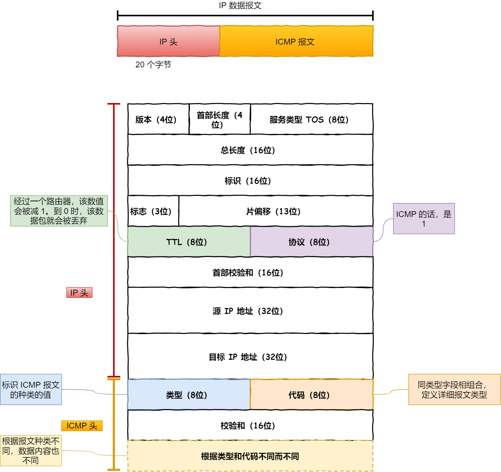

`ICMP` 主要的功能包括：**确认 IP 包是否成功送达目标地址、报告发送过程中 IP 包被废弃的原因和改善网络设置等。**

在 `IP` 通信中如果某个 `IP` 包因为某种原因未能达到目标地址，那么这个具体的原因将**由 ICMP 负责通知**。

ICMP 大致可以分为两大类：

- 一类是用于诊断的查询消息，也就是「**查询报文类型**」
- 另一类是通知出错原因的错误消息，也就是「**差错报文类型**」

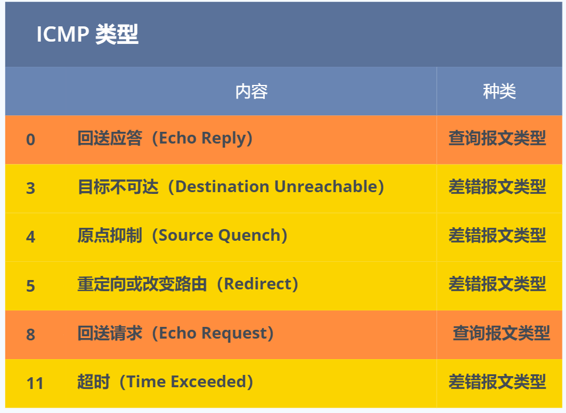

#### IGMP

**IGMP 是因特网组管理协议，工作在主机（组播成员）和最后一跳路由之间**

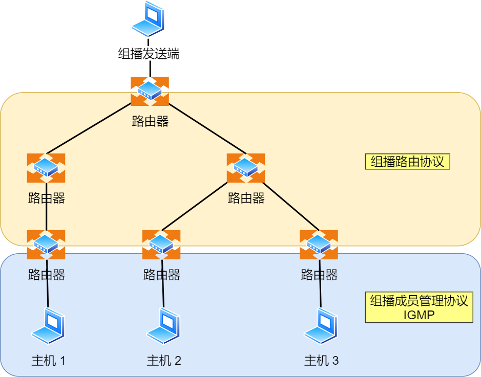

### ping的工作原理

#### 查询报文类型

> 回送消息 —— 类型 `0` 和 `8`

**回送消息**用于进行通信的主机或路由器之间，判断所发送的数据包是否已经成功到达对端的一种消息，`ping` 命令就是利用这个消息实现的。


可以向对端主机发送**回送请求**的消息（`ICMP Echo Request Message`，类型 `8`），也可以接收对端主机发回来的**回送应答**消息（`ICMP Echo Reply Message`，类型 `0`）。


相比原生的 ICMP，这里多了两个字段：

- **标识符**：用以区分是哪个应用程序发 ICMP 包，比如用进程 `PID` 作为标识符；
- **序号**：序列号从 `0` 开始，每发送一次新的回送请求就会加 `1`， 可以用来确认网络包是否有丢失。

在**选项数据**中，`ping` 还会存放发送请求的时间值，来计算往返时间，说明路程的长短。

#### 差错报文类型

几个常用的 ICMP 差错报文的例子：

- 目标不可达消息 —— 类型 为 `3`
- 原点抑制消息 —— 类型 `4`
- 重定向消息 —— 类型 `5`
- 超时消息 —— 类型 `11`

IP 路由器无法将 IP 数据包发送给目标地址时，会给发送端主机返回一个**目标不可达**的 ICMP 消息，并在这个消息中显示不可达的具体原因，原因记录在 ICMP 包头的**代码**字段。

由此，根据 ICMP 不可达的具体消息，发送端主机也就可以了解此次发送**不可达的具体原因**。

举例 6 种常见的目标不可达类型的**代码**：

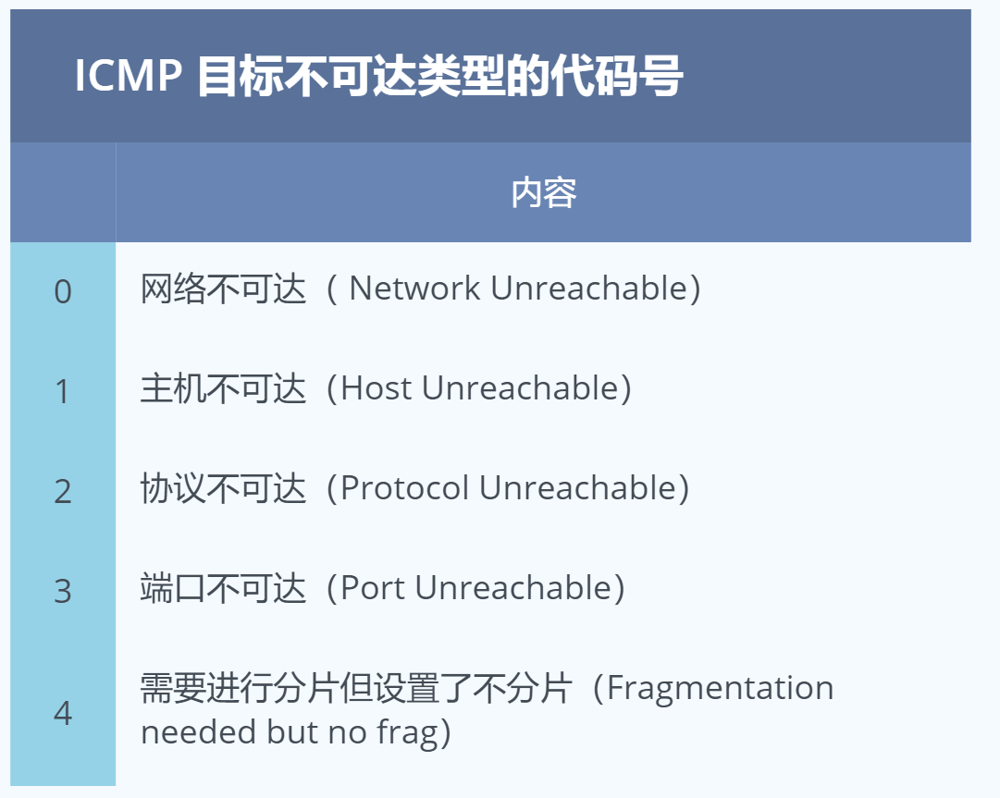

#### ping——查询报文类型的使用

ping 命令执行的时候，源主机首先会构建一个 **ICMP 回送请求消息**数据包。

ICMP 数据包内包含多个字段，最重要的是两个：

- 第一个是**类型**，对于回送请求消息而言该字段为 `8`；
- 另外一个是**序号**，主要用于区分连续 ping 的时候发出的多个数据包。

每发出一个请求数据包，序号会自动加 `1`。为了能够计算往返时间 `RTT`，它会在报文的数据部分插入发送时间。


然后，由 ICMP 协议将这个数据包连同地址 192.168.1.2 一起交给 IP 层。IP 层将以 192.168.1.2 作为**目的地址**，本机 IP 地址作为**源地址**，**协议**字段设置为 `1` 表示是 `ICMP` 协议，再加上一些其他控制信息，构建一个 `IP` 数据包。


接下来，需要加入 `MAC` 头。如果在本地 ARP 映射表中查找出 IP 地址 192.168.1.2 所对应的 MAC 地址，则可以直接使用；如果没有，则需要发送 `ARP` 协议查询 MAC 地址，获得 MAC 地址后，由数据链路层构建一个数据帧，目的地址是 IP 层传过来的 MAC 地址，源地址则是本机的 MAC 地址；还要附加上一些控制信息，依据以太网的介质访问规则，将它们传送出去。


主机 `B` 收到这个数据帧后，先检查它的目的 MAC 地址，并和本机的 MAC 地址对比，如符合，则接收，否则就丢弃。

接收后检查该数据帧，将 IP 数据包从帧中提取出来，交给本机的 IP 层。同样，IP 层检查后，将有用的信息提取后交给 ICMP 协议。

主机 `B` 会构建一个 **ICMP 回送响应消息**数据包，回送响应数据包的**类型**字段为 `0`，**序号**为接收到的请求数据包中的序号，然后再发送出去给主机 A。


在规定的时候间内，源主机如果没有接到 ICMP 的应答包，则说明目标主机不可达；如果接收到了 ICMP 回送响应消息，则说明目标主机可达。

此时，源主机会检查，用当前时刻减去该数据包最初从源主机上发出的时刻，就是 ICMP 数据包的时间延迟。

# 操作系统

## 硬件结构

### 冯诺依曼模型

计算机基本结构为 5 个部分，分别是**运算器、控制器、存储器、输入设备、输出设备**，这 5 个部分也被称为**冯诺依曼模型**。存储单元和输入输出设备要与中央处理器打交道的话，离不开总线。所以，它们之间的关系如下图：

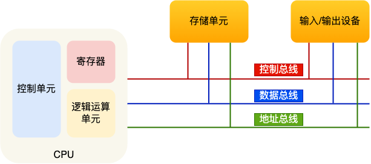

**内存**

我们的程序和数据都是存储在内存，存储的区域是线性的。

在计算机数据存储中，存储数据的基本单位是**字节（\*byte\*）**，1 字节等于 8 位（8 bit）。每一个字节都对应一个内存地址。

内存的地址是从 0 开始编号的，然后自增排列，最后一个地址为内存总字节数 - 1，这种结构好似我们程序里的数组，所以内存的读写任何一个数据的速度都是一样的。

**中央处理器**

中央处理器也就是我们常说的 CPU，32 位和 64 位 CPU 最主要区别在于一次能计算多少字节数据：

- **32 位 CPU 一次可以计算 4 个字节；**
- **64 位 CPU 一次可以计算 8 个字节；**

> 这里的 32 位和 64 位，通常称为 CPU 的位宽。之所以 CPU 要这样设计，是为了能计算更大的数值，如果是 8 位的 CPU，就无法一次完成计算 `10000 * 500` 。 32 位 CPU 能计算的最大整数是 `4294967295`。

CPU 内部还有一些组件，常见的有**寄存器、控制单元和逻辑运算单元**等。其中，寄存器负责存储计算时的数据，控制单元负责控制 CPU 工作，逻辑运算单元负责计算。（内存离 CPU 太远了，而寄存器就在 CPU 里，还紧挨着控制单元和逻辑运算单元，自然计算时速度会很快）

常见的寄存器种类：

- *通用寄存器*，用来存放需要进行**运算的数据**，比如需要进行加和运算的两个数据。
- *程序计数器*，用来存储 CPU 要执行下一条指令「所在的内存地址」，注意不是存储了下一条要执行的指令，此时指令还在内存中，程序计数器只是存储了**下一条指令「的地址」**。
- *指令寄存器*，用来存放**当前正在执行的指令**，也就是指令本身，指令被执行完成之前，指令都存储在这里。

**总线**

总线是用于 CPU 和内存以及其他设备之间的通信，总线可分为 3 种：

- *地址总线*，用于指定 CPU 将要操作的内存地址；
- *数据总线*，用于读写内存的数据；
- *控制总线*，用于发送和接收信号，比如中断、设备复位等信号，CPU 收到信号后自然进行响应，这时也需要控制总线；

当 CPU 要读写内存数据的时候，一般需要通过下面这三个总线：

- 首先要通过「地址总线」来指定内存的地址；
- 然后通过「控制总线」控制是读或写命令；
- 最后通过「数据总线」来传输数据；

**输入、输出设备**

输入设备向计算机输入数据，计算机经过计算后，把数据输出给输出设备。期间，如果输入设备是键盘，按下按键时是需要和 CPU 进行交互的，这时就需要用到控制总线了。

### 位宽

*线路位宽*

线路通过操作电压传输数据，低电压表示 0，高压电压则表示 1。如果只有一条线路，就意味着每次只能传递 1 bit 的数据，即 0 或 1，这样的效率非常低。这样一位一位传输的方式，称为串行，下一个 bit 必须等待上一个 bit 传输完成才能进行传输。当然，想一次多传一些数据，增加线路即可，这时数据就可以并行传输。

为了避免低效率的串行传输的方式，线路的位宽最好一次就能访问到所有的内存地址。

CPU 想要操作「内存地址」就需要「地址总线」：

- 如果地址总线只有 1 条，那每次只能表示 「0 或 1」这两种地址，所以 CPU 能操作的内存地址最大数量为 2（2^1）个（**注意，不要理解成同时能操作 2 个内存地址**）；
- 如果地址总线有 2 条，那么能表示 00、01、10、11 这四种地址，所以 CPU 能操作的内存地址最大数量为 4（2^2）个。

那么，想要 **CPU 操作 4G 大的内存，那么就需要 32 条地址总线**，因为 `2 ^ 32 = 4G`（2^32^个地址即2^32^个字节，因为一个字节一个地址）。

*cpu位宽*

**CPU 的位宽最好不要小于线路位宽**，比如 32 位 CPU 控制 40 位宽的地址总线和数据总线的话，工作起来就会非常复杂且麻烦，所以 32 位的 CPU 最好和 32 位宽的线路搭配，因为 32 位 CPU 一次最多只能操作 32 位宽的地址总线和数据总线。

如果用 32 位 CPU 去加和两个 64 位大小的数字，就需要把这 2 个 64 位的数字分成 2 个低位 32 位数字和 2 个高位 32 位数字来计算，先加个两个低位的 32 位数字，算出进位，然后加和两个高位的 32 位数字，最后再加上进位，就能算出结果了，可以发现 32 位 CPU 并不能一次性计算出加和两个 64 位数字的结果。

对于 64 位 CPU 就可以一次性算出加和两个 64 位数字的结果，因为 64 位 CPU 可以一次读入 64 位的数字，并且 64 位 CPU 内部的逻辑运算单元也支持 64 位数字的计算。

但是并不代表 64 位 CPU 性能比 32 位 CPU 高很多，很少应用需要算超过 32 位的数字，所以**如果计算的数额不超过 32 位数字的情况下，32 位和 64 位 CPU 之间没什么区别的，只有当计算超过 32 位数字的情况下，64 位的优势才能体现出来**。

另外，32 位 CPU 最大只能操作 4GB 内存，就算你装了 8 GB 内存条，也没用。而 64 位 CPU 寻址范围则很大，理论最大的寻址空间为 `2^64`。

### 程序执行的基本过程

- 第一步，CPU 读取「程序计数器」的值，这个值是指令的内存地址，然后 CPU 的「控制单元」操作「地址总线」指定需要访问的内存地址，接着通知内存设备准备数据，数据准备好后通过「数据总线」将指令数据传给 CPU，CPU 收到内存传来的数据后，将这个指令数据存入到「指令寄存器」。
- 第二步，「程序计数器」的值自增，表示指向下一条指令。这个自增的大小，由 CPU 的位宽决定，比如 **32 位的 CPU，指令是 4 个字节，需要 4 个内存地址存放，因此「程序计数器」的值会自增 4**；
- 第三步，CPU 分析「指令寄存器」中的指令，确定指令的类型和参数，如果是计算类型的指令，就把指令交给「逻辑运算单元」运算；如果是存储类型的指令，则交由「控制单元」执行；

简单总结一下就是，**一个程序执行的时候，CPU 会根据程序计数器里的内存地址，从内存里面把需要执行的指令读取到指令寄存器里面执行，然后根据指令长度自增，开始顺序读取下一条指令**。

CPU 从程序计数器读取指令、到执行、再到下一条指令，这个过程会不断循环，直到程序执行结束，这个不断循环的过程被称为 **CPU 的指令周期**。

### a=1+2执行具体过程

程序编译过程中，编译器通过分析代码，发现 1 和 2 是数据，于是程序运行时，内存会有个专门的区域来存放这些数据，这个区域就是「数据段」。如下图，数据 1 和 2 的区域位置：

- 数据 1 被存放到 0x200 位置；
- 数据 2 被存放到 0x204 位置；

注意，数据和指令是分开区域存放的，存放指令区域的地方称为「正文段」。

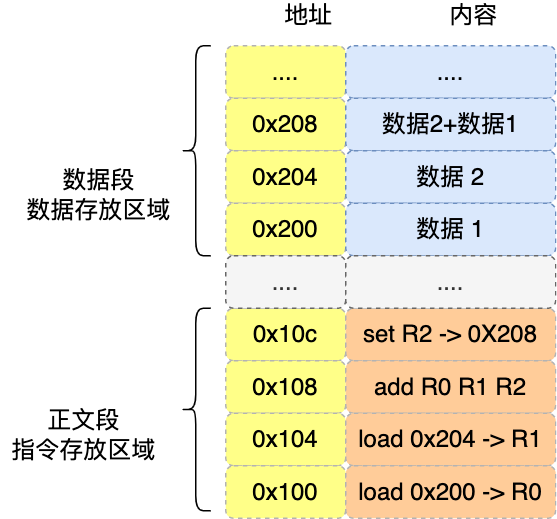

编译器会把 `a = 1 + 2` 翻译成 4 条指令，存放到正文段中。如图，这 4 条指令被存放到了 0x100 ~ 0x10c 的区域中：

- 0x100 的内容是 `load` 指令将 0x200 地址中的数据 1 装入到寄存器 `R0`；
- 0x104 的内容是 `load` 指令将 0x204 地址中的数据 2 装入到寄存器 `R1`；
- 0x108 的内容是 `add` 指令将寄存器 `R0` 和 `R1` 的数据相加，并把结果存放到寄存器 `R2`；
- 0x10c 的内容是 `store` 指令将寄存器 `R2` 中的数据存回数据段中的 0x208 地址中，这个地址也就是变量 `a` 内存中的地址；

> 事实上指令的内容是一串二进制数字的机器码，写成load等是为了便于理解。

上面的例子中，由于是在 32 位 CPU 执行的，因此一条指令是占 32 位大小，所以你会发现每条指令间隔 4 个字节。

而数据的大小是根据你在程序中指定的变量类型，比如 `int` 类型的数据则占 4 个字节，`char` 类型的数据则占 1 个字节。

指令从功能角度划分，可以分为 5 大类：

- *数据传输类型的指令*，比如 `store/load` 是寄存器与内存间数据传输的指令，`mov` 是将一个内存地址的数据移动到另一个内存地址的指令；
- *运算类型的指令*，比如加减乘除、位运算、比较大小等等，它们最多只能处理两个寄存器中的数据；
- *跳转类型的指令*，通过修改程序计数器的值来达到跳转执行指令的过程，比如编程中常见的 `if-else`、`switch-case`、函数调用等。
- *信号类型的指令*，比如发生中断的指令 `trap`；
- *闲置类型的指令*，比如指令 `nop`，执行后 CPU 会空转一个周期；

### 如何提高CPU执行速度

程序执行的时候，耗费的 CPU 时间少就说明程序是快的，对于程序的 CPU 执行时间，我们可以拆解成 **CPU 时钟周期数（*CPU Cycles*）和时钟周期时间（*Clock Cycle Time，即主频，如2.4GHz*）的乘积**。


受摩尔定律和成本限制，时钟周期时间很难提高。如果能减少程序所需的 CPU 时钟周期数量，一样也是能提升程序的性能的。

对于 CPU 时钟周期数我们可以进一步拆解成：「**指令数 x 每条指令的平均时钟周期数（\*Cycles Per Instruction\*，简称 `CPI`）**」，于是程序的 CPU 执行时间的公式可变成如下：


因此，要想程序跑的更快，优化这三者即可：

- *指令数*，表示执行程序所需要多少条指令，以及哪些指令。这个层面是基本靠编译器来优化，毕竟同样的代码，在不同的编译器，编译出来的计算机指令会有各种不同的表示方式。
- *每条指令的平均时钟周期数 CPI*，表示一条指令需要多少个时钟周期数，现代大多数 CPU 通过流水线技术（Pipeline），让一条指令需要的 CPU 时钟周期数尽可能的少；
- *时钟周期时间*，表示计算机主频，取决于计算机硬件。有的 CPU 支持超频技术，打开了超频意味着把 CPU 内部的时钟给调快了，于是 CPU 工作速度就变快了，但是也是有代价的，CPU 跑的越快，散热的压力就会越大，CPU 会很容易崩溃。

### 如何写出让CPU跑得更快的代码？

由于随着计算机技术的发展，CPU 与 内存的访问速度相差越来越多，如今差距已经高达好几百倍了，所以 CPU 内部嵌入了 CPU Cache 组件，作为内存与 CPU 之间的缓存层，CPU Cache 由于离 CPU 核心很近，所以访问速度也是非常快的，但由于所需材料成本比较高，它不像内存动辄几个 GB 大小，而是仅有几十 KB 到 MB 大小。

当 CPU 访问数据的时候，先是访问 CPU Cache，如果缓存命中的话，则直接返回数据，就不用每次都从内存读取数据了。因此，缓存命中率越高，代码的性能越好。

但需要注意的是，当 CPU 访问数据时，如果 CPU Cache 没有缓存该数据，则会从内存读取数据，但是并不是只读一个数据，而是一次性读取一块一块的数据存放到 CPU Cache 中，之后才会被 CPU 读取。

内存地址映射到 CPU Cache 地址里的策略有很多种，其中比较简单是直接映射 Cache，它巧妙的把内存地址拆分成「索引 + 组标记 + 偏移量」的方式，使得我们可以将很大的内存地址，映射到很小的 CPU Cache 地址里。

要想写出让 CPU 跑得更快的代码，就需要写出缓存命中率高的代码，CPU L1 Cache 分为数据缓存和指令缓存，因而需要分别提高它们的缓存命中率：

- 对于数据缓存，我们在遍历数据的时候，应该按照内存布局的顺序操作，这是因为 CPU Cache 是根据 CPU Cache Line 批量操作数据的，所以顺序地操作连续内存数据时，性能能得到有效的提升；
- 对于指令缓存，有规律的条件分支语句能够让 CPU 的分支预测器发挥作用，进一步提高执行的效率；

另外，对于多核 CPU 系统，线程可能在不同 CPU 核心来回切换，这样各个核心的缓存命中率就会受到影响，于是要想提高线程的缓存命中率，可以考虑把线程绑定 CPU 到某一个 CPU 核心。

### 中断

> 在计算机中，中断是系统用来响应硬件设备请求的一种机制，操作系统收到硬件的中断请求，会打断正在执行的进程，然后调用内核中的中断处理程序来响应请求。中断是一种异步的事件处理机制，可以提高系统的并发处理能力。

操作系统收到了中断请求，会打断其他进程的运行，所以**中断请求的响应程序，也就是中断处理程序，要尽可能快的执行完，这样可以减少对正常进程运行调度地影响。**

而且，中断处理程序在响应中断时，可能还会「临时关闭中断」，这意味着，如果当前中断处理程序没有执行完之前，系统中其他的中断请求都无法被响应，也就说中断有可能会丢失，所以中断处理程序要短且快。

### 软中断

Linux 系统**为了解决中断处理程序执行过长和中断丢失的问题，将中断过程分成了两个阶段，分别是「上半部和下半部分」**。

- **上半部用来快速处理中断**，一般会暂时关闭中断请求，主要负责处理跟硬件紧密相关或者时间敏感的事情。
- **下半部用来延迟处理上半部未完成的工作**，一般以「内核线程」的方式运行。

中断处理程序的上部分和下半部可以理解为：

- **上半部直接处理硬件请求，也就是硬中断**，主要是负责耗时短的工作，特点是快速执行；
- **下半部是由内核触发，也就说软中断**，主要是负责上半部未完成的工作，通常都是耗时比较长的事情，特点是延迟执行；

还有一个区别，硬中断（上半部）是会打断 CPU 正在执行的任务，然后立即执行中断处理程序，而软中断（下半部）是以内核线程的方式执行，并且每一个 CPU 都对应一个软中断内核线程，名字通常为「ksoftirqd/CPU 编号」，比如 0 号 CPU 对应的软中断内核线程的名字是 `ksoftirqd/0`

不过，软中断不只是包括硬件设备中断处理程序的下半部，一些内核自定义事件也属于软中断，比如内核调度等、RCU 锁（内核里常用的一种锁）等。

## 操作系统结构

### 内核

计算机是由各种外部硬件设备组成的，比如内存、cpu、硬盘等，如果每个应用都要和这些硬件设备对接通信协议，那这样太累了，所以这个中间人就由内核来负责，**让内核作为应用连接硬件设备的桥梁**，应用程序只需关心与内核交互，不用关心硬件的细节。

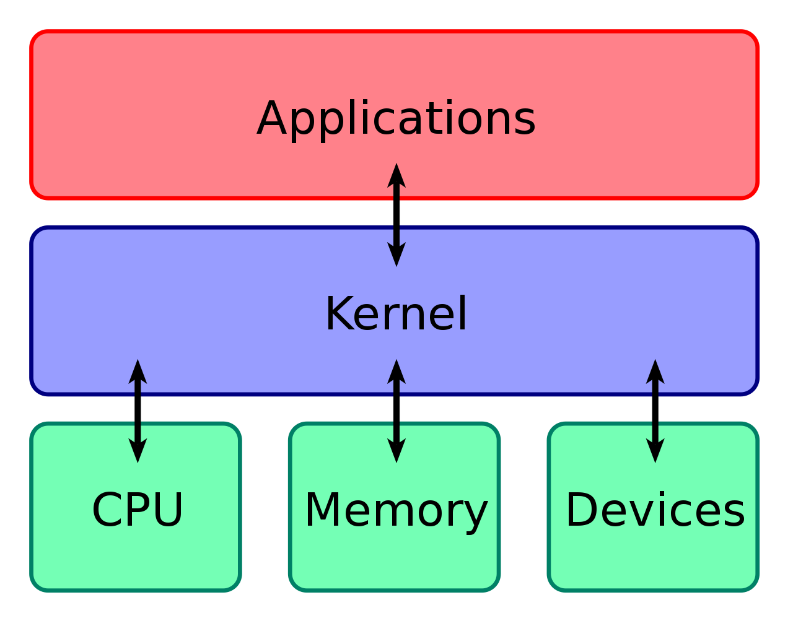

现代操作系统，内核一般会提供 4 个基本能力：

- 管理进程、线程，决定哪个进程、线程使用 CPU，也就是*进程调度*的能力；
- 管理内存，决定内存的分配和回收，也就是*内存管理*的能力；
- 管理硬件设备，为进程与硬件设备之间提供通信能力，也就是*硬件通信*能力；
- *提供系统调用*，如果应用程序要运行更高权限运行的服务，那么就需要有系统调用，它是*用户程序与操作系统之间的接口*。

内核具有很高的权限，可以控制 cpu、内存、硬盘等硬件，而应用程序具有的权限很小，因此大多数操作系统，把内存分成了两个区域：

- *内核空间，这个内存空间只有内核程序可以访问；*
- *用户空间，这个内存空间专门给应用程序使用；*

**用户空间的代码只能访问一个局部的内存空间，而内核空间的代码可以访问所有内存空间。**因此，当程序使用用户空间时，我们常说该程序在**用户态**执行，而当程序使内核空间时，程序则在**内核态**执行。

应用程序如果需要进入内核空间，就需要通过系统调用，下面来看看系统调用的过程：

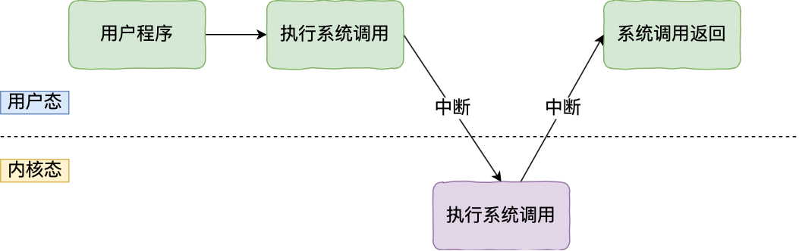

内核程序执行在内核态，用户程序执行在用户态。当应用程序使用系统调用时，会产生一个中断。发生中断后， CPU 会中断当前在执行的用户程序，转而跳转到中断处理程序，也就是开始执行内核程序。内核处理完后，主动触发中断，把 CPU 执行权限交回给用户程序，回到用户态继续工作。

### linux设计

Linux 内核设计的理念主要有这几个点：

- *MultiTask*，多任务：意味着可以有多个任务同时执行，这里的「同时」可以是并发或并行
  - 对于单核 CPU 时，可以让每个任务执行一小段时间，时间到就切换另外一个任务，从宏观角度看，一段时间内执行了多个任务，这被称为并发。
  - 对于多核 CPU 时，多个任务可以同时被不同核心的 CPU 同时执行，这被称为并行。
- *SMP*，对称多处理：代表着每个 CPU 的地位是相等的，对资源的使用权限也是相同的，多个 CPU 共享同一个内存，每个 CPU 都可以访问完整的内存和硬件资源。
- *ELF*，可执行文件链接格式，它是 Linux 操作系统中可执行文件的存储格式。
- *Monolithic Kernel*，宏内核：Linux 内核架构就是宏内核，意味着 Linux 的内核是一个完整的可执行程序，且拥有最高的权限。宏内核的特征是*系统内核的所有模块*，比如进程调度、内存管理、文件系统、设备驱动等，*都运行在内核态*。与宏内核相反的是**微内核**，微内核架构的内核*只保留最基本的能力*，比如进程调度、虚拟机内存、中断等，*把一些应用放到了用户空间*，比如驱动程序、文件系统等。这样服务与服务之间是隔离的，单个服务出现故障或者完全攻击，也不会导致整个操作系统挂掉，提高了操作系统的稳定性和可靠性。华为的鸿蒙操作系统的内核架构就是微内核。还有一种内核叫**混合类型内核**，它的架构有点像微内核，*内核里面会有一个最小版本的内核，然后其他模块会在这个基础上搭建*，然后实现的时候会跟宏内核类似，也就是把整个内核做成一个完整的程序，大部分服务都在内核中，这就像是宏内核的方式包裹着一个微内核。

## 内存管理

我们可以把进程所使用的地址「隔离」开来，即让操作系统为每个进程分配独立的一套「**虚拟地址**」，人人都有，大家自己玩自己的地址就行，互不干涉。但是有个前提每个进程都不能访问物理地址，至于虚拟地址最终怎么落到物理内存里，对进程来说是透明的，操作系统已经把这些都安排的明明白白了。


**操作系统会提供一种机制，将不同进程的虚拟地址和不同内存的物理地址映射起来。**

如果程序要访问虚拟地址的时候，由操作系统转换成不同的物理地址，这样不同的进程运行的时候，写入的是不同的物理地址，这样就不会冲突了。

于是，这里就引出了两种地址的概念：

- 我们程序所使用的内存地址叫做**虚拟内存地址**（*Virtual Memory Address*）
- 实际存在硬件里面的空间地址叫**物理内存地址**（*Physical Memory Address*）。

操作系统引入了虚拟内存，进程持有的虚拟地址会通过 CPU 芯片中的内存管理单元（MMU）的映射关系，来转换变成物理地址，然后再通过物理地址访问内存，如下图所示：


> 操作系统是如何管理虚拟地址与物理地址之间的关系？

主要有两种方式，分别是**内存分段和内存分页**，分段是比较早提出的，我们先来看看内存分段。

### 内存分段

程序是由若干个逻辑分段组成的，如可由代码分段、数据分段、栈段、堆段组成。**不同的段是有不同的属性的，所以就用分段（*Segmentation*）的形式把这些段分离出来。**

分段机制下的虚拟地址由两部分组成，**段选择因子**和**段内偏移量**。


- **段选择因子**就保存在段寄存器里面。段选择因子里面最重要的是**段号**，用作段表的索引。**段表**里面保存的是这个**段的基地址、段的界限和特权等级**等。
- 虚拟地址中的**段内偏移量**应该位于 0 和段界限之间，如果段内偏移量是合法的，就将段基地址加上段内偏移量得到物理内存地址。

在上面，知道了虚拟地址是通过**段表**与物理地址进行映射的，分段机制会把程序的虚拟地址分成 4 个段，每个段在段表中有一个项，在这一项找到段的基地址，再加上偏移量，于是就能找到物理内存中的地址，如下图：


如果要访问段 3 中偏移量 500 的虚拟地址，我们可以计算出物理地址为，段 3 基地址 7000 + 偏移量 500 = 7500。

分段的办法很好，解决了程序本身不需要关心具体的物理内存地址的问题，但它也有一些不足之处：

- 第一个就是**内存碎片**的问题。
- 第二个就是**内存交换的效率低**的问题。

> 我们先来看看，分段为什么会产生内存碎片的问题？

我们来看看这样一个例子。假设有 1G 的物理内存，用户执行了多个程序，其中：

- 游戏占用了 512MB 内存
- 浏览器占用了 128MB 内存
- 音乐占用了 256 MB 内存。

这个时候，如果我们关闭了浏览器，则空闲内存还有 1024 - 512 - 256 = 256MB。

如果这个 256MB 不是连续的，被分成了两段 128 MB 内存，这就会导致没有空间再打开一个 200MB 的程序。


> 内存分段会出现内存碎片吗？

内存碎片主要分为，内部内存碎片和外部内存碎片。

内存分段管理可以做到段根据实际需求分配内存，所以有多少需求就分配多大的段，所以**不会出现内部内存碎片**。

但是由于每个段的长度不固定，所以多个段未必能恰好使用所有的内存空间，会产生了多个不连续的小物理内存，导致新的程序无法被装载，所以**会出现外部内存碎片**的问题。

解决「外部内存碎片」的问题就是**内存交换**。

可以把音乐程序占用的那 256MB 内存写到硬盘上，然后再从硬盘上读回来到内存里。不过再读回的时候，我们不能装载回原来的位置，而是紧紧跟着那已经被占用了的 512MB 内存后面。这样就能空缺出连续的 256MB 空间，于是新的 200MB 程序就可以装载进来。

**这个内存交换空间，在 Linux 系统里，也就是我们常看到的 Swap 空间，这块空间是从硬盘划分出来的，用于内存与硬盘的空间交换。**

> 再来看看，分段为什么会导致内存交换效率低的问题？

对于多进程的系统来说，用分段的方式，外部内存碎片是很容易产生的，产生了外部内存碎片，那不得不重新 `Swap` 内存区域，这个过程会产生性能瓶颈。

因为硬盘的访问速度要比内存慢太多了，每一次内存交换，我们都需要把一大段连续的内存数据写到硬盘上。

所以，**如果内存交换的时候，交换的是一个占内存空间很大的程序，这样整个机器都会显得卡顿。**

为了解决内存分段的「外部内存碎片和内存交换效率低」的问题，就出现了内存分页。

### 内存分页

要解分段的问题，就要想出能少出现一些内存碎片的办法。另外，当需要进行内存交换的时候，让需要交换写入或者从磁盘装载的数据更少一点，这样就可以解决问题了。这个办法，也就是**内存分页**（*Paging*）。

**分页是把整个虚拟和物理内存空间切成一段段固定尺寸的大小**。这样一个连续并且尺寸固定的内存空间，我们叫**页**（*Page*）。在 Linux 下，每一页的大小为 `4KB`。

虚拟地址与物理地址之间通过**页表**来映射，如下图：


页表是存储在内存里的，**内存管理单元** （*MMU*）将虚拟内存地址转换成物理地址。

而当进程访问的虚拟地址在页表中查不到时，系统会产生一个**缺页异常**，进入系统内核空间分配物理内存、更新进程页表，最后再返回用户空间，恢复进程的运行。

> 分页是怎么解决分段的「外部内存碎片和内存交换效率低」的问题？

内存分页由于内存空间都是预先划分好的，也就不会像内存分段一样，在段与段之间会产生间隙非常小的内存，这正是分段会产生外部内存碎片的原因。而**采用了分页，页与页之间是紧密排列的，所以不会有外部碎片。**

但是，因为内存分页机制分配内存的最小单位是一页，即使程序不足一页大小，我们最少只能分配一个页，所以页内会出现内存浪费，所以针对**内存分页机制会有内部内存碎片**的现象。

如果内存空间不够，操作系统会把其他正在运行的进程中的「最近没被使用」的内存页面给释放掉，也就是暂时写在硬盘上，称为**换出**（*Swap Out*）。一旦需要的时候，再加载进来，称为**换入**（*Swap In*）。所以，一次性写入磁盘的也只有少数的一个页或者几个页，不会花太多时间，**内存交换的效率就相对比较高。**


更进一步地，分页的方式使得我们在加载程序的时候，不再需要一次性都把程序加载到物理内存中。我们完全可以在进行虚拟内存和物理内存的页之间的映射之后，并不真的把页加载到物理内存里，而是**只有在程序运行中，需要用到对应虚拟内存页里面的指令和数据时，再加载到物理内存里面去。**

> 分页机制下，虚拟地址和物理地址是如何映射的？

在分页机制下，虚拟地址分为两部分，**页号**和**页内偏移**。页号作为页表的索引，**页表**包含物理页每页所在**物理内存的基地址**，这个基地址与页内偏移的组合就形成了物理内存地址，见下图。


总结一下，对于一个内存地址转换，其实就是这样三个步骤：

- 把虚拟内存地址，切分成页号和偏移量；
- 根据页号，从页表里面，查询对应的物理页号；
- 直接拿物理页号，加上前面的偏移量，就得到了物理内存地址。

> 简单的分页有什么缺陷吗？

有空间上的缺陷。

因为操作系统是可以同时运行非常多的进程的，那这不就意味着页表会非常的庞大。

在 32 位的环境下，虚拟地址空间共有 4GB，假设一个页的大小是 4KB（2^12），那么就需要大约 100 万 （2^20） 个页，每个「页表项」需要 4 个字节大小来存储，那么整个 4GB 空间的映射就需要有 `4MB` 的内存来存储页表。

这 4MB 大小的页表，看起来也不是很大。但是要知道每个进程都是有自己的虚拟地址空间的，也就说都有自己的页表。

那么，`100` 个进程的话，就需要 `400MB` 的内存来存储页表，这是非常大的内存了，更别说 64 位的环境了。

#### 多级页表

要解决上面的问题，就需要采用一种叫作**多级页表**（*Multi-Level Page Table*）的解决方案。

在前面我们知道了，对于单页表的实现方式，在 32 位和页大小 `4KB` 的环境下，一个进程的页表需要装下 100 多万个「页表项」，并且每个页表项是占用 4 字节大小的，于是相当于每个页表需占用 4MB 大小的空间。

我们把这个 100 多万个「页表项」的单级页表再分页，将页表（一级页表）分为 `1024` 个页表（二级页表），每个表（二级页表）中包含 `1024` 个「页表项」，形成**二级分页**。如下图所示：


如果使用了二级分页，一级页表就可以覆盖整个 4GB 虚拟地址空间，但**如果某个一级页表的页表项没有被用到，也就不需要创建这个页表项对应的二级页表了，即可以在需要时才创建二级页表**。做个简单的计算，假设只有 20% 的一级页表项被用到了，那么页表占用的内存空间就只有 4KB（一级页表） + 20% * 4MB（二级页表）= `0.804MB`，这对比单级页表的 `4MB` 是不是一个巨大的节约？

那么为什么不分级的页表就做不到这样节约内存呢？

我们从页表的性质来看，保存在内存中的页表承担的职责是将虚拟地址翻译成物理地址。假如虚拟地址在页表中找不到对应的页表项，计算机系统就不能工作了。所以**页表一定要覆盖全部虚拟地址空间，不分级的页表就需要有 100 多万个页表项来映射，而二级分页则只需要 1024 个页表项**（此时一级页表覆盖到了全部虚拟地址空间，二级页表在需要时创建）。

我们把二级分页再推广到多级页表，就会发现页表占用的内存空间更少了，这一切都要归功于对局部性原理的充分应用。

对于 64 位的系统，两级分页肯定不够了，就变成了四级目录，分别是：

- 全局页目录项 PGD（*Page Global Directory*）；
- 上层页目录项 PUD（*Page Upper Directory*）；
- 中间页目录项 PMD（*Page Middle Directory*）；
- 页表项 PTE（*Page Table Entry*）；

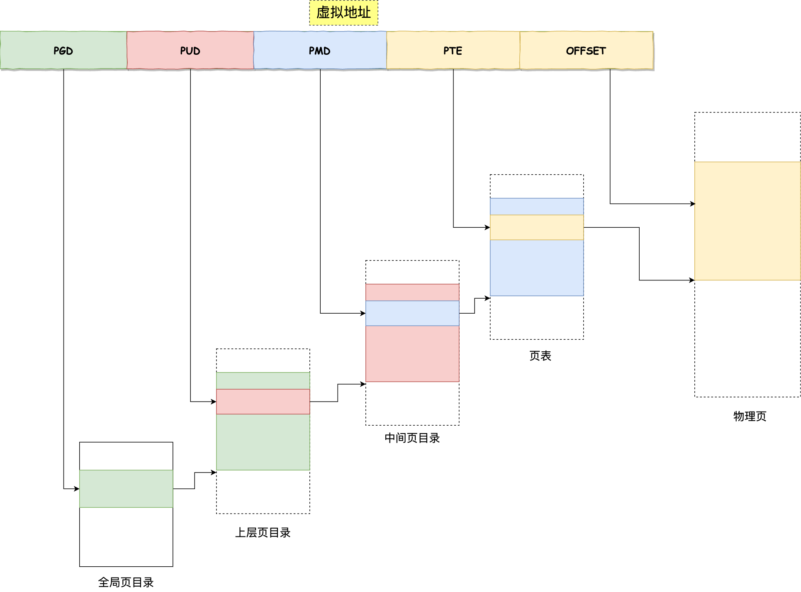

#### TLB

多级页表虽然解决了空间上的问题，但是虚拟地址到物理地址的转换就多了几道转换的工序，这显然就降低了这俩地址转换的速度，也就是带来了时间上的开销。

程序是有局部性的，即在一段时间内，整个程序的执行仅限于程序中的某一部分。相应地，执行所访问的存储空间也局限于某个内存区域。


我们就可以利用这一特性，把最常访问的几个页表项存储到访问速度更快的硬件，于是计算机科学家们，就在 CPU 芯片中，加入了一个专门存放程序最常访问的页表项的 Cache，这个 Cache 就是 TLB（*Translation Lookaside Buffer*） ，通常称为页表缓存、转址旁路缓存、快表等。


在 CPU 芯片里面，封装了内存管理单元（*Memory Management Unit*）芯片，它用来完成地址转换和 TLB 的访问与交互。

有了 TLB 后，那么 CPU 在寻址时，会先查 TLB，如果没找到，才会继续查常规的页表。

TLB 的命中率其实是很高的，因为程序最常访问的页就那么几个。

### 段页式内存管理

内存分段和内存分页并不是对立的，它们是可以组合起来在同一个系统中使用的，那么组合起来后，通常称为**段页式内存管理**。


段页式内存管理实现的方式：

- 先将程序划分为多个有逻辑意义的段，也就是前面提到的分段机制；
- 接着再把每个段划分为多个页，也就是对分段划分出来的连续空间，再划分固定大小的页；

这样，地址结构就由**段号、段内页号和页内位移**三部分组成。

用于段页式地址变换的数据结构是每一个程序一张段表，每个段又建立一张页表，段表中的地址是页表的起始地址，而页表中的地址则为某页的物理页号，如图所示：


段页式地址变换中要得到物理地址须经过三次内存访问：

- 第一次访问段表，得到页表起始地址；
- 第二次访问页表，得到物理页号；
- 第三次将物理页号与页内位移组合，得到物理地址。

可用软、硬件相结合的方法实现段页式地址变换，这样虽然增加了硬件成本和系统开销，但提高了内存的利用率。

### linux内存布局

**Linux 内存主要采用的是页式内存管理，但同时也不可避免地涉及了段机制**。

这主要是 Intel 处理器发展历史导致的，因为 Intel X86 CPU 一律对程序中使用的地址先进行段式映射，然后才能进行页式映射。既然 CPU 的硬件结构是这样，Linux 内核也只好服从 Intel 的选择。

但是事实上，Linux 内核所采取的办法是使段式映射的过程实际上不起什么作用。也就是说，“上有政策，下有对策”，若惹不起就躲着走。

**Linux 把所有段的基地址设为 `0`，也就是所有的段的起始地址都是一样的。这意味着，Linux 系统中的代码，包括操作系统本身的代码和应用程序代码，所面对的地址空间都是线性地址空间（虚拟地址），这种做法相当于屏蔽了处理器中的逻辑地址概念，段只被用于访问控制和内存保护。**

在 Linux 操作系统中，虚拟地址空间的内部又被分为**内核空间和用户空间**两部分，不同位数的系统，地址空间的范围也不同。比如最常见的 32 位和 64 位系统，如下所示：


通过这里可以看出：

- `32` 位系统的内核空间占用 `1G`，位于最高处，剩下的 `3G` 是用户空间；
- `64` 位系统的内核空间和用户空间都是 `128T`，分别占据整个内存空间的最高和最低处，剩下的中间部分是未定义的。

再来说说，内核空间与用户空间的区别：

- 进程在用户态时，只能访问用户空间内存；
- 只有进入内核态后，才可以访问内核空间的内存；

虽然每个进程都各自有独立的虚拟内存，但是**每个虚拟内存中的内核地址，其实关联的都是相同的物理内存**。这样，进程切换到内核态后，就可以很方便地访问内核空间内存。


接下来，进一步了解虚拟空间的划分情况，用户空间和内核空间划分的方式是不同的，内核空间的分布情况就不多说了。

我们看看用户空间分布的情况，以 32 位系统为例：

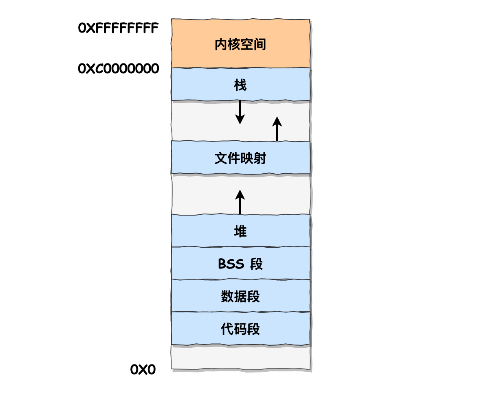

通过这张图你可以看到，用户空间内存，从**低到高**分别是 6 种不同的内存段：

- 代码段，包括二进制可执行代码；
- 数据段，包括已初始化的静态常量和全局变量；
- BSS 段，包括未初始化的静态变量和全局变量；
- 堆段，包括动态分配的内存，从低地址开始向上增长；
- 文件映射段，包括动态库、共享内存等，从低地址开始向上增长（[跟硬件和内核版本有关 (opens new window)](http://lishiwen4.github.io/linux/linux-process-memory-location)）；
- 栈段，包括局部变量和函数调用的上下文等。栈的大小是固定的，一般是 `8 MB`。当然系统也提供了参数，以便我们自定义大小；

上图中的内存布局可以看到，代码段下面还有一段内存空间的（灰色部分），这一块区域是「保留区」，之所以要有保留区这是因为在大多数的系统里，我们认为比较小数值的地址不是一个合法地址，例如，我们通常在 C 的代码里会将无效的指针赋值为 NULL。因此，这里会出现一段不可访问的内存保留区，防止程序因为出现 bug，导致读或写了一些小内存地址的数据，而使得程序跑飞。

在这 7 个内存段中，堆和文件映射段的内存是动态分配的。比如说，使用 C 标准库的 `malloc()` 或者 `mmap()` ，就可以分别在堆和文件映射段动态分配内存。

### 虚拟内存有什么作用？

- 第一，虚拟内存可以使得进程的运行内存超过物理内存大小，因为程序运行符合局部性原理，CPU 访问内存会有很明显的重复访问的倾向性，对于那些没有被经常使用到的内存，我们可以把它换出到物理内存之外，比如硬盘上的 swap 区域。
- 第二，由于每个进程都有自己的页表，所以每个进程的虚拟内存空间就是相互独立的。进程也没有办法访问其他进程的页表，所以这些页表是私有的，这就解决了多进程之间地址冲突的问题。
- 第三，页表里的页表项中除了物理地址之外，还有一些标记属性的比特，比如控制一个页的读写权限，标记该页是否存在等。在内存访问方面，操作系统提供了更好的安全性。

### 内存回收

应用程序通过 malloc 函数申请内存的时候，实际上申请的是虚拟内存，此时并不会分配物理内存。

当应用程序读写了这块虚拟内存，CPU 就会去访问这个虚拟内存， 这时会发现这个虚拟内存没有映射到物理内存， CPU 就会产生**缺页中断**，进程会从用户态切换到内核态，并将缺页中断交给内核的 Page Fault Handler （缺页中断函数）处理。

缺页中断处理函数会看是否有空闲的物理内存，如果有，就直接分配物理内存，并建立虚拟内存与物理内存之间的映射关系。

如果没有空闲的物理内存，那么内核就会开始进行**回收内存**的工作，回收的方式主要是两种：直接内存回收和后台内存回收。

- **后台内存回收**（kswapd）：在物理内存紧张的时候，会唤醒 kswapd 内核线程来回收内存，这个回收内存的过程**异步**的，不会阻塞进程的执行。
- **直接内存回收**（direct reclaim）：如果后台异步回收跟不上进程内存申请的速度，就会开始直接回收，这个回收内存的过程是**同步**的，会阻塞进程的执行。

如果直接内存回收后，空闲的物理内存仍然无法满足此次物理内存的申请，那么内核就会放最后的大招了 ——**触发 OOM （Out of Memory）机制**。

OOM Killer 机制会根据算法选择一个占用物理内存较高的进程，然后将其杀死，以便释放内存资源，如果物理内存依然不足，OOM Killer 会继续杀死占用物理内存较高的进程，直到释放足够的内存位置。


#### 哪些内存可以被回收？

- **文件页**（File-backed Page）：内核缓存的磁盘数据（Buffer）和内核缓存的文件数据（Cache）都叫作文件页。大部分文件页，都可以直接释放内存，以后有需要时，再从磁盘重新读取就可以了。而那些被应用程序修改过，并且暂时还没写入磁盘的数据（也就是脏页），就得先写入磁盘，然后才能进行内存释放。所以，**回收干净页的方式是直接释放内存，回收脏页的方式是先写回磁盘后再释放内存**。
- **匿名页**（Anonymous Page）：这部分内存没有实际载体，不像文件缓存有硬盘文件这样一个载体，比如堆、栈数据等。这部分内存很可能还要再次被访问，所以不能直接释放内存，它们**回收的方式是通过 Linux 的 Swap 机制**，Swap 会把不常访问的内存先写到磁盘中，然后释放这些内存，给其他更需要的进程使用。再次访问这些内存时，重新从磁盘读入内存就可以了。

文件页和匿名页的回收都是基于 LRU 算法，也就是优先回收不常访问的内存。LRU 回收算法，实际上维护着 active 和 inactive 两个双向链表，其中：

- **active_list** 活跃内存页链表，这里存放的是最近被访问过（活跃）的内存页；
- **inactive_list** 不活跃内存页链表，这里存放的是很少被访问（非活跃）的内存页；

越接近链表尾部，就表示内存页越不常访问。这样，在回收内存时，系统就可以根据活跃程度，优先回收不活跃的内存。

#### 回收内存的性能影响？

文件页和匿名页的回收都是基于 LRU 算法，也就是优先回收不常访问的内存。回收内存的操作基本都会发生磁盘 I/O 的，如果回收内存的操作很频繁，意味着磁盘 I/O 次数会很多，这个过程势必会影响系统的性能。

针对回收内存导致的性能影响，常见的解决方式。

- 设置 /proc/sys/vm/swappiness，调整文件页和匿名页的回收倾向，尽量倾向于回收文件页；
- 设置 /proc/sys/vm/min_free_kbytes，调整 kswapd 内核线程异步回收内存的时机；
- 设置 /proc/sys/vm/zone_reclaim_mode，调整 NUMA 架构下内存回收策略，建议设置为 0，这样在回收本地内存之前，会在其他 Node 寻找空闲内存，从而避免在系统还有很多空闲内存的情况下，因本地 Node 的本地内存不足，发生频繁直接内存回收导致性能下降的问题；

在经历完直接内存回收后，空闲的物理内存大小依然不够，那么就会触发 OOM 机制，OOM killer 就会根据每个进程的内存占用情况和 oom_score_adj 的值进行打分，得分最高的进程就会被首先杀掉。

我们可以通过调整进程的 /proc/[pid]/oom_score_adj 值，来降低被 OOM killer 杀掉的概率。

### 缓存失效和缓存污染

#### Linux 操作系统的缓存

在应用程序读取文件的数据的时候，Linux 操作系统是会对读取的文件数据进行缓存的，会缓存在文件系统中的 **Page Cache**（如下图中的页缓存）。


Page Cache 属于内存空间里的数据，由于内存访问比磁盘访问快很多，在下一次访问相同的数据就不需要通过磁盘 I/O 了，命中缓存就直接返回数据即可。

因此，Page Cache 起到了加速访问数据的作用。

#### MySQL 的缓存

MySQL 的数据是存储在磁盘里的，为了提升数据库的读写性能，Innodb 存储引擎设计了一个**缓冲池**（Buffer Pool），Buffer Pool 属于内存空间里的数据。


有了缓冲池后：

- 当读取数据时，如果数据存在于 Buffer Pool 中，客户端就会直接读取 Buffer Pool 中的数据，否则再去磁盘中读取。
- 当修改数据时，首先是修改 Buffer Pool 中数据所在的页，然后将其页设置为脏页，最后由后台线程将脏页写入到磁盘。

#### 传统 LRU 是如何管理内存数据的？

Linux 的 Page Cache 和 MySQL 的 Buffer Pool 的大小是有限的，并不能无限的缓存数据，对于一些频繁访问的数据我们希望可以一直留在内存中，而一些很少访问的数据希望可以在某些时机可以淘汰掉，从而保证内存不会因为满了而导致无法再缓存新的数据，同时还能保证常用数据留在内存中。

要实现这个，最容易想到的就是 LRU（Least recently used）算法。

LRU 算法一般是用「链表」作为数据结构来实现的，链表头部的数据是最近使用的，而链表末尾的数据是最久没被使用的。那么，当空间不够了，就淘汰最久没被使用的节点，也就是链表末尾的数据，从而腾出内存空间。

因为 Linux 的 Page Cache 和 MySQL 的 Buffer Pool 缓存的**基本数据单位都是页（Page）单位**，所以**后续以「页」名称代替「数据」**。

传统的 LRU 算法的实现思路是这样的：

- 当访问的页在内存里，就直接把该页对应的 LRU 链表节点移动到链表的头部。
- 当访问的页不在内存里，除了要把该页放入到 LRU 链表的头部，还要淘汰 LRU 链表末尾的页。

比如下图，假设 LRU 链表长度为 5，LRU 链表从左到右有编号为 1，2，3，4，5 的页。


如果访问了 3 号页，因为 3 号页已经在内存了，所以把 3 号页移动到链表头部即可，表示最近被访问了。


而如果接下来，访问了 8 号页，因为 8 号页不在内存里，且 LRU 链表长度为 5，所以必须要淘汰数据，以腾出内存空间来缓存 8 号页，于是就会淘汰末尾的 5 号页，然后再将 8 号页加入到头部。


传统的 LRU 算法并没有被 Linux 和 MySQL 使用，因为传统的 LRU 算法无法避免下面这两个问题：

- 预读失效导致缓存命中率下降；
- 缓存污染导致缓存命中率下降；

#### 预读失效，怎么办？

##### 什么是预读机制？

Linux 操作系统为基于 Page Cache 的读缓存机制提供**预读机制**，一个例子是：

- 应用程序只想读取磁盘上文件 A 的 offset 为 0-3KB 范围内的数据，由于磁盘的基本读写单位为 block（4KB），于是操作系统至少会读 0-4KB 的内容，这恰好可以在一个 page 中装下。
- 但是操作系统出于空间局部性原理（靠近当前被访问数据的数据，在未来很大概率会被访问到），会选择将磁盘块 offset [4KB,8KB)、[8KB,12KB) 以及 [12KB,16KB) 都加载到内存，于是额外在内存中申请了 3 个 page；

下图代表了操作系统的预读机制：


上图中，应用程序利用 read 系统调动读取 4KB 数据，实际上内核使用预读机制（ReadaHead） 机制完成了 16KB 数据的读取，也就是通过一次磁盘顺序读将多个 Page 数据装入 Page Cache。

这样下次读取 4KB 数据后面的数据的时候，就不用从磁盘读取了，直接在 Page Cache 即可命中数据。因此，预读机制带来的好处就是**减少了 磁盘 I/O 次数，提高系统磁盘 I/O 吞吐量**。

MySQL Innodb 存储引擎的 Buffer Pool 也有类似的预读机制，MySQL 从磁盘加载页时，会提前把它相邻的页一并加载进来，目的是为了减少磁盘 IO。

##### 预读失效会带来什么问题？

如果**这些被提前加载进来的页，并没有被访问**，相当于这个预读工作是白做了，这个就是**预读失效**。

如果使用传统的 LRU 算法，就会把「预读页」放到 LRU 链表头部，而当内存空间不够的时候，还需要把末尾的页淘汰掉。

如果这些「预读页」如果一直不会被访问到，就会出现一个很奇怪的问题，**不会被访问的预读页却占用了 LRU 链表前排的位置，而末尾淘汰的页，可能是热点数据，这样就大大降低了缓存命中率** 。

##### 如何避免预读失效造成的影响？

我们不能因为害怕预读失效，而将预读机制去掉，大部分情况下，空间局部性原理还是成立的。

要避免预读失效带来影响，最好就是**让预读页停留在内存里的时间要尽可能的短，让真正被访问的页才移动到 LRU 链表的头部，从而保证真正被读取的热数据留在内存里的时间尽可能长**。

那到底怎么才能避免呢？

Linux 操作系统和 MySQL Innodb 通过改进传统 LRU 链表来避免预读失效带来的影响，具体的改进分别如下：

- Linux 操作系统实现两个了 LRU 链表：**活跃 LRU 链表（active_list）和非活跃 LRU 链表（inactive_list）**；
- MySQL 的 Innodb 存储引擎是在一个 LRU 链表上划分来 2 个区域：**young 区域 和 old 区域**。

这两个改进方式，设计思想都是类似的，**都是将数据分为了冷数据和热数据，然后分别进行 LRU 算法**。不再像传统的 LRU 算法那样，所有数据都只用一个 LRU 算法管理。

接下来，具体聊聊 Linux 和 MySQL 是如何避免预读失效带来的影响？

> Linux 是如何避免预读失效带来的影响？

Linux 操作系统实现两个了 LRU 链表：**活跃 LRU 链表（active_list）和非活跃 LRU 链表（inactive_list）**。

- **active list** 活跃内存页链表，这里存放的是最近被访问过（活跃）的内存页；
- **inactive list** 不活跃内存页链表，这里存放的是很少被访问（非活跃）的内存页；

有了这两个 LRU 链表后，**预读页就只需要加入到 inactive list 区域的头部，当页被真正访问的时候，才将页插入 active list 的头部**。如果预读的页一直没有被访问，就会从 inactive list 移除，这样就不会影响 active list 中的热点数据。

接下来，给大家举个例子。

假设 active list 和 inactive list 的长度为 5，目前内存中已经有如下 10 个页：


现在有个编号为 20 的页被预读了，这个页只会被插入到 inactive list 的头部，而 inactive list 末尾的页（10号）会被淘汰掉。


**即使编号为 20 的预读页一直不会被访问，它也没有占用到 active list 的位置**，而且还会比 active list 中的页更早被淘汰出去。

如果 20 号页被预读后，立刻被访问了，那么就会将它插入到 active list 的头部， active list 末尾的页（5号），会被**降级**到 inactive list ，作为 inactive list 的头部，这个过程并不会有数据被淘汰。


> MySQL 是如何避免预读失效带来的影响？

MySQL 的 Innodb 存储引擎是在一个 LRU 链表上划分来 2 个区域，**young 区域 和 old 区域**。

young 区域在 LRU 链表的前半部分，old 区域则是在后半部分，这两个区域都有各自的头和尾节点，如下图：


young 区域与 old 区域在 LRU 链表中的占比关系并不是一比一的关系，而是 63:37（默认比例）的关系。

**划分这两个区域后，预读的页就只需要加入到 old 区域的头部，当页被真正访问的时候，才将页插入 young 区域的头部**。如果预读的页一直没有被访问，就会从 old 区域移除，这样就不会影响 young 区域中的热点数据。

接下来，给大家举个例子。

假设有一个长度为 10 的 LRU 链表，其中 young 区域占比 70 %，old 区域占比 30 %。


现在有个编号为 20 的页被预读了，这个页只会被插入到 old 区域头部，而 old 区域末尾的页（10号）会被淘汰掉。


如果 20 号页一直不会被访问，它也没有占用到 young 区域的位置，而且还会比 young 区域的数据更早被淘汰出去。

如果 20 号页被预读后，立刻被访问了，那么就会将它插入到 young 区域的头部，young 区域末尾的页（7号），会被挤到 old 区域，作为 old 区域的头部，这个过程并不会有页被淘汰。


#### 缓存污染，怎么办？

##### 什么是缓存污染？

虽然 Linux （实现两个 LRU 链表）和 MySQL （划分两个区域）通过改进传统的 LRU 数据结构，避免了预读失效带来的影响。

但是如果还是使用「只要数据被访问一次，就将数据加入到活跃 LRU 链表头部（或者 young 区域）」这种方式的话，那么**还存在缓存污染的问题**。

当我们在批量读取数据的时候，由于数据被访问了一次，这些大量数据都会被加入到「活跃 LRU 链表」里，然后之前缓存在活跃 LRU 链表（或者 young 区域）里的热点数据全部都被淘汰了，**如果这些大量的数据在很长一段时间都不会被访问的话，那么整个活跃 LRU 链表（或者 young 区域）就被污染了**。

##### 缓存污染会带来什么问题？

缓存污染带来的影响就是很致命的，等这些热数据又被再次访问的时候，由于缓存未命中，就会产生大量的磁盘 I/O，系统性能就会急剧下降。

我以 MySQL 举例子，Linux 发生缓存污染的现象也是类似。

当某一个 SQL 语句**扫描了大量的数据**时，在 Buffer Pool 空间比较有限的情况下，可能会将 **Buffer Pool 里的所有页都替换出去，导致大量热数据被淘汰了**，等这些热数据又被再次访问的时候，由于缓存未命中，就会产生大量的磁盘 I/O，MySQL 性能就会急剧下降。

注意， 缓存污染并不只是查询语句查询出了大量的数据才出现的问题，即使查询出来的结果集很小，也会造成缓存污染。

比如，在一个数据量非常大的表，执行了这条语句：

```sql
select * from t_user where name like "%xiaolin%";
```

可能这个查询出来的结果就几条记录，但是由于这条语句会发生索引失效，所以这个查询过程是全表扫描的，接着会发生如下的过程：

- 从磁盘读到的页加入到 LRU 链表的 old 区域头部；
- 当从页里读取行记录时，也就是**页被访问的时候，就要将该页放到 young 区域头部**；
- 接下来拿行记录的 name 字段和字符串 xiaolin 进行模糊匹配，如果符合条件，就加入到结果集里；
- 如此往复，直到扫描完表中的所有记录。

经过这一番折腾，由于这条 SQL 语句访问的页非常多，每访问一个页，都会将其加入 young 区域头部，那么**原本 young 区域的热点数据都会被替换掉，导致缓存命中率下降**。那些在批量扫描时，而被加入到 young 区域的页，如果在很长一段时间都不会再被访问的话，那么就污染了 young 区域。

举个例子，假设需要批量扫描：21，22，23，24，25 这五个页，这些页都会被逐一访问（读取页里的记录）。


在批量访问这些页的时候，会被逐一插入到 young 区域头部。


可以看到，原本在 young 区域的 6 和 7 号页都被淘汰了，而批量扫描的页基本占满了 young 区域，如果这些页在很长一段时间都不会被访问，那么就对 young 区域造成了污染。

如果 6 和 7 号页是热点数据，那么在被淘汰后，后续有 SQL 再次读取 6 和 7 号页时，由于缓存未命中，就要从磁盘中读取了，降低了 MySQL 的性能，这就是缓存污染带来的影响。

##### 怎么避免缓存污染造成的影响？

前面的 LRU 算法只要数据被访问一次，就将数据加入活跃 LRU 链表（或者 young 区域），**这种 LRU 算法进入活跃 LRU 链表的门槛太低了**！正式因为门槛太低，才导致在发生缓存污染的时候，很容就将原本在活跃 LRU 链表里的热点数据淘汰了。

所以，**只要我们提高进入到活跃 LRU 链表（或者 young 区域）的门槛，就能有效地保证活跃 LRU 链表（或者 young 区域）里的热点数据不会被轻易替换掉**。

Linux 操作系统和 MySQL Innodb 存储引擎分别是这样提高门槛的：

- **Linux 操作系统**：在内存页被访问**第二次**的时候，才将页从 inactive list 升级到 active list 里。

- MySQL Innodb

  ：在内存页被访问

  第二次

  的时候，并不会马上将该页从 old 区域升级到 young 区域，因为还要进行

  停留在 old 区域的时间判断

  ：

  - 如果第二次的访问时间与第一次访问的时间**在 1 秒内**（默认值），那么该页就**不会**被从 old 区域升级到 young 区域；
  - 如果第二次的访问时间与第一次访问的时间**超过 1 秒**，那么该页就**会**从 old 区域升级到 young 区域；

提高了进入活跃 LRU 链表（或者 young 区域）的门槛后，就很好了避免缓存污染带来的影响。

在批量读取数据时候，**如果这些大量数据只会被访问一次，那么它们就不会进入到活跃 LRU 链表（或者 young 区域）**，也就不会把热点数据淘汰，只会待在非活跃 LRU 链表（或者 old 区域）中，后续很快也会被淘汰。

#### 总结

传统的 LRU 算法法无法避免下面这两个问题：

- 预读失效导致缓存命中率下降；
- 缓存污染导致缓存命中率下降；

为了避免「预读失效」造成的影响，Linux 和 MySQL 对传统的 LRU 链表做了改进：

- Linux 操作系统实现两个了 LRU 链表：**活跃 LRU 链表（active list）和非活跃 LRU 链表（inactive list）**。
- MySQL Innodb 存储引擎是在一个 LRU 链表上划分来 2 个区域：**young 区域 和 old 区域**。

但是如果还是使用「只要数据被访问一次，就将数据加入到活跃 LRU 链表头部（或者 young 区域）」这种方式的话，那么**还存在缓存污染的问题**。

为了避免「缓存污染」造成的影响，Linux 操作系统和 MySQL Innodb 存储引擎分别提高了升级为热点数据的门槛：

- Linux 操作系统：在内存页被访问**第二次**的时候，才将页从 inactive list 升级到 active list 里。

- MySQL Innodb：在内存页被访问

  第二次

  的时候，并不会马上将该页从 old 区域升级到 young 区域，因为还要进行

  停留在 old 区域的时间判断

  ：

  - 如果第二次的访问时间与第一次访问的时间**在 1 秒内**（默认值），那么该页就**不会**被从 old 区域升级到 young 区域；
  - 如果第二次的访问时间与第一次访问的时间**超过 1 秒**，那么该页就**会**从 old 区域升级到 young 区域；

通过提高了进入 active list （或者 young 区域）的门槛后，就很好了避免缓存污染带来的影响。

## 进程管理

### 基础知识

#### 进程

我们编写的代码只是一个存储在硬盘的静态文件，通过编译后就会生成二进制可执行文件，当我们运行这个可执行文件后，它会被装载到内存中，接着 CPU 会执行程序中的每一条指令，那么这个**运行中的程序，就被称为「进程」（Process）**。

单核的 CPU 在某一个瞬间，只能运行一个进程。但在 1 秒钟期间，它可能会运行多个进程，这样就产生**并行的错觉**，实际上这是**并发**。

> 并发和并行有什么区别？

一图胜千言。

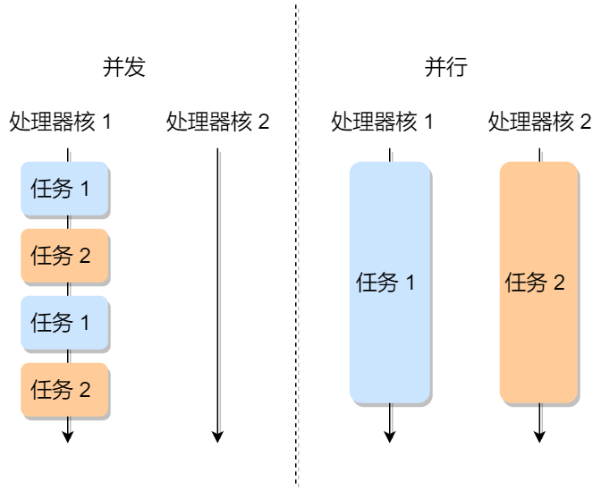

*进程的状态*

**在一个进程的活动期间至少具备三种基本状态，即运行状态、就绪状态、阻塞状态。**


上图中各个状态的意义：

- 运行状态（*Running*）：该时刻进程占用 CPU；
- 就绪状态（*Ready*）：可运行，由于其他进程处于运行状态而暂时停止运行；
- 阻塞状态（*Blocked*）：该进程正在等待某一事件发生（如等待输入/输出操作的完成）而暂时停止运行，这时，即使给它CPU控制权，它也无法运行；

当然，进程还有另外两个基本状态：

- 创建状态（*new*）：进程正在被创建时的状态；
- 结束状态（*Exit*）：进程正在从系统中消失时的状态；

于是，一个完整的进程状态的变迁如下图：


再来详细说明一下进程的状态变迁：

- *NULL -> 创建状态*：一个新进程被创建时的第一个状态；
- *创建状态 -> 就绪状态*：当进程被创建完成并初始化后，一切就绪准备运行时，变为就绪状态，这个过程是很快的；
- *就绪态 -> 运行状态*：处于就绪状态的进程被操作系统的进程调度器选中后，就分配给 CPU 正式运行该进程；
- *运行状态 -> 结束状态*：当进程已经运行完成或出错时，会被操作系统作结束状态处理；
- *运行状态 -> 就绪状态*：处于运行状态的进程在运行过程中，由于分配给它的运行时间片用完，操作系统会把该进程变为就绪态，接着从就绪态选中另外一个进程运行；
- *运行状态 -> 阻塞状态*：当进程请求某个事件且必须等待时，例如请求 I/O 事件；
- *阻塞状态 -> 就绪状态*：当进程要等待的事件完成时，它从阻塞状态变到就绪状态；

如果有大量处于阻塞状态的进程，进程可能会占用着物理内存空间，显然不是我们所希望的，毕竟物理内存空间是有限的，被阻塞状态的进程占用着物理内存就一种浪费物理内存的行为。

所以，在虚拟内存管理的操作系统中，通常会把阻塞状态的进程的物理内存空间换出到硬盘，等需要再次运行的时候，再从硬盘换入到物理内存。


那么，就需要一个新的状态，来**描述进程没有占用实际的物理内存空间的情况，这个状态就是挂起状态**。这跟阻塞状态是不一样，阻塞状态是等待某个事件的返回。

另外，挂起状态可以分为两种：

- 阻塞挂起状态：进程在外存（硬盘）并等待某个事件的出现；
- 就绪挂起状态：进程在外存（硬盘），但只要进入内存，即刻立刻运行；

这两种挂起状态加上前面的五种状态，就变成了七种状态变迁（留给我的颜色不多了），见如下图：


导致进程挂起的原因不只是因为进程所使用的内存空间不在物理内存，还包括如下情况：

- 通过 sleep 让进程间歇性挂起，其工作原理是设置一个定时器，到期后唤醒进程。
- 用户希望挂起一个程序的执行，比如在 Linux 中用 `Ctrl+Z` 挂起进程；

*进程的控制结构*

在操作系统中，是用**进程控制块**（*process control block，PCB*）数据结构来描述进程的。

**PCB 是进程存在的唯一标识**，这意味着一个进程的存在，必然会有一个 PCB，如果进程消失了，那么 PCB 也会随之消失。

> PCB 具体包含什么信息呢？

**进程描述信息：**

- 进程标识符：标识各个进程，每个进程都有一个并且唯一的标识符；
- 用户标识符：进程归属的用户，用户标识符主要为共享和保护服务；

**进程控制和管理信息：**

- 进程当前状态，如 new、ready、running、waiting 或 blocked 等；
- 进程优先级：进程抢占 CPU 时的优先级；

**资源分配清单：**

- 有关内存地址空间或虚拟地址空间的信息，所打开文件的列表和所使用的 I/O 设备信息。

**CPU 相关信息：**

- CPU 中各个寄存器的值，当进程被切换时，CPU 的状态信息都会被保存在相应的 PCB 中，以便进程重新执行时，能从断点处继续执行。

可见，PCB 包含信息还是比较多的。

> 每个 PCB 是如何组织的呢？

通常是通过**链表**的方式进行组织，把具有**相同状态的进程链在一起，组成各种队列**。比如：

- 将所有处于就绪状态的进程链在一起，称为**就绪队列**；
- 把所有因等待某事件而处于等待状态的进程链在一起就组成各种**阻塞队列**；
- 另外，对于运行队列在单核 CPU 系统中则只有一个运行指针了，因为单核 CPU 在某个时间，只能运行一个程序。

那么，就绪队列和阻塞队列链表的组织形式如下图：


除了链接的组织方式，还有索引方式，它的工作原理：将同一状态的进程组织在一个索引表中，索引表项指向相应的 PCB，不同状态对应不同的索引表。

一般会选择链表，因为可能面临进程创建，销毁等调度导致进程状态发生变化，所以链表能够更加灵活的插入和删除。

*进程的上下文切换*

各个进程之间是共享 CPU 资源的，在不同的时候进程之间需要切换，让不同的进程可以在 CPU 执行，那么这个**一个进程切换到另一个进程运行，称为进程的上下文切换**。

> 在详细说进程上下文切换前，我们先来看看 CPU 上下文切换

大多数操作系统都是多任务，通常支持大于 CPU 数量的任务同时运行。实际上，这些任务并不是同时运行的，只是因为系统在很短的时间内，让各个任务分别在 CPU 运行，于是就造成同时运行的错觉。

任务是交给 CPU 运行的，那么在每个任务运行前，CPU 需要知道任务从哪里加载，又从哪里开始运行。

所以，操作系统需要事先帮 CPU 设置好 **CPU 寄存器和程序计数器**。

CPU 寄存器是 CPU 内部一个容量小，但是速度极快的内存（缓存）。我举个例子，寄存器像是你的口袋，内存像你的书包，硬盘则是你家里的柜子，如果你的东西存放到口袋，那肯定是比你从书包或家里柜子取出来要快的多。

再来，程序计数器则是用来存储 CPU 正在执行的指令位置、或者即将执行的下一条指令位置。

所以说，CPU 寄存器和程序计数是 CPU 在运行任何任务前，所必须依赖的环境，这些环境就叫做 **CPU 上下文**。

既然知道了什么是 CPU 上下文，那理解 CPU 上下文切换就不难了。

CPU 上下文切换就是先把前一个任务的 CPU 上下文（CPU 寄存器和程序计数器）保存起来，然后加载新任务的上下文到这些寄存器和程序计数器，最后再跳转到程序计数器所指的新位置，运行新任务。

系统内核会存储保持下来的上下文信息，当此任务再次被分配给 CPU 运行时，CPU 会重新加载这些上下文，这样就能保证任务原来的状态不受影响，让任务看起来还是连续运行。

上面说到所谓的「任务」，主要包含进程、线程和中断。所以，可以根据任务的不同，把 CPU 上下文切换分成：**进程上下文切换、线程上下文切换和中断上下文切换**。

> 进程的上下文切换到底是切换什么呢？

进程是由内核管理和调度的，所以进程的切换只能发生在内核态。

所以，**进程的上下文切换不仅包含了虚拟内存、栈、全局变量等用户空间的资源，还包括了内核堆栈、寄存器等内核空间的资源。**

通常，会把交换的信息保存在进程的 PCB，当要运行另外一个进程的时候，我们需要从这个进程的 PCB 取出上下文，然后恢复到 CPU 中，这使得这个进程可以继续执行，如下图所示：


大家需要注意，进程的上下文开销是很关键的，我们希望它的开销越小越好，这样可以使得进程可以把更多时间花费在执行程序上，而不是耗费在上下文切换。

> 发生进程上下文切换有哪些场景？

- 为了保证所有进程可以得到公平调度，CPU 时间被划分为一段段的时间片，这些时间片再被轮流分配给各个进程。这样，当某个进程的时间片耗尽了，进程就从运行状态变为就绪状态，系统从就绪队列选择另外一个进程运行；
- 进程在系统资源不足（比如内存不足）时，要等到资源满足后才可以运行，这个时候进程也会被挂起，并由系统调度其他进程运行；
- 当进程通过睡眠函数 sleep 这样的方法将自己主动挂起时，自然也会重新调度；
- 当有优先级更高的进程运行时，为了保证高优先级进程的运行，当前进程会被挂起，由高优先级进程来运行；
- 发生硬件中断时，CPU 上的进程会被中断挂起，转而执行内核中的中断服务程序；

#### 线程

**线程是进程当中的一条执行流程。**

同一个进程内多个线程之间可以共享代码段、数据段、打开的文件等资源，但每个线程各自都有一套独立的寄存器和栈，这样可以确保线程的控制流是相对独立的。


> 线程的优缺点？

线程的优点：

- 一个进程中可以同时存在多个线程；
- 各个线程之间可以并发执行；
- 各个线程之间可以共享地址空间和文件等资源；

线程的缺点：

- 当进程中的一个线程崩溃时，会导致其所属进程的所有线程崩溃（这里是针对 C/C++）

> 线程与进程的比较？

线程与进程的比较如下：

- 进程是资源（包括内存、打开的文件等）分配的单位，线程是 CPU 调度的单位；
- 进程拥有一个完整的资源平台，而线程只独享必不可少的资源，如寄存器和栈；
- 线程同样具有就绪、阻塞、执行三种基本状态，同样具有状态之间的转换关系；
- 线程能减少并发执行的时间和空间开销；

对于线程比进程能减少开销，体现在：

- 线程的创建时间比进程快，因为进程在创建的过程中，还需要资源管理信息，比如内存管理信息、文件管理信息，而线程在创建的过程中，不会涉及这些资源管理信息，而是共享它们；
- 线程的终止时间比进程快，因为线程释放的资源相比进程少很多；
- 同一个进程内的线程切换比进程切换快，因为线程具有相同的地址空间（虚拟内存共享），这意味着同一个进程的线程都具有同一个页表，那么在切换的时候不需要切换页表。而对于进程之间的切换，切换的时候要把页表给切换掉，而页表的切换过程开销是比较大的；
- 由于同一进程的各线程间共享内存和文件资源，那么在线程之间数据传递的时候，就不需要经过内核了，这就使得线程之间的数据交互效率更高了；

所以，不管是时间效率，还是空间效率线程比进程都要高。

> 线程的上下文切换？

所谓操作系统的任务调度，实际上的调度对象是线程，而进程只是给线程提供了虚拟内存、全局变量等资源。

对于线程和进程，我们可以这么理解：

- 当进程只有一个线程时，可以认为进程就等于线程；
- 当进程拥有多个线程时，这些线程会共享相同的虚拟内存和全局变量等资源，这些资源在上下文切换时是不需要修改的；

另外，线程也有自己的私有数据，比如栈和寄存器等，这些在上下文切换时也是需要保存的。

> 线程上下文切换，切换了什么东西？

这还得看线程是不是属于同一个进程：

- 当两个线程不是属于同一个进程，则切换的过程就跟进程上下文切换一样；
- **当两个线程是属于同一个进程，因为虚拟内存是共享的，所以在切换时，虚拟内存这些资源就保持不动，只需要切换线程的私有数据、寄存器等不共享的数据**；

所以，线程的上下文切换相比进程，开销要小很多。

> 线程的实现？

主要有三种线程的实现方式：

- **用户线程（*User Thread*）**：在用户空间实现的线程，不是由内核管理的线程，是由用户态的线程库来完成线程的管理；
- **内核线程（*Kernel Thread*）**：在内核中实现的线程，是由内核管理的线程；
- **轻量级进程（*LightWeight Process*）**：在内核中来支持用户线程；

那么，这还需要考虑一个问题，用户线程和内核线程的对应关系。

首先，第一种关系是**多对一**的关系，也就是多个用户线程对应同一个内核线程：


第二种是**一对一**的关系，也就是一个用户线程对应一个内核线程：


第三种是**多对多**的关系，也就是多个用户线程对应到多个内核线程：


> 用户线程如何理解？

用户线程是基于用户态的线程管理库来实现的，那么**线程控制块（\*Thread Control Block, TCB\*）** 也是在库里面来实现的，对于操作系统而言是看不到这个 TCB 的，它只能看到整个进程的 PCB。

所以，**用户线程的整个线程管理和调度，操作系统是不直接参与的，而是由用户级线程库函数来完成线程的管理，包括线程的创建、终止、同步和调度等。**

用户级线程的模型，也就类似前面提到的**多对一**的关系，即多个用户线程对应同一个内核线程，如下图所示：


> 那内核线程如何理解？存在什么优势和缺陷？

**内核线程是由操作系统管理的，线程对应的 TCB 自然是放在操作系统里的，这样线程的创建、终止和管理都是由操作系统负责。**

内核线程的模型，也就类似前面提到的**一对一**的关系，即一个用户线程对应一个内核线程，如下图所示：


> 最后的轻量级进程如何理解？

**轻量级进程（\*Light-weight process，LWP\*）是内核支持的用户线程，一个进程可有一个或多个 LWP，每个 LWP 是跟内核线程一对一映射的，也就是 LWP 都是由一个内核线程支持，而且 LWP 是由内核管理并像普通进程一样被调度**。

在大多数系统中，**LWP与普通进程的区别也在于它只有一个最小的执行上下文和调度程序所需的统计信息**。一般来说，一个进程代表程序的一个实例，而 LWP 代表程序的执行线程，因为一个执行线程不像进程那样需要那么多状态信息，所以 LWP 也不带有这样的信息。

在 LWP 之上也是可以使用用户线程的，那么 LWP 与用户线程的对应关系就有三种：

- `1 : 1`，即一个 LWP 对应 一个用户线程；
- `N : 1`，即一个 LWP 对应多个用户线程；
- `M : N`，即多个 LWP 对应多个用户线程；

LWP 模型：


#### 调度

> 下文的进程指只有主线程的进程，所以调度主线程就等于调度了整个进程。
>
> 而操作系统相关书籍，都是用进程调度这个名字，所以也沿用了这个名字。

选择一个进程运行这一功能是在操作系统中完成的，通常称为**调度程序**（*scheduler*）。

> 调度时机？

在进程的生命周期中，当进程从一个运行状态到另外一状态变化的时候，其实会触发一次调度。

比如，以下状态的变化都会触发操作系统的调度：

- *从就绪态 -> 运行态*：当进程被创建时，会进入到就绪队列，操作系统会从就绪队列选择一个进程运行；
- *从运行态 -> 阻塞态*：当进程发生 I/O 事件而阻塞时，操作系统必须选择另外一个进程运行；
- *从运行态 -> 结束态*：当进程退出结束后，操作系统得从就绪队列选择另外一个进程运行；

因为，这些状态变化的时候，操作系统需要考虑是否要让新的进程给 CPU 运行，或者是否让当前进程从 CPU 上退出来而换另一个进程运行。

另外，如果硬件时钟提供某个频率的周期性中断，那么可以根据如何处理时钟中断 ，把调度算法分为两类：

- **非抢占式调度算法**挑选一个进程，然后让该进程运行直到被阻塞，或者直到该进程退出，才会调用另外一个进程，也就是说不会理时钟中断这个事情。
- **抢占式调度算法**挑选一个进程，然后让该进程只运行某段时间，如果在该时段结束时，该进程仍然在运行时，则会把它挂起，接着调度程序从就绪队列挑选另外一个进程。这种抢占式调度处理，需要在时间间隔的末端发生**时钟中断**，以便把 CPU 控制返回给调度程序进行调度，也就是常说的**时间片机制**。

> 调度原则？


- **CPU 利用率**：调度程序应确保 CPU 是始终匆忙的状态，这可提高 CPU 的利用率；
- **系统吞吐量**：吞吐量表示的是单位时间内 CPU 完成进程的数量，长作业的进程会占用较长的 CPU 资源，因此会降低吞吐量，相反，短作业的进程会提升系统吞吐量；
- **周转时间**：周转时间是进程运行+阻塞时间+等待时间的总和，一个进程的周转时间越小越好；
- **等待时间**：这个等待时间不是阻塞状态的时间，而是进程处于就绪队列的时间，等待的时间越长，用户越不满意；
- **响应时间**：用户提交请求到系统第一次产生响应所花费的时间，在交互式系统中，响应时间是衡量调度算法好坏的主要标准。

说白了，这么多调度原则，目的就是要使得进程要「快」。

### 进程间通信

每个进程的用户地址空间都是独立的，一般而言是不能互相访问的，但内核空间是每个进程都共享的，所以进程之间要通信必须通过内核。


#### 管道

```bash
$ ps auxf | grep mysql
```

上面命令行里的「`|`」竖线就是一个**管道**，它的功能是将前一个命令（`ps auxf`）的输出，作为后一个命令（`grep mysql`）的输入，从这功能描述，可以看出**管道传输数据是单向的**，如果想相互通信，我们需要创建两个管道才行。

同时，我们得知上面这种管道是没有名字，所以「`|`」表示的管道称为**匿名管道**，用完了就销毁。

管道还有另外一个类型是**命名管道**，也被叫做 `FIFO`，因为数据是先进先出的传输方式。

在使用命名管道前，先需要通过 `mkfifo` 命令来创建，并且指定管道名字：

```bash
$ mkfifo myPipe
```

myPipe 就是这个管道的名称，基于 Linux 一切皆文件的理念，所以管道也是以文件的方式存在，我们可以用 ls 看一下，这个文件的类型是 p，也就是 pipe（管道） 的意思：

```bash
$ ls -l
prw-r--r--. 1 root    root         0 Jul 17 02:45 myPipe
```

接下来，我们往 myPipe 这个管道写入数据：

```bash
$ echo "hello" > myPipe  // 将数据写进管道
                         // 停住了 ...
```

你操作了后，你会发现命令执行后就停在这了，这是因为管道里的内容没有被读取，只有当管道里的数据被读完后，命令才可以正常退出。

于是，我们执行另外一个命令来读取这个管道里的数据：

```bash
$ cat < myPipe  // 读取管道里的数据
hello
```

可以看到，管道里的内容被读取出来了，并打印在了终端上，另外一方面，echo 那个命令也正常退出了。

**管道通信方式效率低，不适合进程间频繁地交换数据**。好处是简单，同时也我们很容易得知管道里的数据已经被另一个进程读取了。

**所谓的管道，就是内核里面的一串缓存**。**对于匿名管道，它的通信范围是存在父子关系的进程。对于命名管道，它可以在不相关的进程间也能相互通信**。不管是匿名管道还是命名管道，进程写入的数据都是缓存在内核中，另一个进程读取数据时候自然也是从内核中获取，同时通信数据都遵循**先进先出**原则，不支持 lseek 之类的文件定位操作。

#### 消息队列（非消息中间件）

**消息队列是保存在内核中的消息链表**，在发送数据时，会分成一个一个独立的数据单元，也就是消息体（数据块），消息体是用户自定义的数据类型，消息的发送方和接收方要约定好消息体的数据类型，所以每个消息体都是固定大小的存储块，不像管道是无格式的字节流数据。如果进程从消息队列中读取了消息体，内核就会把这个消息体删除。

消息队列生命周期随内核，如果没有释放消息队列或者没有关闭操作系统，消息队列会一直存在，而前面提到的匿名管道的生命周期，是随进程的创建而建立，随进程的结束而销毁。

#### 共享内存

现代操作系统，对于内存管理，采用的是虚拟内存技术，也就是每个进程都有自己独立的虚拟内存空间，不同进程的虚拟内存映射到不同的物理内存中。所以，即使进程 A 和 进程 B 的虚拟地址是一样的，其实访问的是不同的物理内存地址，对于数据的增删查改互不影响。

**共享内存的机制，就是拿出一块虚拟地址空间来，映射到相同的物理内存中**。这样这个进程写入的东西，另外一个进程马上就能看到了，都不需要拷贝来拷贝去，传来传去，大大提高了进程间通信的速度。


#### 信号量

用了共享内存通信方式，带来新的问题，那就是如果多个进程同时修改同一个共享内存，很有可能就冲突了。例如两个进程都同时写一个地址，那先写的那个进程会发现内容被别人覆盖了。

为了防止多进程竞争共享资源，而造成的数据错乱，所以需要保护机制，使得共享的资源，在任意时刻只能被一个进程访问。正好，**信号量**就实现了这一保护机制。

**信号量其实是一个整型的计数器，主要用于实现进程间的互斥与同步，而不是用于缓存进程间通信的数据**。

信号量表示资源的数量，控制信号量的方式有两种原子操作：

- 一个是 **P 操作**，这个操作会把信号量减去 1，相减后如果信号量 < 0，则表明资源已被占用，进程需阻塞等待；相减后如果信号量 >= 0，则表明还有资源可使用，进程可正常继续执行。
- 另一个是 **V 操作**，这个操作会把信号量加上 1，相加后如果信号量 <= 0，则表明当前有阻塞中的进程，于是会将唤醒该阻塞进程；相加后如果信号量 > 0，则表明当前没有阻塞中的进程；

**P 操作是用在进入共享资源之前，V 操作是用在离开共享资源之后，这两个操作是必须成对出现的。**

#### 信号

**对于异常情况下的工作模式，就需要用「信号」的方式来通知进程。**

信号跟信号量虽然名字相似度 66.66%，但两者用途完全不一样，就好像 Java 和 JavaScript 的区别。

在 Linux 操作系统中， 为了响应各种各样的事件，提供了几十种信号，分别代表不同的意义。我们可以通过 `kill -l` 命令，查看所有的信号：

```shell
$ kill -l
 1) SIGHUP       2) SIGINT       3) SIGQUIT      4) SIGILL       5) SIGTRAP
 6) SIGABRT      7) SIGBUS       8) SIGFPE       9) SIGKILL     10) SIGUSR1
11) SIGSEGV     12) SIGUSR2     13) SIGPIPE     14) SIGALRM     15) SIGTERM
16) SIGSTKFLT   17) SIGCHLD     18) SIGCONT     19) SIGSTOP     20) SIGTSTP
21) SIGTTIN     22) SIGTTOU     23) SIGURG      24) SIGXCPU     25) SIGXFSZ
26) SIGVTALRM   27) SIGPROF     28) SIGWINCH    29) SIGIO       30) SIGPWR
31) SIGSYS      34) SIGRTMIN    35) SIGRTMIN+1  36) SIGRTMIN+2  37) SIGRTMIN+3
38) SIGRTMIN+4  39) SIGRTMIN+5  40) SIGRTMIN+6  41) SIGRTMIN+7  42) SIGRTMIN+8
43) SIGRTMIN+9  44) SIGRTMIN+10 45) SIGRTMIN+11 46) SIGRTMIN+12 47) SIGRTMIN+13
48) SIGRTMIN+14 49) SIGRTMIN+15 50) SIGRTMAX-14 51) SIGRTMAX-13 52) SIGRTMAX-12
53) SIGRTMAX-11 54) SIGRTMAX-10 55) SIGRTMAX-9  56) SIGRTMAX-8  57) SIGRTMAX-7
58) SIGRTMAX-6  59) SIGRTMAX-5  60) SIGRTMAX-4  61) SIGRTMAX-3  62) SIGRTMAX-2
63) SIGRTMAX-1  64) SIGRTMAX
```

信号是进程间通信机制中**唯一的异步通信机制**，因为可以在任何时候发送信号给某一进程，一旦有信号产生，我们就有下面这几种，用户进程对信号的处理方式。

**1.执行默认操作**。Linux 对每种信号都规定了默认操作，例如，上面列表中的 SIGTERM 信号，就是终止进程的意思。

**2.捕捉信号**。我们可以为信号定义一个信号处理函数。当信号发生时，我们就执行相应的信号处理函数。

**3.忽略信号**。当我们不希望处理某些信号的时候，就可以忽略该信号，不做任何处理。有两个信号是应用进程无法捕捉和忽略的，即 `SIGKILL` 和 `SEGSTOP`，它们用于在任何时候中断或结束某一进程。

#### socket

前面提到的管道、消息队列、共享内存、信号量和信号都是在同一台主机上进行进程间通信，那要想**跨网络与不同主机上的进程之间通信，就需要 Socket 通信了。**

实际上，Socket 通信不仅可以跨网络与不同主机的进程间通信，还可以在同主机上进程间通信。

### 多线程冲突

同步与互斥是两种不同的概念：

- 同步就好比：「操作 A 应在操作 B 之前执行」，「操作 C 必须在操作 A 和操作 B 都完成之后才能执行」等；
- 互斥就好比：「操作 A 和操作 B 不能在同一时刻执行」；

为了实现进程/线程间正确的协作，操作系统必须提供实现进程协作的措施和方法，主要的方法有两种：

- *锁*：加锁、解锁操作，根据锁的实现不同，可以分为「忙等待锁」和「无忙等待锁」；
  - 当获取不到锁时，线程就会一直 while 循环，不做任何事情，所以就被称为「忙等待锁」，也被称为**自旋锁（*spin lock*）**。这是最简单的一种锁，一直自旋，利用 CPU 周期，直到锁可用。
  - 无等待锁顾明思议就是获取不到锁的时候，不用自旋。既然不想自旋，那当没获取到锁的时候，就把当前线程放入到锁的等待队列，然后执行调度程序，把 CPU 让给其他线程执行。
- *信号量*：P、V 操作；

这两个都可以方便地实现进程/线程互斥，而信号量比锁的功能更强一些，它还可以方便地实现进程/线程同步。

> 哲学家就餐问题，解决方案：**让偶数编号的哲学家「先拿左边的叉子后拿右边的叉子」，奇数编号的哲学家「先拿右边的叉子后拿左边的叉子」。**
>
> 

### 死锁

#### 概念

当两个线程为了保护两个不同的共享资源而使用了两个互斥锁，那么这两个互斥锁应用不当的时候，可能会造成**两个线程都在等待对方释放锁**，在没有外力的作用下，这些线程会一直相互等待，就没办法继续运行，这种情况就是发生了**死锁**。

> 举个例子，小林拿了小美房间的钥匙，而小林在自己的房间里，小美拿了小林房间的钥匙，而小美也在自己的房间里。如果小林要从自己的房间里出去，必须拿到小美手中的钥匙，但是小美要出去，又必须拿到小林手中的钥匙，这就形成了死锁。

#### 发生的条件

死锁只有**同时满足**以下四个条件才会发生：

- 互斥条件：**多个线程不能同时使用同一个资源**。

- 持有并等待条件：**线程持有某资源时又申请被其他线程持有的资源，线程在等待该资源的同时并不会释放自己已经持有的资源**。

- 不可剥夺条件：**当线程已经持有了资源 ，在自己使用完之前不能被其他线程获取，其他线程只能等待资源被释放后才能获取**

- 环路等待条件：**在死锁发生的时候，两个线程获取资源的顺序构成了环形链**。比如，线程 A 已经持有资源 2，而想请求资源 1， 线程 B 已经获取了资源 1，而想请求资源 2，这就形成资源请求等待的环形图。

  

#### 避免死锁

避免死锁问题就只需要破环其中一个条件就可以，最常见的并且可行的就是**使用资源有序分配法，来破坏环路等待条件**。级线程 A 和 线程 B 总是以相同的顺序申请自己想要的资源。

### 锁的种类

加锁的目的就是保证共享资源在任意时间里，只有一个线程访问，这样就可以避免多线程导致共享数据错乱的问题。

#### 互斥锁与自旋锁

当已经有一个线程加锁后，其他线程加锁则就会失败，互斥锁和自旋锁对于加锁失败后的处理方式是不一样的：

- **互斥锁**加锁失败后，线程会**释放 CPU** ，给其他线程；
- **自旋锁**加锁失败后，线程会**忙等待**，直到它拿到锁；

互斥锁是一种「独占锁」，比如当线程 A 加锁成功后，此时互斥锁已经被线程 A 独占了，只要线程 A 没有释放手中的锁，线程 B 加锁就会失败，于是就会释放 CPU 让给其他线程，**既然线程 B 释放掉了 CPU，自然线程 B 加锁的代码就会被阻塞**。

**对于互斥锁加锁失败而阻塞的现象，是由操作系统内核实现的**。当加锁失败时，内核会将线程置为「睡眠」状态，等到锁被释放后，内核会在合适的时机唤醒线程，当这个线程成功获取到锁后，于是就可以继续执行。如下图：


所以，互斥锁加锁失败时，会从用户态陷入到内核态，让内核帮我们切换线程，虽然简化了使用锁的难度，但是存在一定的性能开销成本。

那这个开销成本是什么呢？会有**两次线程上下文切换的成本**：

- 当线程加锁失败时，内核会把线程的状态从「运行」状态设置为「睡眠」状态，然后把 CPU 切换给其他线程运行；
- 接着，当锁被释放时，之前「睡眠」状态的线程会变为「就绪」状态，然后内核会在合适的时间，把 CPU 切换给该线程运行。

线程的上下文切换的是什么？当两个线程是属于同一个进程，**因为虚拟内存是共享的，所以在切换时，虚拟内存这些资源就保持不动，只需要切换线程的私有数据、寄存器等不共享的数据。**

上下切换的耗时有大佬统计过，大概在几十纳秒到几微秒之间，如果你锁住的代码执行时间比较短，那可能上下文切换的时间都比你锁住的代码执行时间还要长。

所以，**如果你能确定被锁住的代码执行时间很短，就不应该用互斥锁，而应该选用自旋锁，否则使用互斥锁。**

自旋锁是通过 CPU 提供的 `CAS` 函数（*Compare And Swap*），在「用户态」完成加锁和解锁操作，不会主动产生线程上下文切换，所以相比互斥锁来说，会快一些，开销也小一些。

一般加锁的过程，包含两个步骤：

- 第一步，查看锁的状态，如果锁是空闲的，则执行第二步；
- 第二步，将锁设置为当前线程持有；

CAS 函数就把这两个步骤合并成一条硬件级指令，形成**原子指令**，这样就保证了这两个步骤是不可分割的，要么一次性执行完两个步骤，要么两个步骤都不执行。

> CAS算法是一种有名的无锁算法。无锁编程，即不使用锁的情况下实现多线程之间的变量同步，也就是在没有线程被阻塞的情况下实现变量的同步，所以也叫非阻塞同步（Non-blocking Synchronization）。CAS算法涉及到三个操作数
>
> - 需要读写的内存值V（旧值）
> - 进行比较的值A（目标操作数）
> - 拟写入的新值B
>
>  当且仅当 V 的值等于 A时，CAS通过原子方式用新值B来更新V的值，否则不会执行任何操作（比较和替换是一个原子操作）。一般情况下是一个自旋操作，即不断的重试。

使用自旋锁的时候，当发生多线程竞争锁的情况，加锁失败的线程会「忙等待」，直到它拿到锁。这里的「忙等待」可以用 `while` 循环等待实现，不过最好是使用 CPU 提供的 `PAUSE` 指令来实现「忙等待」，因为可以减少循环等待时的耗电量。

自旋锁是最比较简单的一种锁，一直自旋，利用 CPU 周期，直到锁可用。**需要注意，在单核 CPU 上，需要抢占式的调度器（即不断通过时钟中断一个线程，运行其他线程）。否则，自旋锁在单 CPU 上无法使用，因为一个自旋的线程永远不会放弃 CPU。**

自旋锁开销少，在多核系统下一般不会主动产生线程切换，适合异步、协程等在用户态切换请求的编程方式，但如果被锁住的代码执行时间过长，自旋的线程会长时间占用 CPU 资源，所以自旋的时间和被锁住的代码执行的时间是成「正比」的关系，我们需要清楚的知道这一点。

自旋锁与互斥锁使用层面比较相似，但实现层面上完全不同：**当加锁失败时，互斥锁用「线程切换」来应对，自旋锁则用「忙等待」来应对**。

*Go实现自旋锁可以用atomic包的CompareAndSwapXXXX函数（比较目标操作数与旧值，当目标操作数的值等于旧值时，就会被赋予新值，并且返回`true`；否则返回`false`），当加锁失败时，进入for循环，同时让出G的执行权*

```go
type SpinLock uint32

func (s *SpinLock) Lock() {
	// 当s=0时（Unlocked），尝试设置为1（Locked）
	for !atomic.CompareAndSwapUint32((*uint32)(s), 0, 1) {
		runtime.Gosched()  // 让出当前G的执行权
	}
}

func (s *SpinLock) Unlock() {
	atomic.StoreUint32((*uint32)(s), 0)
}

func NewSpinLock() sync.Locker {
	var l SpinLock
	return &l
}
```

#### 读写锁

**读写锁适用于能明确区分读操作和写操作的场景**。

读写锁的工作原理是：

- 写锁是互斥锁
- 读锁是共享锁，只锁住写操作

另外，根据实现的不同，读写锁可以分为「读优先锁」和「写优先锁」。

读优先锁期望的是，读锁能被更多的线程持有，以便提高读线程的并发性，它的工作方式是：当读线程 A 先持有了读锁，写线程 B 在获取写锁的时候，会被阻塞，并且在阻塞过程中，后续来的读线程 C 仍然可以成功获取读锁，最后直到读线程 A 和 C 释放读锁后，写线程 B 才可以成功获取写锁。如下图：


而「写优先锁」是优先服务写线程，其工作方式是：当读线程 A 先持有了读锁，写线程 B 在获取写锁的时候，会被阻塞，并且在阻塞过程中，后续来的读线程 C 获取读锁时会失败，于是读线程 C 将被阻塞在获取读锁的操作，这样只要读线程 A 释放读锁后，写线程 B 就可以成功获取写锁。如下图：


读优先锁对于读线程并发性更好，但也不是没有问题。我们试想一下，如果一直有读线程获取读锁，那么写线程将永远获取不到写锁，这就造成了写线程「饥饿」的现象。

写优先锁可以保证写线程不会饿死，但是如果一直有写线程获取写锁，读线程也会被「饿死」。

既然不管优先读锁还是写锁，对方可能会出现饿死问题，那么我们就不偏袒任何一方，搞个「公平读写锁」。

**公平读写锁比较简单的一种方式是：用队列把获取锁的线程排队，不管是写线程还是读线程都按照先进先出的原则加锁即可，这样读线程仍然可以并发，也不会出现「饥饿」的现象。**

互斥锁和自旋锁都是最基本的锁，读写锁可以根据场景来选择这两种锁其中的一个进行实现。

#### 悲观锁与乐观锁

悲观锁做事比较悲观，它认为**多线程同时修改共享资源的概率比较高，于是很容易出现冲突，所以访问共享资源前，先要上锁**。

乐观锁做事比较乐观，它假定冲突的概率很低，它的工作方式是：**先修改完共享资源，再验证修改资源的这段时间内有没有发生冲突，如果没有其他线程在修改资源，那么操作完成，如果发现有其他线程已经修改过这个资源，就放弃本次操作**。

**乐观锁全程并没有加锁，所以它也叫无锁编程**。但是一旦发生冲突，重试的成本非常高，所以**只有在冲突概率非常低，且加锁成本非常高的场景时，才考虑使用乐观锁。**

### 一个进程组多可以创建多少线程？

- 32 位系统，用户态的虚拟空间只有 3G，如果创建线程时分配的栈空间是 10M，那么一个进程最多只能创建 300 个左右的线程。
- 64 位系统，用户态的虚拟空间大到有 128T，理论上不会受虚拟内存大小的限制，而会受系统的参数或性能限制。

## 调度算法

### 进程调度算法

当 CPU 空闲时，操作系统就选择内存中的某个「就绪状态」的进程，并给其分配 CPU。

什么时候会发生 CPU 调度呢？通常有以下情况：

1. 当进程从运行状态转到阻塞状态；
2. 当进程从运行状态转到就绪状态；
3. 当进程从阻塞状态转到就绪状态；
4. 当进程从运行状态转到终止状态；

其中发生在 1 和 4 两种情况下的调度称为「非抢占式调度」，2 和 3 两种情况下发生的调度称为「抢占式调度」。

**非抢占式的意思就是，当进程正在运行时，它就会一直运行，直到该进程完成或发生某个事件而被阻塞时，才会把 CPU 让给其他进程。**

**而抢占式调度，顾名思义就是进程正在运行的时，可以被打断，使其把 CPU 让给其他进程。那抢占的原则一般有三种，分别是时间片原则、优先权原则、短作业优先原则。**

> 你可能会好奇为什么第 3 种情况也会发生 CPU 调度呢？假设有一个进程是处于等待状态的，但是它的优先级比较高，如果该进程等待的事件发生了，它就会转到就绪状态，一旦它转到就绪状态，如果我们的调度算法是以优先级来进行调度的，那么它就会立马抢占正在运行的进程，所以这个时候就会发生 CPU 调度。
>
> 那第 2 种状态通常是时间片到的情况，因为时间片到了就会发生中断，于是就会抢占正在运行的进程，从而占用 CPU。

调度算法影响的是等待时间（进程在就绪队列中等待调度的时间总和），而不能影响进程真在使用 CPU 的时间和 I/O 时间。

#### 先来先服务算法

**非抢占式**的先来先服务（*First Come First Severd, FCFS*）算法：**每次从就绪队列选择最先进入队列的进程，然后一直运行，直到进程退出或被阻塞，才会继续从队列中选择第一个进程接着运行。**

FCFS 对长作业有利，适用于 CPU 繁忙型作业的系统，而不适用于 I/O 繁忙型作业的系统。

#### 最短作业优先调度算法

最短作业优先（*Shortest Job First, SJF*）：会**优先选择运行时间最短的进程来运行**，这有助于提高系统的吞吐量。

这显然对长作业不利，很容易造成一种极端现象：一个长作业在就绪队列等待运行，而这个就绪队列有非常多的短作业，那么就会使得长作业不断的往后推，周转时间变长，致使长作业长期不会被运行。

#### 高响应比优先调度算法

高响应比优先 （*Highest Response Ratio Next, HRRN*）调度算法主要是**权衡了短作业和长作业**。

**每次进行进程调度时，先计算「响应比优先级」，然后把「响应比优先级」最高的进程投入运行**，「响应比优先级」的计算公式：


从上面的公式，可以发现：

- 如果两个进程的「等待时间」相同时，「要求的服务时间」越短，「响应比」就越高，这样短作业的进程容易被选中运行；
- 如果两个进程「要求的服务时间」相同时，「等待时间」越长，「响应比」就越高，这就兼顾到了长作业进程，因为进程的响应比可以随时间等待的增加而提高，当其等待时间足够长时，其响应比便可以升到很高，从而获得运行的机会；

#### 时间片轮转调度算法

最古老、最简单、最公平且使用最广的算法就是**时间片轮转（\*Round Robin, RR\*）调度算法**。


**每个进程被分配一个时间段，称为时间片（*Quantum*），即允许该进程在该时间段中运行。**

- 如果时间片用完，进程还在运行，那么将会把此进程从 CPU 释放出来，并把 CPU 分配另外一个进程；
- 如果该进程在时间片结束前阻塞或结束，则 CPU 立即进行切换；

另外，时间片的长度就是一个很关键的点：

- 如果时间片设得太短会导致过多的进程上下文切换，降低了 CPU 效率；
- 如果设得太长又可能引起对短作业进程的响应时间变长。将

通常时间片设为 `20ms~50ms` 通常是一个比较合理的折中值。

#### 最高优先级调度算法

前面的「时间片轮转算法」做了个假设，即让所有的进程同等重要，也不偏袒谁，大家的运行时间都一样。

但是，对于多用户计算机系统就有不同的看法了，它们希望调度是有优先级的，即希望调度程序能**从就绪队列中选择最高优先级的进程进行运行，这称为最高优先级（*Highest Priority First，HPF*）调度算法**。

进程的优先级可以分为，静态优先级或动态优先级：

- 静态优先级：创建进程时候，就已经确定了优先级了，然后整个运行时间优先级都不会变化；
- 动态优先级：根据进程的动态变化调整优先级，比如如果进程运行时间增加，则降低其优先级，如果进程等待时间（就绪队列的等待时间）增加，则升高其优先级，也就是**随着时间的推移增加等待进程的优先级**。

该算法也有两种处理优先级高的方法，非抢占式和抢占式：

- 非抢占式：当就绪队列中出现优先级高的进程，运行完当前进程，再选择优先级高的进程。
- 抢占式：当就绪队列中出现优先级高的进程，当前进程挂起，调度优先级高的进程运行。

但是依然有缺点，可能会导致低优先级的进程永远不会运行。

#### 多级反馈队列调度算法

**多级反馈队列（*Multilevel Feedback Queue*）调度算法**是「时间片轮转算法」和「最高优先级算法」的综合和发展。

顾名思义：

- 「多级」表示有多个队列，每个队列优先级从高到低，同时优先级越高时间片越短。
- 「反馈」表示如果有新的进程加入优先级高的队列时，立刻停止当前正在运行的进程，转而去运行优先级高的队列；


### 内存页面置换算法

#### 缺页异常

当 CPU 访问的页面不在物理内存时，便会产生一个缺页中断，请求操作系统将所缺页调入到物理内存。那它与一般中断的主要区别在于：

- **缺页中断在指令执行「期间」产生和处理中断信号，而一般中断在一条指令执行「完成」后检查和处理中断信号。**
- **缺页中断返回到该指令的开始重新执行「该指令」，而一般中断返回回到该指令的「下一个指令」执行。**

我们来看一下缺页中断的处理流程，如下图：


1. 在 CPU 里访问一条 Load M 指令，然后 CPU 会去找 M 所对应的页表项。
2. 如果该页表项的状态位是「有效的」，那 CPU 就可以直接去访问物理内存了，如果状态位是「无效的」，则 CPU 则会发送缺页中断请求。
3. 操作系统收到了缺页中断，则会执行缺页中断处理函数，先会查找该页面在磁盘中的页面的位置。
4. 找到磁盘中对应的页面后，需要把该页面换入到物理内存中，但是在换入前，需要在物理内存中找空闲页
   - 如果找到空闲页，就把页面换入到物理内存中。
   - 找不到空闲页的话，就说明此时内存已满了，这时候，就需要「页面置换算法」选择一个物理页，如果该物理页有被修改过（脏页），则把它换出到磁盘，然后把该被置换出去的页表项的状态改成「无效的」，最后把正在访问的页面装入到这个物理页中。
5. 页面从磁盘换入到物理内存完成后，则把页表项中的状态位修改为「有效的」。
6. 最后，CPU 重新执行导致缺页异常的指令。

这里提一下，页表项通常有如下图的字段：


那其中：

- *状态位*：用于表示该页是否有效，也就是说是否在物理内存中，供程序访问时参考。
- *访问字段*：用于记录该页在一段时间被访问的次数，供页面置换算法选择出页面时参考。
- *修改位*：表示该页在调入内存后是否有被修改过，由于内存中的每一页都在磁盘上保留一份副本，因此，如果没有修改，在置换该页时就不需要将该页写回到磁盘上，以减少系统的开销；如果已经被修改，则将该页重写到磁盘上，以保证磁盘中所保留的始终是最新的副本。
- *硬盘地址*：用于指出该页在硬盘上的地址，通常是物理块号，供调入该页时使用。

页面置换算法的功能是，**当出现缺页异常，需调入新页面而内存已满时，选择被置换的物理页面**，也就是说选择一个物理页面换出到磁盘，然后把需要访问的页面换入到物理页。

#### 最佳页面置换算法

**置换在「未来」最长时间不访问的页面**。该算法实现需要计算内存中每个逻辑页面的「下一次」访问时间，然后比较，选择未来最长时间不访问的页面。

这很理想，但是实际系统中无法实现，因为程序访问页面时是动态的，我们是无法预知每个页面在「下一次」访问前的等待时间。所以，最佳页面置换算法作用是为了衡量你的算法的效率，你的算法效率越接近该算法的效率，那么说明你的算法是高效的。

#### 先进先出置换算法

**FIFO（First in First out），先进先出算法,最先进入的数据,最先被淘汰。**

核心思想是:

最近刚访问的，将来访问的可能性比较大 ,如果一个数据最先进入缓存中，则应该最早置换掉。

执行过程理解:

1. 利用一个双向链表保存数据，
2. 当来了新的数据之后便添加到链表末尾，
3. 如果Cache存满数据，则把链表头部数据删除，
4. 然后把新的数据添加到链表末尾。
5. 在访问数据的时候，如果存在该数据的话，则返回对应的value值；

存在的问题:

这种绝对的公平方式容易导致效率的降低。例如，如果最先加载进来的页面是经常被访问的页面，这样做很可能造成常被访问的页面替换到磁盘上，导致很快就需要再次发生缺页中断，从而降低效率。

#### 最近最少使用置换算法

**LRU（Least Recently User） 最近最少使用算法,根据数据的历史访问记录来进行淘汰数据**

核心思想是：最近使用的数据很大概率将会再次被使用。而最近一段时间都没有使用的数据，很大概率不会再使用。

做法：把最长时间未被访问的数据置换出去。这种算法是完全从最近使用的时间角度去考虑的。

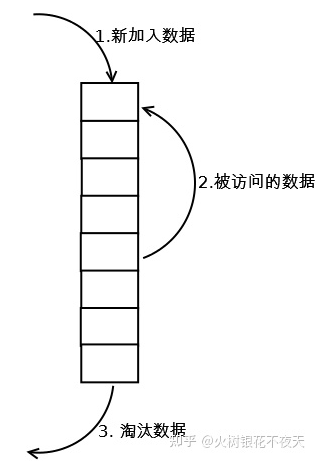

执行过程理解:

1. 在缓存中查找客户端需要访问的数据 如果缓存命中，则将访问的数据中队列中取出，重新加入到缓存队列的头部。
2. 如果没有命中，表示缓存穿透，将需要访问的数据从磁盘中取出，加入到缓存队列的尾部；
3. 如果此时缓存满了，淘汰队列尾部的数据，然后再在队列头部加入新数据。

存在的问题：

缓存污染：如果某个客户端访问大量历史数据时，可能使缓存中的数据被这些历史数据替换，其他客户端访问数据的命中率大大降低。

#### 时钟页面置换算法

#### 最不常用算法

**LFU(Least Frequently Used): 最近最不常用算法,根据数据的历史访问频率来淘汰数据**

核心思想是：

最近使用频率高的数据很大概率将会再次被使用,而最近使用频率低的数据,很大概率不会再使用。

做法：把使用频率最小的数据置换出去。这种算法是完全从使用频率的角度去考虑的。


执行过程理解:

1. 在缓存中查找客户端需要访问的数据
2. 如果缓存命中，则将访问的数据从队列中取出，并将数据对应的频率计数加1，然后将其放到频率相同的数据队列的头部，比如原来是A(10)->B(9)->C(9)->D(8),D被访问后，它的time变成了9，这时它被提到A和B之间，而不是继续在C后面
3. 如果没有命中，表示缓存穿透，将需要访问的数据从磁盘中取出，加入到缓存队列的尾部，记频率为1，这里也是加入到同为1的那一级的最前面
4. 如果此时缓存满了，则需要先置换出去一个数据，淘汰队列尾部频率最小的数据，然后再在队列尾部加入新数据。

存在的问题：

某些数据短时间内被重复引用，并且在很长一段时间内不再被访问。由于它的访问频率计数急剧增加，即使它在相当长的一段时间内不会被再次使用，也不会在短时间内被淘汰。这使得其他可能更频繁使用的块更容易被清除，此外，刚进入缓存的新项可能很快就会再次被删除，因为它们的计数器较低，即使之后可能会频繁使用。

### 磁盘调度算法

## 文件系统

## 设备管理

## 网络系统

## linux命令